$$
f(n) = \left\{
\begin{aligned}
& 1 & n = 1 \\
& 1 & n = 2 \\
& f(n-1) + f(n-2) & n \ge 3
\end{aligned}
\right.
$$


---

【代码】爬楼梯（递归）

```c
int climbStairs(int n) {
    if(n <= 0) {
        return 0;
    } else if(n == 1) {
        return 1;
    } else if(n == 2) {
        return 2;
    }
    return climbStairs(n-1) + climbStairs(n-2);
}
```

---


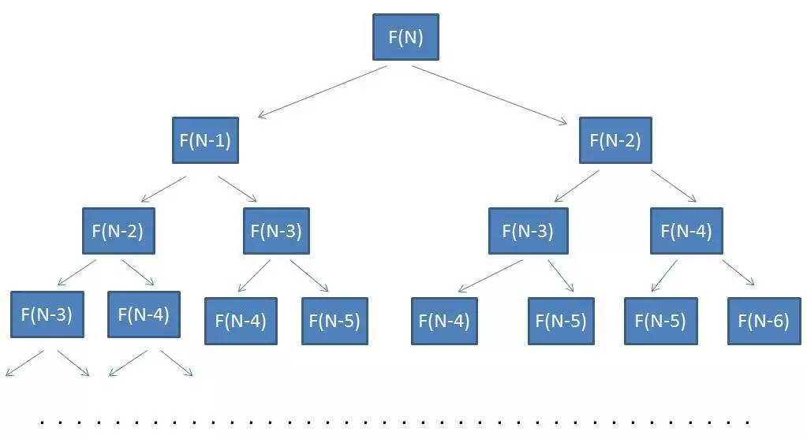


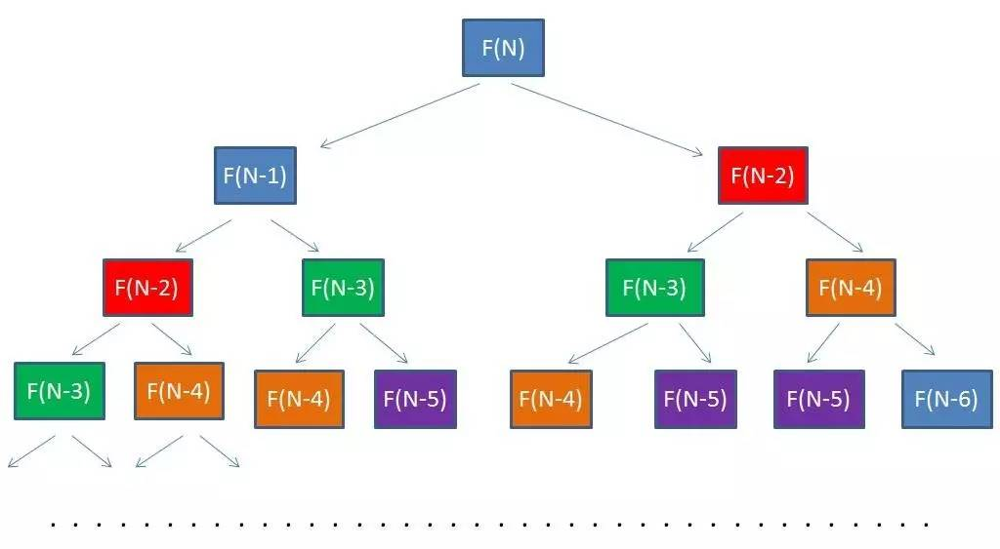


|   台阶数   |  1   |  2   |  3   |  4   |  5   |  6   |  7   |  8   |  9   |
| :--------: | :--: | :--: | :--: | :--: | :--: | :--: | :--: | :--: | :--: |
| **走法数** |  1   |  2   |      |      |      |      |      |      |      |


|   台阶数   |  1   |  2   |  3   |  4   |  5   |  6   |  7   |  8   |  9   |
| :--------: | :--: | :--: | :--: | :--: | :--: | :--: | :--: | :--: | :--: |
| **走法数** |  1   |  2   |  3   |      |      |      |      |      |      |


|   台阶数   |  1   |  2   |  3   |  4   |  5   |  6   |  7   |  8   |  9   |
| :--------: | :--: | :--: | :--: | :--: | :--: | :--: | :--: | :--: | :--: |
| **走法数** |  1   |  2   |  3   |  5   |      |      |      |      |      |


|   台阶数   |  1   |  2   |  3   |  4   |  5   |  6   |  7   |  8   |  9   |
| :--------: | :--: | :--: | :--: | :--: | :--: | :--: | :--: | :--: | :--: |
| **走法数** |  1   |  2   |  3   |  5   |  8   |      |      |      |      |

---

【代码】爬楼梯（动态规划）

```c
int climbStairs(int n) {
    if(n <= 0) {
        return 0;
    } else if(n == 1) {
        return 1;
    } else if(n == 2) {
        return 2;
    }
    int num1 = 1;
    int num2 = 2;
    int sum;
    for(int i = 3; i <= n; i++) {
        sum = num1 + num2;
        num1 = num2;
        num2 = sum;
    }
    return sum;
}
```

---

<div style="page-break-after: always;"></div>

## 5.2 硬币找零

**硬币找零**

有三种硬币，面值分别是2元、5元、7元，每种硬币都有足够多。买一个物品需要27元，如何用最少的硬币组合正好付清？

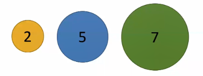

要让硬币最少，应该尽量用面值大的硬币，也就是贪心算法的结果为$ 7 + 7 + 7 + 5 = 26 $，呃……

那么需要改变一下策略，尽量用面值大的硬币，最后如果可以用一种硬币付清就行。$ 7 + 7 + 7 + 2 + 2 + 2 = 27 $，一共$ 6 $枚硬币，应该对了吧……

正确答案：$ 7 + 5 + 5 + 5 + 5 = 27 $，一共$ 5 $枚硬币。

状态在动态规划中的作用属于定海神针，确定状态需要两个意识：

1. 最后一步：虽然目前不知道最优策略是什么，但是最优策略肯定是$ k $枚硬币$ a_1, a_2, \dots, a_K $面值加起来是$ 27 $。所以一定有最后一枚硬币$ a_k $除了这枚硬币，前面硬币的面值加起来是$ 27 - a_k $。因为是最优策略，所以拼出$ 27 - a_k $的硬币数一定要最少。

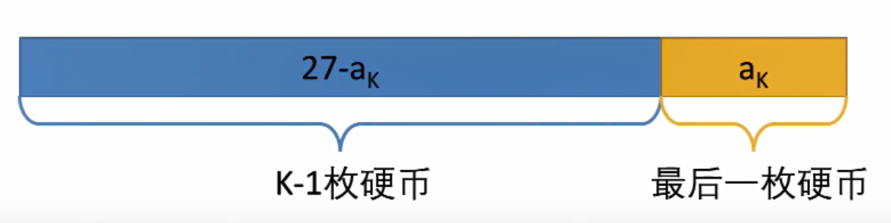

2. 子问题：因此问题就变成了最少用多少枚硬币可以拼出$ 27 - a_k $。这样就将原问题转化成了一个子问题，而且规模更小。

假设状态$ F(X) = 拼出X元的最少硬币数 $，

最后那枚硬币$ a_k $只可能是$ 2 $元、$ 5 $元或$ 7 $元：

- 如果$ a_k $是$ 2 $元，$ F(27) = F(27-2) + 1 $（加上最后一枚$ 2 $元硬币）
- 如果$ a_k $是$ 5 $元，$ F(27) = F(27-5) + 1 $（加上最后一枚$ 5 $元硬币）
- 如果$ a_k $是$ 7 $元，$ F(27) = F(27-7) + 1 $（加上最后一枚$ 7 $元硬币）

由此可得到递归公式：
$$
F(27) = min\{F(27-2)+1,\ F(27-5)+1,\ F(27-7)+1\}
$$

---

【代码】硬币找零（递归）

```java
public static int getMinCoins(int price) {
    // 0元钱只需要0枚硬币
    if(price == 0) {
        return 0;
    }
    // 初始化为无穷大
    int coinNum = Integer.MAX_VALUE - 1;
    // 最后一枚硬币是2元
    if(price >= 2) {
        coinNum = Math.min(getMinCoins(price-2) + 1, coinNum);
    }
    // 最后一枚硬币是5元
    if(price >= 5) {
        coinNum = Math.min(getMinCoins(price-5) + 1, coinNum);
    }
    // 最后一枚硬币是7元
    if(price >= 7) {
        coinNum = Math.min(getMinCoins(price-7) + 1, coinNum);
    }
    return coinNum;
}
```

---

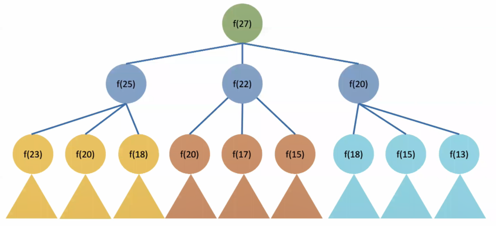

动态规划的另一个组成部分就是状态转移方程：
$$
F[X] = min\{F[X-2]+1,\ F[X-5]+1,\ F[X-7]+1\}
$$
其次需要考虑初始条件和边界情况：如果不能拼出$ i $元，则定义$ F[i] = \infin $。例如当$ X - 2 $、$ X - 5 $、$ X - 7 $小于$ 0 $，
$$
F[-1] = F[-2] = \dots = \infin
$$
因此，
$$
F[1] = min\{F[-1]+1,\ F[-4]+1,\ F[-6]+1\} = \infin
$$
表示拼不出$ 1 $元。

状态转移方程的初始状态为
$$
F[0] = 0
$$
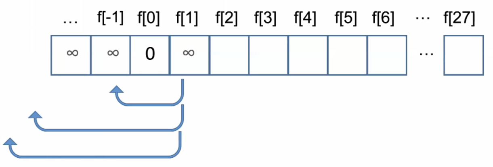


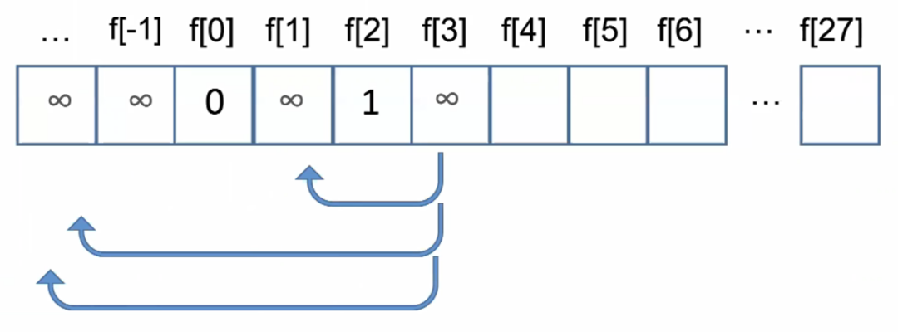

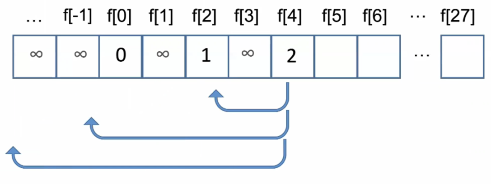

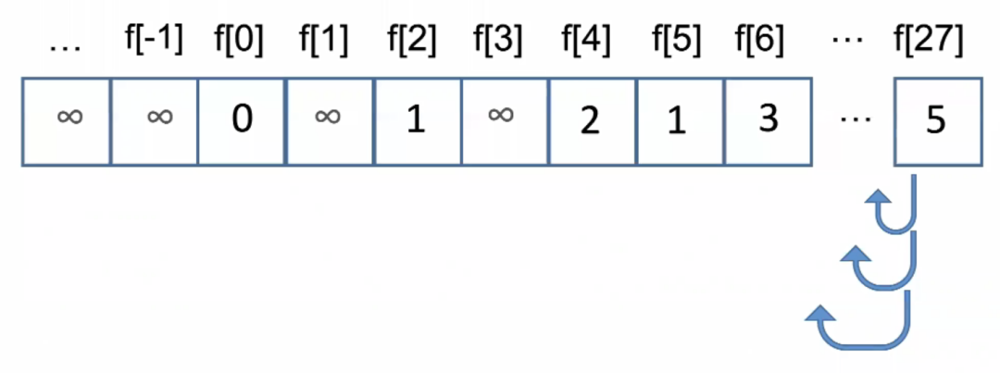

---

【代码】硬币找零（动态规划）

```python
def get_min_coins(coins, price):
    f = [INF] * (price + 1)

    f[0] = 0
    for i in range(1, price+1):
        for j in range(len(coins)):
            if i >= coins[j] and f[i - coins[j]] != INF:
                f[i] = min(f[i - coins[j]] + 1, f[i])
        
    if f[price] == INF:
        f[price] = -1
    return f[price]
```

---

<div style="page-break-after: always;"></div>

## 5.3 路径问题

**路径问题**

有一个机器人位于一个$ m $行$ n $列的网格的左上角$ (0, 0) $，机器人每次只能向下或向右移动一步，问有多少种方法可以走到右下角。

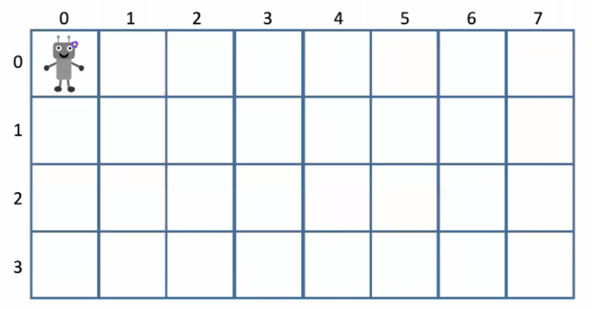

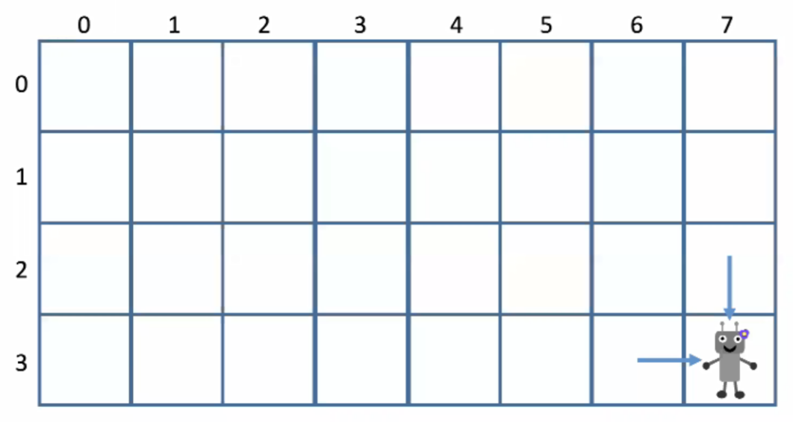

无论机器人用何种方式到达右下角，总有最后挪动的一步。右下角的坐标为$ (m-1, n-1) $，那么前一步机器人一定在$ (m-2, n-1) $或$ (m-1, n-2) $的位置。

如果机器人有$ X $种方式从左上角走到$ (m-2, n-1) $，有$ Y $种方式从左上角走到$ (m-1, n-2) $，那么机器人一共有$ X + Y $种方式从左上角走到$ (m-1, n-1) $。原问题就转换为了机器人有多少种方式从左上角走到$ (m-2, n-1) $和$ (m-1, n-2) $。

那么可以得出转移方程：
$$
f[i][j] = f[i-1][j] + f[i][j-1]
$$

> $ f[i][j] $：机器人有多少种方式走到$ (i, j) $
>
> $ f[i-1][j] $：机器人有多少种方式走到$ (i-1, j) $
>
> $ f[i][j-1] $：机器人有多少种方式走到$ (i, j-1) $

初始条件为$ f[0][0] = 1 $，因为机器人只有$ 1 $种方式到达左上角。

边界情况为当$ i = 0 $或$ j = 0 $，则前一步只能有一个方向到达，因此$ f[i][j] = 1 $。

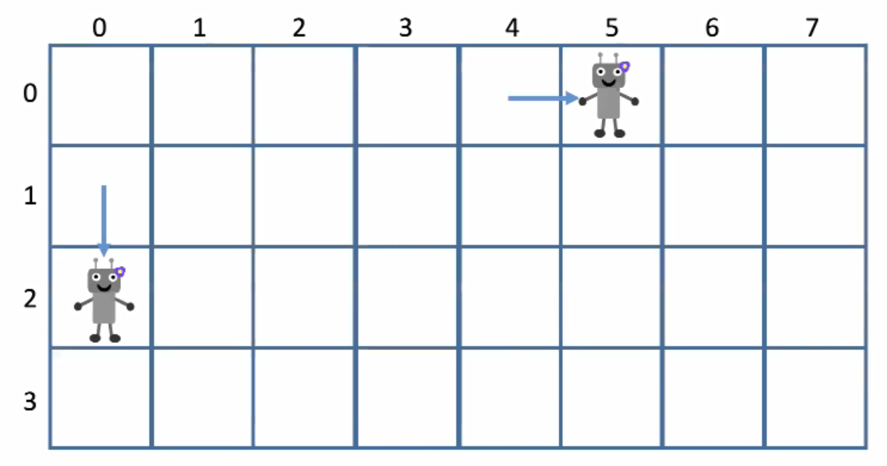

---

【代码】路径问题

```c
int uniquePath(int m, int n) {
    int f[m][n];
    for(int i = 0; i < m; i++) {
        for(int j = 0; j < n; j++) {
            if(i == 0 || j == 0) {
                f[i][j] = 1;
            } else {
                f[i][j] = f[i-1][j] + f[i][j-1];
            }
        }
    }
    return f[m-1][n-1];
}
```

---

<div style="page-break-after: always;"></div>

## 5.4 跳跃游戏

**跳跃游戏**

有$ n $块石头分别在$ 0, 1, \dots, n-1 $的位置，一只青蛙在石头$ 0 $，想跳到石头$ n - 1 $。如果青蛙在第i块石头上，每块石头的元素表示可以跳跃的最长距离。问青蛙能否跳到石头$ n - 1 $。

> 示例1：
>
> 输入: s = [2, 3, 1, 1, 4]
>
> 输出: True
>
> 解释: 可以先跳1步，从石头0达到石头1，然后再从石头1跳3步到达目标。

> 示例2：
>
> 输入: s = [3, 2, 1, 0, 4]
>
> 输出: False
>
> 解释: 无论怎样，总会达到石头3，但该石头的最大跳跃长度是0，所以永远不可能到达目标。

如果青蛙能跳到最后一块石头$ n - 1 $，那么它一定是从石头$ i $跳过来的（$ i < n - 1 $）。

这需要两个条件同时满足：

1. 青蛙可以跳到石头$ i $。
2. 最后一跳不超过跳跃的最大距离。

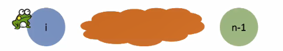

那么问题转化为了青蛙能否跳到石头$ i $。假设$ f[j] $表示青蛙能否跳到石头$ j $，可以得出转移方程：
$$
f[j] = OR_{0 \le i < j}(f[i]\ AND\ i + a[i] \ge j)
$$

> $ f[j] $：青蛙能否跳到石头$ j $
>
> $ OR_{0 \le i < j} $：枚举上一个跳到的石头$ i $
>
> $ f[i] $：青蛙能否跳到石头$ i $
>
> $ a[i] $：最后一步的距离不能超过$ a_i $

初始条件为$ f[0] = True  $，因为青蛙一开始就在石头$ 0 $。

---

【代码】跳跃游戏

```java
public static boolean canJump(int[] stone) {
    int n = stone.length;
    boolean[] f = new boolean[n];
    f[0] = true;

    for(int j = 1; j < n; j++) {
        f[j] = false;
        for(int i = 0; i < j; i++) {
            if(f[i] && i + stone[i] >= j) {
                f[j] = true;
                break;
            }
        }
    }
    return f[n-1];
}
```

---

<div style="page-break-after: always;"></div>

## 5.5 0-1背包

**0-1背包（0-1 Knapsack）**

有一个小偷带了一个能够装$ C = 20 $公斤物品的背包到商店里面偷东西，请问他要怎么偷才能使价值最高？

| 物品 | 重量W | 价格V |
| :--: | :---: | :---: |
|  0   |   2   |   3   |
|  1   |   3   |   4   |
|  2   |   4   |   5   |
|  3   |   5   |   8   |
|  4   |   9   |  10   |

假设用$ B(k, C) $表示当背包容量还剩下$ C $的时候，在前$ k $件物品中能偷到的最大价值。
$$
B(k, C) = \left\{
\begin{aligned}
& B(k-1, C) & \text{当第}k\text{件太重} \\
& max \left\{
        \begin{aligned}
        & B(k-1, C-w_k) + v_k & \text{偷} \\
        & B(k-1, C)	& \text{不偷} \\
        \end{aligned}
	\right.
\end{aligned}
\right.
$$
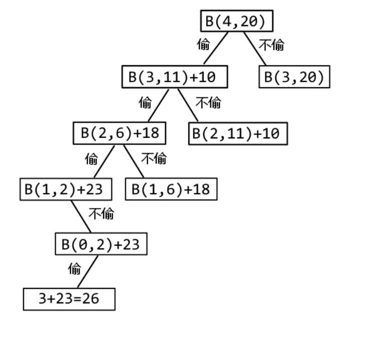

边界情况为$ B(i, 0)  = B(0, j) = 0 $，即当背包容量为$ 0 $或者没有物品可偷的情况下，最大价值为$ 0 $。 

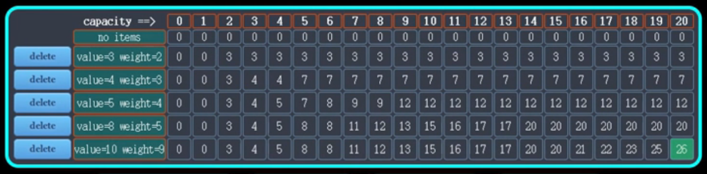

---

【代码】0-1背包

```c
#define ITEM_NUM 5
#define CAPACITY 20

int getMaxValue(int *weight, int *value) {
    int b[ITEM_NUM+1][CAPACITY+1] = {{0}};

    for(int k = 1; k <= ITEM_NUM; k++) {
        for(int c = 1; c <= CAPACITY; c++) {
            if(weight[k] > c) {
                b[k][c] = b[k-1][c];
            } else {
                b[k][c] = max(
                    b[k-1][c-weight[k]] + value[k],
                    b[k-1][c]
               	);
            }
        }
    }
    return b[ITEM_NUM][CAPACITY];
}
```