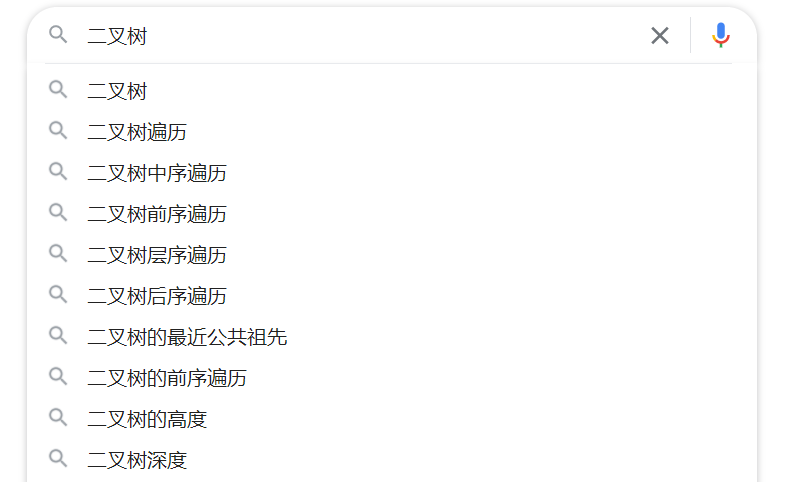

- 情况3：结点2的兄弟结点是红色。


以结点2的父结点A为轴进行左旋转。


然后结点A变为红色，结点B变为黑色。


这样的变化就有可能转换成情况4、5、6中的任意一种。

- 情况4：结点2的父结点是红色，兄弟和侄子结点是黑色。


将结点2的父结点A变为黑色，兄弟结点B变为红色。


这样结点2的路径补充了黑色结点，而结点B的路径并没有减少黑色结点，重新符合红黑树的规则。

- 情况5：结点2的父结点随意，兄弟结点B是黑色右孩子，结点2的左侄子是红色，右侄子是黑色。


以结点2的兄弟结点B为轴进行右旋转。


将结点B变为红色，结点C变为黑色。


这样的变化就转换成了情况6。

- 情况6：结点2的父结点随意，兄弟结点B是黑色右孩子，结点2的右侄子的红色。


以结点2的父结点A为轴进行左旋转。


将结点A和B的颜色交换，让结点D变为黑色。


这样经过结点2的路径由之前的`随机 + 黑`变成了`随机 + 黑 + 黑`，补充了一个黑色结点。

经过结点D的路径由之前的`随机 + 黑 + 红`变成了`随机 + 黑`，黑色结点并没有减少。

这时重新符合了红黑树的规则。


由于待删除结点17有两个孩子，子树当中仅大于17的结点是25，所以把结点25复制到17的位置，保持黑色。


接着需要删除原本的结点25，这个情况对应的是删除结点操作中的第二步情况3（待删除结点是黑色，子结点是空叶子结点）。


此时，以结点25为根的子树符合第三步情况5的镜像（结点NIL的父结点随意，兄弟结点15是黑色左孩子，结点NIL的右侄子是红色，左侄子是黑色）。


通过左旋转和变色，将子树转化成第三步情况6的镜像（结点NIL的父结点随意，兄弟结点16是黑色左孩子，结点NIL的左侄子是红色）。


通过右旋转和变色，使整棵二叉树重新符合红黑树的规则。


<div style="page-break-after: always;"></div>

## 5.4 Trie树

**Trie树**

`Trie`树的名字取自`检索retrieval`，发音同`tree`，但为了防止误解，也可发音为`try`。

`Trie`树也称`字典树`或`前缀树`，因此它专门用于处理字符串的匹配，用来解决在一组字符串集合中快速查找某个字符串的问题。


`Trie`树的核心思想就是利用空间换时间，通过最大限度地减少无谓的字符串比较，做到高效查询和插入，时间复杂度为$ O(k) $，$ k $为字符串长度，缺点是如果大量字符串没有公共前缀时会消耗大量内存。

`Trie`树的根结点不包含字符，除根结点外每一个结点都只包含一个字符。从根结点到某一结点，路径上经过的字符连接起来，就为该结点对应的字符串。

`Trie`树在实现过程中，会在结点中设置一个标志，用来表示该结点是否是一个字符串的结尾。


**查询**

在`Trie`树中查找一个字符串时，可以将待查找字符串分割成单个字符，从根结点开始匹配。


`Trie`树可以用于前缀匹配，也就是找出一个字符串集合中所有指定前缀的字符串。例如在进行搜索时，可以根据用户输入返回前缀匹配的搜索结果。




**插入与删除**

`Trie`树的插入操作就是将字符串的每个字符逐一插入，插入前先判断字符对应结点是否存在，存在则共享结点，不存在则创建新结点。当字符串插入`Trie`树后，将该字符串最后一个字符所对应的结点中设置标志位，表示该字符为该路径上某一字符串的末尾。


`Trie`树的删除操作分为3种情况：

1. 删除整个字符串。例如删除`hi`，从树根找到结点`h`，再找到结点`i`。因为结点i为标志位，所以去除其标志位。同时结点`i`是叶子结点，将其删除。删除后结点`h`变为叶子结点，并且结点`h`不是标志位，也将其删除。

2. 删除前缀字符串。例如删除`cod`，首先查找到末尾字符结点`d`，因为结点`d`不是叶子结点，只需将其标志位去除即可。

3. 删除分支字符串。例如删除`cook`，方法与删除整个字符串类似，区别在于当删除到共享结点`o`时，由于`o`不是叶子结点，停止删除。

<div style="page-break-after: always;"></div>

## 5.5 B树

**B树**


一个$m $阶的`B树`具有以下特征：

1. 根结点至少有$ 2 $个孩子。
2. 每个中间结点都包含$ k-1 $个元素和$ k $个孩子（$ {m \over 2} \le k \le m $）。
3. 每个叶子结点都包含$ k - 1 $个元素（$ {m \over 2} \le k \le m $）。
4. 所有叶子结点都位于同一层。
5. 每个结点中的元素从小到大排列，结点中$ k - 1 $个元素正好是k个孩子包含的元素的值域分划。


**插入**


由于结点$ (3, 5) $已经是两元素结点，无法再增加。父结点$ (2, 6) $也是两元素结点，也无法再增加。根结点$ 9 $是单元素结点，可以升级为两元素结点。于是拆分结点$ (3, 5) $和结点$ (2, 6) $，让根结点$ 9 $升级为$ (4, 9) $，结点$ 6 $独立为根结点的第二个孩子。


**删除**


删除结点$ 11 $后，结点$ 12 $只有一个孩子，不符合`B树`特征。因此找出$ 12 $、$ 13 $、$ 15 $中的中位数$ 13 $，取代结点$ 12 $，而结点$ 12 $下移成为第一个孩子。


<div style="page-break-after: always;"></div>

## 5.6 B+树

**B+树**


一个$ m $阶的`B+树`具有以下特征：

1. 有$ k $个子树的中间结点包含$ k $个元素（`B树`中是$ k - 1 $个元素）。
2. 所有的叶子结点中包含了全部元素的信息，及指向含这些元素记录的指针，且叶子结点本身按照关键字大小连接。
3. 所有中间结点元素都同时存在于子结点，在子结点元素中是最大（或最小）元素。


**范围查找**


<div style="page-break-after: always;"></div>

## 5.7 并查集

**并查集（Disjoint Set）**

并查集是一种简洁优雅的数据结构，主要用于解决一些元素分组的问题。

它管理一系列不相交的集合，并支持两种操作：

1. 合并（union）：把两个不相交的集合合并为一个集合。
2. 查询（find）：查询两个元素是否在同一个集合中。

例如在某个家族中，如果$ x $和$ y $是亲戚，$ y $和$ z $是亲戚，那么$ x $和$ z $也是亲戚。如果$ x $和$ y $是亲戚，那么$ x $的亲戚都是$ y $的亲戚，$ y $的亲戚也都是$ x $的亲戚。为了判断两个人是否为亲戚，只需判断他们是否属于同一个集合即可。

并查集的思想在于用集合中的一个元素代表集合，类似于把集合看做帮派，代表元素则是帮主，最开始所有元素各自为一个集合（各自的帮主就是自己）。


例如将元素$ 1 $和$ 3 $合并，就是将$ 1 $号和$ 3 $号比武，假设$ 1 $号赢了，$ 3 $号就认$ 1 $号作帮主。


再合并元素$ 2 $和$ 3 $，但$ 3 $号表示“别跟我打，让我的帮主来收拾你”。假设还是$ 1 $号赢了，$ 2 $号也认$ 1 $号作帮主。


假设元素$ 4 $、$ 5 $、$ 6 $也进行了相关合并：


现在再合并元素$ 2 $和$ 6 $，将它们的帮主$ 1 $号和$ 4 $号比武，假设$ 1 $号胜利后，$ 4 $号认$ 1 $号为帮主，当然它的手下也都跟着投降了。


并查集是一种树型结构，要寻找集合的代表元素，只需要一层一层向上访问父结点，直达树的根结点即可。根结点的父结点就是它自己。


假设有$ n $个元素，利用数组`parent`存放每个元素的父结点。一开始每个元素的父结点为自己。

---

【代码】初始化

```c
void init(int n) {
    parent = (int *)malloc(sizeof(int) * n);
    for(int i = 0; i < n; i++) {
        parent[i] = i;
    }
}
```

---

要判断两个元素是否属于同一个集合，只需要看它们的根结点是否相同。利用递归的方法可以实现对代表元素的查询，一层一层访问父结点，直至根结点。

---

【代码】查询

```c
int find(int val) {
    if(parent[val] == val) {
        return val;
    }
    return find(parent[val]);
}
```

---

合并操作需要先找到两个集合的根结点，将前者的父结点设置为后者即可（也可将后者的父结点设置为前者）。

---

【代码】合并

```c
void merge(int i, int j) {
    parent[find(i)] = find(j);
}
```

---


**路径压缩（Path Compression）**

最简单的并查集效率是比较低的，例如：


分别`merge(2, 3)`和`merge(2, 4)`：


这样可能会形成一条长链，随着链越来越长，想要从底部找到根结点会变得越来越难。利用路径压缩的方法可以解决这个问题，因为我们只关心一个元素所对应的根结点，因此每个元素到根结点的路径最好尽可能短。


实现的时候只需在查询过程中，把沿途的每个结点的父结点都设置为根结点即可。在下一次查询的时候，就可以节省很多时间。

---

【代码】查询（路径压缩）

```c
int find(int val) {
    if(parent[val] == val) {
        return val;
    } else {
        parent[val] = find(parent[val]);
        return parent[val];
    }
}
```

---


**按秩合并**

如果需要将一棵比较复杂的树与一个单元素进行合并，例如`merge(7, 8)`时，是把元素$ 7 $的父结点设为$ 8 $好，还是把$ 8 $的父结点设为$ 7 $呢？


如果把$ 7 $的父结点设为$ 8 $，会使树的深度加深，原来树中的每个元素到根结点的距离都变长了，之后寻找根结点的路径也会变长。虽然有路径压缩，但路径压缩也是要消耗时间的。而把$ 8 $的父结点设为$ 7 $，并不会影响到不相关的结点。


因此在合并两个集合时，应该把简单的树往复杂的树上合并。利用数组`rank`记录每个结点对应的树的深度，一开始所有元素的`rank`设为$ 1 $。合并时比较两个根结点，把`rank`较小者往较大者上合并。

---

【代码】按秩合并

```c
void init(int n) {
    parent = (int *)malloc(sizeof(int) * n);
    rank = (int *)malloc(sizeof(int) * n);
    for(int i = 0; i < n; i++) {
        parent[i] = i;
        rank[i] = 1;
    }
}

void merge(int i, int j) {
    // 找到对应根结点
    int x = find(i);
    int y = find(j);
    if(rank[x] <= rank[y]) {
        parent[x] = y;
    } else {
        parent[y] = x;
    }
    // 如果深度相同且根结点不同，则新的根结点深度+1
    if(rank[x] == rank[y] && x != y) {
        rank[y]++;
    }
}
```

---

深度相同的情况下，无论如何合并，都会使树的深度增加$ 1 $。


