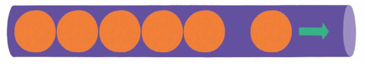
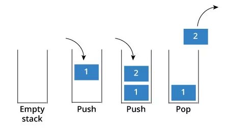
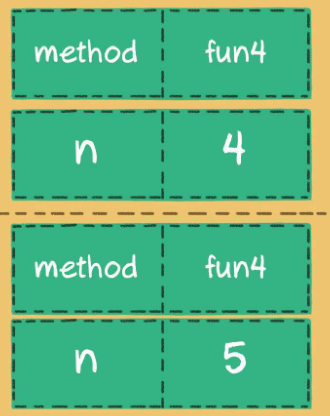
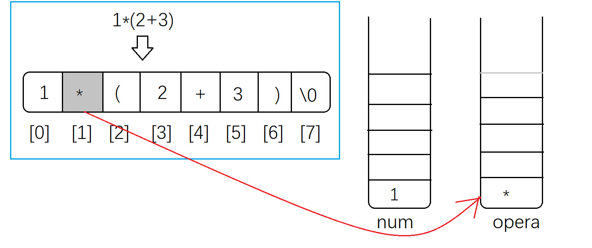
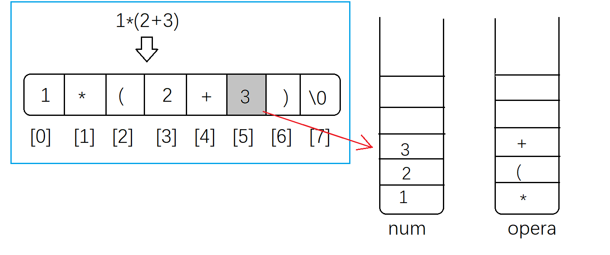
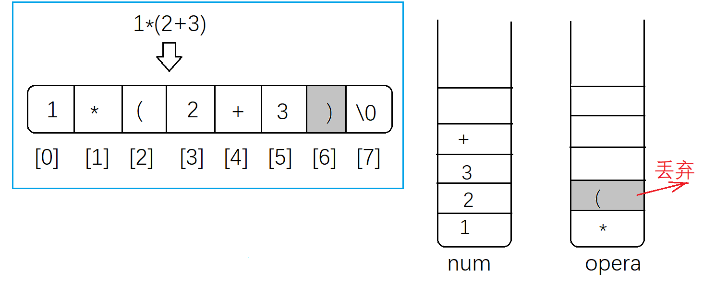
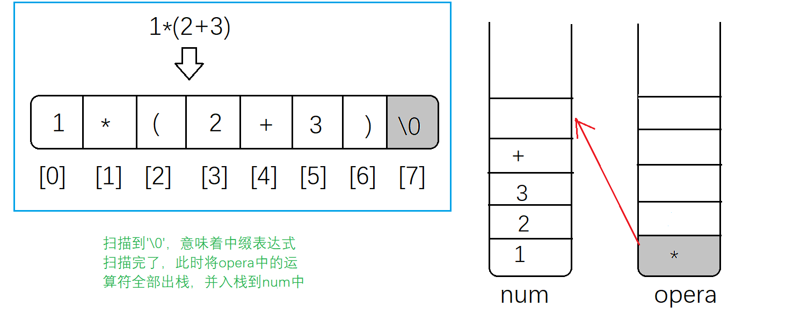
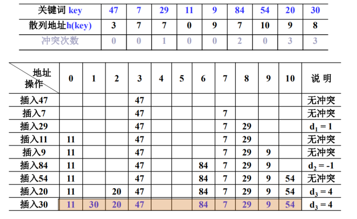

<center><h1>数据结构</h1></center>

<div style="border-bottom: none;"><center><h3>目录</h3></center></div>

[TOC]

<div style="page-break-after: always;"></div>

# 第1章 数据结构与算法

## 1.1 算法

**算法（Algorithm）**

算法是一个很古老的概念，最早来自数学领域。

有一个关于算法的小故事：在很久很久以前，曾经有一个顽皮又聪明的“熊孩子”，天天在课堂上调皮捣蛋。终于有一天，老师忍无可忍，对“熊孩子”说：


老师以为，“熊孩子”会按部就班地一步一步计算：
$$
\begin{aligned}
1 + 2 &= 3 \\
3 + 3 &= 6 \\
6 + 4 &= 10 \\
10 + 5 &= 15 \\
\dots
\end{aligned}
$$
这还不得算到明天天亮？够这小子受的！老师心里幸灾乐祸地想着。谁知仅仅几分钟后……


看着老师惊讶的表情，“熊孩子”微微一笑，讲出了他的计算方法。

首先把从1到10000这10000个数字两两分组相加：
$$
\begin{aligned}
1 + 10000 &= 10001 \\
2 + 9999 &= 10001 \\
3 + 9998 &= 10001 \\
4 + 9997 &= 10001 \\
\dots
\end{aligned}
$$
一共有$ 10000 \div 2 = 5000$组，所以1到10 000相加的总和可以这样来计算：
$$
(1 + 10000) \times 10000 \div 2 = 50005000
$$
这个“熊孩子”就是后来著名的犹太数学家约翰·卡尔·弗里德里希·高斯，而他所采用的这种等差数列求和的方法，被称为高斯算法。


算法是解决问题的一种方法或一个过程，是一个由若干运算或指令组成的有穷序列。求解问题的算法可以看作是输入实例与输出之间的函数。

算法有5个特点：

1. 有穷性（finiteness）：算法必须能在执行有限个步骤之后终止。
2. 确定性（definiteness）：算法的每一步骤必须有确切的定义。
3. 输入项（input）：一个算法有0个或多个输入。
4. 输出项（output）：一个算法有一个或多个输出，没有输出的算法是毫无意义的。
5. 可行性（effectiveness）：算法中执行的任何计算步骤都是可以被分解为基本的可执行的操作步。


**算法描述**

流程图（flow chart）是算法的一种图形化表示方式，使用一组预定义的符号来说明如何执行特定任务。

- 圆角矩形：开始和结束
- 矩形：数据处理
- 平行四边形：输入/输出
- 菱形：分支判断条件
- 流程线：步骤


伪代码（pseudocode）是一种非正式的，类似于英语结构的，用于描述模块结构图的语言。使用伪代码的目的是使被描述的算法可以容易地以任何一种编程语言实现。

---

【代码】插入排序伪代码

```python
insertSort(A[0..n-1]):
    for j = 2 to n-1 do
        key = A[j]
        i = j - 1
        while i > 0 and A[i] > key
            A[i+1] = A[i]
            i = i - 1
        A[i+1] = key
    return A
```


---

<div style="page-break-after: always;"></div>

## 1.2 算法效率

**算法效率**

算法有高效的，也有拙劣的。在高斯的故事中，高斯所用的算法显然是更加高效的算法，它利用等差数列的规律，四两拨千斤，省时省力地求出了最终结果。而老师心中所想的算法，按部就班地一个数一个数进行累加，则是一种低效、笨拙的算法。虽然这种算法也能得到最终结果，但是其计算过程要低效得多。

在计算机领域，我们同样会遇到各种高效和拙劣的算法。衡量算法好坏的重要标准有两个：时间复杂度、空间复杂度。首先，让我们来想象一个场景：某一天，小灰和大黄同时加入了同一家公司。


一天后，小灰和大黄交付了各自的代码，两人的代码实现的功能差不多。

> 大黄的代码运行一次要花`100ms`，占用内存`5MB`。
>
> 小灰的代码运行一次要花`100s`，占用内存`500MB`。


小灰虽然也按照老板的要求实现了功能，但他的代码存在两个很严重的问题：

1. 运行时间长：运行别人的代码只要`100ms`，而运行小灰的代码则要`100s`，使用者肯定是无法忍受的。
2. 占用空间大：别人的代码只消耗`5MB`的内存，而小灰的代码却要消耗`500MB`的内存，这会给使用者造成很多麻烦。

算法效率分析指的是算法求解一个问题所需要的时间资源和空间资源。效率可以通过对算法执行基本运算（步数）的数目进行估算，度量一个算法运算时间的三种方式：

- 最好情形时间复杂度
- 最坏情形时间复杂度
- 平均情形时间复杂度

最坏情形是任何规模为$ n $的问题实例运行时间的上界，即任何规模为$ n $的实例，其运行时间都不会超过最坏情况的运行时间。

对某些算法，最坏情况经常发生。例如在某个数据库中查询不存在的某条诗句就是查询算法的最坏情形。平均情形有时跟最坏情形差不多。


**时间复杂度（Time Complexity）**

算法的效率主要取决于算法本身，与计算模型（例如计算机）无关，这样可以通过分析算法的运行时间从而比较出算法之间的快慢。分析一个算法的运行时间应该主要关注与问题规模有关的主要项，其它低阶项，甚至主要项的常数系数都可以忽略。

渐进时间复杂度用大写`O`来表示，所以也被称为`大O表示法`。

时间复杂度有如下原则：

1. 如果运行时间是常数量级，则用常数`1`表示。
2. 只保留时间函数中的最高阶项。
3. 如果最高阶项存在，则省去最高阶项前面的系数。

在编程的世界中有各种各样的算法，有许多不同形式的时间复杂度，例如：$ O(1) $、$ O(logn) $、$ O(n) $、$ O(nlogn) $、$ O(n^2) $、$ O(2^n) $、$ O(n!) $等。


**空间复杂度（Space Complexity）**

内存空间是有限的，在时间复杂度相同的情况下，算法占用的内存空间自然是越小越好。如何描述一个算法占用的内存空间的大小呢？这就用到了算法的另一个重要指标——空间复杂度。

和时间复杂度类似，空间复杂度是对一个算法在运行过程中临时占用存储空间大小的量度，它同样使用了`大O表示法`。

正所谓鱼和熊掌不可兼得，很多时候，我们不得不在时间复杂度和空间复杂度之间进行取舍。在绝大多数时候，时间复杂度更为重要一些，我们宁可多分配一些内存空间，也要提升程序的执行速度。

<div style="page-break-after: always;"></div>

## 1.3 数据结构

**数据结构（Data Structure）**

数据结构是算法基石，是计算机数据的组织、管理和存储的方式，数据结构指的是相互之间存在一种或多种特定关系的数据元素的集合。一个好的数据结构可以带来更高的运行或者存储效率。


<div style="page-break-after: always;"></div>

# 第2章 数组

## 2.1 数组

**数组（Array）**

数组是数据结构中最简单的结构，很多编程语言都内置数组。数组是有限个相同类型的变量所组成的集合，数组中的每一个变量被称为元素。

创建数组时会在内存中划分出一块连续的内存，将数据按顺序进行存储，数组中的每一个元素都有着自己的下标（index），下标从`0`开始一直到`数组长度 - 1`。因为数组在存储数据时是按顺序存储的，存储数据的内存也是连续的，所以特点就是读取数据比较容易，插入和删除比较困难。


对于数组来说，读取元素是最简单的操作。由于数组在内存中顺序存储，所以只要给出数组的下标，就可以读取到对应位置的元素。像这种根据下标读取元素的方式叫作随机读取。但是需要注意的是，数组的下标范围必须在`0`到`数组长度 - 1`之内，否则会出现数组越界。数组读取元素的时间复杂度是$ O(1) $。

数组拥有非常高效的随机访问能力，只要给出下标，就可以用常量时间找到对应元素。有一种高效查找元素的算法叫作二分查找，就是利用了数组的这个优势。

数组的劣势体现在插入和删除元素方面。由于数组元素连续紧密地存储在内存中，插入、删除元素都会导致大量元素被迫移动，影响效率。总的来说，数组所适合的是读操作多、写操作少的场景。

把数组中某一个元素的值替换为一个新值是非常简单的操作，直接利用数组下标把新值赋给该元素即可。数组更新元素的的时间复杂度是$ O(1) $。

---

【代码】更新数组元素

```python
arr = {3, 1, 2, 5, 4, 9, 7, 2}
arr[5] = 10
print(arr[5])
```

---

<div style="page-break-after: always;"></div>

## 2.2 查找算法

**顺序查找（Sequence Search）**

顺序查找也称线性查找，是一种按照序列原有顺序进行遍历比较查询的基本查找算法。

对于任意一个序列以及一个需要查找的元素（关键字），将关键字与序列中元素依次比较，直到找出与给定关键字相同的元素，或者将序列中的元素与其都比较完为止。若某个元素的值与关键字相等，则查找成功；如果直到最后一个元素，元素的值和关键字比较都不等时，则查找不成功。

最好的情况就是在第一个位置就找到，算法时间复杂度为$ O(1) $。

最坏情况是关键字不存在，需要进行$ n $次比较，时间复杂度为$ O(n) $。

平均查找次数为$ (n + 1) / 2 $，平均时间复杂度为$ O(n) $。

---

【代码】顺序查找

```c
int sequenceSearch(int *arr, int n, int key) {
    for(int i = 0; i < n; i++) {
        if(arr[i] == key) {
            return i;
        }
    }
    return -1;
}
```

---


**二分查找（Binary Search）**

二分查找法也称折半查找，是一种效率较高的查找方法。折半查找要求线性表必须采用顺序存储结构，而且表中元素按关键字有序排列。

算法思想是假设表中元素是按升序排列，将表中间位置的关键字与查找关键字比较，如果两者相等，则查找成功；否则利用中间位置记录将表分成前、后两个子表，如果中间位置的关键字大于查找关键字，则进一步查找前一子表，否则进一步查找后一子表。重复以上过程，直到找到满足条件的记录，使查找成功，或直到子表不存在为止，此时查找不成功。

二分查找法的时间复杂度为$ O(logn) $。

---

【代码】二分查找

```c
int binarySearch(int *arr, int n, int key) {
    int start = 0;
    int end = n - 1;
    while(start <= end) {
        int mid = (start + end) / 2;
        if(arr[mid] == key) {
            return mid;
        } else if(arr[mid] < key) {
            start = mid + 1;
        } else {
            end = mid - 1;
        }
    }
    return -1;
}
```

---

<div style="page-break-after: always;"></div>

## 2.3 数组元素插入与删除

**插入元素**

在数组中插入元素存在3种情况：

1. 尾部插入：直接把插入的元素放在数组尾部的空闲位置即可。


2. 中间插入：首先把插入位置及后面的元素向后移动，腾出位置，再把要插入的元素放入该位置上。


---

【代码】插入元素

```c
int insert(int *arr, int n, int index, int val) {
    if(index < 0 || index >= n) {
        return n;
    }
    for(int i = n - 1; i >= index; i--) {
        arr[i+1] = arr[i];
    }
    arr[index] = val;
    n++;
    return n;
}
```

---

3. 超范围插入


**数组扩容**

数组的长度在创建时就已经确定了，要实现数组的扩容，只能创建一个新数组，长度是旧数组的2倍，再把旧数组中的元素全部复制过去，这样就实现了数组的扩容。


数组插入元素最好情况是尾部插入，无需移动任何元素，时间复杂度为$ O(1) $。最坏情况是在第一个位置插入，这样就需要移动后面所有$ n - 1 $个元素，时间复杂度为$ O(n) $。因此，总体的时间复杂度为$ O(n) $。


**删除元素**

数组的删除操作与插入操作过程相反，如果被删除的元素位于数组中间，其后的元素都需要向前挪动一位。


---

【代码】删除元素

```c
int delete(int *arr, int n, int index) {
    if(index < 0 || index >= n) {
        return n;
    }
    for(int i = index + 1; i < n; i++) {
        arr[i-1] = arr[i];
    }
    n--;
    return n;
}
```

---

数组的删除操作，由于只涉及元素的移动，时间复杂度为$ O(n) $。

对于删除操作，其实还存在一种取巧的方式，前提是数组元素没有顺序要求。如需要删除数组中某个元素，可直接把最后一个元素复制到被删除元素的位置，然后再删除最后一个元素。这样一来，无须进行大量的元素移动，时间复杂度降低为$ O(1) $。当然，这种方式只作参考，并不是删除元素主流的操作方式。


<div style="page-break-after: always;"></div>

# 第3章 链表

## 3.1 链表

**单向链表（Singly Linked List）**

为避免元素的移动，采用线性表的另一种存储方式：链式存储结构。链表是一种在物理上非连续、非顺序的数据结构，由若干结点（node）所组成。

单向链表的每一个结点又包含两部分，一部分是存放数据的数据域`data`，另一部分是指向下一个结点的指针域`next`。结点可以在运行时动态生成。

```c
typedef struct Node {
    dataType data;          // 数据域
    struct Node *next;		// 指针域
} Node;
```

链表的第一个结点被称为头结点，最后一个节点被称为尾结点，尾结点的`next`指针指向空`NULL`。


与数组按照下标来随机寻找元素不同，对于链表的其中一个结点A，只能根据结点A的next指针来找到该结点的下一个结点B，再根据结点B的`next`指针找到下一个节点C……

数组在内存中的存储方式是顺序存储，链表在内存中的存储方式则是随机存储。链表采用了见缝插针的方式，每一个结点分布在内存的不同位置，依靠`next`指针关联起来。这样可以灵活有效地利用零散的碎片空间。


**双向链表（Doubly Linked List）**

那么，通过链表的一个结点，如何能快速找到它的前一个结点呢？要想让每个结点都能回溯到它的前置结点，可以使用双向链表。

双向链表比单向链表稍微复杂一点，它的每一个结点除了拥有`data`和`next`指针，还拥有指向前置结点的`prev`指针。


| 单向链表特点                                 | 双向链表特点                                   |
| -------------------------------------------- | ---------------------------------------------- |
| 只能从头到尾遍历，只能找到后继，无法找到前驱 | 需要多分配一个指针的存储空间                   |
| 遍历的时候不会死循环                         | 每个结点有两个指针，分别指向直接前驱和直接后继 |
|                                              | 可以找到前驱和后继，可进可退                   |


**循环链表（Circular Linked List）**

除了单向链表和双向链表以外，还有循环链表。

对于单向循环链表，尾结点的`next`指针指向头结点。

对于双向循环链表，尾结点的`next`指针指向头结点，并且头结点的`prev`指针指向尾结点。


<div style="page-break-after: always;"></div>

## 3.2 链表的增删改查

**查找结点**

在查找元素时，链表不像数组那样可以通过下标快速进行定位，只能从头结点开始向后一个一个结点逐一查找。

例如在一个链表中查找第3个结点：


链表中的数据只能按顺序进行访问，最坏的时间复杂度是$ O(n) $。

---

【代码】查找结点

```c
Node* search(List *head, dataType val) {
    // 查找元素位置
    Node *temp = head;
    while(temp) {
        if(temp->data == val) {
            return temp;
        }
        temp = temp->next;
    }
    return NULL;        // 未找到
}
```

---


**更新结点**

如果不考虑查找结点的过程，链表的更新过程会像数组那样简单，直接把旧数据替换成新数据即可。


---

【代码】更新结点

```c
void replace(List *head, int pos, dataType val) {
    // 找到元素位置
	Node *temp = head;
    for(int i = 0; i < pos; i++) {
        temp = temp->next;
    }
    temp->data = val;
}
```

---


**插入结点**

链表插入结点，分为3种情况：

1. 尾部插入：把最后一个结点的`next`指针指向新插入的结点。


2. 头部插入：先把新结点的`next`指针指向原先的头结点，再把新结点设置为链表的头结点。


3. 中间插入：先把新结点的`next`指针指向插入位置的结点，再将插入位置的前置结点的`next`指针指向新结点。


只要内存空间允许，能够插入链表的元素是无穷无尽的，不需要像数组考虑扩容的问题。如果不考虑插入之前的查找元素的过程，只考虑纯粹的插入操作，时间复杂度是$ O(1) $。


**删除结点**

链表的删除操作也分3种情况：

1. 尾部删除：把倒数第二个结点的`next`指针指向空。


2. 头部删除：把链表的头结点设置为原先头结点的`next`指针。


3. 中间删除：把要删除的结点的前置结点的`next`指针，指向要删除结点的下一个结点。


许多高级语言，如`Java`，拥有自动化的垃圾回收机制，所以不用刻意去释放被删除的结点，只要没有外部引用指向它们，被删除的结点会被自动回收。

如果不考虑删除操作之前的查找的过程，只考虑纯粹的删除操作，时间复杂度是$ O(1) $。

<div style="page-break-after: always;"></div>

## 3.3 带头结点的链表

**带头结点的链表**

为了方便链表的插入、删除操作，在链表加上头结点之后，无论链表是否为空，头指针始终指向头结尾。因此对于空表和非空表的处理也统一了，方便了链表的操作，也减少了程序的复杂性和出现bug的机会。

---

【代码】插入结点

```c
void insert(List *head, int pos, dataType val) {
    Node *newNode = (Node *)malloc(sizeof(Node));
    newNode->data = val;
    newNode->next =  NULL;
    
    // 找到插入位置
    Node *temp = head;
    for(int i = 0; i < pos; i++) {
        temp = temp->next;
    }
    newNode->next = temp->next;
    temp->next = newNode;
}
```

---

【代码】删除结点

```c
void delete(List *head, int pos) {
    Node *temp = head;
    for(int i = 0; i < pos; i++) {
        temp = temp->next;
    }
    Node *del = temp->next;
    temp->next = del->next;
    free(del);
    del = NULL;
}
```

---


**数组VS链表**

数据结构没有绝对的好与坏，数组和链表各有千秋。

|    比较内容    |          数组          |             链表             |
| :------------: | :--------------------: | :--------------------------: |
|    **基本**    |  一组固定数量的数据项  |       可变数量的数据项       |
|    **大小**    |      声明期间指定      | 无需指定，执行期间增长或收缩 |
|  **存储分配**  | 元素位置在编译期间分配 |     元素位置在运行时分配     |
|  **元素顺序**  |        连续存储        |           随机存储           |
|  **访问元素**  |  直接访问：索引、下标  |      顺序访问：指针遍历      |
| **插入/删除**  |         速度慢         |          快速、高效          |
|    **查找**    |   二分查找、线性查找   |           线性查找           |
| **内存利用率** |          低效          |             高效             |

数组的优势在于能够快速定位元素，对于读操作多、写操作少的场景来说，用数组更合适一些。

相反，链表的优势在于能够灵活地进行插入和删除操作，如果需要频繁地插入、删除元素，用链表更合适一些。

|          |   查找   |   更新   |   插入   |   删除   |
| :------: | :------: | :------: | :------: | :------: |
| **数组** | $ O(1) $ | $ O(1) $ | $ O(n) $ | $ O(n) $ |
| **链表** | $ O(n) $ | $ O(n) $ | $ O(1) $ | $ O(1) $ |

<div style="page-break-after: always;"></div>

## 3.4 倒数第k个结点

**倒数第k个结点**

输入一个链表，输出该链表中倒数第k个结点。例如一个链表有6个结点[0, 1, 2, 3, 4, 5]，这个链表的倒数第3个结点是值为3的结点。

算法的思路是设置两个指针p1和p2，它们都从头开始出发，p2指针先出发k个结点，然后p1指针再进行出发，当p2指针到达链表的尾结点时，则p1指针的位置就是链表的倒数第k个结点。

---

【代码】倒数第k个结点

```java
public static Node findLastKth(LinkedList list, int k) {
    Node p1 = list.getHead();
    Node p2 = list.getHead();

    int i = 0;
    while(p2 != null && i < k) {
        p2 = p2.next;
        i++;
    }
    while(p2 != null) {
        p1 = p1.next;
        p2 = p2.next;
    }
    return p1;
}
```

---

<div style="page-break-after: always;"></div>

## 3.5 逆序输出链表

**逆序输出链表**

输入一个单链表，从尾到头打印链表每个结点的值。

由于单链表的遍历只能从头到尾，所以可以通过递归达到链表尾部，然后在回溯时输出每个结点的值。根据栈先进后出的特性，可以把链表的结点全部放入栈中，然后依次取出栈顶的位置即可。

---

【代码】逆序输出链表（递归）

```java
public static void inverse(Node head) {
    if(head != null) {
        inverse(head.next);
        System.out.print(head.data + " ");
    }
}
```

---

【代码】逆序输出链表（非递归）

```java
public static void inverseNonRecursive(LinkedList list) {
    Stack s = new Stack();

    Node node = list.getHead();
    while(node != null) {
        s.push(node);
        node = node.next;
    }
    while(!s.isEmpty()) {
        System.out.print(s.pop().data + " ");
    }
    System.out.println();
}
```

---

<div style="page-break-after: always;"></div>

## 3.6 环形链表

**环形链表**

一个单向链表中有可能出现环，不允许修改链表结构，如何在时间复杂度$ O(n) $、空间复杂度$ O(1) $内判断出这个链表是有环链表？如果带环，环的长度是多少？环的入口结点是哪个？

暴力算法首先从头结点开始，依次遍历单链表的每一个结点。对于每个结点都从头重新遍历之前的所有结点。如果发现当前结点与之前结点存在相同ID，则说明该结点被遍历过两次，链表有环。但是这种方法的时间复杂度太高。

另一种方法就是利用快慢指针，首先创建两个指针p1和p2，同时指向头结点，然后让p1每次向后移动一个位置，让p2每次向后移动两个位置。在环中，快指针一定会反复遇到慢指针。比如在一个环形跑道上，两个运动员在同一地点起跑，一个运动员速度快，一个运动员速度慢。当两人跑了一段时间，速度快的运动员必然会从速度慢的运动员身后再次追上并超过。

环的长度可以通过从快慢指针相遇的结点开始再走一圈，下一次回到该点的时的移动步数，即环的长度n。

环的入口可以利用类似获取链表倒数第k个结点的方法，准备两个指针p1和p2，让p2先走n步，然后p1和p2一块走。当两者相遇时，即为环的入口处。

---

【代码】环形链表

```java
public static Node cycleNode(LinkedList list) {
    Node p1 = list.getHead();
    Node p2 = list.getHead();

    while(p1 != null && p2 != null) {
        if(p2.next == null || p2.next.next == null) {
            return null;
        }
        p1 = p1.next;
        p2 = p2.next.next;
        if(p1 == p2) {
            return p1;
        }
    }
    return null;
}

public static int cycleLength(LinkedList list) {
    Node node = cycleNode(list);
    if(node == null) {
        return 0;
    }
    int len = 1;
    Node cur = node.next;
    while(cur != node) {
        cur = cur.next;
        len++;
    }
    return len;
}

public static Node cycleEntrance(LinkedList list) {
    int n = cycleLength(list);
    if(n == 0) {
        return null;
    }

    Node p1 = list.getHead();
    Node p2 = list.getHead();
    for(int i = 0; i < n; i++) {
        p2 = p2.next;
    }

    while(p1 != p2) {
        p1 = p1.next;
        p2 = p2.next;
    }
    return p1;
}
```

---

<div style="page-break-after: always;"></div>

## 3.7 反转链表

**反转链表**

反转一个链表需要调整链表中指针的方向。

递归反转法的实现思想是从链表的尾结点开始，依次向前遍历，遍历过程依次改变各结点的指向，即另其指向前一个结点。

而迭代反转法的实现思想非常直接，就是从当前链表的首结点开始，一直遍历至链表尾部，期间会逐个改变所遍历到的结点的指针域，另其指向前一个结点。


---

【代码】反转链表（递归）

```java
public static Node reverseList(Node head) {
    if(head == null || head.next == null) {
        return head;
    }
    Node next = head.next;
    head.next = null;
    Node newHead = reverseList(next);
    next.next = head;
    return newHead;
}
```

---

【代码】反转链表（迭代）

```java
public static Node reverseListIterative(LinkedList list) {
    Node newHead = new Node(-1);
    Node head = list.getHead();
    while(head != null) {
        Node next = head.next;
        head.next = newHead.next;
        newHead.next = head;
        head = next;
    }
    return newHead.next;
}
```

---

<div style="page-break-after: always;"></div>

## 3.8 跳表

**跳表（Skip List）**

给定一个有序链表，如何根据给定元素的值进行高效率查找？


在原始链表的基础上，增加了一个索引链表。原始链表的每两个结点，有一个结点在索引链表当中。当需要查找结点20的时候，不需要在原始链表中一个一个结点访问，而是首先访问索引链表。


在索引链表找到结点20之后，顺着索引链表的结点向下，找到原始链表的结点20。


这个过程，就像是先查阅了图书的目录，再翻到章节所对应的页码。由于索引链表的结点个数是原始链表的一半，查找结点所需的访问次数也相应减少了一半。


基于原始链表的第1层索引，抽出了第2层更为稀疏的索引，结点数量是第1层索引的一半。这样的多层索引可以进一步提升查询效率。


假设原始链表有$ n $个结点，那么索引的层级就是$ logn - 1 $，在每一层的访问次数是常量，因此查找结点的平均时间复杂度是$ O(logn) $，这比起常规的线性查找效率要高得多。

但相应的，这种基于链表的优化增加了额外的空间开销，各层索引的结点总数是$ {n \over 2} + {n \over 4} + {n \over 8} + {n \over 16} + \dots \approx n $。也就是说，优化之后的数据结构所占空间，是原来的2倍，这是典型的以空间换时间的做法。


假设要插入的结点是10，首先按照跳表查找结点的方法，找到待插入结点的前置结点（仅小于待插入结点）。


按照一般链表的插入方式，把结点10插入到结点9的下一个位置。


这样是不是插入工作就完成了呢？并不是。随着原始链表的新结点越来越多，索引会渐渐变得不够用了，因此索引结点也需要相应作出调整。

调整索引的方法就是让新插入的结点随机晋升成为索引结点，晋升成功的几率是50%。


新结点在成功晋升之后，仍然有机会继续向上一层索引晋升。


假设要从跳表中删除结点10，首先按照跳表查找结点的方法，找到待删除的结点。按照一般链表的删除方式，把结点10从原始链表当中删除。

这样是不是删除工作就完成了呢？并不是。还需要顺藤摸瓜，把索引当中的对应结点也一一删除。


1. 程序中跳表采用的是双向链表，无论前后结点还是上下结点，都各有两个指针相互指向彼此。
2. 程序中跳表的每一层首尾各有一个空结点，左侧的空节点是负无穷大，右侧的空节点是正无穷大。


<div style="page-break-after: always;"></div>

# 第4章 栈

## 4.1 栈

**栈（Stack）**

栈，又名堆栈，是一种运算受限的线性数据结构，栈只能在表尾进行插入和删除操作。

栈中的元素只能先进后出（`FILO`, First In Last Out）。最早进入栈的元素所存放的位置叫作栈底（bottom），最后进入栈的元素存放的位置叫作栈顶（top）。




向一个栈插入新元素的操作称为入栈`push`（或进栈、压栈），从一个栈删除元素的操作称为出栈`pop`（或退栈、弹栈）。



栈这种数据结构既可以用数组来实现，也可以用链表来实现。


**顺序栈**

使用数组方式实现的栈称为静态栈。可以根据下标来表示栈顶在数组中的位置，对于空栈，栈顶为`-1`。

进行入栈操作时，栈顶指针`+1`；出栈时，栈顶指针`-1`。


对满栈进行入栈和对空栈进行出栈操作操作都会产生数组的越界并引起程序崩溃，称为`上溢`和`下溢`。因此使用顺序栈前需要提前声明一个数组的大小，如果数组大小不够则可能发生数组越界，如果数组太大则会浪费一定的空间。

使用数组实现的栈的执行效率会比用链表来实现的高，入栈和出栈不需要移动大量元素，只需要移动栈顶指针即可。


**链式栈**

使用链表方式实现的栈称为动态栈。通过在表头插入一个元素来实现入栈，通过删除表尾元素来实现出栈。

动态栈有链表的部分特性，元素与元素之间在物理存储上可以不连续，但是功能有些受限制，动态栈只能在栈顶处进行插入和删除操作，不能在栈尾或栈中间进行插入和删除操作。


动态栈的元素内存是动态分配的，避免了静态栈可能会浪费空间的问题，但是对申请`malloc`和释放`free`空间的调用开销会比较大。


**入栈（Push）**

入栈操作就是把新元素放入栈中，只允许从栈顶一侧放入元素，新元素的位置将会成为新的栈顶。

最初，栈为空，栈顶的初始值为`-1`。每当向栈中添加元素时，栈顶指针`+1`。


---

【代码】入栈

```c
void push(Stack *stack, dataType val) {
    stack->data[++stack->top] = val;
}
```

---

入栈只影响最后一个元素，不涉及元素的整体移动，所以无论是以数组还是链表实现，时间复杂度都是$ O(1) $。


**出栈（Pop）**

出栈操作就是把新元素从栈中弹出，只有栈顶元素才允许出栈，出栈元素的前一个元素将会成为新的栈顶。

从栈中移出元素，栈顶指针`-1`。数组中元素的删除并非真正意义上把元素从内存中清除，出栈只需对栈顶`-1`即可，后期向栈中添加元素时，新元素会将旧元素覆盖。


---

【代码】出栈

```c
dataType pop(Stack *stack) {
    return stack->data[stack->top--];
}
```

---

出栈只影响最后一个元素，不涉及元素的整体移动，所以无论是以数组还是链表实现，时间复杂度都是$ O(1) $。


**栈的应用**

栈的输出顺序和输入顺序相反，所以栈同行用于对历史的回溯。例如实现递归的逻辑，就可以用栈回溯调用链。



栈还有一个著名的应用场景就是面包屑导航，使用户在流浪页面时可以轻松地回溯到上一级更更上一级页面。


<div style="page-break-after: always;"></div>

## 4.2 最小栈

**最小栈**

设计一个支持`push()`、`pop()`、`peek()`和`getMin()`操作的栈，并能在常数时间内检索到最小元素。

对于栈来说，如果一个元素a在入栈时，栈里有其它的元素b、c、d，那么无论这个栈在之后经历了什么操作，只要a在栈中，b、c、d就一定在栈中。因此，在操作过程中的任意一个时刻，只要栈顶的元素是a，那么就可以确定栈里面现在的元素一定是a、b、c、d。

那么可以在每个元素a入栈时把当前栈的最小值m存储起来。在这之后无论何时，如果栈顶元素是a，就可以直接返回存储的最小值m。

当一个元素要入栈时，取辅助栈的栈顶存储的最小值，与当前元素比较得出最小值，将这个最小值插入辅助栈中。当一个元素要出栈时，把辅助栈的栈顶元素也一并弹出。这样在任意一个时刻，栈内元素的最小值就存储在辅助栈的栈顶元素中。

---

【代码】最小栈

```python
class MinStack:
    def __init__(self):
        self.stack = []
        self.min_stack = [math.inf]
    
    def push(self, data):
        self.stack.append(data)
        self.min_stack.append(min(data, self.min_stack[-1]))
    
    def pop(self):
        self.stack.pop()
        self.min_stack.pop()
    
    def peek(self):
        return self.stack[-1]
    
    def get_min(self):
        return self.min_stack[-1]
```

---

<div style="page-break-after: always;"></div>

## 4.3 括号匹配

**括号匹配**

给定一个只包括`(`、`)`、`[`、`]`、`{`和`}`的字符串，判断字符串是否有效。有效字符串需满足左括号必须用相同类型的右括号闭合，并且左括号必须以正确的顺序闭合。

判断括号的有效性可以使用栈来解决。通过遍历字符串，当遇到左括号时，会期望在后续的遍历中，有一个相同类型的右括号将其闭合。由于后遇到的左括号要先闭合，因此将这个左括号放入栈顶。

当遇到右括号时，需要将一个相同类型的左括号闭合。此时可以取出栈顶的左括号并判断它们是否是相同类型的括号。如果不是相同的类型，或者栈中并没有左括号，那么字符串无效。为了快速判断括号的类型，可以使用哈希表存储每一种括号，哈希表的键为右括号，值为相同类型的左括号。

在遍历结束后，如果为空栈，说明字符串中的所有左括号闭合。

注意有效字符串的长度一定为偶数，因此如果字符串的长度为奇数，可以直接返回判断出字符串无效，省去后续的遍历判断过程。

---

【代码】括号匹配

```python
def valid_paratheses(s):
    if len(s) % 2 == 1:
        return False
    
    pairs = {")": "(", "]": "[", "}": "{"}
    stack = list()
    for paran in s:
        if paran in pairs:
            if not stack or stack[-1] != pairs[paran]:
                return False
            stack.pop()
        else:
            stack.append(paran)

    return not stack
```

---

<div style="page-break-after: always;"></div>

## 4.4 表达式求值

**表达式求值**

逆波兰表达式是一种后缀表达式，所谓后缀就是指运算符写在运算数的后面。平常使用的算式则是一种中缀表达式，如$ (1 + 2) * (3 + 4) $，该算式的逆波兰表达式写法为$ 1\ 2 + 3\ 4 + * $。

逆波兰表达式的优点在于去掉了中缀表达式中的括号后表达式无歧义，因此

适合用栈操作运算。遇到数字则入栈，遇到算符则取出栈顶两个数字进行计算，并将结果压入栈中。

在对中缀表达式求值时，一般都会将其转换为后缀表达式的形式，转换过程同样需要用到栈，规则如下：

1. 如果遇到操作数，就直接将其输出。
2. 如果遇到左括号，将其放入栈中。
3. 如果遇到右括号，则一直出栈并输出，直到遇到左括号为止。注意，左括号只出栈并不输出。
4. 如果遇到任何其它的运算符，如果为栈为空，则直接入栈。否则从栈中出栈元素并输出，直到遇到优先级更低的元素（或者栈为空）位置。在出栈完这些元素后，再将当前遇到的运算符入栈。有一点需要注意，只有在遇到右括号的情况下才将左括号出栈，其它情况都不会出栈左括号。
5. 如果读取到了表达式的末尾，则将栈中所有元素依次出栈输出。













---

【代码】表达式求值

```python
def priority(op):
    """
        运算符的优先级
        乘除法优先级高于加减法
        Args:
            op (str): 运算符
        Returns:
            (int): 优先级
    """
    if op == "*" or op == "/":
        return 2
    elif op == "+" or op == "-":
        return 1
    else:
        return 0

def infix_to_postfix(exp):
    """
        中缀表达式转换后缀表达式
        转换后的后缀表达式操作数之前带空格
        Args:
            exp (str): 中缀表达式
        Returns:
            (str): 后缀表达式
    """
    postfix = ""    # 保存生成的后缀表达式
    s = stack.Stack()

    number = ""
    for ch in exp:
        # 如果是数字，保存每一位数字
        if ch.isdigit():
            number += ch
            continue
        
        # 如果读取一个完整数字，直接输出
        if len(number) > 0:
            postfix += number + " "
            number = ""
        
        # 空格忽略
        if ch == " ":
            continue
        
        # 如果是运算符，并且空栈，则直接入栈
        if s.is_empty():
            s.push(ch)
        # 如果遇到左括号，将其放入栈中
        elif ch == "(":
            s.push(ch)
        # 如果遇到右括号，则一直出栈并输出，直到遇到左括号为止
        # 注意，左括号只出栈并不输出
        elif ch == ")":
            while s.peek() != "(":
                postfix += s.pop() + " "
            s.pop()
        # 如果遇到任何其它的运算符，如果为栈为空，则直接入栈
        # 否则从栈中出栈元素并输出，直到遇到优先级更低的元素（或为空）
        # 在出栈完这些元素后，再将当前遇到的运算符入栈
        # 只有遇到右括号的情况下才将左括号出栈
        else:
            while not s.is_empty() 
            	  and priority(ch) <= priority(s.peek()):
                postfix += s.pop() + " "
            s.push(ch)
    
    # 如果读取一个完整数字，直接输出
    if len(number) > 0:
        postfix += number + " "
        number = ""
    
    while not s.is_empty():
        postfix += s.pop() + " "
    
    return postfix.rstrip()

def calculate(postfix):
    """
    表达式求值
    Args:
        postfix (str): 后缀表达式
    Returns:
        (int): 表达式结果
    """
    s = stack.Stack()

    tokens = postfix.split()
    for token in tokens:
        # 数字则入栈
        try:
            s.push(int(token))
        # 运算符则出栈2次，将计算结果入栈
        except ValueError:
            num2 = s.pop()
            num1 = s.pop()
            if token == '+':
                s.push(num1 + num2)
            elif token == '-':
                s.push(num1 - num2)
            elif token == '*':
                s.push(num1 * num2)
            elif token == '/':
                s.push(int(num1 / num2))
    return s.pop()
```

---

<div style="page-break-after: always;"></div>

# 第5章 队列

## 5.1 队列

**队列（Queue）**

队列是一种运算受限的线性数据结构，不同于栈的先进后出（`FILO`），队列中的元素只能先进先出（`FIFO`, First In First Out）。

队列的出口端叫作队头（`front`），队列的入口端叫作队尾（`rear`）。队列只允许在队尾进行入队（`enqueue`），在队头进行出队（`dequeue`）。

与栈类似，队列既可以用数组来实现，也可以用链表来实现。其中用数组实现时，为了入队操作的方便，把队尾位置规定为最后入队元素的下一个位置。


**入列（enqueue）**

入队就是把新元素放入队列中，只允许在队尾的位置放入元素，新元素的下一个位置将会成为新的队尾。


入队操作的时间复杂度是$ O(1) $。


**出队（dequeue）**

出队就是把元素移出队列，只允许在队头一侧移出元素，出队元素的后一个元素将成为新的队头。


出队操作的时间复杂度是$ O(1) $。

<div style="page-break-after: always;"></div>

## 5.2 循环队列

**循环队列（Circular Queue）**


用数组实现的队列可以采用循环队列的方式来维持队列容量的恒定。为充分利用空间，克服假溢出的现象，在数组不做扩容的情况下，将队列想象为一个首尾相接的圆环，可以利用已出队元素留下的空间，让队尾指针重新指回数组的首位。这样一来整个队列的元素就循环起来了。


在物理存储上，队尾的位置也可以在队头之前。当再有元素入队时，将其放入数组的首位，队尾指针继续后移即可。队头和队尾互相追赶，这个追赶的过程就是入队的出队的过程。

如果队尾追上队头说明队列满了，如果队头追上队尾说明队列为空。循环队列并非真正地把数组弯曲，利用求余操作就能使队头和队尾指针不会跑出数组的范围，逻辑上实现了弯曲的效果。

假设数组长度为`MAX`：

- 入队时队尾指针后移：$ (rear + 1)\ \%\ MAX $
- 出队时队头指针后移：$ (front + 1)\ \%\ MAX $
- 判断队满：$ (rear + 1)\ \%\ MAX == front $
- 判断队空：$ front == rear $

需要注意的是，队尾指针指向的位置永远空出一位，所以队列最大容量比数组长度小`1`。

---

【代码】入队

```c
void enqueue(Queue *queue, dataType val) {
    queue->data[queue->rear] = val;
    queue->rear = (queue->rear + 1) % queue->max;
}
```

---

【代码】出队

```c
dataType dequeue(Queue *queue) {
    dataType ret = queue->data[queue->front];
    queue->front = (queue->front + 1) % queue->max;
    return ret;
}
```

---

<div style="page-break-after: always;"></div>

## 5.3 栈实现队列

**栈实现队列**

栈是特性是`FILO`，而队列是`FIFO`，因此可以使用两个栈来实现队列的效果。

可以将一个栈当作输入栈，用于`push`数据，另一个栈当作输出栈，用于`pop`和`peek`数据。每次`pop`或`peek`时，若输出栈为空则将输入栈的全部数据依次弹出并压入输出栈，这样输出栈从栈顶往栈底的顺序就是队列从队首往队尾的顺序。

用两个栈来实现队列的情况在生活中也经常出现。去医院挂号等待，等待的时候把病历给护士, 护士面前放了两堆病历。等着无聊就看护士是怎么管理病历的。发现一个堆是倒着放的，一个堆是正着放的。新过来的病人把病历给她时，她就把病历倒着放到第一堆，有病人看病结束后，从第二堆的开头翻一个新的病历，然后叫病人。如果第二堆没了话，就直接把第一堆翻过来放到第二推上面。


---

【代码】栈实现队列

```python
class Queue:
    def __init__(self):
        self.in_stack = list()
        self.out_stack = list()
    
    def is_empty(self):
        return not self.in_stack and not self.out_stack

    def enqueue(self, data):
        self.in_stack.append(data)
    
    def dequeue(self):
        if not self.out_stack:
            while self.in_stack:
                self.out_stack.append(self.in_stack.pop())
        return self.out_stack.pop()
```

---

用双栈实现的队列`push`的时间复杂度为$ O(1) $，`pop`和`peek`为均摊$ O(1) $，因为对于每个元素，至多入栈和出栈各两次。

<div style="page-break-after: always;"></div>

## 5.4 队列实现栈

**两个队列实现栈**

为了满足栈的特性，在使用队列实现栈时，应满足队列前端的元素是最后入栈的元素。可以使用两个队列实现栈的操作，其中queue1用于存储栈内的元素，queue2作为入栈操作的辅助队列。

入栈操作时，首先将元素入队到queue2，然后将queue1的全部元素依次出队并入队到queue2，此时queue2的前端的元素即为新入栈的元素，再将queue1和queue2互换，则queue1的元素即为栈内的元素，queue1的前端和后端分别对应栈顶和栈底。

由于queue1用于存储栈内的元素，判断栈是否为空时，只需要判断queue1是否为空即可。


**一个队列实现栈**

在两个队列实现栈的方法中，其中一个队列的作用相当于临时变量。因此只使用一个队列就能实现栈了。

入栈操作时，首先获得入栈前的元素个数$ n $，然后将元素入队到队列，再将队列中的前$ n $个元素（即除了新入栈的元素之外的全部元素）依次出队并入队到队列，此时队列的前端的元素即为新入栈的元素，且队列的前端和后端分别对应栈顶和栈底。


---

【代码】队列实现栈

```python
import collections

class Stack:
    def __init__(self):
        self.queue = collections.deque()
    
    def is_empty(self):
        return not self.queue

    def push(self, data):
        n = len(self.queue)
        self.queue.append(data)
        for _ in range(n):
            self.queue.append(self.queue.popleft())
    
    def pop(self):
        return self.queue.popleft()
    
    def peek(self):
        return self.queue[0]
```

---

<div style="page-break-after: always;"></div>

## 5.5 双端队列

**双端队列（Deque, Double Ended Queue）**

双端队列是一种同时具有队列和栈的性质的数据结构，双端队列可以从其两端插入和删除元素。

---

【代码】双端队列

```python
class Deque:
    def __init__(self):
        self.data = []

    def is_empty(self):
        return not self.data

    def add_front(self, val):
        self.data.insert(0, val)

    def add_rear(self, val):
        self.data.append(val)

    def remove_front(self):
        if not self.is_empty():
            return self.data.pop(0)

    def remove_rear(self):
        if not self.is_empty():
            return self.data.pop()

    def get_front(self):
        if not self.is_empty():
            return self.data[0]

    def get_rear(self):
        if not self.is_empty():
            return self.data[len(self.data)-1]
```

---

<div style="page-break-after: always;"></div>

# 第6章 哈希表

## 6.1 哈希表

**哈希表（Hash Table）**

例如开发一个学生管理系统，需要有通过输入学号快速查出对应学生的姓名的功能。这里不必每次都去查询数据库，而可以在内存中建立一个缓存表，这样做可以提高查询效率。

再例如需要统计一本英文书里某些单词出现的频率，就需要遍历整本书的内容，把这些单词出现的次数记录在内存中。


因为这些需要，一个重要的数据结构诞生了，这个数据结构就是哈希表。哈希表也称散列表，哈希表提供了键（key）和值（value）的映射关系，只要给出一个`key`，就可以高效地查找到它所匹配的`value`，其时间复杂度接近于$ O(1) $。


哈希表的时间复杂度几乎是常量$ O(1) $，即查找时间与问题规模无关。

|                |    插入     |    删除     |                 查找                  |
| :------------: | :---------: | :---------: | :-----------------------------------: |
|    **数组**    |  $ O(n) $   |  $ O(n) $   | 顺序查找$ O(n) $；二分查找$ O(logn) $ |
|    **链表**    |  $ O(1) $   |  $ O(1) $   |               $ O(n) $                |
| **二叉搜索树** | $ O(logn) $ | $ O(logn) $ |              $ O(logn) $              |
| **平衡二叉树** | $ O(logn) $ | $ O(logn) $ |              $ O(logn) $              |

哈希表的两项基本工作：

1. 计算位置：构造哈希函数确定关键字的存储位置
2. 解决冲突：应用某种策略解决多个关键字位置相同的问题

<div style="page-break-after: always;"></div>

## 6.2 哈希函数

**哈希函数（Hash Function）**

哈希的基本思想是将键`key`通过一个确定的函数，计算出对应的函数值`value`作为数据对象的存储地址，这个函数就是哈希函数。


哈希表本质上也是一个数组，可是数组只能根据下标来访问，而哈希表的`key`则是以字符串类型为主的。

在不同的语言中，哈希函数的实现方式是不一样的。假设需要存储整型变量，转化为数组的下标就不难实现了。最简单的转化方式就是按照数组长度进行取模运算。

一个好的哈希函数应该考虑两个因素：

1. 计算简单，以便提高转换速度。
2. 关键字对应的地址空间分布均匀，以尽量减少冲突


**数字关键字的哈希函数构造方法**

对于数字类型的关键字，哈希函数有以下几种常用的构造方法：

1. 直接定址法：取关键字的某个线性函数值为散列地址。

$$
h(key) = a * key + b\ (a,b\text{为常数})
$$

例如：根据出生年份计算人口数量$ h(key) = key - 1990 $：

|   地址    | 出生年份  |   人数    |
| :-------: | :-------: | :-------: |
|     0     |   1990    |  1285万   |
|     1     |   1991    |  1281万   |
|     2     |   1992    |  1280万   |
| $ \dots $ | $ \dots $ | $ \dots $ |
|    10     |   2000    |  1250万   |
| $ \dots $ | $ \dots $ | $ \dots $ |
|    21     |   2011    |  1180万   |

2. 除留余数法：哈希函数为$ h(key) = key\ mod\ p\ (p\text{一般取素数}) $。

例如$ h(key) = key\ \%\ 17 $：

|    地址    |  0   |  1   |  2   |  3   |  4   |  5   |  6   |  7   |  8   |  9   |  10  |  11  |  12  |  13  |  14  |  15  |  16  |
| :--------: | :--: | :--: | :--: | :--: | :--: | :--: | :--: | :--: | :--: | :--: | :--: | :--: | :--: | :--: | :--: | :--: | :--: |
| **关键字** |  34  |  18  |  2   |  20  |      |      |  23  |  7   |  42  |      |  27  |  11  |      |  30  |      |  15  |      |

3. 数字分析法：分析数字关键字在各位上的变化情况，取比较随机的位作为散列地址。

例如取11位手机号码的后4位作为地址$ h(key) = Integer(key + 7) $。

再例如取18位身份证号码中变化较为随机的位数：

|  1   |  2   |  3   |  4   |  5   |  6   |  7   |  8   |  9   |  10  |  11  |  12  |  13  |  14  |  15  |  16  |  17  |  18  |
| :--: | :--: | :--: | :--: | :--: | :--: | :--: | :--: | :--: | :--: | :--: | :--: | :--: | :--: | :--: | :--: | :--: | :--: |
|  3   |  3   |  0   |  1   |  0   |  6   |  1   |  9   |  9   |  0   |  1   |  0   |  0   |  8   |  0   |  4   |  1   |  9   |
|  省  |  省  |  市  |  市  |  区  |  区  |  年  |  年  |  年  |  年  |  月  |  月  |  日  |  日  |  辖  |  辖  |  辖  | 校验 |

4. 折叠法：把关键字分割成位数相同的几个部分，然后叠加。

例如将整数$ 56793542 $每三位进行分割：
$$
\begin{array}{r}
542 \\
793 \\
+ 056 \\
\hline
1319 \\
\end{array}
$$

$$
h(56793542) = 319
$$

5. 平方取中法：计算关键字的平方，取中间几位。

例如整数$ 56793542 $：
$$
\begin{array}{r}
56793542 \\
\times 56793542 \\
\hline
3225506412905764 \\
\end{array}
$$

$$
h(56793542) = 641
$$


**字符串关键字的哈希函数构造方法**

对于字符串类型的关键字，哈希函数有以下几种常用的构造方法：

1. ASCII码加和法

$$
h(key) = \left( \sum key[i] \right)\ mod\ TableSize
$$

但是对于某些字符串会导致严重冲突，例如：`a3`、`b2`、`c1`或`eat`、`tea`等。

2. 移位法：取前3个字符移位，如：

$$
h(key) = \left( key[0] \times 27^2 + key[1] \times 27 | key[2] \right)\ mod\ TableSize
$$

对于一些字符串仍然会冲突，例如`string`、`strong`、`street`、`structure`等。

一个有效的改进是涉及关键字中所有$ n $个字符：
$$
h(key) = \left( \sum_{i=0}^{n-1} key[n-i-1] \times 32^i \right)\ mod\ TableSize
$$

---

【代码】快速计算$ h('abcde') = a * 32^4 + b * 32^3 + c * 32^2 + d * 32 + e $

```c
int hash(char *key, int tableSize) {
    int h = 0;          // hash value
    int i = 0;
    while(key[i] != '\0') {
        h = (h << 5) + key[i];
        i++;
    }
    return h % tableSize;
}
```

---

【代码】凯撒加密

```c
/**
 * @brief  凯撒加密
 * @note  加密算法：ciphertext[i] = (plaintext[i] + Key) % 128
 * @param  plaintext: 明文
 * @retval 密文
 */
char* encrypt(char *plaintext) {
    int n = strlen(plaintext);
    char *ciphertext = (char *)malloc((n + 1) * sizeof(char));
    for(int i = 0; i < n; i++) {
        ciphertext[i] = (plaintext[i] + KEY) % 128;
    }
    ciphertext[n] = '\0';
    return ciphertext;
}

/**
 * @brief  凯撒解密
 * @note   解密算法：plaintext[i] = (ciphertext[i] - key + 128) % 128
 * @param  ciphertext: 密文
 * @retval 明文
 */
char* decrypt(char *ciphertext) {
    int n = strlen(ciphertext);
    char *plaintext = (char *)malloc((n + 1) * sizeof(char));
    for(int i = 0; i < n; i++) {
        plaintext[i] = (ciphertext[i] - KEY + 128) % 128;
    }
    plaintext[n] = '\0';
    return plaintext;
}
```

---

<div style="page-break-after: always;"></div>

## 6.3 冲突处理

**装填因子（Load Factor）**

假设哈希表空间大小为$ m $，填入表中元素个数是$ n $，则称$ \alpha = n / m $为哈希表的装填因子。

当哈希表元素太多，即装填因子$ \alpha $太大时，查找效率会下降。实用最大装填因子一般取$ 0.5 \le \alpha \le 0.85 $。当装填因子过大时，解决的方法是加倍扩大哈希表，这个过程叫作再散列（rehashing）。

再散列的过程需要遍历原哈希表，把所有的关键字重新散列到新数组中。为什么需要重新散列呢？因为长度扩大以后，散列的规则也随之改变。经过扩容，原本拥挤的哈希表重新变得稀疏，原有的关键字也重新得到了尽可能均匀的分配。

装填因子也是影响产生哈希冲突的因素之一。当不同的关键字可能会映射到同一个散列地址上，就导致了哈希冲突（collision），即$ h(key_i) = h(key_j),\ key_i \ne key_j $，因此需要某种冲突解决策略。

例如有11个数据对象的集合$ {18, 23, 11, 20, 2, 7, 27, 30, 42, 15, 34, 35} $，哈希表的大小为$ 17 $，哈希函数选择$ h(key) = key\ mod\ size $。

|    地址    |  0   |  1   |  2   |  3   |  4   |  5   |  6   |  7   |  8   |  9   |  10  |  11  |  12  |  13  |  14  |  15  |  16  |
| :--------: | :--: | :--: | :--: | :--: | :--: | :--: | :--: | :--: | :--: | :--: | :--: | :--: | :--: | :--: | :--: | :--: | :--: |
| **关键字** |  34  |  18  |  2   |  20  |      |      |  23  |  7   |  42  |      |  27  |  11  |      |  30  |      |  15  |      |

在插入最后一个关键字$ 35 $之前，都没有产生任何冲突。但是$ h(35) = 1 $，位置已有对象，就导致了冲突。


**冲突处理方法**

常用的处理冲突的思路有两种：

1. 开放地址法（open addressing）：一旦产生了冲突，就按某种规则去寻找另一空地址。开放地址法主要有线性探测法、平方探测法（二次探测法）和双散列法。
2. 分离链接法：将相应位置上有冲突的所有关键字存储在同一个单链表中。


**线性探测法（Linear Probing）**

当产生冲突时，以增量序列$ 1, 2, 3, ..., n-1 $循环试探下一个存储地址。

例如序列$ {47, 7, 29, 11, 9, 84, 54, 20, 30} $，哈希表表长为$ 13 $，哈希函数$ h(key) = key\ mod\ 11 $，用线性探测法处理冲突。


线性探测法的缺陷在于容易出现聚集现象。


**平方探测法（Quadratic Probing）**

平方探测法也称为二次探测法，以增量序列$ 1^2, -1^2, 2^2, -2^2, \dots, q^2, -q^2 (q \le \lfloor size/2 \rfloor) $循环试探下一个存储地址。

例如序列$ {47, 7, 29, 11, 9, 84, 54, 20, 30} $，哈希表表长为$ 11 $，哈希函数$ h(key) = key\ mod\ 11 $，用平方探测法处理冲突。



但是只要还有空间，平方探测法就一定能找到吗？

例如对于以下哈希表，插入关键字$ 11 $，哈希函数$ h(key) = key\ mod\ 5 $，用平方探测法处理冲突。

|    下标    |  0   |  1   |  2   |  3   |  4   |
| :--------: | :--: | :--: | :--: | :--: | :--: |
| **关键字** |  5   |  6   |  7   |      |      |

对关键字$ 11 $进行平方探测的结果一直在下标$ 0 $和$ 2 $之间波动，永远无法达到其它空的位置。

但是有定理证明，如果哈希表长度是某个$ 4k + 3\ (k \in Z^+)$形式的素数时，平方探测法就可以探查到整个哈希表空间。


**双散列探测法（Double Hashing）**

设定另一个哈希函数$ h_2(key) $，探测序列为$ h_2(key),\ 2h_2(key),\ 3h_2(key), \dots $

探测序列应该保证所有的散列存储单元都应该能够被探测到，选择以下形式有良好的效果：
$$
h_2(key) = p - (key\ mod\ p),\ p < TableSize,\ p,\ TableSize \in {素数}
$$


**分离链接法**

分离链接法也称拉链法、链地址法，将相应位置上有冲突的所有关键字存储在同一个单链表中。

例如关键字序列为$ {47, 7, 29, 11, 16, 92, 22, 8, 3, 50, 37, 89, 94, 21} $，哈希函数$ h(key) = key\ mod\ 11 $，用分离链接法处理冲突。


<div style="page-break-after: always;"></div>

## 6.4 性能分析

**性能分析**

哈希表的平均查找长度（ASL, Average Search Length）用来度量哈希表查找效率。关键字的比较次数，取决于产生冲突的多少。影响产生冲突多少有三个因素：

1. 哈希函数是否均匀
2. 处理冲突的方法
3. 哈希表的装填因子$ \alpha $

合理的最大装填因子$ \alpha $应该不超过$ 0.85 $，选择合适的哈希函数可以使哈希表的查找效率期望是常数$ O(1) $，它几乎与关键字的空间大小$ n $无关。这是以较小的$ \alpha $为前提，因此哈希表是一个以空间换时间的结构。

哈希表的存储对关键字是随机的，因此哈希表不便于顺序查找、范围查找、最大值/最小值查找等操作。

<div style="page-break-after: always;"></div>

# 第7章 树

## 7.1 树

**树（Tree）**

