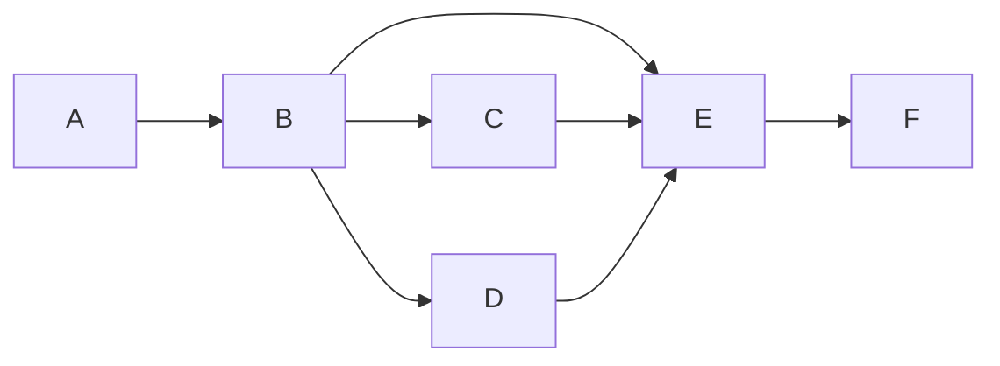
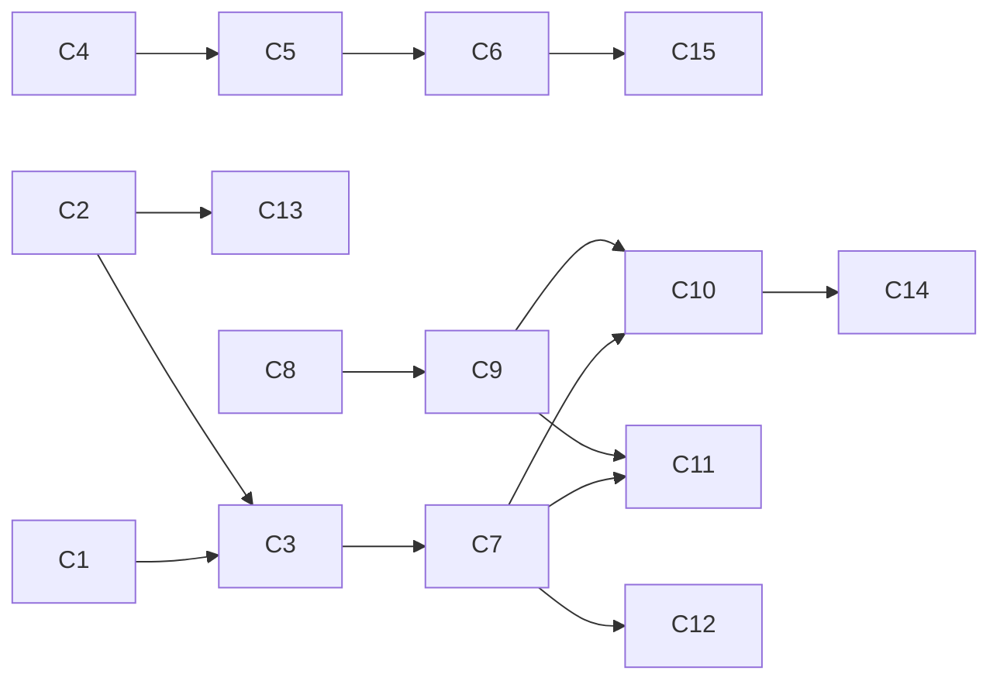
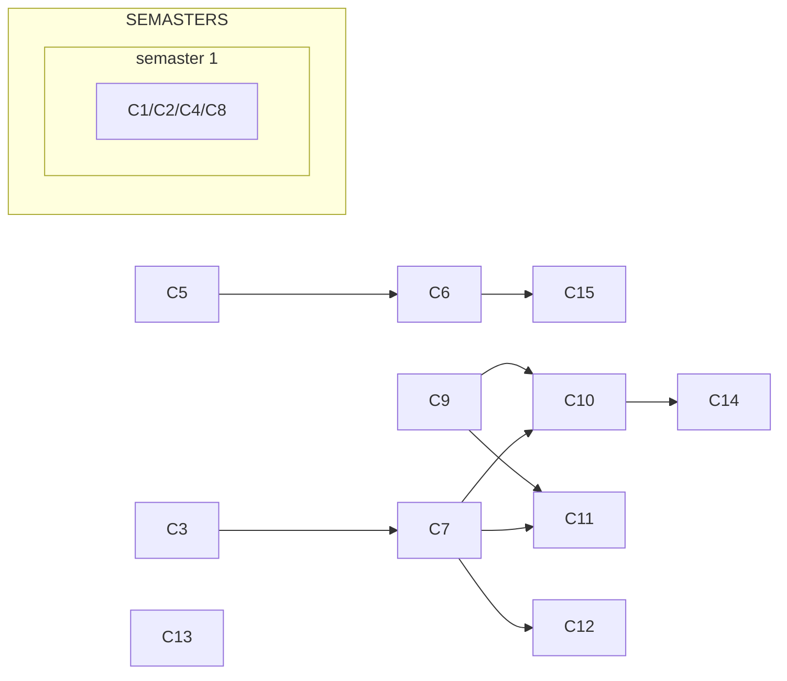
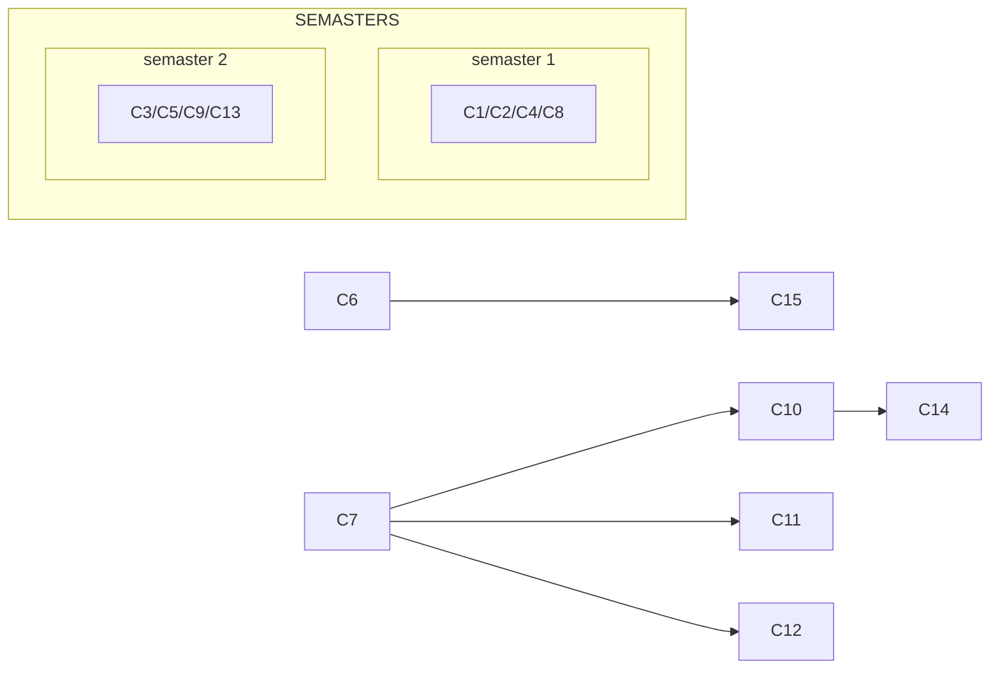
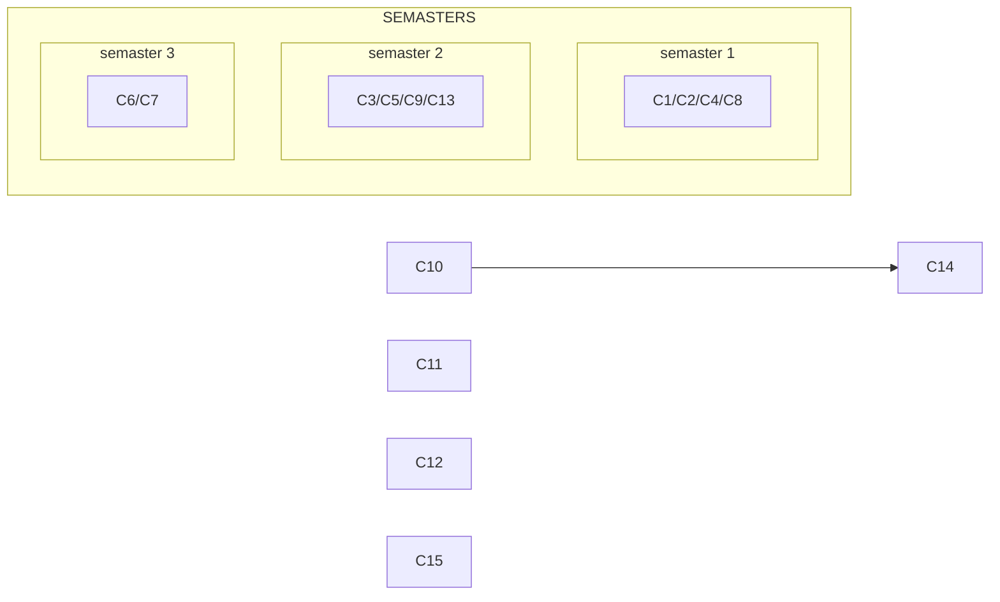
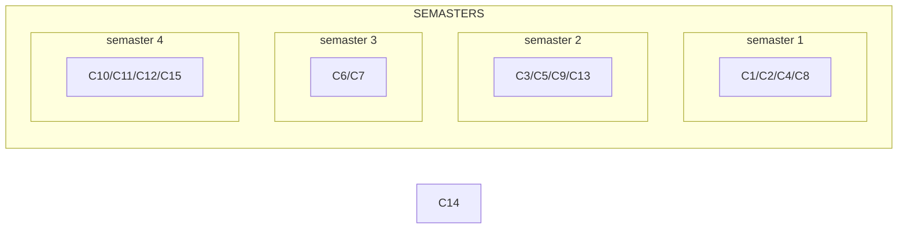
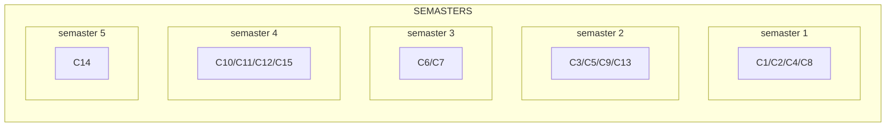

---

【代码】广度优先搜索

```
bfs(Vertex V):
    isVisited[V] = true
    enqueue(Q, V)
    while(!isEmpty(Q))
        V = dequeue(Q)
        for(v in V)
            if(!isVisited[v])
                isVisited[v = true
                enqueue(Q, v)
```

---

<div style="page-break-after: always;"></div>

## 8.4 连通图

**连通图**

图还有一些有关路径的术语：

- 连通：如果从顶点$ V $到$ W $存在一条路径，则称$ V $和$ W $是连通的。
- 路径：顶点$ V $到$ W $的路径是一系列顶点$ \{V, v_1, v_2, \dots, v_n, W\} $的集合，其中任意一对相邻的顶点间都有图中的边。
- 路径长度：路径中边的个数，如果是带权图（网络），则是所有边的权重和。
- 简单路径：顶点$ V $到$ W $之间的路径中所有顶点都不同。
- 回路：起点等于终点的路径。

如果图中任意两顶点均连通，那么称这个图是一个连通图。

一个图的连通分量指的是图的极大连通子图，极大连通子图需要满足两点要求：

1. 顶点数到达极大，即再加一个顶点就不连通了。
2. 边数达到极大，即包含子图中所有顶点相连的所有边。


对于有向图而言，如果有向图中任意一对顶点$ V $和$ W $之间存在双向路径，既可以从$ V $走到$ W $，也可以从$ W $走到$ V $，但这两条路径不一定是同一条，则称该图为强连通图。

如果有向图不是强连通图，但将所有的有向边替换为无向边之后可以变为连通图，则称该图为弱连通图。

有向图的极大强连通子图称为强连通分量。


**非连通图的遍历**

如果一个图不是连通图，那么无论使用深度优先遍历还是广度优先遍历，都会有顶点无法被访问到。解决这个问题的方式是每调用一次`dfs(V)`或`bfs(V)`，就把顶点$ V $所在的连通分量遍历一遍。

---

【代码】非连通图的深度优先遍历

```
dfs(Vertex V):
    isVisited[V] = true
    for(v in V)
        if(!isVisited[v])
            dfs(v)

listComponents(Graph G):
    for(V in G)
        if(!isVisited[V])
            dfs(V)
```

---

<div style="page-break-after: always;"></div>

## 8.5 最短路径

**最短路径（Shortest Path）**

在现实中很多需要都运用到了最短路径的算法，例如从一个地铁站到另一个地铁站的最快换乘路线等。地铁线路图中，地铁站可以看作是图的顶点，站与站之间的线路可以看作是边，权重可以是距离、时间、费用等。


在网络中，求两个不同顶点之间的所有路径中，边的权值之和最小的那一条路径，这条路径就是两点之间的最短路径。其中最短路径的第一个顶点称为源点（source），最后一个顶点为终点（destination）。

图的最短路径问题分为2种类型：

1. 单源最短路径：从某固定源点出发，求到所有其它顶点的最短路径。
2. 多源最短路径：求任意两顶点间的最短路径。


**无权图的单源最短路径算法（SSSP, Single-Source Shortest Path）**

无权图的单源最短路径算法可以按照递增（非递减）的顺序找出到各个顶点的最短路，算法类似广度优先遍历。


---

【代码】无权图的单源最短路径

```
unweightedSSSP(Vertex S):
    enqueue(Q, S)
    while(!isEmpty(Q))
        V = dequeue(Q)
        for(v in V)
            if(dist[v] == -1)
                dist[v] = dist[V] + 1
                path[v] = V
                enqueue(Q, v)
```

---

无权图的单元最短路径算法中，`dist[v]`存储从源点$ S $到$ v $的最短路径，初始化源点`dist[S]`的距离为$ 0 $，`path[v]`表示达到顶点路径$ v $上一个经过的顶点。

|   顶点   |  1   |  2   |  3   |  4   |  5   |  6   |  7   |
| :------: | :--: | :--: | :--: | :--: | :--: | :--: | :--: |
| **dist** |  1   |  2   |  0   |  2   |  3   |  1   |  3   |
| **path** |  3   |  1   |  -1  |  1   |  2   |  3   |  4   |


**有权图的单源最短路径算法**

有权图的最短路径不一定是经过顶点树最少的路。如果图中存在负值圈（negative-cost cycle）的话会导致算法失效，因为沿着回路走无穷多次，花销是负无穷。


迪杰斯特拉（Dijkstra）算法的本质是不断刷新起点与其他各个顶点之间的距离表。`Dijkstra`算法采用了贪心的思想，每次都未收录的顶点中选取`dist`值最小的收录。每当收录一个顶点时，可能会影响另外一个顶点的`dist`值。
$$
dist[w] = min\{dist[w], dist[v] + weight_{<v, w>}\}
$$
例如计算从源点$ A $到其它各顶点的最短路径。

第1步：创建距离表。其中表中`key`是顶点名称，`value`是源点$ A $到对应顶点的已知最短距离。一开始并不知道最短路径是多少，因此`value`都为无穷大。


第2步：找到源点$ A $的邻接点$ B $和$ C $，从$ A $到$ B $的距离是`5`，从$ A $到$ C $的距离是`2`。更新距离表。


第3步：从距离表中找到从$ A $出发距离最短的顶点，也就是顶点$ C $。找到顶点$ C $的邻接点$ D $和$ F $（$ A $已经遍历过不需要考虑）。从$ C $到$ D $的距离是`6`，所以从$ A $到$ D $的距离是`2 + 6 = 8`；从$ C $到$ F $的距离是`8`，所以从$ A $到$ F $的距离是`2 + 8 = 10`。更新距离表。


第4步：从距离表中找到从$ A $出发距离最短的顶点（$ C $已经遍历过不需要考虑），也就是顶点$ B $。找到顶点$ B $的邻接点$ D $和$ E $（$ A $已经遍历过不需要考虑）。从$ B $到$ D $的距离是`1`，所以从$A $到$ D $的距离是`5 + 1 = 6`，小于距离表中的`8`；从$ B $到$ E $的距离是`6`，所以从$ A $到$ E $的距离是`5 + 6 = 11`。更新距离表。


第5步：从距离表中找到从$ A $出发距离最短的顶点（$ B $和$ C $不用考虑），也就是顶点$ D $。找到顶点$ D $的邻接点$ E $和$ F $。从$ D $到$ E $的距离是`1`，所以从$ A $到$ E $的距离是`6 + 1 = 7`，小于距离表中的`11`；从$ D $到$ F $的距离是`2`，所以从$ A $到$ F $的距离是`6 + 2 = 8`，小于距离表中的`10`。更新距离表。


第6步：从距离表中找到从$ A $出发距离最短的顶点，也就是顶点$ E $。找到顶点$ E $的邻接点$ G $。从$ E $到$ G $的距离是`7`，所以从$ A $到$ G $的距离是`7 + 7 = 14`。更新距离表。


第7步：从距离表中找到从$ A $出发距离最短的顶点，也就是顶点$ F $。找到顶点$ F $的邻接点$ G $。从$ F $到$ G $的距离是`3`，所以从$ A $到$ G $的距离是`8 + 3 = 11`，小于距离表中的`14`。更新距离表。


最终，距离表中存储的是从源点$ A $到所有顶点的最短距离。


**多源最短路径算法**


弗洛伊德（Floyd-Warshall）算法是专门用于寻找带权图中多源点之间的最短路径算法。`Floyd`算法的思想是，若想缩短两点间的距离，仅有一种方式，那就是通过第三顶点绕行。

假设$ D^k[i][j]$为路径$ \{i \rarr \{l \le k\} \rarr j\} $的最小长度。当$ D^{k-1} $已经完成，递推到$ D^k $时：

1. 如果$ k \notin \text{最短路径}\{i \rarr \{l \le k\} \rarr j\} $，则$ D^k = D^{k-1} $。
2. 如果$ k \in \text{最短路径}\{i \rarr \{l \le k\} \rarr j\} $，该路径必定由两段最短路径组成，则$ D^k[i][j] = D^{k-1}[i][k] + D^{k-1}[k][j] $。

例如，小哼准备去一些城市旅游，有些城市之间有公路，有些城市之间则没有。为了节省经费以及方便计划旅程，小哼希望在出发之前直到任意两个城市之间的最短路程。


如果要让任意两点之间的路程变短，只能引入第三个点，并通过这个顶点中转才有可能缩短原来的路程。这个中转的顶点甚至有时候不只通过一个顶点，而是经过两个或更多点中转会更短。

当任意两点之间不允许经过第三个点中转时，这些城市之间的最短路径就是邻接矩阵的初始路径。


在只允许经过$ 1 $号顶点中转的情况下，任意两点之间的最短路程更新为：


在只允许经过$ 1 $号和$ 2 $号顶点中转的情况下，任意两点之间的最短路程更新为：


在只允许经过$ 1 $号、$ 2 $号和$ 3 $号顶点中转的情况下，任意两点之间的最短路程更新为：


最后允许通过所有顶点作为中转，任意两点之间的最短路程更新为：


---

【代码】Floyd最短路径

```c
void floyd(Graph *g, int dist[MAX][MAX]) {
    // 最短路径矩阵初始化为图的邻接矩阵
    for(int i = 0; i < g->vertexNum; i++) {
        for(int j = 0; j < g->vertexNum; j++) {
            dist[i][j] = g->weight[i][j];
        }
    }

    // Floyd算法
    for(int k = 0; k < g->vertexNum; k++) {
        for(int i = 0; i < g->vertexNum; i++) {
            for(int j = 0; j < g->vertexNum; j++) {
                if(dist[i][k] + dist[k][j] < dist[i][j]) {
                    dist[i][j] = dist[i][k] + dist[k][j];
                }
            }
        }
    }
}
```

---

<div style="page-break-after: always;"></div>

## 8.6 最小生成树

**最小生成树（MST, Mininum Spanning Tree）**

所谓最小生成树，就是一个图的极小连通子图，它包含原图的所有顶点，并且所有边的权值之和尽可能小。

最小生成树需要满足3个条件：

1. 是一棵树：树不能有回路，并且$ |V| $个顶点一定有$ |V| - 1 $条边。
2. 是生成树：包含原图的全部顶点，树的$ |V| - 1 $条边都必须在图里，并且如果向生成树中任意加一条边都一定构成回路。
3. 边的权重和最小。

如果最小生成树存在，那么图一定连通，反之亦然。

例如一个带权图，绿色边可以把所有顶点连接起来，又保证边的权值和最小。


图的最小生成树不是唯一的，同一个图有可能对应多个最小生成树。

最小生成树在现实中很很多用处。假如要在若干个城市之间铺设铁路，而预算又是有限的，那么就需要寻找成本最低的铺设方式。城市之间的交通网就像一个连通图，其实并不需要在每两个城市之间都直接进行连接，只需要一个最小生成树，保证所有的城市都有铁路可以达到即可。

获得最小生成树的常用算法有2个：

- `Prim`
- `Kruskal`


**Prim**

`Prim`算法是以图的顶点为基础，从一个初始顶点开始，寻找达到其它顶点权值最小的边，并把该顶点加入到已触达顶点的集合中。当全部顶点都加入到集合时，算法的工作就完成了。`Prim`算法的本质是基于贪心算法（greedy algorithm）。

`Prim`算法可以理解为让一棵小树长大，每次找能够向外生长的最小边。

例如使用`Prim`算法获得一个带权图的最小生成树：


**Kruskal**

与`Prim`算法不同，`Prim`算法是以顶点为关键来获得最小生成树的，而`Kruskal`算法是以边为关键获得最小生成树的。

`Kruskal`算法可以理解为将森林合并成树，每次在图中找权值最小的边收录。

例如使用`Kruskal`算法获得一个带权图的最小生成树：


<div style="page-break-after: always;"></div>

## 8.7 拓扑排序

**拓扑排序（Topological Sort）**

一项大的工程常被分为多个小的子工程，子工程之间可能存在一定的先后顺序，即某些子工程必须在其它的一些子工程完成后才能开始。在现代化管理中，有向图可以用来描述和分析一项工程的计划和实施过程，其中图的顶点表示活动，有向边表示活动之间的先后关系，这样的图称为`AOV（Activity on Vertex）`网。



如果图中从顶点$ V $到$ W $有一条有向路径，则$ V $一定排在$ W $之前，满足此条件的顶点序列称为一个拓扑序。`AOV`网如果有合理的拓扑序，则必定是有向无环图（DAG, Directed Acyclic Graph）。


可以使用卡恩`Kahn`算法完成拓扑排序。假设列表$ L $用于存放拓扑排序的结果，把所有入度为`0`的顶点放入$ L $中，然后把这些顶点从图中去掉。重复该操作，直到找不到入度为`0`的顶点。如果此时$ L $中的元素个数和图的顶点总数相同，说明拓扑排序完成；如果此时$ L $中的元素个数少于图的顶点总数，说明原图中存在环，无法进行拓扑排序。

例如对计算机专业课安排学习顺序：

| 课程代码 |       课程名称       | 预修课程 |
| :------: | :------------------: | :------: |
|    C1    |     程序设计基础     |    无    |
|    C2    |       离散数学       |    无    |
|    C3    |       数据结构       |  C1、C2  |
|    C4    |     微积分（一）     |    无    |
|    C5    |     微积分（二）     |    C4    |
|    C6    |       线性代数       |    C5    |
|    C7    |    算法分析与设计    |    C3    |
|    C8    | 逻辑与计算机设计基础 |    无    |
|    C9    |      计算机组成      |    C8    |
|   C10    |       操作系统       |  C7、C9  |
|   C11    |       编译原理       |  C7、C9  |
|   C12    |        数据库        |    C7    |
|   C13    |       计算理论       |    C2    |
|   C14    |      计算机网络      |   C10    |
|   C15    |       数值分析       |    C6    |













