<center><h1>数据结构</h1></center>

<div style="border-bottom: none;"><center><h3>目录</h3></center></div>

[TOC]

<div style="page-break-after: always;"></div>

## 5.1 队列

**队列（Queue）**

队列是一种运算受限的线性数据结构，不同于栈的先进后出（`FILO`），队列中的元素只能先进先出（`FIFO`, First In First Out）。

队列的出口端叫作队头（`front`），队列的入口端叫作队尾（`rear`）。队列只允许在队尾进行入队（`enqueue`），在队头进行出队（`dequeue`）。

与栈类似，队列既可以用数组来实现，也可以用链表来实现。其中用数组实现时，为了入队操作的方便，把队尾位置规定为最后入队元素的下一个位置。

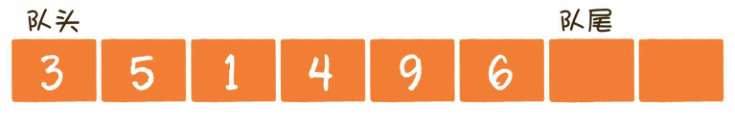

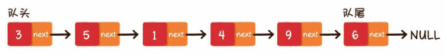


**入列（enqueue）**

入队就是把新元素放入队列中，只允许在队尾的位置放入元素，新元素的下一个位置将会成为新的队尾。

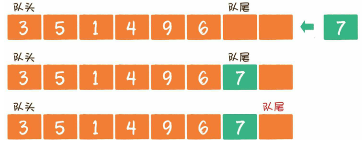

入队操作的时间复杂度是$ O(1) $。


**出队（dequeue）**

出队就是把元素移出队列，只允许在队头一侧移出元素，出队元素的后一个元素将成为新的队头。

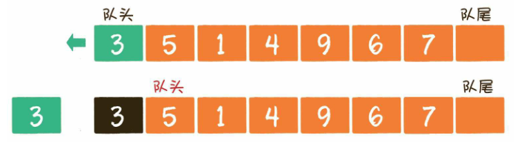

出队操作的时间复杂度是$ O(1) $。

<div style="page-break-after: always;"></div>

## 5.2 循环队列

**循环队列（Circular Queue）**


用数组实现的队列可以采用循环队列的方式来维持队列容量的恒定。为充分利用空间，克服假溢出的现象，在数组不做扩容的情况下，将队列想象为一个首尾相接的圆环，可以利用已出队元素留下的空间，让队尾指针重新指回数组的首位。这样一来整个队列的元素就循环起来了。

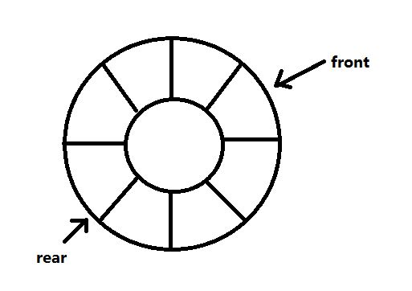

在物理存储上，队尾的位置也可以在队头之前。当再有元素入队时，将其放入数组的首位，队尾指针继续后移即可。队头和队尾互相追赶，这个追赶的过程就是入队的出队的过程。

如果队尾追上队头说明队列满了，如果队头追上队尾说明队列为空。循环队列并非真正地把数组弯曲，利用求余操作就能使队头和队尾指针不会跑出数组的范围，逻辑上实现了弯曲的效果。

假设数组长度为`MAX`：

- 入队时队尾指针后移：$ (rear + 1)\ \%\ MAX $
- 出队时队头指针后移：$ (front + 1)\ \%\ MAX $
- 判断队满：$ (rear + 1)\ \%\ MAX == front $
- 判断队空：$ front == rear $

需要注意的是，队尾指针指向的位置永远空出一位，所以队列最大容量比数组长度小`1`。

---

【代码】入队

```c
void enqueue(Queue *queue, dataType val) {
    queue->data[queue->rear] = val;
    queue->rear = (queue->rear + 1) % queue->max;
}
```

---

【代码】出队

```c
dataType dequeue(Queue *queue) {
    dataType ret = queue->data[queue->front];
    queue->front = (queue->front + 1) % queue->max;
    return ret;
}
```

---

<div style="page-break-after: always;"></div>

## 5.3 栈实现队列

**栈实现队列**

栈是特性是`FILO`，而队列是`FIFO`，因此可以使用两个栈来实现队列的效果。

可以将一个栈当作输入栈，用于`push`数据，另一个栈当作输出栈，用于`pop`和`peek`数据。每次`pop`或`peek`时，若输出栈为空则将输入栈的全部数据依次弹出并压入输出栈，这样输出栈从栈顶往栈底的顺序就是队列从队首往队尾的顺序。

用两个栈来实现队列的情况在生活中也经常出现。去医院挂号等待，等待的时候把病历给护士, 护士面前放了两堆病历。等着无聊就看护士是怎么管理病历的。发现一个堆是倒着放的，一个堆是正着放的。新过来的病人把病历给她时，她就把病历倒着放到第一堆，有病人看病结束后，从第二堆的开头翻一个新的病历，然后叫病人。如果第二堆没了话，就直接把第一堆翻过来放到第二推上面。

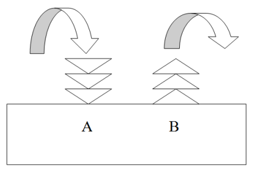

---

【代码】栈实现队列

```python
class Queue:
    def __init__(self):
        self.in_stack = list()
        self.out_stack = list()
    
    def is_empty(self):
        return not self.in_stack and not self.out_stack

    def enqueue(self, data):
        self.in_stack.append(data)
    
    def dequeue(self):
        if not self.out_stack:
            while self.in_stack:
                self.out_stack.append(self.in_stack.pop())
        return self.out_stack.pop()
```

---

用双栈实现的队列`push`的时间复杂度为$ O(1) $，`pop`和`peek`为均摊$ O(1) $，因为对于每个元素，至多入栈和出栈各两次。

<div style="page-break-after: always;"></div>

## 5.4 队列实现栈

**两个队列实现栈**

为了满足栈的特性，在使用队列实现栈时，应满足队列前端的元素是最后入栈的元素。可以使用两个队列实现栈的操作，其中queue1用于存储栈内的元素，queue2作为入栈操作的辅助队列。

入栈操作时，首先将元素入队到queue2，然后将queue1的全部元素依次出队并入队到queue2，此时queue2的前端的元素即为新入栈的元素，再将queue1和queue2互换，则queue1的元素即为栈内的元素，queue1的前端和后端分别对应栈顶和栈底。

由于queue1用于存储栈内的元素，判断栈是否为空时，只需要判断queue1是否为空即可。

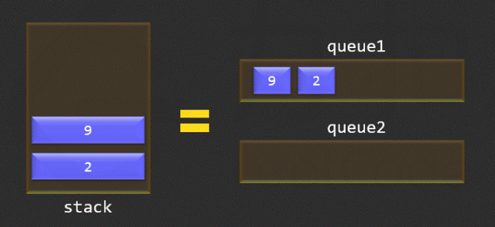


**一个队列实现栈**

在两个队列实现栈的方法中，其中一个队列的作用相当于临时变量。因此只使用一个队列就能实现栈了。

入栈操作时，首先获得入栈前的元素个数$ n $，然后将元素入队到队列，再将队列中的前$ n $个元素（即除了新入栈的元素之外的全部元素）依次出队并入队到队列，此时队列的前端的元素即为新入栈的元素，且队列的前端和后端分别对应栈顶和栈底。

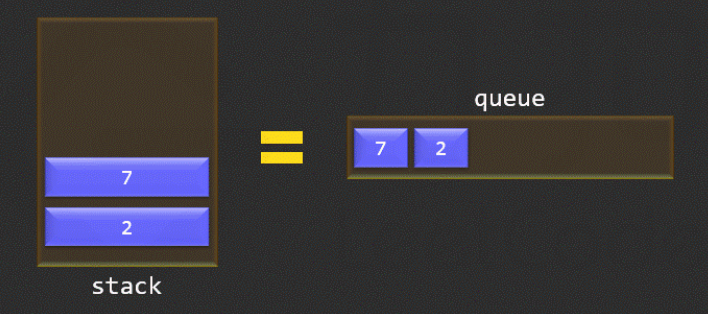

---

【代码】队列实现栈

```python
import collections

class Stack:
    def __init__(self):
        self.queue = collections.deque()
    
    def is_empty(self):
        return not self.queue

    def push(self, data):
        n = len(self.queue)
        self.queue.append(data)
        for _ in range(n):
            self.queue.append(self.queue.popleft())
    
    def pop(self):
        return self.queue.popleft()
    
    def peek(self):
        return self.queue[0]
```

---

<div style="page-break-after: always;"></div>

## 5.5 双端队列

**双端队列（Deque, Double Ended Queue）**

双端队列是一种同时具有队列和栈的性质的数据结构，双端队列可以从其两端插入和删除元素。

---

【代码】双端队列

```python
class Deque:
    def __init__(self):
        self.data = []

    def is_empty(self):
        return not self.data

    def add_front(self, val):
        self.data.insert(0, val)

    def add_rear(self, val):
        self.data.append(val)

    def remove_front(self):
        if not self.is_empty():
            return self.data.pop(0)

    def remove_rear(self):
        if not self.is_empty():
            return self.data.pop()

    def get_front(self):
        if not self.is_empty():
            return self.data[0]

    def get_rear(self):
        if not self.is_empty():
            return self.data[len(self.data)-1]
```

---

<div style="page-break-after: always;"></div>

# 第6章 哈希表

## 6.1 哈希表

**哈希表（Hash Table）**

例如开发一个学生管理系统，需要有通过输入学号快速查出对应学生的姓名的功能。这里不必每次都去查询数据库，而可以在内存中建立一个缓存表，这样做可以提高查询效率。

再例如需要统计一本英文书里某些单词出现的频率，就需要遍历整本书的内容，把这些单词出现的次数记录在内存中。

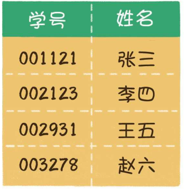

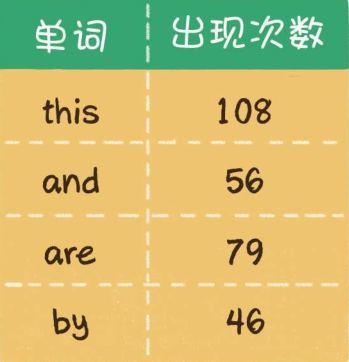

因为这些需要，一个重要的数据结构诞生了，这个数据结构就是哈希表。哈希表也称散列表，哈希表提供了键（key）和值（value）的映射关系，只要给出一个`key`，就可以高效地查找到它所匹配的`value`，其时间复杂度接近于$ O(1) $。

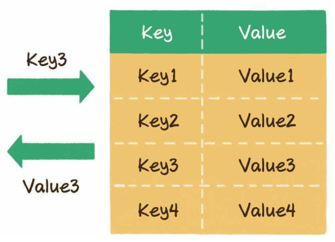

哈希表的时间复杂度几乎是常量$ O(1) $，即查找时间与问题规模无关。

|                |    插入     |    删除     |                 查找                  |
| :------------: | :---------: | :---------: | :-----------------------------------: |
|    **数组**    |  $ O(n) $   |  $ O(n) $   | 顺序查找$ O(n) $；二分查找$ O(logn) $ |
|    **链表**    |  $ O(1) $   |  $ O(1) $   |               $ O(n) $                |
| **二叉搜索树** | $ O(logn) $ | $ O(logn) $ |              $ O(logn) $              |
| **平衡二叉树** | $ O(logn) $ | $ O(logn) $ |              $ O(logn) $              |

哈希表的两项基本工作：

1. 计算位置：构造哈希函数确定关键字的存储位置
2. 解决冲突：应用某种策略解决多个关键字位置相同的问题

<div style="page-break-after: always;"></div>

## 6.2 哈希函数

**哈希函数（Hash Function）**

哈希的基本思想是将键`key`通过一个确定的函数，计算出对应的函数值`value`作为数据对象的存储地址，这个函数就是哈希函数。

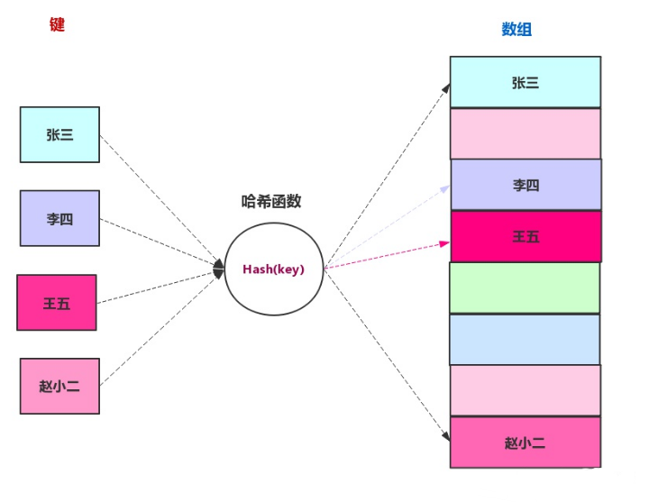

哈希表本质上也是一个数组，可是数组只能根据下标来访问，而哈希表的`key`则是以字符串类型为主的。

在不同的语言中，哈希函数的实现方式是不一样的。假设需要存储整型变量，转化为数组的下标就不难实现了。最简单的转化方式就是按照数组长度进行取模运算。

一个好的哈希函数应该考虑两个因素：

1. 计算简单，以便提高转换速度。
2. 关键字对应的地址空间分布均匀，以尽量减少冲突


**数字关键字的哈希函数构造方法**

对于数字类型的关键字，哈希函数有以下几种常用的构造方法：

1. 直接定址法：取关键字的某个线性函数值为散列地址。

$$
h(key) = a * key + b\ (a,b\text{为常数})
$$

例如：根据出生年份计算人口数量$ h(key) = key - 1990 $：

|   地址    | 出生年份  |   人数    |
| :-------: | :-------: | :-------: |
|     0     |   1990    |  1285万   |
|     1     |   1991    |  1281万   |
|     2     |   1992    |  1280万   |
| $ \dots $ | $ \dots $ | $ \dots $ |
|    10     |   2000    |  1250万   |
| $ \dots $ | $ \dots $ | $ \dots $ |
|    21     |   2011    |  1180万   |

2. 除留余数法：哈希函数为$ h(key) = key\ mod\ p\ (p\text{一般取素数}) $。

例如$ h(key) = key\ \%\ 17 $：

|    地址    |  0   |  1   |  2   |  3   |  4   |  5   |  6   |  7   |  8   |  9   |  10  |  11  |  12  |  13  |  14  |  15  |  16  |
| :--------: | :--: | :--: | :--: | :--: | :--: | :--: | :--: | :--: | :--: | :--: | :--: | :--: | :--: | :--: | :--: | :--: | :--: |
| **关键字** |  34  |  18  |  2   |  20  |      |      |  23  |  7   |  42  |      |  27  |  11  |      |  30  |      |  15  |      |

3. 数字分析法：分析数字关键字在各位上的变化情况，取比较随机的位作为散列地址。

例如取11位手机号码的后4位作为地址$ h(key) = Integer(key + 7) $。

再例如取18位身份证号码中变化较为随机的位数：

|  1   |  2   |  3   |  4   |  5   |  6   |  7   |  8   |  9   |  10  |  11  |  12  |  13  |  14  |  15  |  16  |  17  |  18  |
| :--: | :--: | :--: | :--: | :--: | :--: | :--: | :--: | :--: | :--: | :--: | :--: | :--: | :--: | :--: | :--: | :--: | :--: |
|  3   |  3   |  0   |  1   |  0   |  6   |  1   |  9   |  9   |  0   |  1   |  0   |  0   |  8   |  0   |  4   |  1   |  9   |
|  省  |  省  |  市  |  市  |  区  |  区  |  年  |  年  |  年  |  年  |  月  |  月  |  日  |  日  |  辖  |  辖  |  辖  | 校验 |

4. 折叠法：把关键字分割成位数相同的几个部分，然后叠加。

例如将整数$ 56793542 $每三位进行分割：
$$
\begin{array}{r}
542 \\
793 \\
+ 056 \\
\hline
1319 \\
\end{array}
$$

$$
h(56793542) = 319
$$

5. 平方取中法：计算关键字的平方，取中间几位。

例如整数$ 56793542 $：
$$
\begin{array}{r}
56793542 \\
\times 56793542 \\
\hline
3225506412905764 \\
\end{array}
$$

$$
h(56793542) = 641
$$


**字符串关键字的哈希函数构造方法**

对于字符串类型的关键字，哈希函数有以下几种常用的构造方法：

1. ASCII码加和法

$$
h(key) = \left( \sum key[i] \right)\ mod\ TableSize
$$

但是对于某些字符串会导致严重冲突，例如：`a3`、`b2`、`c1`或`eat`、`tea`等。

2. 移位法：取前3个字符移位，如：

$$
h(key) = \left( key[0] \times 27^2 + key[1] \times 27 | key[2] \right)\ mod\ TableSize
$$

对于一些字符串仍然会冲突，例如`string`、`strong`、`street`、`structure`等。

一个有效的改进是涉及关键字中所有$ n $个字符：
$$
h(key) = \left( \sum_{i=0}^{n-1} key[n-i-1] \times 32^i \right)\ mod\ TableSize
$$

---

【代码】快速计算$ h('abcde') = a * 32^4 + b * 32^3 + c * 32^2 + d * 32 + e $

```c
int hash(char *key, int tableSize) {
    int h = 0;          // hash value
    int i = 0;
    while(key[i] != '\0') {
        h = (h << 5) + key[i];
        i++;
    }
    return h % tableSize;
}
```

---

【代码】凯撒加密

```c
/**
 * @brief  凯撒加密
 * @note  加密算法：ciphertext[i] = (plaintext[i] + Key) % 128
 * @param  plaintext: 明文
 * @retval 密文
 */
char* encrypt(char *plaintext) {
    int n = strlen(plaintext);
    char *ciphertext = (char *)malloc((n + 1) * sizeof(char));
    for(int i = 0; i < n; i++) {
        ciphertext[i] = (plaintext[i] + KEY) % 128;
    }
    ciphertext[n] = '\0';
    return ciphertext;
}

/**
 * @brief  凯撒解密
 * @note   解密算法：plaintext[i] = (ciphertext[i] - key + 128) % 128
 * @param  ciphertext: 密文
 * @retval 明文
 */
char* decrypt(char *ciphertext) {
    int n = strlen(ciphertext);
    char *plaintext = (char *)malloc((n + 1) * sizeof(char));
    for(int i = 0; i < n; i++) {
        plaintext[i] = (ciphertext[i] - KEY + 128) % 128;
    }
    plaintext[n] = '\0';
    return plaintext;
}
```

---

<div style="page-break-after: always;"></div>

## 6.3 冲突处理

**装填因子（Load Factor）**

假设哈希表空间大小为$ m $，填入表中元素个数是$ n $，则称$ \alpha = n / m $为哈希表的装填因子。

当哈希表元素太多，即装填因子$ \alpha $太大时，查找效率会下降。实用最大装填因子一般取$ 0.5 \le \alpha \le 0.85 $。当装填因子过大时，解决的方法是加倍扩大哈希表，这个过程叫作再散列（rehashing）。

再散列的过程需要遍历原哈希表，把所有的关键字重新散列到新数组中。为什么需要重新散列呢？因为长度扩大以后，散列的规则也随之改变。经过扩容，原本拥挤的哈希表重新变得稀疏，原有的关键字也重新得到了尽可能均匀的分配。

装填因子也是影响产生哈希冲突的因素之一。当不同的关键字可能会映射到同一个散列地址上，就导致了哈希冲突（collision），即$ h(key_i) = h(key_j),\ key_i \ne key_j $，因此需要某种冲突解决策略。

例如有11个数据对象的集合$ {18, 23, 11, 20, 2, 7, 27, 30, 42, 15, 34, 35} $，哈希表的大小为$ 17 $，哈希函数选择$ h(key) = key\ mod\ size $。

|    地址    |  0   |  1   |  2   |  3   |  4   |  5   |  6   |  7   |  8   |  9   |  10  |  11  |  12  |  13  |  14  |  15  |  16  |
| :--------: | :--: | :--: | :--: | :--: | :--: | :--: | :--: | :--: | :--: | :--: | :--: | :--: | :--: | :--: | :--: | :--: | :--: |
| **关键字** |  34  |  18  |  2   |  20  |      |      |  23  |  7   |  42  |      |  27  |  11  |      |  30  |      |  15  |      |

在插入最后一个关键字$ 35 $之前，都没有产生任何冲突。但是$ h(35) = 1 $，位置已有对象，就导致了冲突。


**冲突处理方法**

常用的处理冲突的思路有两种：

1. 开放地址法（open addressing）：一旦产生了冲突，就按某种规则去寻找另一空地址。开放地址法主要有线性探测法、平方探测法（二次探测法）和双散列法。
2. 分离链接法：将相应位置上有冲突的所有关键字存储在同一个单链表中。


**线性探测法（Linear Probing）**

当产生冲突时，以增量序列$ 1, 2, 3, ..., n-1 $循环试探下一个存储地址。

例如序列$ {47, 7, 29, 11, 9, 84, 54, 20, 30} $，哈希表表长为$ 13 $，哈希函数$ h(key) = key\ mod\ 11 $，用线性探测法处理冲突。

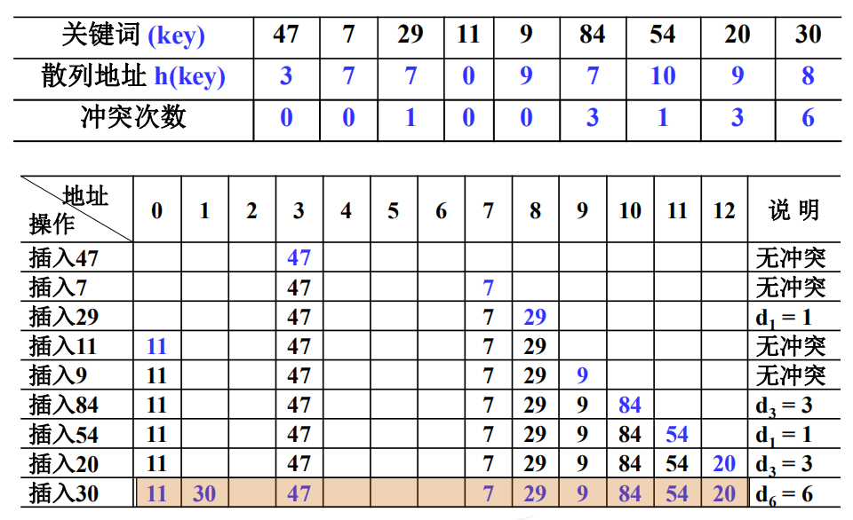

线性探测法的缺陷在于容易出现聚集现象。


**平方探测法（Quadratic Probing）**

平方探测法也称为二次探测法，以增量序列$ 1^2, -1^2, 2^2, -2^2, \dots, q^2, -q^2 (q \le \lfloor size/2 \rfloor) $循环试探下一个存储地址。

例如序列$ {47, 7, 29, 11, 9, 84, 54, 20, 30} $，哈希表表长为$ 11 $，哈希函数$ h(key) = key\ mod\ 11 $，用平方探测法处理冲突。

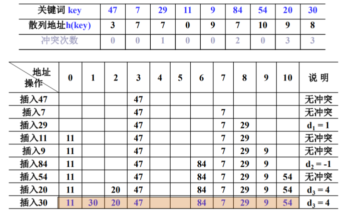

但是只要还有空间，平方探测法就一定能找到吗？

例如对于以下哈希表，插入关键字$ 11 $，哈希函数$ h(key) = key\ mod\ 5 $，用平方探测法处理冲突。

|    下标    |  0   |  1   |  2   |  3   |  4   |
| :--------: | :--: | :--: | :--: | :--: | :--: |
| **关键字** |  5   |  6   |  7   |      |      |

对关键字$ 11 $进行平方探测的结果一直在下标$ 0 $和$ 2 $之间波动，永远无法达到其它空的位置。

但是有定理证明，如果哈希表长度是某个$ 4k + 3\ (k \in Z^+)$形式的素数时，平方探测法就可以探查到整个哈希表空间。


**双散列探测法（Double Hashing）**

设定另一个哈希函数$ h_2(key) $，探测序列为$ h_2(key),\ 2h_2(key),\ 3h_2(key), \dots $

探测序列应该保证所有的散列存储单元都应该能够被探测到，选择以下形式有良好的效果：
$$
h_2(key) = p - (key\ mod\ p),\ p < TableSize,\ p,\ TableSize \in {素数}
$$


**分离链接法**

分离链接法也称拉链法、链地址法，将相应位置上有冲突的所有关键字存储在同一个单链表中。

例如关键字序列为$ {47, 7, 29, 11, 16, 92, 22, 8, 3, 50, 37, 89, 94, 21} $，哈希函数$ h(key) = key\ mod\ 11 $，用分离链接法处理冲突。

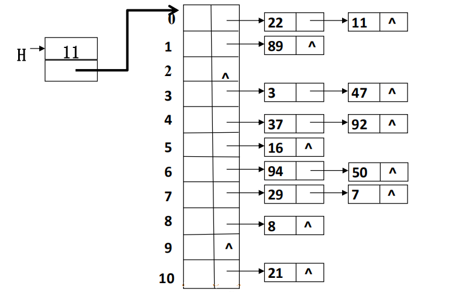

<div style="page-break-after: always;"></div>

## 6.4 性能分析

**性能分析**

哈希表的平均查找长度（ASL, Average Search Length）用来度量哈希表查找效率。关键字的比较次数，取决于产生冲突的多少。影响产生冲突多少有三个因素：

1. 哈希函数是否均匀
2. 处理冲突的方法
3. 哈希表的装填因子$ \alpha $

合理的最大装填因子$ \alpha $应该不超过$ 0.85 $，选择合适的哈希函数可以使哈希表的查找效率期望是常数$ O(1) $，它几乎与关键字的空间大小$ n $无关。这是以较小的$ \alpha $为前提，因此哈希表是一个以空间换时间的结构。

哈希表的存储对关键字是随机的，因此哈希表不便于顺序查找、范围查找、最大值/最小值查找等操作。

<div style="page-break-after: always;"></div>

# 第7章 树

## 7.1 树

**树（Tree）**


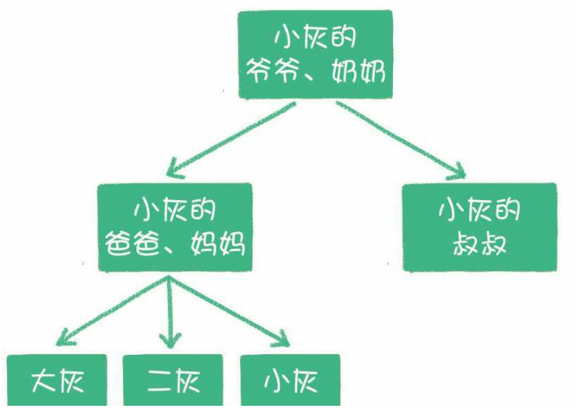

许多逻辑关系并不是简单的线性关系，在实际场景中，常常存在着一对多，甚至多对多的情况。树和图就是典型的非线性数据结构。

除了家谱是一个树，企业里的职级关系也是一个树：

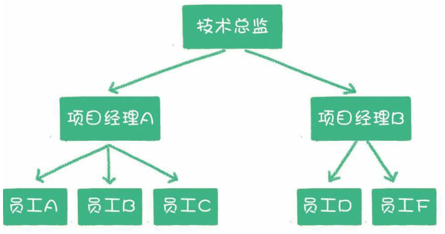

除了人与人之间的关系之外，许多抽象的东西也可以成为一个树，例如一本书的目录：


这些结构都像自然界中的树一样，从同一个根衍生出许多枝干，再从每一个枝干衍生出许多更小的枝干，最后衍生出更多的叶子。

树是由$ n\ (n \ge 0) $个有限节点组成的一个具有层次关系的集合，当$ n = 0 $时称为空树。

在任意一个非空树中，有以下特点：

1. 有且有且仅有一个特定的结点称为根（root）。
2. 当$ n > 1 $时，其余结点可分为$ m\ (m > 0) $个互不相交的有限集$ T_1, T_2, \dots, T_m $，其中每一个集合本身又是一棵树，并且称为根的子树（subtree）。


**树的术语**

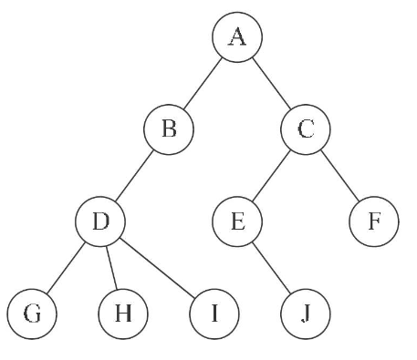

- 根：没有父结点（parent）的结点。
- 内部结点（internal node）：至少有一个子结点（child）的结点。
- 外部结点（external node） / 叶子结点（leaf node）：没有子结点的结点。
- 度（degree）：结点分支的个数。
- 路径（path）：从根结点到树中某结点经过的分支构成了路径。
- 祖先结点（ancestors）：包含父结点、父结点的父结点等。
- 子孙结点（descendants）：包含子结点、子结点的子结点等。
- 深度（depth） / 高度（height）：最大层级数。

<div style="page-break-after: always;"></div>

## 7.2 二叉树

**二叉树（Binary Tree）**

二叉树是树的一种特殊形式。二叉树的每个结点最多有两个孩子结点，即最多有`2`个，也可能只有`1`个，或者`没有`孩子结点。

二叉树结点的两个孩子结点，分别被称为`左孩子（left child）`和`右孩子（right child）`。这两个孩子结点的顺序是固定的，不能颠倒或混淆。

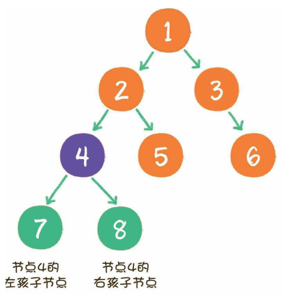

二叉树还有几种特殊的形式：

1. 左斜树（left skew tree） / 右斜树（right skew tree）：只有左子树或只有右子树的二叉树。

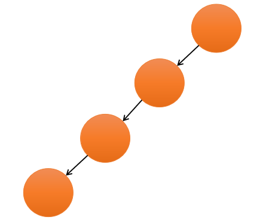

2. 满二叉树（full binary tree）：所有非叶子结点都存在左右孩子，并且所有叶子结点都在同一层。

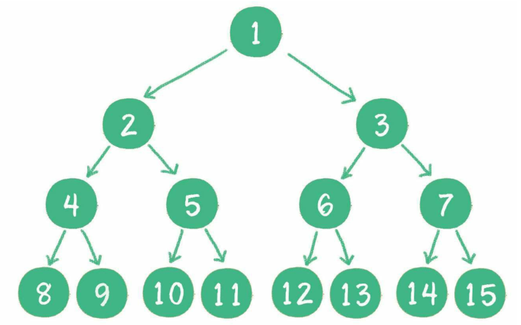

3. 完全二叉树：对于一个有$ n $个结点的二叉树，按层级顺序编号，则所有结点的编号从1到n，完全二叉树所有结点和同样深度的满二叉树的编号从$ 1 $到$ n $的结点位置相同。简单来说，就是除最后一层外，其它各层的结点数都达到最大，并且最后一层从右向左连续缺少若干个结点。

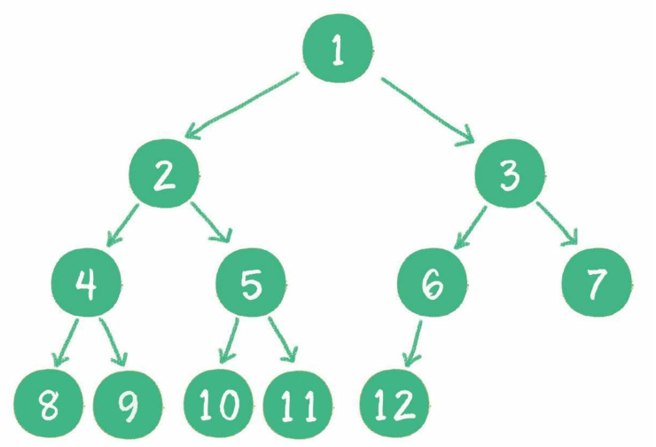


**二叉树的存储结构**

二叉树既可以通过链式存储，也可以使用数组存储：

1. 链式存储结构：一个结点最多可以指向左右两个孩子结点，所以二叉树的每一个结点包含三个部分：
    - 存储数据的数据域`data`
    - 指向左孩子的指针`left`
    - 指向右孩子的指针`right`

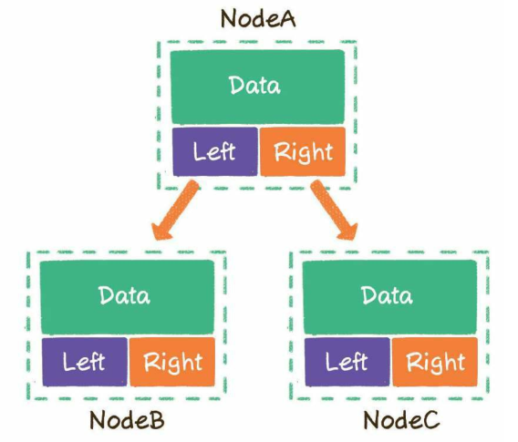

2. 数组存储：按照层级顺序把二叉树的结点放到数组中对应的位置上。如果某一结点的左孩子或右孩子空缺，则数组的相应位置也空出来。

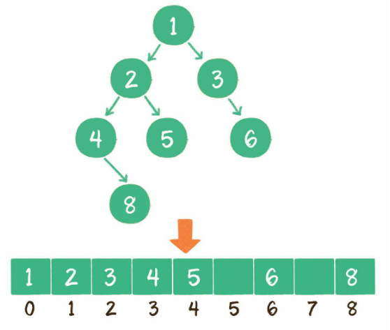

采用数组存储可以更方便地定位二叉树的孩子结点和父结点。假设一个父结点的下标是`parent`，那么它的左孩子结点的下标就是`2 * parent + 1`，右孩子结点的下标就是`2 * parent + 2`。反过来，假设一个左孩子结点的下标是`leftChild`，那么它的父结点的下标就是`(leftChild - 1) / 2`。

但是，对于一个稀疏的二叉树来说，用数组表示法是非常浪费空间的。对于一种特殊的完全二叉树——二叉堆而言，就是使用数组进行存储的。


**二叉树的应用**

二叉树包含许多特殊的形式，每一种形式都有自己的作用，但是其最主要的应用还在于进行查找操作和维持相对顺序这两个方面。

常用的二叉树包括：

1. 二叉搜索树（binary search tree）


2. AVL树（AVL tree）

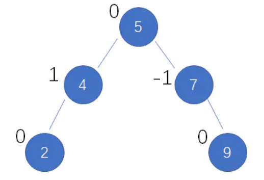

3. 红黑树（red black tree）

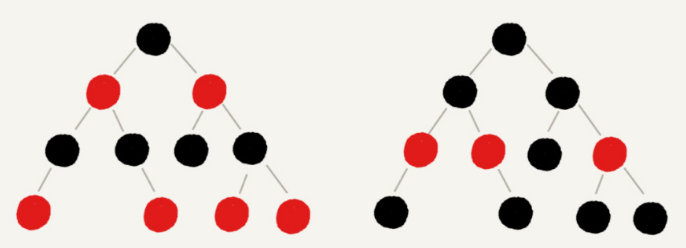

4. 二叉堆（binary heap）

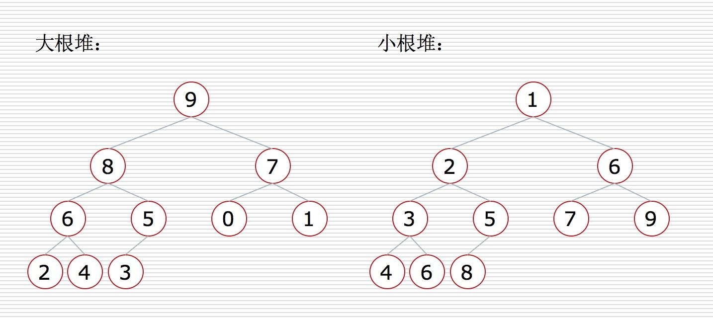

5. 哈夫曼树（Huffman tree）

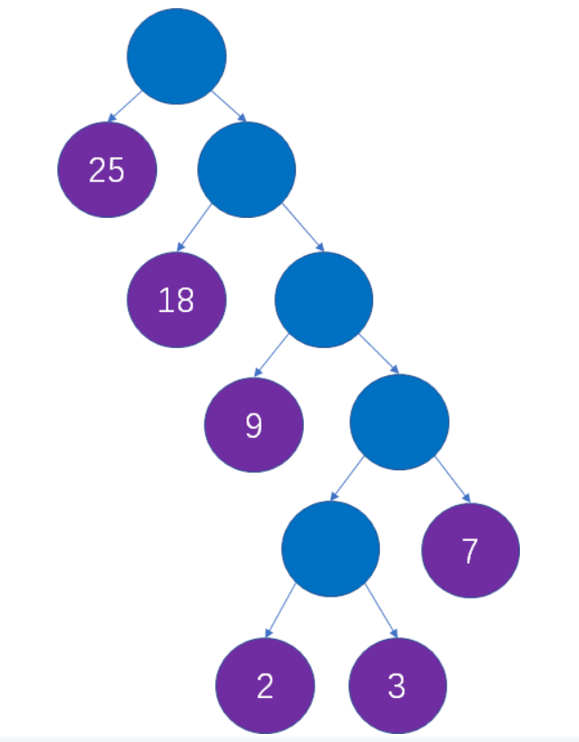

二叉树还可以用在表达式求值中：

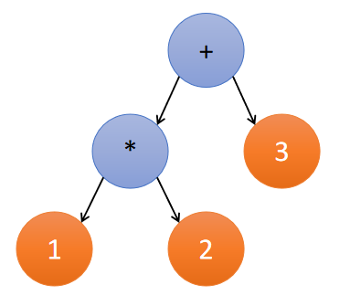

<div style="page-break-after: always;"></div>

## 7.3 二叉树的遍历

**二叉树的遍历**

在计算机程序中，遍历（traversal）本身是一个线性操作，所以遍历同样具有线性结构的数组或链表是一件轻而易举的事情。

反观二叉树，是典型的非线性数据结构，遍历时需要把非线性关联的结点转化成一个线性的序列，以不同的方式来遍历，遍历出的序列顺序也不同。

二叉树的遍历方式分为`4`种：

1. 前序遍历（pre-order）：访问根结点，遍历左子树，遍历右子树。
2. 中序遍历（in-order）：遍历左子树，访问根结点，遍历右子树。
3. 后序遍历（post-order）：遍历左子树，遍历右子树，访问根结点。
4. 层次遍历（level-order）：按照从根结点到叶子结点的层次关系，一层一层横向遍历。


**前序遍历**

二叉树的前序遍历，首先访问根结点然后遍历左子树，最后遍历右子树。在遍历左、右子树时，仍然先访问根结点，然后遍历左子树，最后遍历右子树，如果结点为空则返回。

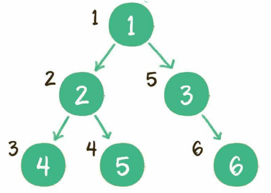

---

【代码】前序遍历

```c
void preOrder(BST *root) {
    if(!root) {
        return;
    }
    printf("%d ", root->data);
    preOrder(root->left);
    preOrder(root->right);
}
```

---


**中序遍历**

二叉树的中序遍历，首先遍历左子树，然后访问根结点，最后遍历右子树，如果结点为空则返回。

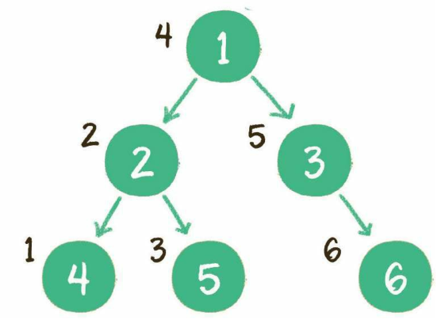

---

【代码】中序遍历

```c
void inOrder(BST *root) {
    if(!root) {
        return;
    }
    inOrder(root->left);
    printf("%d ", root->data);
    inOrder(root->right);
}
```

---


**后序遍历**

二叉树的后序遍历，首先遍历左子树，然后遍历右子树，最后访问根结点，如果结点为空则返回。

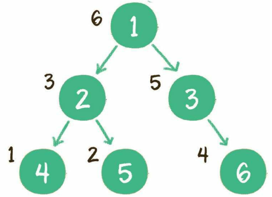

---

【代码】后序遍历

```c
void postOrder(BST *root) {
    if(!root) {
        return;
    }
    postOrder(root->left);
    postOrder(root->right);
    printf("%d ", root->data);
}
```

---


**二叉树遍历非递归实现**

绝大多数可以用递归解决的问题，其实都可以用栈来解决，因为递归和栈都有回溯的特性。

以二叉树的中序遍历为例。当遇到一个结点时，就把它入栈，并去遍历它的左子树。当左子树遍历结束后，从栈顶弹出这个结点并访问它，然后按其右指针再去中序遍历该结点的右子树。

---

【代码】中序遍历（非递归）

```java
public void inOrderNonRecursive(BSTNode node) {
    Stack s = new Stack();
    while(node != null || !s.empty()) {
        // 一直向左并将沿途结点压入堆栈
        while(node != null) {
            s.push(node);
            node = node.left;
        }
        if(!s.empty()) {
            node = s.pop();					   //结点弹出堆栈
            System.out.println(node.data);		// 访问结点
            node = node.right;				   // 转向右子树
        }
    }
}
```

---


**层次遍历**

二叉树同一层次的结点之间是没有直接关联的，需要队列来辅助完成层序遍历。

层次遍历从根结点开始首先将根结点入队，然后开始循环执行以下操作直到队列为空：结点出队、访问该结点、其左右儿子入队。

---

【代码】层次遍历

```java
public void levelOrder(BSTNode node) {
    if(node == null) {
        return;
    }
    
    Queue q = new Queue();
    q.enqueue(node);
    while(!q.empty()) {
        node = q.dequeue();
        System.out.println(node.data);		// 访问结点
        if(node.left != null) {
            q.enqueue(node.left);
        }
        if(node.right != null) {
            q.enqueue(node.right);
        }
    }
}
```

---

<div style="page-break-after: always;"></div>

## 7.4 二叉搜索树

**二叉搜索树（Binary Search Tree）**

二叉搜索树，也称二叉查找树或二叉排序树，可以是一棵空树。

如果不为空树，那么二叉搜索树满足以下性质：

1. 非空左子树的所有结点的值小于其根结点的值。
2. 非空右子树的所有结点的值大于其根结点的值。
3. 左、右子树均是二叉搜索树

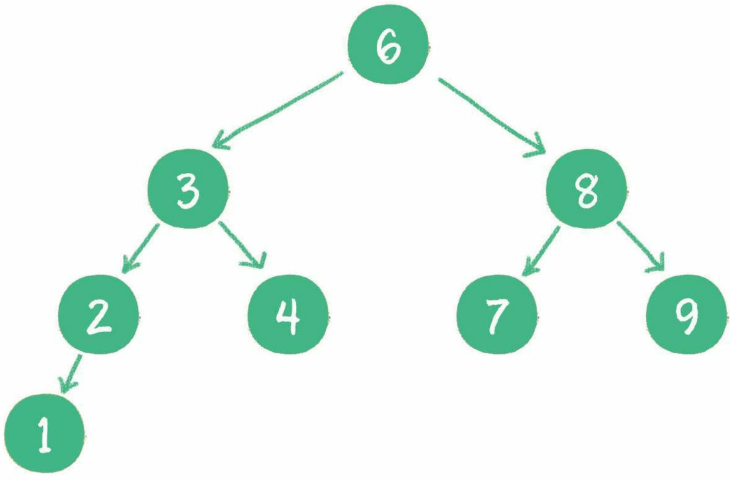


**查找结点**

在二叉搜索树中查找一个元素从根结点开始，如果树为空，返回`NULL`。

如果树不为空，则将根结点的值和被查找的key值进行比较：

1. 如果key值小于根结点的值，只需在左子树中继续查找。
2. 如果key值大于根结点的值，只需在右子树中继续查找。
3. 如果key值与根结点的值相等，查找成功。

---

【代码】查找结点（递归）

```c
Node* search(Node *root, dataType val) {
    if(!root) {
        return NULL;
    }
    if(val == root->data) {
        return root;
    } else if(val < root->data) {
        return search(root->left, val);
    } else {
        return search(root->right, val);
    }
}
```

---

由于非递归函数的执行效率高，可将`尾递归`（在函数最后才使用递归返回）的函数改为迭代函数。

---

【代码】查找结点（迭代）

```c
Node* search(Node *root, dataType val) {
    if(!root) {
        return NULL;
    }  
    while(root) {
        if(root->data == val) {
            return root;
        } else if(val < root->data) {
            root = root->left;
        } else {
            root = root->right;
        }
    }
}
```

---


**查找最小值和最大值**

二叉搜索树中，最小值一定在树的最左分枝的叶子结点上，最大值一定在树的最右分枝的叶子结点上。

---

【代码】查找最小值（递归）

```c
Node* findMin(Node *root) {
	if(!root) {
        return NULL;
    } else if(!root->left) {
        return root;
    } else {
        return findMin(root->left);		//沿左分枝继续查找
    }
}
```

---

【代码】查找最大值（迭代）

```c
Node* findMax(Node *root) {
	if(!root) {
        return NULL;
    } 
    while(root->right) {
        root = root->right;
    }
    return root;
}
```

---


**插入结点**

在二叉搜索树中插入结点与查找的算法相似，需要找到插入的位置并将新结点插入。

---

【代码】插入结点

```c
BST* insert(BST *root, dataType val) {
    // 空树，插入结点设为树根
    if(!root) {
        return init(val);
    }
    if(val < root->data) {
        root->left = insert(root->left, val);
    } else {
        root->right = insert(root->right, val);
    }
    return root;
}
```

---

<div style="page-break-after: always;"></div>

## 7.5 堆排序

**堆（Heap）**

二叉堆本质上是一种完全二叉树，分为最大堆和最小堆两个类型。在最大堆中，任何一个父结点的值都大于等于它左右孩子结点的值。在最小堆中，任何一个父结点的值都小于等于它左右孩子结点的值。

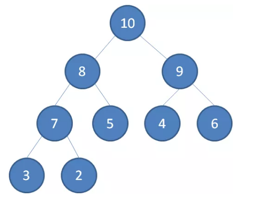

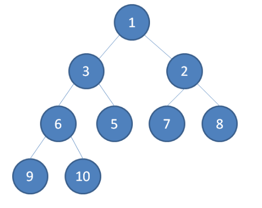

二叉堆的根结点称为堆顶，在最大堆中堆顶是整个堆中的最大元素，在最小堆中堆顶是整个堆中的最小元素。

在二叉堆中插入结点、删除结点、构造二叉堆的操作都基于堆的自我调整。

二叉堆虽然是一棵完全二叉树，但它的存储方式并不是链式存储，而是顺序存储。数组中，通过下标可以定位到结点的左右孩子，假设父结点的下标是$ parent $，那么它的左孩子下标为$ 2 * parent + 1 $、右孩子下标为$ 2 * parent + 2 $。

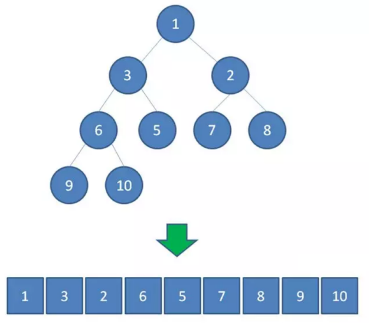


**插入/删除结点**

二叉堆的插入操作可以看成是结点上浮，当在堆中插入一个结点时，必须满足完全二叉树的标准，那么被插入结点的位置是完全二叉树的最后一个位置。在最大堆中，如果新结点的值大于它的父结点的值，则让新结点上浮，即和父结点交换位置。

堆的插入时间复杂度取决于树高为$ O(logn) $。

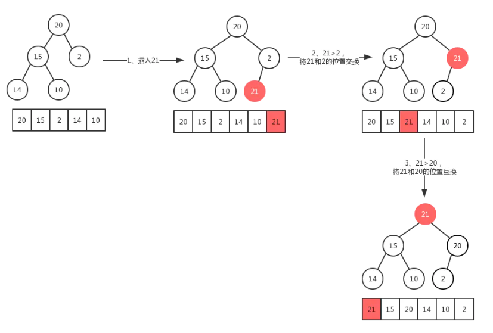

二叉堆的删除操作总是从堆的根结点删除元素。根结点被删除之后为了能够保证该树还是一棵完全二叉树，需要将完全二叉树的最后一个结点补到根结点的位置，让其继续符合完全二叉树的定义。二叉堆的删除结点操作可以看作是结点下沉。在最大堆中，如果新堆顶元素小于它的左右孩子中较大的那个结点，则与它的较大的子结点交换位置。

堆的删除时间复杂度取决于树高为$ O(logn) $。

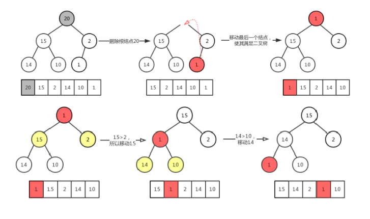


**构建二叉堆**

构建二叉堆，就是把一个无序的完全二叉树调整为二叉堆，本质上就是让所有非叶子结点依次下沉。

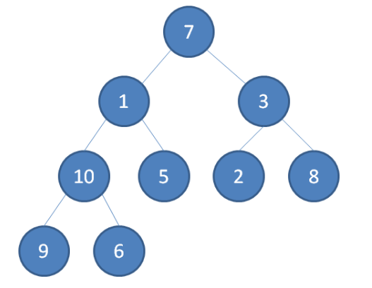

首先从最后一个非叶子结点开始，结点10下沉：


结点3下沉：

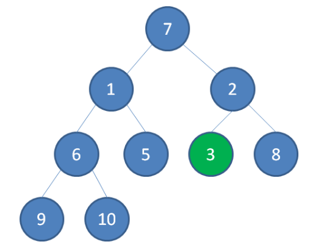

结点1不用改变。结点7下沉：

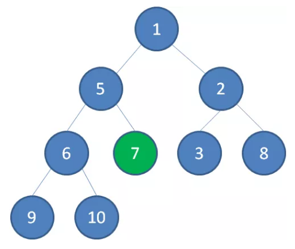

最终一棵无序完全二叉树就调整成了一个最小堆。


**堆排序（Heap Sort）**

有了二叉堆的构建、删除和自我调节，实现堆排序就是水到聚成了。当删除一个最大堆的堆顶后（并不是完全删除，而是替换到堆的最后面），经过自我调节，第二大的元素就会被交换上来，成为最大堆的新堆顶。

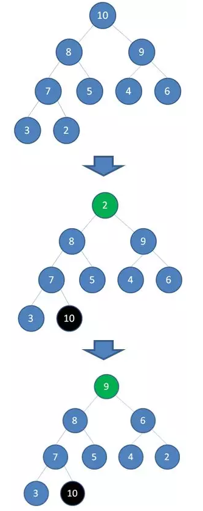

只要反复删除堆顶，反复调节二叉堆，所得到的的集合就成为了一个有序集合。

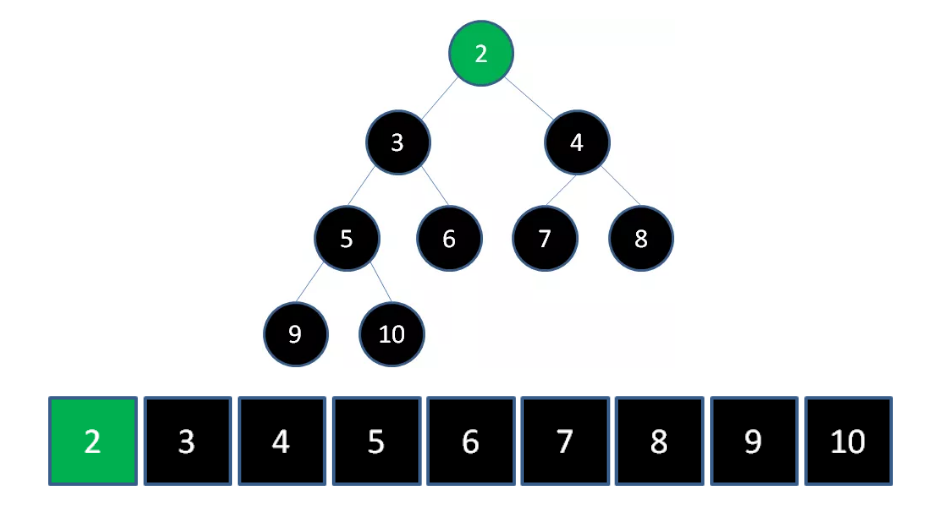

---

【代码】堆排序

```java
public static void downAdjust(int[] arr, int parentIndex, int length) {
    // 保存父结点的值，用于最后的赋值
    int temp = arr[parentIndex];
    int childIndex = 2 * parentIndex + 1;

    while(childIndex < length) {
        // 如果有右孩子，且右孩子大于左孩子的值，则定位到右孩子
        if(childIndex + 1 < length 
           && arr[childIndex + 1] > arr[childIndex]) {
            childIndex++;
        }
        // 如果父结点小于任何一个孩子的值，直接跳出
        if(temp >= arr[childIndex]) {
            break;
        }
        // 无需真正交换，单向赋值即可
        arr[parentIndex] = arr[childIndex];
        parentIndex = childIndex;
        childIndex = 2 * childIndex + 1;
    }
    arr[parentIndex] = temp;
}

public static void heapSort(int[] arr) {
    // 把无序数组构建成二叉堆
    for(int i = (arr.length-2) / 2; i >= 0; i--) {
        downAdjust(arr, i, arr.length);
    }

    // 循环删除堆顶元素，移到数组尾部，调节堆产生新的堆顶
    for(int i = arr.length - 1; i > 0; i--) {
        // 最后一个元素和第一个元素交换
        int temp = arr[i];
        arr[i] = arr[0];
        arr[0] = temp;
        // 下沉调整最大堆
        downAdjust(arr, 0, i);
    }
}
```

---

堆排序的空间复杂度为$ O(1) $，因为算法并没有开辟额外的集合空间。

至于空间复杂度，假设二叉堆总共有$ n $个元素，那么下沉调整的最坏时间复杂度就等同于二叉堆的高度$ O(logn) $。

堆排序的算法步骤分为两部分：

1. 把无序数组构建成二叉堆：进行$ n / 2 $次循环，每次循环进行一次下沉调节，因为此步骤的计算规模为$ n/2 * logn $，时间复杂度为$ O(nlogn) $。
2. 循环删除堆顶元素，移到数组尾部，调节堆产生新堆顶：进行$ n - 1 $次循环，每次循环进行一次下沉调节，因此次步骤的计算规模为$ (n-1) * logn $，时间复杂度为$ O(nlogn) $。

综合堆排序的两个步骤，整体时间复杂度为$ O(nlogn) $。

<div style="page-break-after: always;"></div>

## 7.6 哈夫曼树

**哈夫曼树（Huffman Tree）**

树的每一个结点都可以拥有自己的权值（weight），假设二叉树有$ n $个叶子结点，每个叶子结点都带有权值$ w_k $，从根结点到每个叶子结点的长度为$ l_k $，则树的带权路径长度（WPL, Weighted Path Length）为：
$$
WPL = \sum_{k=1}^n w_k l_k
$$
哈夫曼树是由麻省理工学院的哈夫曼博士于1952年发明的，哈夫曼树是在叶子结点和权重确定的情况下，带权路径长度最小的二叉树，也被称为最优二叉树。

例如，有五个叶子结点，它们的权值为$ \{1, 2, 3, 4, 5\} $，用此权值序列可以构造出形状不同的多个二叉树。

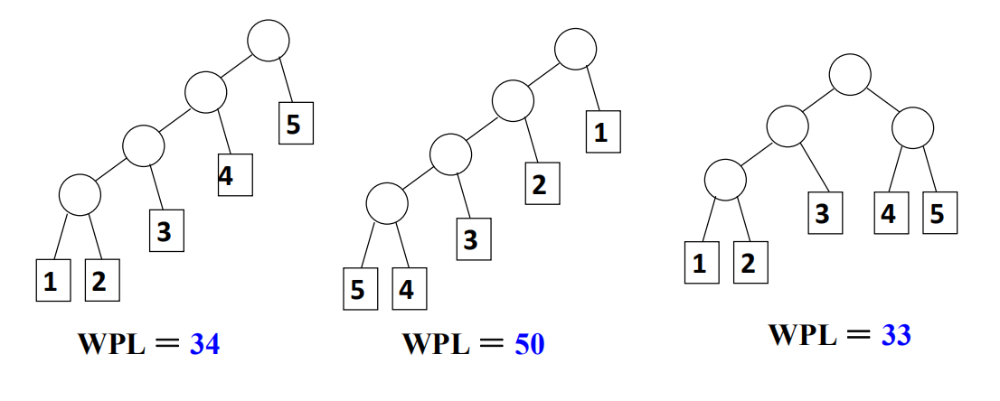
$$
\begin{aligned}
WPL_1 &= 5 * 1 + 4 * 2 + 3 * 3 + 2 * 4 + 1 * 4 = 34 \\
WPL_2 &= 1 * 1 + 2 * 2 + 3 * 3 + 4 * 4 + 5 * 4 = 50 \\
WPL_3 &= 3 * 2 + 4 * 2 + 5 * 2 + 1 * 3 + 2 * 3 = 33
\end{aligned}
$$
​	怎样才能保证构建出的二叉树带权路径长度最小呢？原则上，应该让权重小的叶子结点远离树根，权重大的叶子结点靠近树根。需要注意的是，同样叶子结点所构成的哈夫曼树可能不止一棵。


**哈夫曼树的构造**

哈夫曼树的构造方法就是每次把权值最小的两棵二叉树合并。

例如有$ 6 $个叶子结点，权重依次是$ 2, 3, 7, 9, 18, 25 $。

第一步：把每一个叶子结点都当成一棵独立的树（只有根结点的树），这样就形成了一个森林。

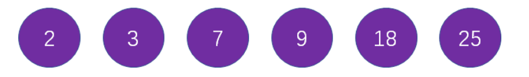

第二步：从森林中移除权值最小的两个结点，生成父结点，父结点的权值是这两个结点权值之和，把父结点加入森林。重复该步骤，直到森林中只有一棵树为止。

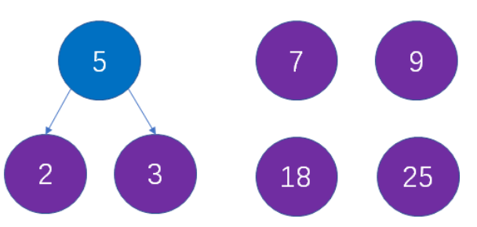

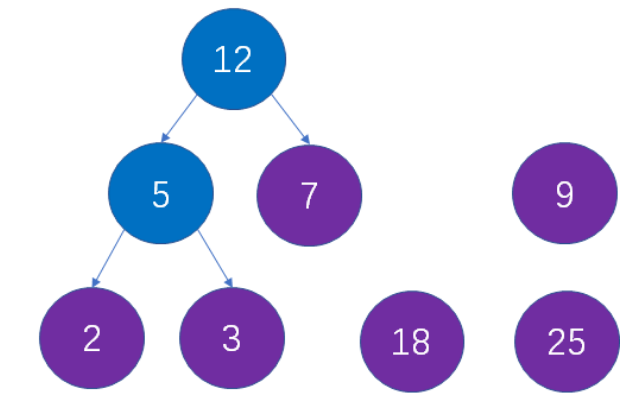


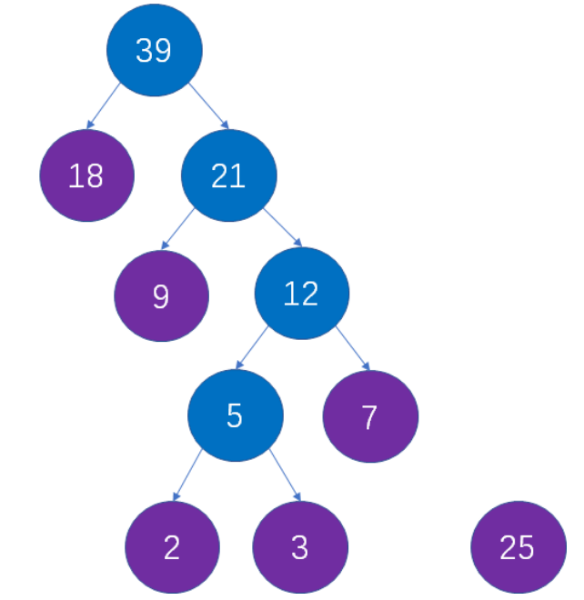

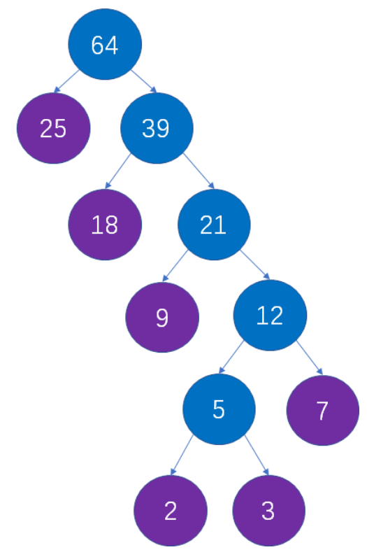

哈夫曼树有以下几个特点：

1. 没有度为$ 1 $的结点。
2. 哈夫曼树的任意非叶结点的左右子树交换后仍是哈夫曼树。
3. 对同一组权值，可能存在不同构的两棵哈夫曼树

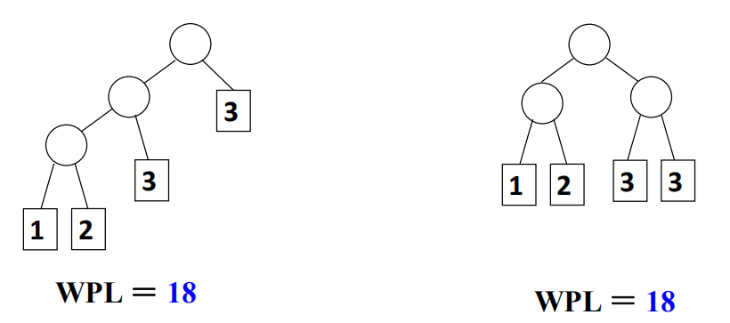

<div style="page-break-after: always;"></div>

## 7.7 哈夫曼编码

**哈夫曼编码（Huffman Code）**

哈夫曼编码是一种高效的编码方式，在信息存储和传输过程中用于对信息进行压缩。要理解哈夫曼编码，需要从信息存储的底层逻辑讲起。

计算机不是人，它不认识中文和英文，更不认识图片和视频，它唯一认识的就是`0（低电平）`和`1（高电平）`。因此，计算机上一切文字、图象、音频、视频，底层都是用二进制来存储和传输的。

将信息转换成计算机能够识别的二进制形式的过程被称为编码。在ASCII码中，每一个字符表示成特定的`8`位二进制数。例如：

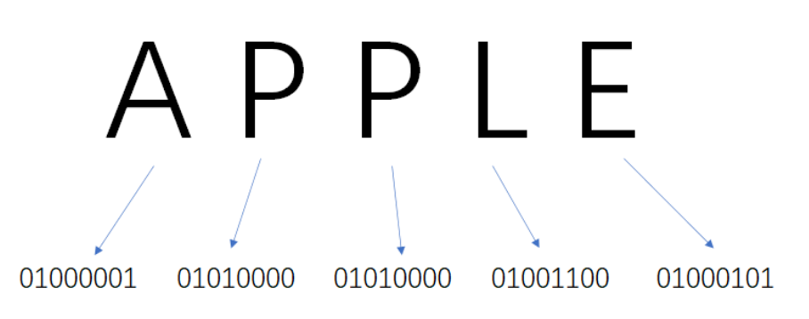

显然，ASCII码是一种等长编码，也就是任何字符的编码长度都相等。等长编码的有点明显，因为每个字符对应的二进制编码长度相等，所以很容易设计，也很方便读写。但是计算机的存储空间以及网络传输的带宽是有限的，等长编码最大的缺点就是编码结果太长，会占用过多资源。

使用不等长编码，让出现频率高的字符用的编码短一些，出现频率低的字符编码长一些，可以使编码的总长度减小。但是不等长编码是不能随意设计的，如果一个字符的编码恰好是另一个字符编码的前缀，就会产生歧义的问题。

哈夫曼编码就是一种不等长的编码，并且任何一个字符的编码都不是另一个字符编码的前缀，因此可以无二义地进行解码，并且信息编码的总长度最小。

哈夫曼编码并非一套固定的编码，而是根据给定信息中各个字符出现的频次，动态生成最优的编码。哈夫曼编码的生成过程就用到了哈夫曼树。

例如一段信息里只有A、B、C、D、E、F这6个字符，出现的次数分别是2次、3次、7次、9次、18次、25次。通过把这6个字符当成6个叶子结点，将出现次数作为结点的权重，生成一颗哈夫曼树。将哈夫曼树中结点的左分支当做0、结点的右分支当做1，从哈夫曼树的根结点到每一个叶子结点的路径，都可以等价为一段二进制编码。

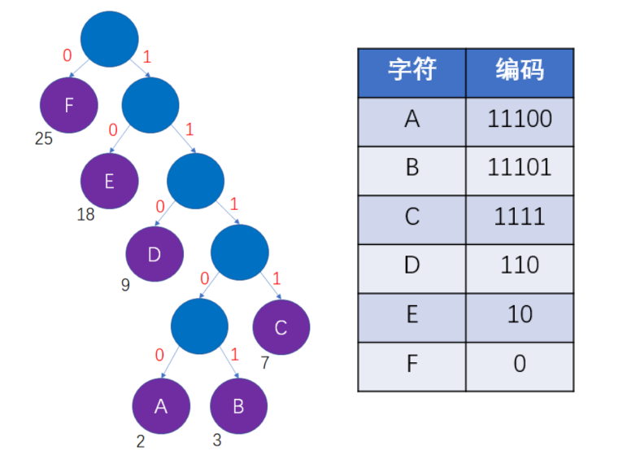

因为每一个字符对应的都是哈夫曼树的叶子结点，从根结点到这些叶子结点的路径并没有包含关系，最终得到的二进制编码自然也不会是彼此的前缀。

<div style="page-break-after: always;"></div>

# 第8章 图

## 8.1 图

**图（Graph）**

例如，你的微信中有若干好友，而你的好友又有若干好友。

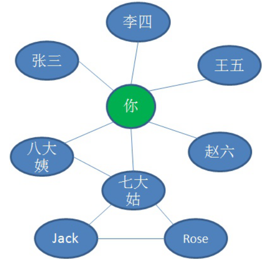

许许多多的用户组成了一个多对多的关系网，这个关系网就是数据结构中的图。

再例如使用地图导航功能时，导航会根据你的出发地和目的地规划最佳的地铁换乘路线。许许多多的地铁站组成的交通网络也可以认为是图。

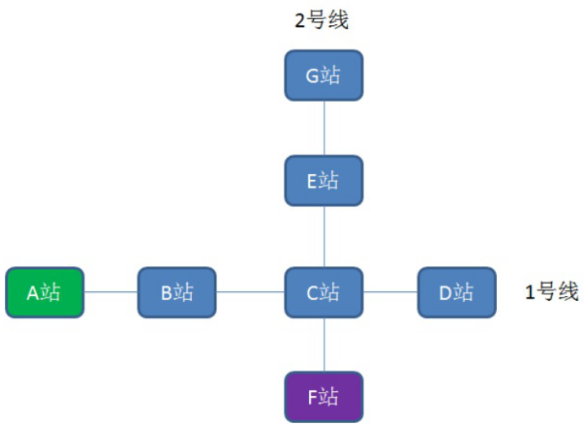

图是一种比树更为复杂的数据结构。树的结点之间是一对多的关系，并且存在父与子的层级划分。而图的顶点之间是多对多关系，并且所有顶点都是平等的，无所谓谁是父子。

在图中，最基本的单元是顶点（vertex），相当于树中的结点。顶点之间的关联关系被称为边（edge）。图中包含一组顶点和一组边，通常用$ V $表示顶点集合，用$ E $表示边集合。边可以看作是顶点对，即$ (v, w) \in E,\ v, w \in V $。

在有些图中，每一条边并不是完全等同的。例如地铁线路，站与站之间的距离都有可能不同。因此图中会涉及边的权重（weight），涉及到权重的图被称为带权图（weighted graph），也称为网络。

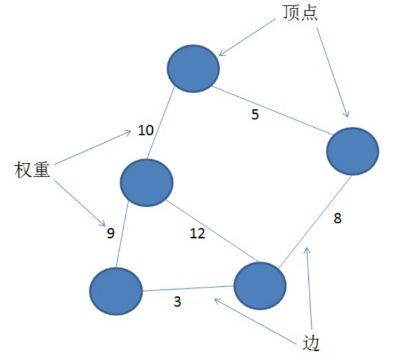

还有一种图，顶点之间的关联并不是完全对称的。拿微信举例，你的好友列表里有我，但我的好友列表里未必有你。


这样一来，顶点之间的边就有了方向的区分，这种带有方向的图被称为有向图（directed graph）。有向边可以使用$ <v, w> $表示从$ v $指向$ w $的边。

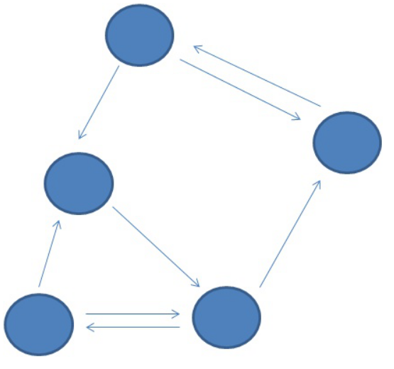

相应地，在QQ中，只要我把你从好友里删除，你在自己的好友列表里就看不到我了。因此QQ的好友关系可以认为是一个没有方向区分的图，这种图被称为无向图（undirected graph）。

<div style="page-break-after: always;"></div>

## 8.2 图的表示

**邻接矩阵（Adjacency Matrix）**

拥有$ n $个顶点的图，它所包含的边的数量最多是$ n(n-1) $条，因此，要表达各个顶点之间的关联关系，最清晰易懂的方式是使用邻接矩阵$ G[N][N] $。

对于无向图来说，如果顶点之间有关联，那么邻接矩阵中对应的值为`1`；如果顶点之间没有关联，那么邻接矩阵中对应的值为`0`。
$$
G[i][j] = \left\{
\begin{aligned}
& 1 & <v_i, v_j>\text{是}G\text{中的边} \\
& 0 & <v_i, v_j>\text{不是}G\text{中的边} \\
\end{aligned}
\right.
$$

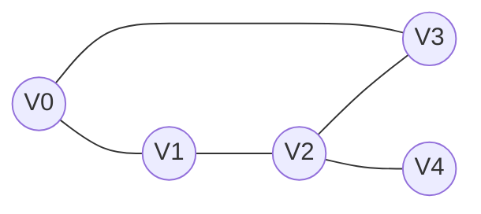
```mermaid
graph LR
	V0((V0))
	V1((V1))
	V2((V2))
	V3((V3))
	V4((V4))
	
	V0 --- V1
	V0 --- V3
	V1 --- V2
	V2 --- V3
	V2 --- V4
```

|   G    |  V0  |  V1  |  V2  |  V3  |  V4  |
| :----: | :--: | :--: | :--: | :--: | :--: |
| **V0** |  0   |  1   |  0   |  1   |  0   |
| **V1** |  1   |  0   |  1   |  0   |  0   |
| **V2** |  0   |  1   |  0   |  1   |  1   |
| **V3** |  1   |  0   |  1   |  0   |  0   |
| **V4** |  0   |  0   |  1   |  0   |  0   |

需要注意的是，邻接矩阵从左上到右下的一条对角线上的元素值必然是0，因为任何一个顶点与它自身是没有连接的。同时，无向图对应的邻接矩阵是一个对称矩阵，假如V1和V2有关联，那么V2和V1也必定有关联。

但是对于有向图的邻接矩阵，不一定是一个对称矩阵，假如V1可以达到V2，从V2未必能达到V1。

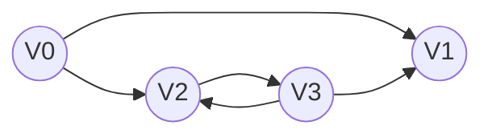
```mermaid
graph LR
	V0((V0))
	V1((V1))
	V2((V2))
	V3((V3))
	
	V0 --> V1
	V0 --> V2
	V2 --> V3
	V3 --> V1
	V3 --> V2
```

|   G    |  V0  |  V1  |  V2  |  V3  |
| :----: | :--: | :--: | :--: | :--: |
| **V0** |  0   |  1   |  1   |  0   |
| **V1** |  0   |  0   |  0   |  0   |
| **V2** |  0   |  0   |  0   |  1   |
| **V3** |  0   |  1   |  1   |  0   |

对于网络，只要把邻接矩阵对应位置的值定义为边$ <v_i, v_j> $的权重即可。

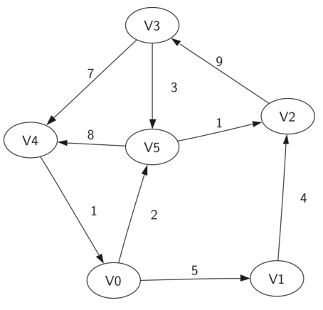

|   G    |  V0  |  V1  |  V2  |  V3  |  V4  | V5 |
| :----: | :--: | :--: | :--: | :--: | :--: | :--: |
| **V0** |     |  5  |     |     |     |  2  |
| **V1** |     |     |  4  |     |     |     |
| **V2** |     |     |     |  9  |     |     |
| **V3** |     |     |     |     |  7  |  3  |
| **V4** |  1  |     |     |     |     |     |
| **V5** |     |     |  1  |     |  8  |     |

但如果$ v_i $和$ v_j $之前没有边该怎么表示？还是设为0吗？


邻接矩阵的优点：

1. 简单、直观。
2. 可以快速查到一个顶点和另一顶点之间的关联关系。
3. 方便计算任一顶点的度，对于有向图，从顶点发出的边数为`出度`，指向顶点的边数为`入度`。

邻接矩阵的缺点：

1. 浪费空间，对于稀疏图（点很多而边很少）有大量无效元素。但对于稠密图（特别是完全图）还是很合算的。
2. 浪费时间，统计稀疏图中边的个数，也就是计算邻接矩阵中元素`1`的个数。

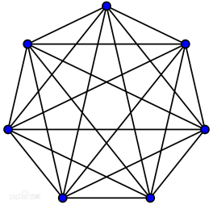


**邻接表（Adjacency List）**

为了解决邻接矩阵占用空间的问题，人们想到了另一种图的表示方法——邻接表。在邻接表中，图的每一个顶点都是一个链表的头结点，其后连接着该顶点能够直接到达的相邻顶点。对于稀疏图而言，邻接表存储方式占用的空间比邻接矩阵要小得多。

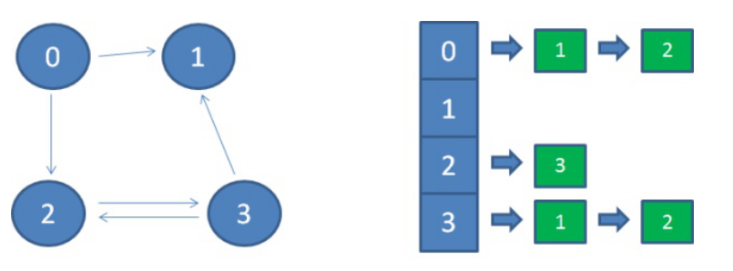

通过遍历邻接表可以查找到所有能够到达的相邻顶点，但是对于逆向查找，即哪些顶点可以达到一个顶点就会很麻烦。

通过逆邻接表可以解决逆向查找的麻烦。逆邻接表和邻接表是正好相反的，逆邻接表每一个顶点作为链表的头结点，后继结点所存储的是能够直接到达该顶点的相邻顶点。

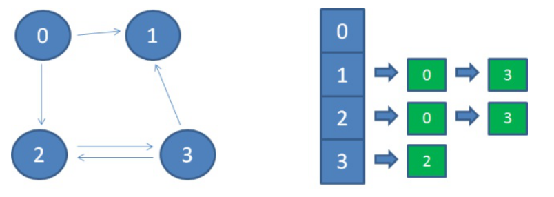


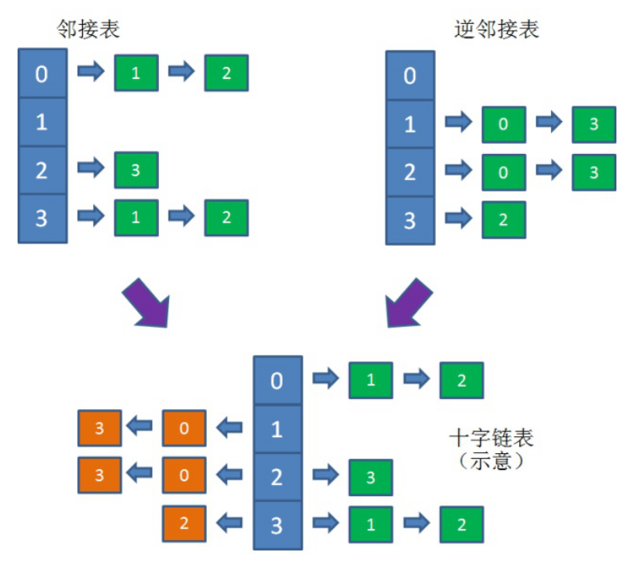

<div style="page-break-after: always;"></div>

## 8.3 图的遍历

**深度优先搜索（DFS, Depth First Search）**

深度优先搜索是一种一头扎到底的遍历方法，选择一条支路，尽可能不断地深入，如果遇到死路就回退，回退过程中如果遇到没探索的支路，就进入该支路继续深入。

例如有一个小镇，你知道小镇的每个地方与每条路。小镇的每个地方都藏有可以实现愿望的光玉，现在你要出发去收集小镇上所有的光玉。你的出生点在0号位置，你需要一个地点都不遗漏地走完整个小镇，才能收集完所有光玉。

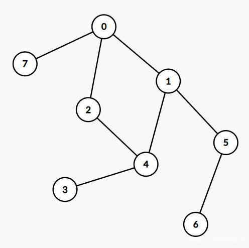

二叉树的先序遍历本质上也可以认为是图的深度优先遍历。要想实现回溯，可以利用栈的先进后出的特性，也可以采用递归的方式，因为递归本身就是基于方法调用栈来实现的。

---

【代码】深度优先搜索

```
dfs(Vertex V):
    isVisited[V] = true
    for(v in V)
        if(!isVisited[v])
            dfs(v)
```

---


**广度优先搜索（BFS, Breath First Search）**

除了深度优先搜索一头扎到底的方法以外，还有一种方法就是首先把从源点相邻的顶点遍历，然后再遍历稍微远一点的顶点，再去遍历更远一点的顶点。

二叉树的层次遍历本质上也可以认为是图的广度优先遍历，需要借助队列来实现重放。

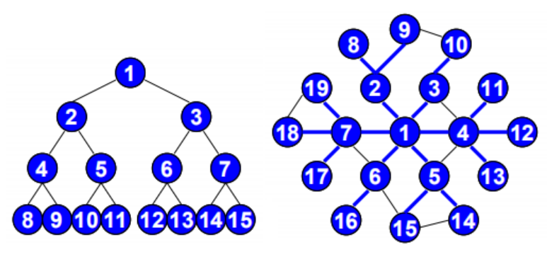

---

【代码】广度优先搜索

```
bfs(Vertex V):
    isVisited[V] = true
    enqueue(Q, V)
    while(!isEmpty(Q))
        V = dequeue(Q)
        for(v in V)
            if(!isVisited[v])
                isVisited[v = true
                enqueue(Q, v)
```

---

<div style="page-break-after: always;"></div>

## 8.4 连通图

**连通图**

图还有一些有关路径的术语：

- 连通：如果从顶点$ V $到$ W $存在一条路径，则称$ V $和$ W $是连通的。
- 路径：顶点$ V $到$ W $的路径是一系列顶点$ \{V, v_1, v_2, \dots, v_n, W\} $的集合，其中任意一对相邻的顶点间都有图中的边。
- 路径长度：路径中边的个数，如果是带权图（网络），则是所有边的权重和。
- 简单路径：顶点$ V $到$ W $之间的路径中所有顶点都不同。
- 回路：起点等于终点的路径。

如果图中任意两顶点均连通，那么称这个图是一个连通图。

一个图的连通分量指的是图的极大连通子图，极大连通子图需要满足两点要求：

1. 顶点数到达极大，即再加一个顶点就不连通了。
2. 边数达到极大，即包含子图中所有顶点相连的所有边。

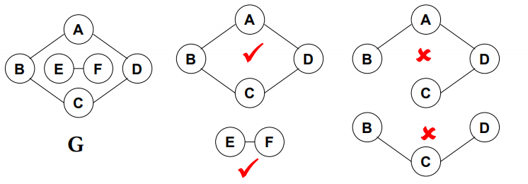

对于有向图而言，如果有向图中任意一对顶点$ V $和$ W $之间存在双向路径，既可以从$ V $走到$ W $，也可以从$ W $走到$ V $，但这两条路径不一定是同一条，则称该图为强连通图。

如果有向图不是强连通图，但将所有的有向边替换为无向边之后可以变为连通图，则称该图为弱连通图。

有向图的极大强连通子图称为强连通分量。

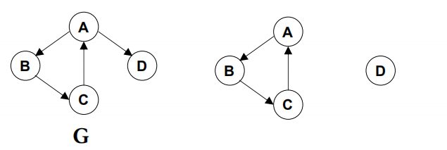


**非连通图的遍历**

如果一个图不是连通图，那么无论使用深度优先遍历还是广度优先遍历，都会有顶点无法被访问到。解决这个问题的方式是每调用一次`dfs(V)`或`bfs(V)`，就把顶点$ V $所在的连通分量遍历一遍。

---

【代码】非连通图的深度优先遍历

```
dfs(Vertex V):
    isVisited[V] = true
    for(v in V)
        if(!isVisited[v])
            dfs(v)

listComponents(Graph G):
    for(V in G)
        if(!isVisited[V])
            dfs(V)
```

---

<div style="page-break-after: always;"></div>

## 8.5 最短路径

**最短路径（Shortest Path）**

在现实中很多需要都运用到了最短路径的算法，例如从一个地铁站到另一个地铁站的最快换乘路线等。地铁线路图中，地铁站可以看作是图的顶点，站与站之间的线路可以看作是边，权重可以是距离、时间、费用等。

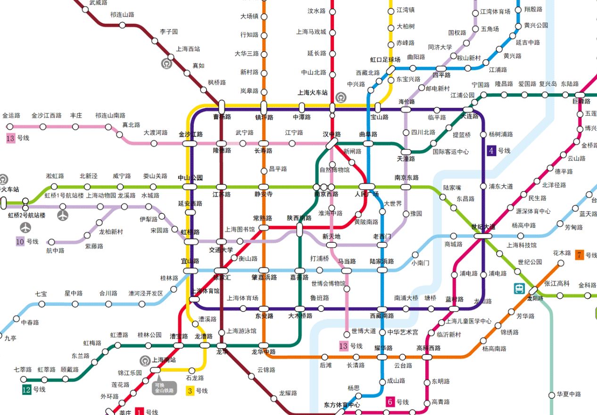

在网络中，求两个不同顶点之间的所有路径中，边的权值之和最小的那一条路径，这条路径就是两点之间的最短路径。其中最短路径的第一个顶点称为源点（source），最后一个顶点为终点（destination）。

图的最短路径问题分为2种类型：

1. 单源最短路径：从某固定源点出发，求到所有其它顶点的最短路径。
2. 多源最短路径：求任意两顶点间的最短路径。


**无权图的单源最短路径算法（SSSP, Single-Source Shortest Path）**

无权图的单源最短路径算法可以按照递增（非递减）的顺序找出到各个顶点的最短路，算法类似广度优先遍历。

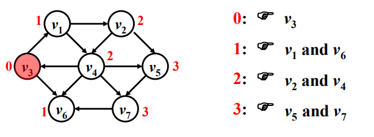

---

【代码】无权图的单源最短路径

```
unweightedSSSP(Vertex S):
    enqueue(Q, S)
    while(!isEmpty(Q))
        V = dequeue(Q)
        for(v in V)
            if(dist[v] == -1)
                dist[v] = dist[V] + 1
                path[v] = V
                enqueue(Q, v)
```

---

无权图的单元最短路径算法中，`dist[v]`存储从源点$ S $到$ v $的最短路径，初始化源点`dist[S]`的距离为$ 0 $，`path[v]`表示达到顶点路径$ v $上一个经过的顶点。

|   顶点   |  1   |  2   |  3   |  4   |  5   |  6   |  7   |
| :------: | :--: | :--: | :--: | :--: | :--: | :--: | :--: |
| **dist** |  1   |  2   |  0   |  2   |  3   |  1   |  3   |
| **path** |  3   |  1   |  -1  |  1   |  2   |  3   |  4   |


**有权图的单源最短路径算法**

有权图的最短路径不一定是经过顶点树最少的路。如果图中存在负值圈（negative-cost cycle）的话会导致算法失效，因为沿着回路走无穷多次，花销是负无穷。


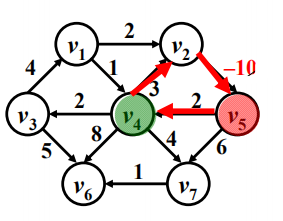


迪杰斯特拉（Dijkstra）算法的本质是不断刷新起点与其他各个顶点之间的距离表。`Dijkstra`算法采用了贪心的思想，每次都未收录的顶点中选取`dist`值最小的收录。每当收录一个顶点时，可能会影响另外一个顶点的`dist`值。
$$
dist[w] = min\{dist[w], dist[v] + weight_{<v, w>}\}
$$
例如计算从源点$ A $到其它各顶点的最短路径。

第1步：创建距离表。其中表中`key`是顶点名称，`value`是源点$ A $到对应顶点的已知最短距离。一开始并不知道最短路径是多少，因此`value`都为无穷大。

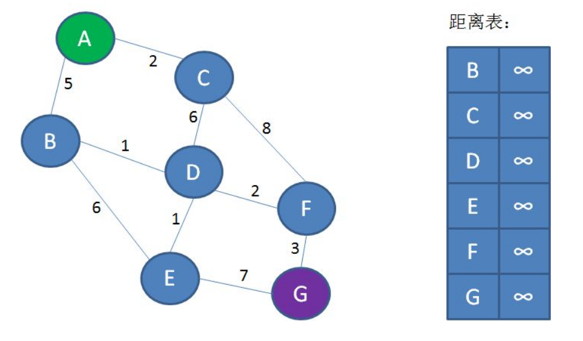

第2步：找到源点$ A $的邻接点$ B $和$ C $，从$ A $到$ B $的距离是`5`，从$ A $到$ C $的距离是`2`。更新距离表。

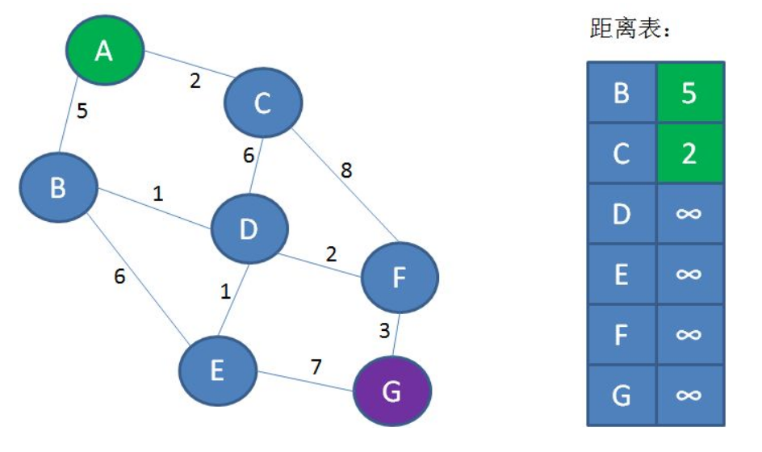

第3步：从距离表中找到从$ A $出发距离最短的顶点，也就是顶点$ C $。找到顶点$ C $的邻接点$ D $和$ F $（$ A $已经遍历过不需要考虑）。从$ C $到$ D $的距离是`6`，所以从$ A $到$ D $的距离是`2 + 6 = 8`；从$ C $到$ F $的距离是`8`，所以从$ A $到$ F $的距离是`2 + 8 = 10`。更新距离表。

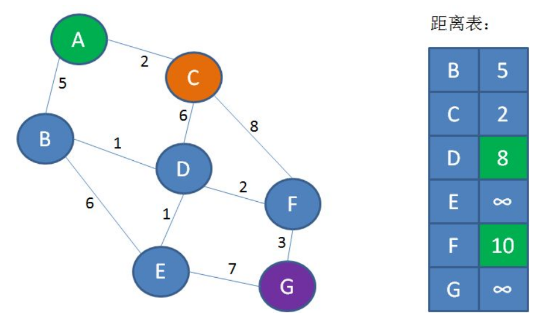

第4步：从距离表中找到从$ A $出发距离最短的顶点（$ C $已经遍历过不需要考虑），也就是顶点$ B $。找到顶点$ B $的邻接点$ D $和$ E $（$ A $已经遍历过不需要考虑）。从$ B $到$ D $的距离是`1`，所以从$A $到$ D $的距离是`5 + 1 = 6`，小于距离表中的`8`；从$ B $到$ E $的距离是`6`，所以从$ A $到$ E $的距离是`5 + 6 = 11`。更新距离表。

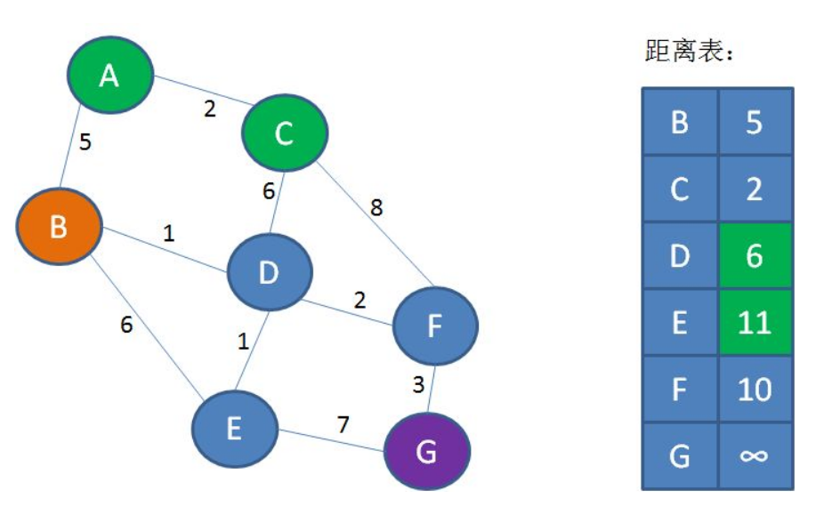

第5步：从距离表中找到从$ A $出发距离最短的顶点（$ B $和$ C $不用考虑），也就是顶点$ D $。找到顶点$ D $的邻接点$ E $和$ F $。从$ D $到$ E $的距离是`1`，所以从$ A $到$ E $的距离是`6 + 1 = 7`，小于距离表中的`11`；从$ D $到$ F $的距离是`2`，所以从$ A $到$ F $的距离是`6 + 2 = 8`，小于距离表中的`10`。更新距离表。

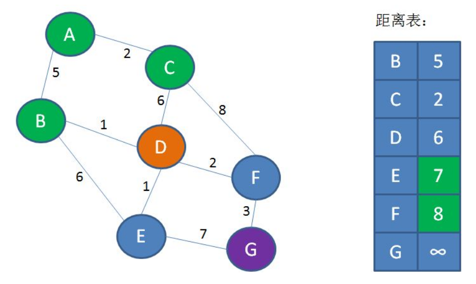

第6步：从距离表中找到从$ A $出发距离最短的顶点，也就是顶点$ E $。找到顶点$ E $的邻接点$ G $。从$ E $到$ G $的距离是`7`，所以从$ A $到$ G $的距离是`7 + 7 = 14`。更新距离表。

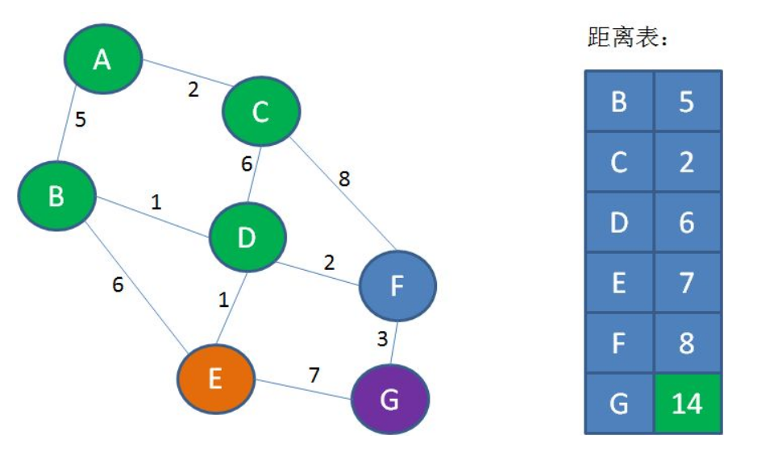

第7步：从距离表中找到从$ A $出发距离最短的顶点，也就是顶点$ F $。找到顶点$ F $的邻接点$ G $。从$ F $到$ G $的距离是`3`，所以从$ A $到$ G $的距离是`8 + 3 = 11`，小于距离表中的`14`。更新距离表。

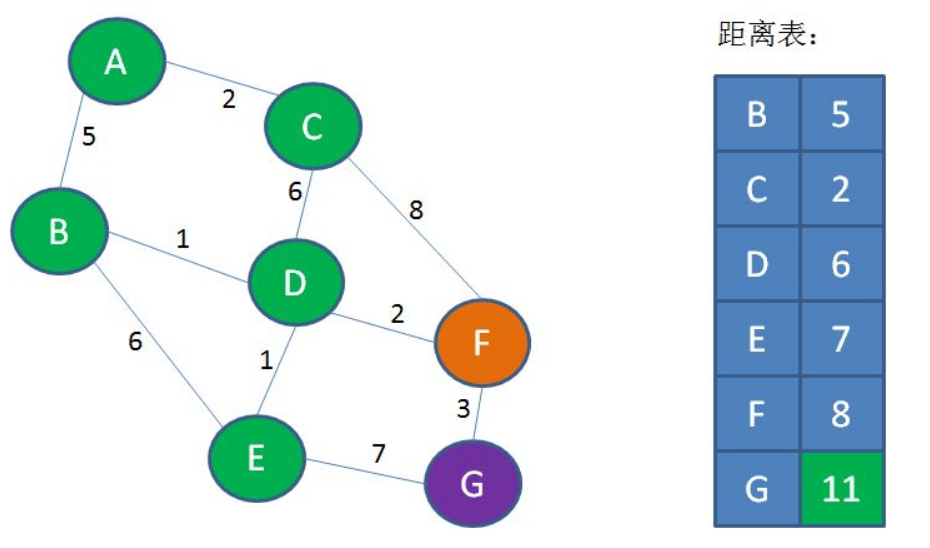

最终，距离表中存储的是从源点$ A $到所有顶点的最短距离。


**多源最短路径算法**


弗洛伊德（Floyd-Warshall）算法是专门用于寻找带权图中多源点之间的最短路径算法。`Floyd`算法的思想是，若想缩短两点间的距离，仅有一种方式，那就是通过第三顶点绕行。

假设$ D^k[i][j]$为路径$ \{i \rarr \{l \le k\} \rarr j\} $的最小长度。当$ D^{k-1} $已经完成，递推到$ D^k $时：

1. 如果$ k \notin \text{最短路径}\{i \rarr \{l \le k\} \rarr j\} $，则$ D^k = D^{k-1} $。
2. 如果$ k \in \text{最短路径}\{i \rarr \{l \le k\} \rarr j\} $，该路径必定由两段最短路径组成，则$ D^k[i][j] = D^{k-1}[i][k] + D^{k-1}[k][j] $。

例如，小哼准备去一些城市旅游，有些城市之间有公路，有些城市之间则没有。为了节省经费以及方便计划旅程，小哼希望在出发之前直到任意两个城市之间的最短路程。

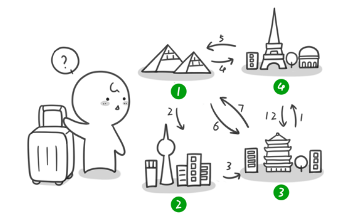

如果要让任意两点之间的路程变短，只能引入第三个点，并通过这个顶点中转才有可能缩短原来的路程。这个中转的顶点甚至有时候不只通过一个顶点，而是经过两个或更多点中转会更短。

当任意两点之间不允许经过第三个点中转时，这些城市之间的最短路径就是邻接矩阵的初始路径。

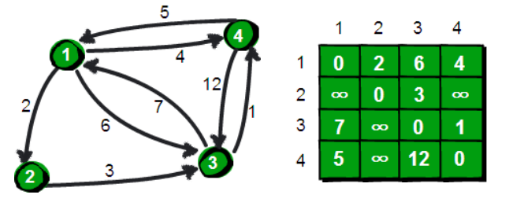

在只允许经过$ 1 $号顶点中转的情况下，任意两点之间的最短路程更新为：

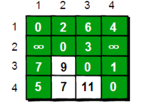

在只允许经过$ 1 $号和$ 2 $号顶点中转的情况下，任意两点之间的最短路程更新为：

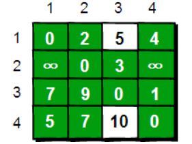

在只允许经过$ 1 $号、$ 2 $号和$ 3 $号顶点中转的情况下，任意两点之间的最短路程更新为：


最后允许通过所有顶点作为中转，任意两点之间的最短路程更新为：

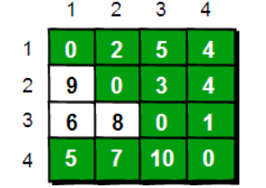

---

【代码】Floyd最短路径

```c
void floyd(Graph *g, int dist[MAX][MAX]) {
    // 最短路径矩阵初始化为图的邻接矩阵
    for(int i = 0; i < g->vertexNum; i++) {
        for(int j = 0; j < g->vertexNum; j++) {
            dist[i][j] = g->weight[i][j];
        }
    }

    // Floyd算法
    for(int k = 0; k < g->vertexNum; k++) {
        for(int i = 0; i < g->vertexNum; i++) {
            for(int j = 0; j < g->vertexNum; j++) {
                if(dist[i][k] + dist[k][j] < dist[i][j]) {
                    dist[i][j] = dist[i][k] + dist[k][j];
                }
            }
        }
    }
}
```

---

<div style="page-break-after: always;"></div>

## 8.6 最小生成树

**最小生成树（MST, Mininum Spanning Tree）**

所谓最小生成树，就是一个图的极小连通子图，它包含原图的所有顶点，并且所有边的权值之和尽可能小。

最小生成树需要满足3个条件：

1. 是一棵树：树不能有回路，并且$ |V| $个顶点一定有$ |V| - 1 $条边。
2. 是生成树：包含原图的全部顶点，树的$ |V| - 1 $条边都必须在图里，并且如果向生成树中任意加一条边都一定构成回路。
3. 边的权重和最小。

如果最小生成树存在，那么图一定连通，反之亦然。

例如一个带权图，绿色边可以把所有顶点连接起来，又保证边的权值和最小。

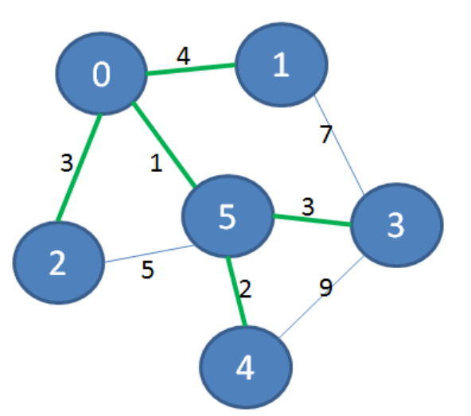

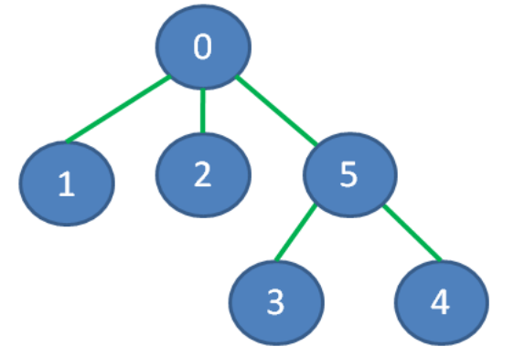

图的最小生成树不是唯一的，同一个图有可能对应多个最小生成树。

最小生成树在现实中很很多用处。假如要在若干个城市之间铺设铁路，而预算又是有限的，那么就需要寻找成本最低的铺设方式。城市之间的交通网就像一个连通图，其实并不需要在每两个城市之间都直接进行连接，只需要一个最小生成树，保证所有的城市都有铁路可以达到即可。

获得最小生成树的常用算法有2个：

- `Prim`
- `Kruskal`


**Prim**

`Prim`算法是以图的顶点为基础，从一个初始顶点开始，寻找达到其它顶点权值最小的边，并把该顶点加入到已触达顶点的集合中。当全部顶点都加入到集合时，算法的工作就完成了。`Prim`算法的本质是基于贪心算法（greedy algorithm）。

`Prim`算法可以理解为让一棵小树长大，每次找能够向外生长的最小边。

例如使用`Prim`算法获得一个带权图的最小生成树：

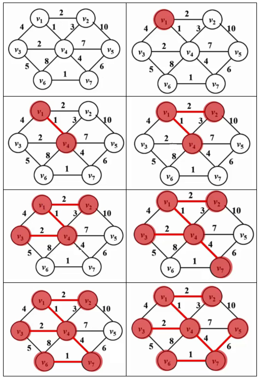


**Kruskal**

与`Prim`算法不同，`Prim`算法是以顶点为关键来获得最小生成树的，而`Kruskal`算法是以边为关键获得最小生成树的。

`Kruskal`算法可以理解为将森林合并成树，每次在图中找权值最小的边收录。

例如使用`Kruskal`算法获得一个带权图的最小生成树：

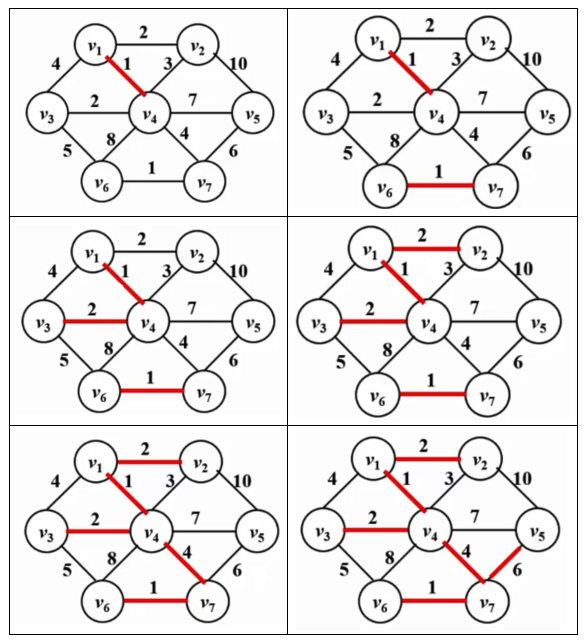

<div style="page-break-after: always;"></div>

## 8.7 拓扑排序

**拓扑排序（Topological Sort）**

一项大的工程常被分为多个小的子工程，子工程之间可能存在一定的先后顺序，即某些子工程必须在其它的一些子工程完成后才能开始。在现代化管理中，有向图可以用来描述和分析一项工程的计划和实施过程，其中图的顶点表示活动，有向边表示活动之间的先后关系，这样的图称为`AOV（Activity on Vertex）`网。

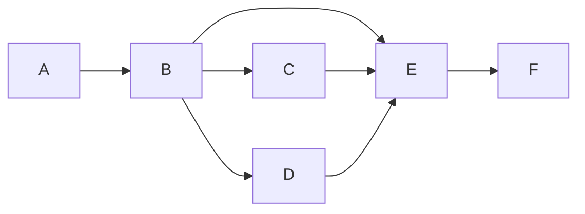
```mermaid
graph LR
	A --> B
	B --> C
	B --> D
	B --> E
	C --> E
	D --> E
	E --> F
```

如果图中从顶点$ V $到$ W $有一条有向路径，则$ V $一定排在$ W $之前，满足此条件的顶点序列称为一个拓扑序。`AOV`网如果有合理的拓扑序，则必定是有向无环图（DAG, Directed Acyclic Graph）。

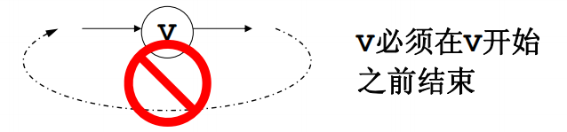

可以使用卡恩`Kahn`算法完成拓扑排序。假设列表$ L $用于存放拓扑排序的结果，把所有入度为`0`的顶点放入$ L $中，然后把这些顶点从图中去掉。重复该操作，直到找不到入度为`0`的顶点。如果此时$ L $中的元素个数和图的顶点总数相同，说明拓扑排序完成；如果此时$ L $中的元素个数少于图的顶点总数，说明原图中存在环，无法进行拓扑排序。

例如对计算机专业课安排学习顺序：

| 课程代码 |       课程名称       | 预修课程 |
| :------: | :------------------: | :------: |
|    C1    |     程序设计基础     |    无    |
|    C2    |       离散数学       |    无    |
|    C3    |       数据结构       |  C1、C2  |
|    C4    |     微积分（一）     |    无    |
|    C5    |     微积分（二）     |    C4    |
|    C6    |       线性代数       |    C5    |
|    C7    |    算法分析与设计    |    C3    |
|    C8    | 逻辑与计算机设计基础 |    无    |
|    C9    |      计算机组成      |    C8    |
|   C10    |       操作系统       |  C7、C9  |
|   C11    |       编译原理       |  C7、C9  |
|   C12    |        数据库        |    C7    |
|   C13    |       计算理论       |    C2    |
|   C14    |      计算机网络      |   C10    |
|   C15    |       数值分析       |    C6    |

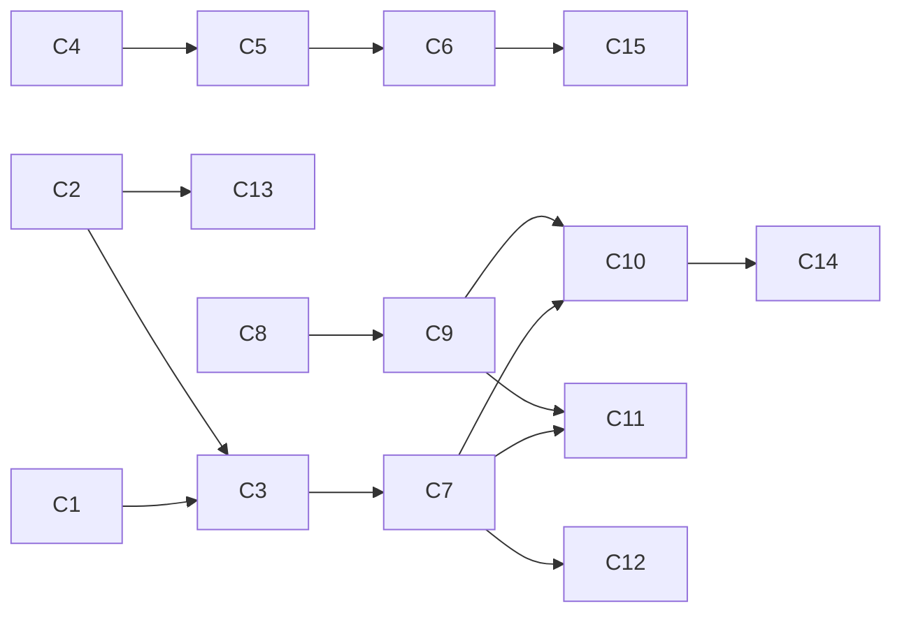
```mermaid
graph LR
	C1 --> C3
	C2 --> C3
	C2 --> C13
	C3 --> C7
	C4 --> C5
	C5 --> C6
	C6 --> C15
	C7 --> C10
	C7 --> C11
	C7 --> C12
	C8 --> C9
	C9 --> C10
	C9 --> C11
	C10 --> C14
```

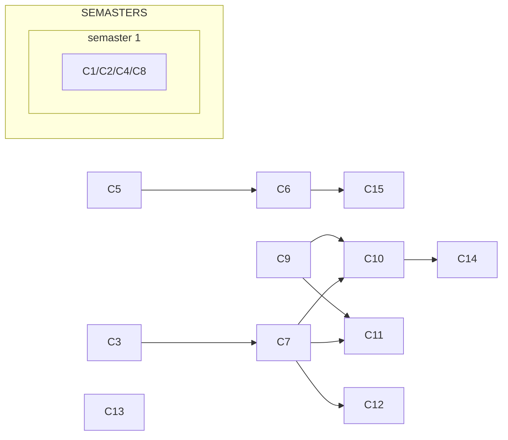
```mermaid
graph LR
	C3 --> C7
	C5 --> C6
	C6 --> C15
	C7 --> C10
	C7 --> C11
	C7 --> C12
	C9 --> C10
	C9 --> C11
	C10 --> C14
	C13

	subgraph SEMASTERS
		subgraph semaster 1
			C1/C2/C4/C8
		end
	end
```

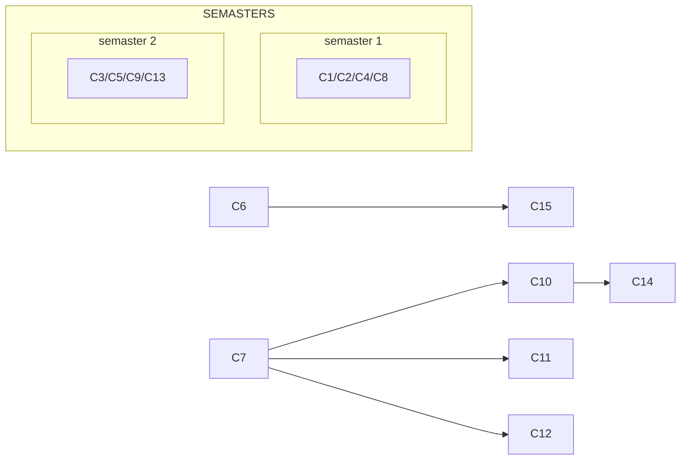
```mermaid
graph LR
	C6 --> C15
	C7 --> C10
	C7 --> C11
	C7 --> C12
	C10 --> C14

	subgraph SEMASTERS
		subgraph semaster 1
			C1/C2/C4/C8
		end
		
		subgraph semaster 2
			C3/C5/C9/C13
		end
	end
```

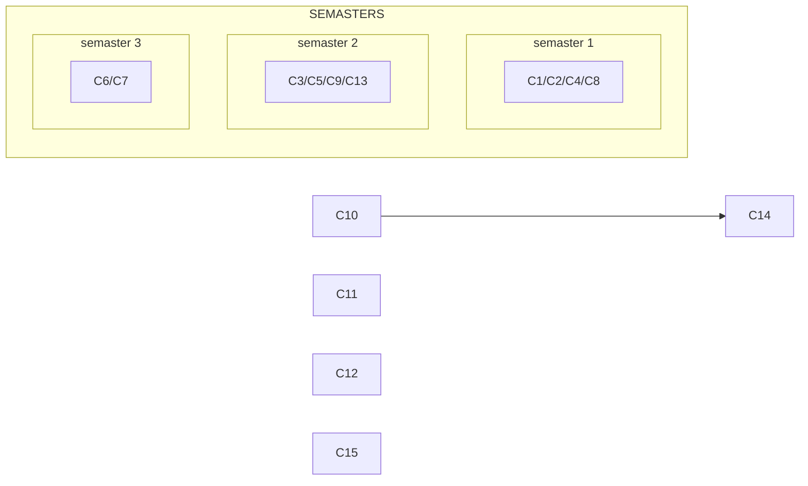
```mermaid
graph LR
	C10 --> C14
	C11
	C12
	C15

	subgraph SEMASTERS
		subgraph semaster 1
			C1/C2/C4/C8
		end
		
		subgraph semaster 2
			C3/C5/C9/C13
		end
		
		subgraph semaster 3
			C6/C7
		end
	end
```

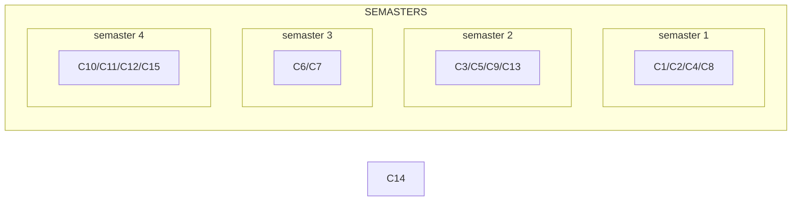
```mermaid
graph LR
	C14

	subgraph SEMASTERS
		subgraph semaster 1
			C1/C2/C4/C8
		end
		
		subgraph semaster 2
			C3/C5/C9/C13
		end
		
		subgraph semaster 3
			C6/C7
		end
		
		subgraph semaster 4
			C10/C11/C12/C15
		end
	end
```

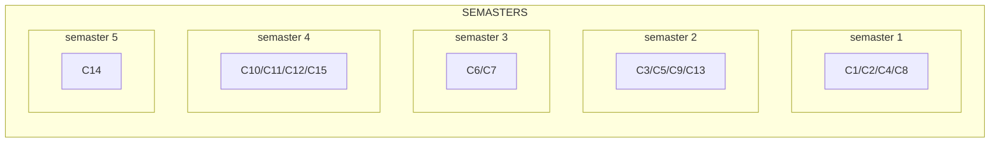
```mermaid
graph LR
	subgraph SEMASTERS
		subgraph semaster 1
			C1/C2/C4/C8
		end
		
		subgraph semaster 2
			C3/C5/C9/C13
		end
		
		subgraph semaster 3
			C6/C7
		end
		
		subgraph semaster 4
			C10/C11/C12/C15
		end
		
		subgraph semaster 5
			C14
		end
	end
```

