<center><h1>算法</h1></center>

<div style="border-bottom: none;"><center><h3>目录</h3></center></div>

[TOC]

<div style="page-break-after: always;"></div>

## 2.3 最近点对

**最近点对**

在一个平面上有$ n $个点，找到所有点对中距离最短的点对。

暴力解法就是计算任意两点之间的距离，找到其中的最小值，因此时间复杂度为$ O(n^2) $。

利用分治法，可以根据排序后的横坐标将点集分为左右两个部分，然后递归地对两个子问题进行求解。先求出左半部分的最短距离，再求出右半部分的最短距离。但是最短距离的点对也有可能会跨越边界，因此还需要计算一个点在左半部分、另一个点在右半部分的最短距离。三个距离中最短的就是原问题的最终解。

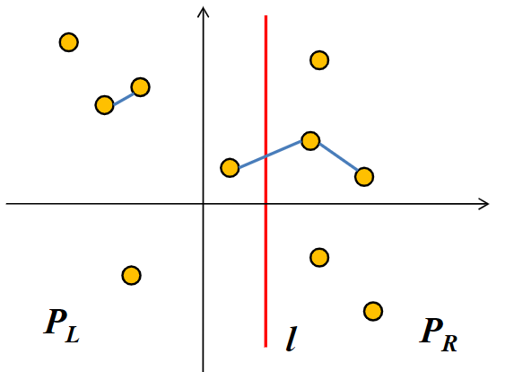

在计算出左右两边的最短距离后，两者较小的值$ d $即为跨越边界的范围。

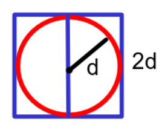

对于处于左边的每个点而言，在右边的每个小长方形中至多存在$ 1 $个点，即最多只需要比较右边的$ 6 $个点。如果在右半边存在超过$ 6 $个点的话，那么就存在一个比$ d $更短的距离，就与之前的最短距离矛盾了。

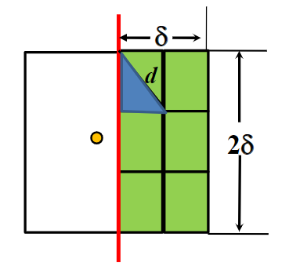

因此检查$ 1 $个点是常数时间，检查$ n $个点需要$ O(n) $的时间。

分治算法中排序需要$ O(nlogn) $，递归处理子问题需要$ T(n/2) + O(n) $。总体时间复杂度为$ O(nlogn) $。

<div style="page-break-after: always;"></div>

## 2.4 凸包

**凸包（Convex Hull）**

凸包是计算几何中的概念。在大量离散点的集合中，求一个最小的凸多边形，使得所有点都在该多边形的内部或边上。凸包在形状识别、字形识别、碰撞检测中都有所应用。

利用分治算法，连接最大纵坐标和最小纵坐标的两点，将点集划分成Left和Right两部分，并递归对两个子问题进行求解。

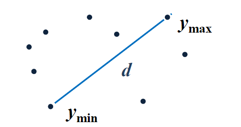

例如在左半边中，先找到距离边界$ d $最远的点$ P $。落在形成的三角形内部的点全部排除。接着将边$ a $外的点与$ a $构成作Left的子问题，将边$ b $外的点与$ b $构成另一个Left的子问题。每次将距离边界最远的点加入凸包即可求解原问题。

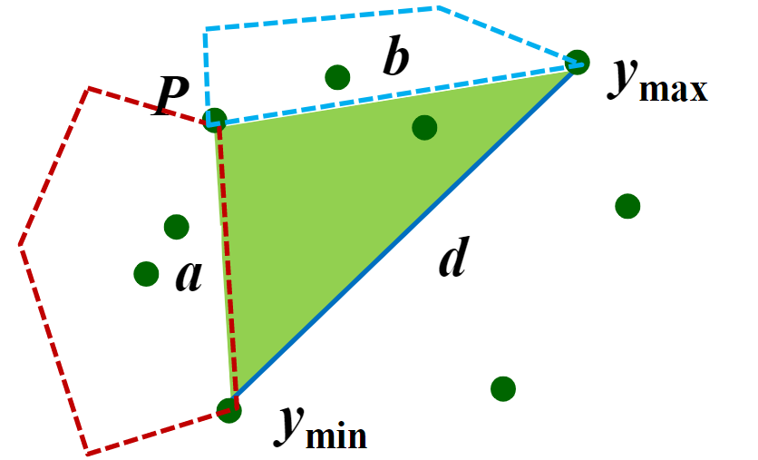

每个子问题可以找到一个凸包上的点，使问题规模缩小1，寻找凸包顶点和划分子问题需要的时间$ O(n) $。当子问题的规模小于3时，可直接进行求解。因此分治算法的时间复杂度为：

$$
W(n) = \left\{
\begin{aligned}
& O(1) & n = 3 \\
& W(n - 1) + O(n) & n > 3
\end{aligned}
\right.
$$
求解得到：
$$
W(n) = O(n^2)
$$


**Graham扫描法**

Graham扫描法首先找到最靠近左下角的点，以这个点为极点，其它点按照极角排序。按照逆时针顺序进行扫描，先把点$ 1 $压入凸包的栈中。

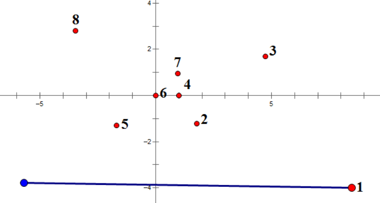

检查点$ 2 $是否在点$ 1 $的一侧，发现点$ 2 $满足，入栈。

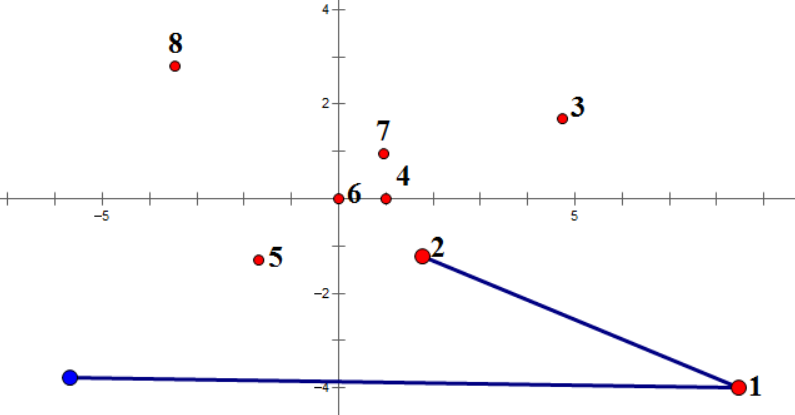

点$ 3 $更加靠近外侧，点$ 2 $出栈，点$ 3 $入栈。

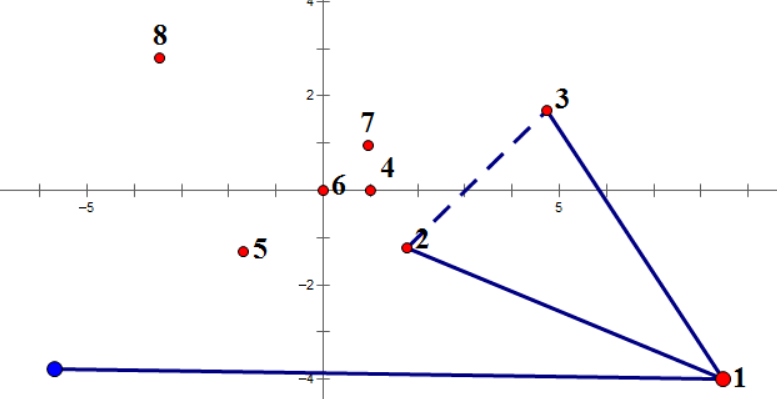

依次判断，最终所有凸包上的点都会在栈中。

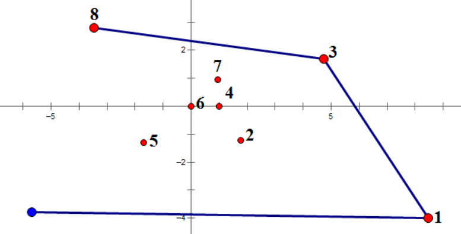

Graham扫描法的时间复杂度为$ O(nlogn) $。

<div style="page-break-after: always;"></div>


创建桶的数量取决于数据的区间范围，一般创建桶的数量等于待排序的元素数量，每个桶的区间跨度为：
$$
max - min \over buckets - 1
$$

---

【代码】桶排序

```java
public static void bucketSort(int[] arr) {
        int max = arr[0];
        int min = arr[0];
        for(int i = 1; i < arr.length; i++) {
            if(arr[i] > max) {
                max = arr[i];
            }
            if(arr[i] < min) {
                min = arr[i];
            }
        }
        int diff = max - min;

        // 创建桶
        int bucketNum = arr.length;
        List<LinkedList<Integer>> buckets 
            = new ArrayList<>(bucketNum);
        for(int i = 0; i < bucketNum; i++) {
            buckets.add(new LinkedList<>());
        }

        // 遍历数组，把元素放入对应桶中
        for(int i = 0; i < arr.length; i++) {
            // 计算当前元素所放置的桶号
            int num = (arr[i]-min) / (diff / (bucketNum-1));
            buckets.get(num).add(arr[i]);
        }

        // 桶内排序
        for(int i = 0; i < bucketNum; i++) {
            Collections.sort(buckets.get(i));
        }

        // 取出元素
        int cnt = 0;
        for(LinkedList<Integer> list : buckets) {
            for(int data : list) {
                arr[cnt++] = data;
            }
        }
    }
```

---

<div style="page-break-after: always;"></div>

## 3.9 基数排序

**基数排序（Radix Sort）**

基数排序可以看作是桶排序的扩展，主要思想是将整数按位划分。

基数排序需要准备$ 10 $个桶，分别代表$ 0 - 9 $，根据整数个位数字的数值将元素放入对应的桶中，之后按照输入赋值到原序列中，再依次对十位、百位等进行同样的操作。

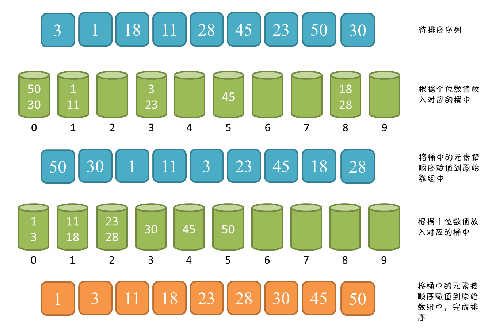

---

【代码】基数排序

```java
public static void radixSort(int[] arr) {
        int max = arr[0];
        for(int i = 1; i < arr.length; i++) {
            if(arr[i] > max) {
                max = arr[i];
            }
        }

        int bucketNum = 10;
        // 从个位开始
        for(int exp = 1; max / exp > 0; exp *= 10) {
            // 创建桶
            List<LinkedList<Integer>> buckets 
                = new ArrayList<>(bucketNum);
            for(int i = 0; i < bucketNum; i++) {
                buckets.add(new LinkedList<>());
            }

            // 把元素放到对应桶中
            for(int data : arr) {
                int num = (data / exp) % 10;
                buckets.get(num).add(data);
            }

            // 按顺序取出元素
            int cnt = 0;
            for(LinkedList<Integer> bucket : buckets) {
                for(int data : bucket) {
                    arr[cnt++] = data;
                }
            }
        }
    }
```

---

<div style="page-break-after: always;"></div>

## 3.11 猴子排序

**猴子排序（Bogo Sort）**


无限猴子定理（Infinite Monkey Theorem）与薛定谔的猫、电车实验等并居十大思想实验，所谓思想实验即用想象力去进行，而在现实中基本无法去实现的实验。

无限猴子定理讲的是如果让一只猴子在打字机上胡乱打字，只要有无限的时间，总有一天可以恰好打出莎士比亚的著作。如果让无限只猴子在无限的空间、无限的时间里不停地敲打打字机，总有一天可以完整打出一本《哈姆雷特》，甚至是可以打出所有可能的文章。


这个看似不可能的事情，却可以用现有数学原理被推导出来。但在现实中往往被认为是无法实现的，因为人们认为“无限”这个条件通常无法被满足。根据概率论证，即使可观测宇宙中充满了猴子一直不停地打字，能够打出一部《哈姆雷特》的概率仍然小于$ 1 \over 10^{183900} $。

无限猴子定理同样可以用在排序中。如果给数组随机排列顺序，每一次排列之后验证数组是否有序，只要次数足够多，总有一次数组刚好被随机成有序数组。


<div style="page-break-after: always;"></div>

## 3.12 珠排序

**珠排序（Bead Sort）**

珠排序的算法和算盘非常类似。算盘上有许多圆圆的珠子被串在细杆上：

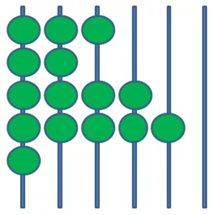

如果把算盘竖起来，算盘上的小珠子会在重力的作用下滑到算盘底部：

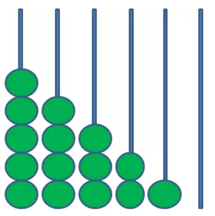

其中有一个很神奇的细节，如果统计每一横排珠子的数量，下落之后每一排珠子数量正好是下落前珠子数量的升序排序。

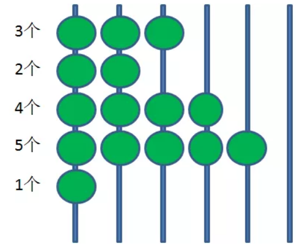

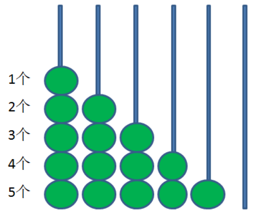

通过模拟珠子下落的元素可以对一组正整数进行排序。使用二维数组来模拟算盘，有珠子的位置设为$ 1 $，没有珠子的位置设为$ 0 $。例如一个有5个数字组成的无序整型数组$ \{3, 2, 4, 5, 1\} $就可以转化为以下的二维数组：

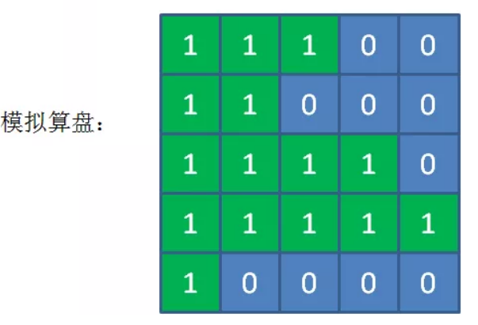

接下来模拟算盘珠子掉落的过程，让所有的元素1都落到二维数组的最底部。

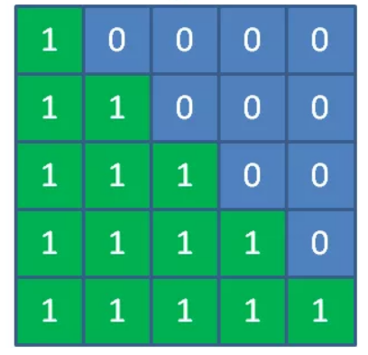

最后把掉落后的算盘转换为一维有序数组$ \{1, 2, 3, 4, 5\} $。

<div style="page-break-after: always;"></div>

# 第4章 贪心算法

## 4.1 贪心算法

**贪心算法（Greedy Algorithm）**

贪心算法，又称贪婪算法，是指在对问题求解时，总是做出在当前看来是最好的选择，也就是说不从整体最优上加以考虑。算法得到的是在某种意义上的局部最优解。贪心算法不是对所有问题都能得到整体最优解，关键在于贪心策略的选择。

贪心算法没有固定的算法框架，算法设计的关键是贪心策略的选择。必须注意的是，贪心算法不是对所有问题都能得到整体最优解，选择的贪心策略必须具备无后效性，即某个状态以后的过程不会影响以前的状态，只与当前状态有关。

在利用贪心算法求解问题之前，必须需要清楚什么样的问题适合用贪心算法。一般而言，能够利用贪心算法求解的问题都会具备以下两点性质：

1. 贪心选择：当某一个问题的整体最优解可通过一系列局部最优解的选择达到，并且每次做出的选择可以依赖以前做出的选择，但不需要依赖后面需要做出的选择。
2. 最优子结构：如果一个问题的最优解包含其子问题的最优解，则此问题具备最优子结构的性质。

贪心算法的基本思路分为：

1. 建立数学模型描述问题。
2. 把求解的问题分成若干个子问题。
3. 对每个子问题求解，得到子问题的局部最优解。
4. 把子问题的局部最优解合成为原问题的解。


**买卖股票的最佳时期**

给定一个数组，它的第$ i $个元素是一支给定股票第$ i $天的价格。设计一个算法来计算所能获取的最大利润。（提示：可以尽可能地完成更多的交易，但不能同时参与多笔交易，在再次购买前出售掉之前的股票）。

> 示例：
>
> 输入: [7, 1, 5, 3, 6, 4]
>
> 输出: 7
>
> 解释: 在第2天（股票价格 = 1）的时候买入，在第3天（股票价格 = 5）的时候卖出, 这笔交易所能获得利润 = 5 - 1 = 4。随后，在第4天（股票价格 = 3）的时候买入，在第5天（股票价格 = 6）的时候卖出, 这笔交易所能获得利润 = 6 - 3 = 3。

---

【代码】买卖股票的最佳时期

```java
public static int maxProfit(int[] prices) {
    int profit = 0;
    for(int i = 0; i < prices.length - 1; i++) {
        if(prices[i] < prices[i+1]) {
            profit += prices[i+1] - prices[i];
        }
    }
    return profit;
}
```

---


**分发饼干**

有一群孩子和一堆饼干，每个孩子有一个饥饿度，每个饼干都有大小。每个孩子最多只能吃一个饼干，且只有饼干的大小大于等于孩子的饥饿度时，这个孩子才能吃饱。求解最多有多少孩子可以吃饱。

> 示例1：
>
> 输入: children = [1, 2, 3], cookies = [1, 1]
>
> 输出: 1
>
> 解释: 有三个孩子和两块饼干，3个孩子的饥饿度分别是1, 2, 3。虽然有两块饼干，由于它们的大小都是1，只能让饥饿度是1的孩子满足。所以应该输出1。

> 示例2：
>
> 输入: children = [1, 2], cookies = [1, 2, 3]
>
> 输出: 2
>
> 解释: 有两个孩子和三块饼干，2个孩子的饥饿度分别是1, 2。拥有的饼干数量和大小都足以让所有孩子满足。所以应该输出2。

因为饥饿度最小的孩子最容易吃饱，所以先考虑这个孩子。为了尽量使得剩下的饼干可以满足饥饿度更大的孩子，所以应该把大于等于这个孩子饥饿度的、且大小最小的饼干给这个孩子。满足了这个孩子之后，采取同样的策略，考虑剩下孩子里饥饿度最小的孩子，直到没有满足条件的饼干存在。

这里的贪心策略是，给剩余孩子里最小饥饿度的孩子分配最小的能饱腹的饼干。因为需要获得大小关系，一个便捷的方法就是把孩子和饼干分别排序，这样就可以从饥饿度最小的孩子和大小最小的饼干出发，计算有多少个孩子可以吃饱。

---

【代码】分发饼干

```java
public static int distribute(int[] children, int[] cookies) {
    Arrays.sort(children);
    Arrays.sort(cookies);
    int child = 0;
    int cookie = 0;
    while (child < children.length && cookie < cookies.length) {
        if (children[child] <= cookies[cookie++]) {
            child++;
        }
    }
    return child;
}
```

---


**硬币找零**

假设硬币的面值分别为1元、5元、10元、25元和100元，有一个小店拥有各面值硬币数量无限个，顾客买东西之后需要给顾客找零，如何能够使找零的硬币个数最少？

> 示例：
>
> 输入: 36输出: 3解释: 找零[25, 10, 1]

为了尽量减少硬币的数量，首先得尽可能地多使用面值大的硬币，也就是优先使用大面值的硬币。

---

【代码】硬币找零

```python
def get_min_coins(coins, price):
    """
        最少硬币找零
        Args:
            coins (list): 硬币面值
            price (int): 找零数量
    """
    solution = []
    coins = sorted(coins, reverse=True)
    for coin in coins:
        num = price // coin
        solution += [coin] * num
        price -= coin * num
        if price <= 0:
            break
    return solution
```

---

<div style="page-break-after: always;"></div>

## 4.2 活动安排

**活动安排**

假设有$ n $个活动的集合$ S = \{a_1, a_2, a_3, \dots, a_n\} $，其中每个活动都要使用同一种资源（如场馆等），而在同一时间内只能有一个活动使用这个资源。每个活动$ a_i $都有一个开始时间$ s_i $和结束时间$ f_i $（$ s_i < f_i $）。如果某个活动$ a_i $被选择，那么活动$ a_i $的发生时间在半开区间$ [s_i, f_i) $内。如果两个活动$ a_i $和$ a_j $满足$ [s_i, f_i) $和$ [s_j, f_j) $不重叠，则称它们是兼容的。活动安排问题就是要求选出最大兼容活动集。

假设活动已经按照结束时间的单调递增顺序排序好：

|  $ i $  |  1   |  2   |  3   |  4   |  5   |  6   |  7   |  8   |  9   |  10  |  11  |
| :-----: | :--: | :--: | :--: | :--: | :--: | :--: | :--: | :--: | :--: | :--: | :--: |
| $ s_i $ |  1   |  3   |  0   |  5   |  3   |  5   |  6   |  8   |  8   |  2   |  12  |
| $ f_i $ |  4   |  5   |  6   |  7   |  9   |  9   |  10  |  11  |  12  |  14  |  16  |

对于活动安排问题的贪心选择，应该选择一个这样的活动，选择它之后剩下的资源可以被尽量多的其它活动所占用。活动安排问题中的贪心选择就是每次选择最先结束的活动。

一个贪心选择的日常应用场景就比如有多个不同的兼职岗位，每个岗位都有一个开始时间和结束时间，小灰在同一时间内只能做一份兼职，小灰每天最多可以做多少份兼职。面对这样的问题，在日常生活中，我们的第一选择肯定是先把结束时间早的兼职做了，这样就可以留出更多的时间做其它兼职。

---

【代码】活动安排

```java
public static List<Integer> selectActivity(int[] a, int[] s, int[] f) {
    List<Integer> activity = new ArrayList<Integer>();
    int n = s.length;
    activity.add(a[0]);
    int k = 0;
    for(int i = 1; i < n; i++) {
        if(s[i] >= f[k]) {
            activity.add(a[i]);
            k = i;
        }
    }
    return activity;
}
```

---

<div style="page-break-after: always;"></div>

## 4.3 部分背包

**部分背包（Knapsack）**

假设有一个小偷，背着一个容量为$ c $的背包（最多可以放的物品重量不能超过$ c $）。商店中一共有$ n $种物品，每种物品i的重量和价值分别为$ w_i $和$ v_i $。如何选择物品放入背包才能使得总价值最大？

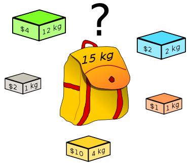

假设背包的容量为30，各类物品对应的重量和价格如下：

|   物品$ i $   |  1   |  2   |  3   |  4   |  5   |
| :-----------: | :--: | :--: | :--: | :--: | :--: |
| **重量$ w $** |  10  |  5   |  15  |  10  |  20  |
| **价值$ v $** |  20  |  30  |  15  |  25  |  10  |

对于背包问题，很显然它是满足最优子结构性质的，因为一个容量为$ c $的背包问题必然包含容量小于$ c $的背包问题的最优解。如果要使最终的价值最大，那么必定需要使得选择的单位中联的物品的价值最大。所以背包问题的贪心策略是优先选择单位重量价值最大的物品，当这个物品选择完之后，继续选择其它价值最大的物品。

---

【代码】部分背包

```python
class Item:
    """
        物品类
    """
    def __init__(self, type, weight, value):
        """
            初始化物品
            Args:
                type (int): 物品类型
                weight (float): 重量
                value (float): 价值
        """
        self.type = type
        self.weight = weight
        self.value = value
        self.unit_value = value / weight    # 单位价值

def main():
    capacity = 30       # 背包容量
    item_type = [1, 2, 3, 4, 5]
    item_weight = [10, 5, 15, 10, 30]
    item_value = [20, 30, 15, 25, 10]

    items = []
    for i in range(len(item_type)):
        items.append(Item(item_type[i], item_weight[i], item_value[i]))
    
    # 物品按照单价降序排列
    items.sort(key=lambda x: x.unit_value, reverse=True)

    # 背包选择
    selected_items = []
    cur_weight = 0          # 当前背包重量
    for item in items:
        if cur_weight + item.weight <= capacity:
            cur_weight += item.weight
            selected_items.append(item)
        else:
            item.weight = capacity - cur_weight
            selected_items.append(item)
            break
    
    # 输出选择结果
    for item in selected_items:
        print("类型：%d，重量：%.2f" % (item.type, item.weight))

if __name__ == "__main__":
    main()
```

---

<div style="page-break-after: always;"></div>

## 4.4 哈夫曼树

**哈夫曼树（Huffman Tree）**

树的每一个结点都可以拥有自己的权值（weight），假设二叉树有$ n $个叶子结点，每个叶子结点都带有权值$ w_k $，从根结点到每个叶子结点的长度为$ l_k $，则树的带权路径长度（WPL, Weighted Path Length）为：
$$
WPL = \sum_{k=1}^n w_k l_k
$$
哈夫曼树是由麻省理工学院的哈夫曼博士于1952年发明的，哈夫曼树是在叶子结点和权重确定的情况下，带权路径长度最小的二叉树，也被称为最优二叉树。

例如，有五个叶子结点，它们的权值为$ \{1, 2, 3, 4, 5\} $，用此权值序列可以构造出形状不同的多个二叉树。


$$
\begin{aligned}
WPL_1 &= 5 * 1 + 4 * 2 + 3 * 3 + 2 * 4 + 1 * 4 = 34 \\
WPL_2 &= 1 * 1 + 2 * 2 + 3 * 3 + 4 * 4 + 5 * 4 = 50 \\
WPL_3 &= 3 * 2 + 4 * 2 + 5 * 2 + 1 * 3 + 2 * 3 = 33
\end{aligned}
$$
​	怎样才能保证构建出的二叉树带权路径长度最小呢？原则上，应该让权重小的叶子结点远离树根，权重大的叶子结点靠近树根。需要注意的是，同样叶子结点所构成的哈夫曼树可能不止一棵。


**哈夫曼树的构造**

哈夫曼树的构造方法就是每次把权值最小的两棵二叉树合并。

例如有$ 6 $个叶子结点，权重依次是$ 2, 3, 7, 9, 18, 25 $。

第一步：把每一个叶子结点都当成一棵独立的树（只有根结点的树），这样就形成了一个森林。


第二步：从森林中移除权值最小的两个结点，生成父结点，父结点的权值是这两个结点权值之和，把父结点加入森林。重复该步骤，直到森林中只有一棵树为止。

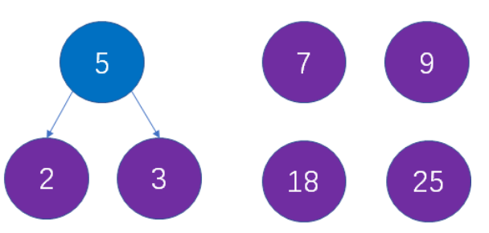

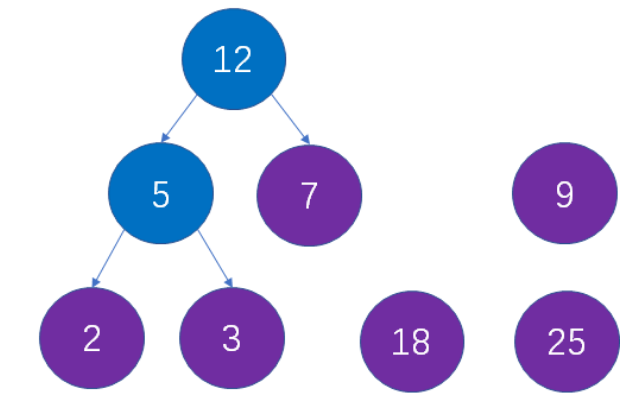

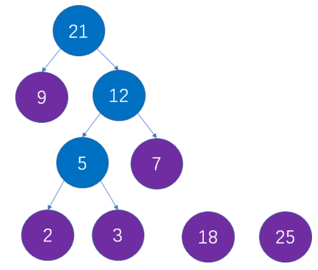

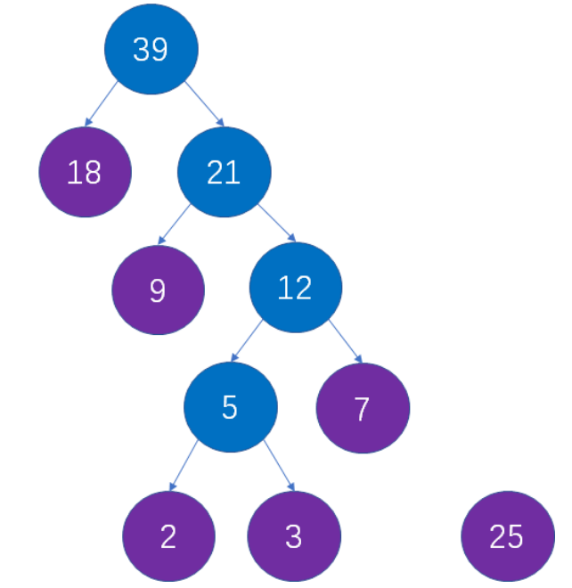

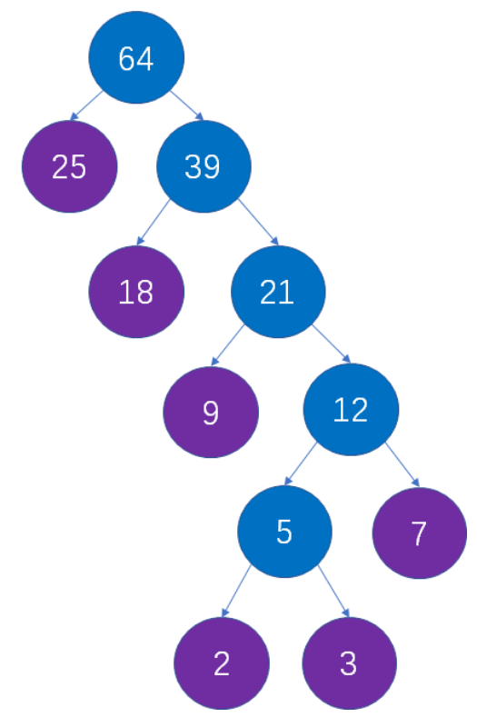

哈夫曼树有以下几个特点：

1. 没有度为$ 1 $的结点。
2. 哈夫曼树的任意非叶结点的左右子树交换后仍是哈夫曼树。
3. 对同一组权值，可能存在不同构的两棵哈夫曼树

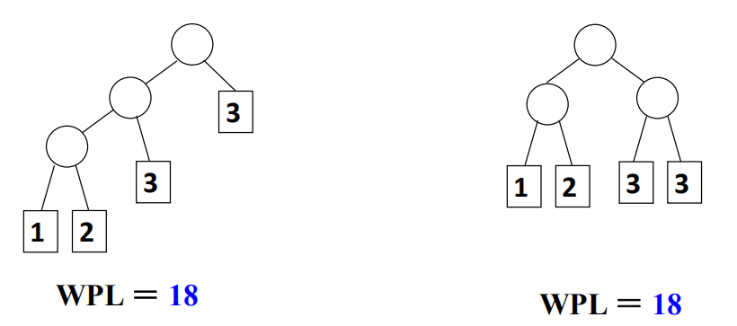

<div style="page-break-after: always;"></div>

## 4.5 哈夫曼编码

**哈夫曼编码（Huffman Code）**

哈夫曼编码是一种高效的编码方式，在信息存储和传输过程中用于对信息进行压缩。要理解哈夫曼编码，需要从信息存储的底层逻辑讲起。

计算机不是人，它不认识中文和英文，更不认识图片和视频，它唯一认识的就是`0（低电平）`和`1（高电平）`。因此，计算机上一切文字、图象、音频、视频，底层都是用二进制来存储和传输的。

将信息转换成计算机能够识别的二进制形式的过程被称为编码。在ASCII码中，每一个字符表示成特定的`8`位二进制数。例如：


显然，ASCII码是一种等长编码，也就是任何字符的编码长度都相等。等长编码的有点明显，因为每个字符对应的二进制编码长度相等，所以很容易设计，也很方便读写。但是计算机的存储空间以及网络传输的带宽是有限的，等长编码最大的缺点就是编码结果太长，会占用过多资源。

使用不等长编码，让出现频率高的字符用的编码短一些，出现频率低的字符编码长一些，可以使编码的总长度减小。但是不等长编码是不能随意设计的，如果一个字符的编码恰好是另一个字符编码的前缀，就会产生歧义的问题。

哈夫曼编码就是一种不等长的编码，并且任何一个字符的编码都不是另一个字符编码的前缀，因此可以无二义地进行解码，并且信息编码的总长度最小。

哈夫曼编码并非一套固定的编码，而是根据给定信息中各个字符出现的频次，动态生成最优的编码。哈夫曼编码的生成过程就用到了哈夫曼树。

例如一段信息里只有A、B、C、D、E、F这6个字符，出现的次数分别是2次、3次、7次、9次、18次、25次。通过把这6个字符当成6个叶子结点，将出现次数作为结点的权重，生成一颗哈夫曼树。将哈夫曼树中结点的左分支当做0、结点的右分支当做1，从哈夫曼树的根结点到每一个叶子结点的路径，都可以等价为一段二进制编码。

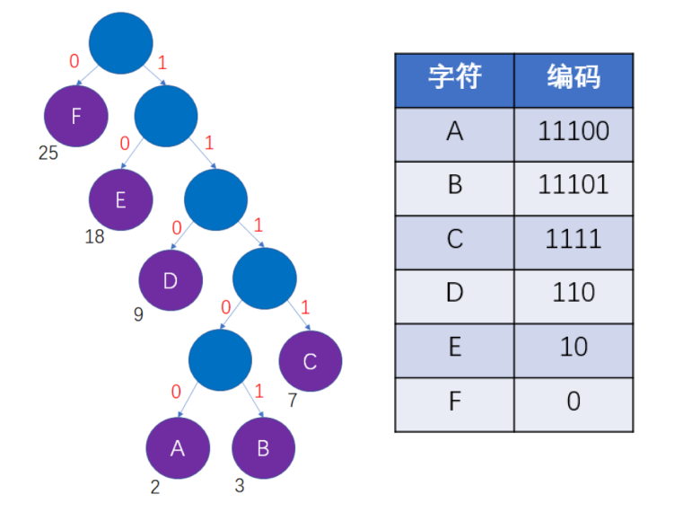

因为每一个字符对应的都是哈夫曼树的叶子结点，从根结点到这些叶子结点的路径并没有包含关系，最终得到的二进制编码自然也不会是彼此的前缀。

<div style="page-break-after: always;"></div>

## 4.6 最小生成树

**最小生成树（MST, Mininum Spanning Tree）**

所谓最小生成树，就是一个图的极小连通子图，它包含原图的所有顶点，并且所有边的权值之和尽可能小。

最小生成树需要满足3个条件：

1. 是一棵树：树不能有回路，并且$ |V| $个顶点一定有$ |V| - 1 $条边。
2. 是生成树：包含原图的全部顶点，树的$ |V| - 1 $条边都必须在图里，并且如果向生成树中任意加一条边都一定构成回路。
3. 边的权重和最小。

如果最小生成树存在，那么图一定连通，反之亦然。

例如一个带权图，绿色边可以把所有顶点连接起来，又保证边的权值和最小。

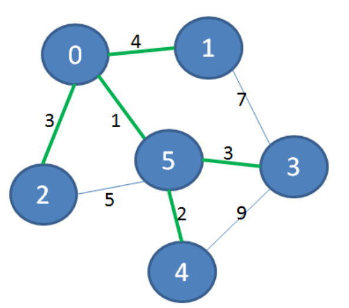

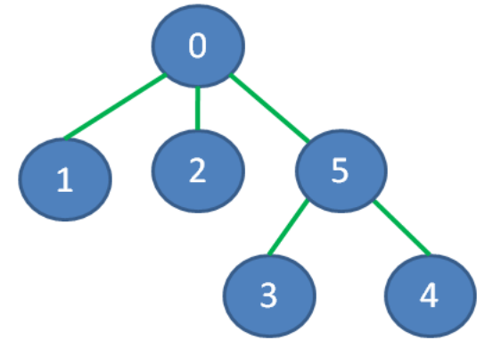

图的最小生成树不是唯一的，同一个图有可能对应多个最小生成树。

最小生成树在现实中很很多用处。假如要在若干个城市之间铺设铁路，而预算又是有限的，那么就需要寻找成本最低的铺设方式。城市之间的交通网就像一个连通图，其实并不需要在每两个城市之间都直接进行连接，只需要一个最小生成树，保证所有的城市都有铁路可以达到即可。

获得最小生成树的常用算法有2个：

- `Prim`
- `Kruskal`


**Prim**

`Prim`算法是以图的顶点为基础，从一个初始顶点开始，寻找达到其它顶点权值最小的边，并把该顶点加入到已触达顶点的集合中。当全部顶点都加入到集合时，算法的工作就完成了。`Prim`算法的本质是基于贪心算法（greedy algorithm）。

`Prim`算法可以理解为让一棵小树长大，每次找能够向外生长的最小边。

例如使用`Prim`算法获得一个带权图的最小生成树：


**Kruskal**

与`Prim`算法不同，`Prim`算法是以顶点为关键来获得最小生成树的，而`Kruskal`算法是以边为关键获得最小生成树的。

`Kruskal`算法可以理解为将森林合并成树，每次在图中找权值最小的边收录。

例如使用`Kruskal`算法获得一个带权图的最小生成树：

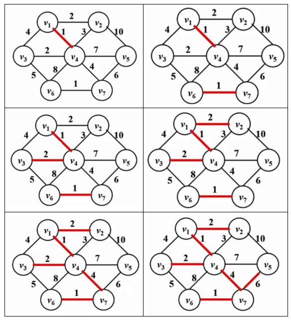

<div style="page-break-after: always;"></div>

## 4.7 贪心算法局限性

**局限性**

贪心算法可以用来解决优化问题，与其他算法相比，贪心算法的最大优点是在大多数情况下易于实现且非常高效，但也存在一些问题。

贪心算法不能保证解是最佳的，因为它总是从局部出发，并没从整体考虑。尽管贪心算法给出了接近最优的解决方案，但它未能产生最优的解决方案。背包问题和旅行商问题是贪心算法无法产生最佳解决方案的问题示例。

当需要实时解决方案且近似答案足够好时，贪心算法最适用。显然，贪心算法可在确保产生最佳解决方案的同时最大程度地减少时间，因此更适用于需要较少时间的情况。


**硬币找零**

假设有1元、5元、11元这三种面值的硬币，给定一个找零金额，比如28元，最少使用的硬币组合是什么？

使用贪心算法可以得到结果为$ [11, 11, 5, 1] $，总共是4个硬币。对于这个例子而言，4个硬币的确是最优解。但是假如找零是15元呢？使用贪心算法结果为$ [11, 1, 1, 1, 1] $，共用了5个硬币，然而最优解是[5, 5, 5]，共3个硬币。硬币找零问题可以使用动态规划计算出最优解。


**0-1背包**

部分背包问题可以用贪心算法实现，是因为选择放入的物品可以进行拆分，即并不需要放入整个物品。与之对应的另一种背包问题为0-1背包问题，这个时候整个物品不可以拆分，只可以选择放入或者不放入。0-1背包问题用贪心算法并不能求得准确的解，需要用动态规划算法求解。

假设0-1背包的容量为8，物品的重量和价值分别为：

|   物品$ i $   |  1   |  2   |  3   |  4   |
| :-----------: | :--: | :--: | :--: | :--: |
| **重量$ w $** |  2   |  3   |  4   |  5   |
| **价值$ v $** |  3   |  4   |  5   |  6   |
| **单位价值**  | 1.5  | 1.33 | 1.25 | 1.2  |

使用贪心算法会优先选择单位重量价值最高的物品，当拿完物品1和物品2后，背包剩余容量为$ 8 - 2 - 3 = 3 $。由于物品不可拆分，背包无法装入物品3和物品4。最终总价值为$ 3 + 4 = 7 $。

但是使用动态规划可以计算出最佳方案是选择物品2和物品4，最大价值为$ 4 + 6 = 10 $。

<div style="page-break-after: always;"></div>

## 4.8 旅行商问题

**旅行商问题（TSP, Traveling Salesman Problem）**


有一个快递员，要分别给三家顾客送快递，他自己到达每个顾客家的路程各不相同，每个顾客之间的路程也各不相同。那么想要把快递依次送达这三家，并最终回到起点，哪一条路线所走的总距离是最短的呢？

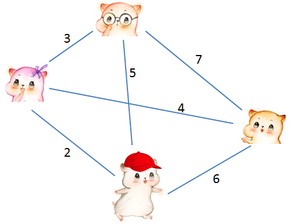


有一个商品推销员，要去若干个城市推销商品。该推销员从一个城市出发，需要经过所有城市后，回到出发地。每个城市之间都有道路连通，且距离各不相同，推销员应该如何选择路线，使得总行程最短呢？


这个问题看起来很简单，却很难找到一个真正高效的求解算法。其中最容易想到的，是使用穷举法把所有可能的路线穷举出来，计算出每一条路线的总行程。

通过排列组合，从所有路线中找出总行程最短的路线。显然，这个方法的时间复杂度是$ O(n!) $，随着城市数量的增长，花费的运算时间简直不可想象！

后来，人们想出了许多相对优化的解决方案，比如动态规划法和分枝定界法等。但是，这些算法的时间复杂度仍然是指数级的，并没有让性能问题得到根本的解决。


<div style="page-break-after: always;"></div>

## 4.9 NP=P?

**P和NP**

|     算法      |  时间复杂度  |
| :-----------: | :----------: |
|   二分查找    | $ O(logn) $  |
|   归并排序    | $ O(nlogn) $ |
| Floyd最短路径 |  $ O(n^3) $  |

尽管这些算法的运行时间有数量级上的差别，但是它们的时间复杂度都可以用$ O(n^k) $来表示，其中$ k $是一个常数。因此，这些算法都是多项式时间算法，能用多项式时间算法解决的问题被称为P问题（Polynomial）。

人们常说，能用钱解决的问题都不是问题，在计算机科学家眼中，能用多项式时间解决的问题都不是问题。

然而，世间还存在许多变态的问题，是无法（至少是暂时无法）在多项式时间内解决的，比如一些算法的时间复杂度是$ O(2^n) $，甚至$ O(n!) $。随着问题规模$ n $的增长，计算量的增长速度是非常恐怖的。这类问题被称为NP问题（Non-deterministic Polynomial），意思是“不确定是否能用多项式时间解决”。

有些科学家认为，所有的NP问题终究都可以在多项式时间内解决，只是我们暂时还没有找到方法；也有些科学家认为，某些NP问题永远无法在多项式时间内解决。

这个业界争论可以用一个公式来表达：
$$
NP = P?
$$


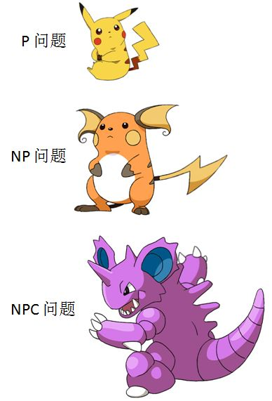


**规约和NPC**

这里所说的NPC问题可不是游戏当中的NPC，要想理解NPC问题，需要先了解归约的概念。

归约（reduction），可以简单理解成问题之间的转化。例如问题是一个一元一次方程的求解问题$ Q: 3x + 6 = 12 $，这个问题可以转化成一个一元二次问题$ Q': 0x^2 + 3x + 6 = 12 $。

显然，问题$ Q $并不比问题$ Q' $更难解决，只要有办法解决$ Q' $，就一定能够解决$ Q $。对于这种情况，我们可以说问题$ Q $归约于问题$ Q' $。

同时，这种归约可以逐级传递，比如问题A归约于问题B，问题B归约于问题C，问题C归约于问题D，那么可以说问题A归约于问题D。

在NP问题之间，也可以存在归约关系。我们把众多的NP问题层层归约，必定会得到一个或多个终极问题，这些归约的终点就是所谓的NPC问题（NP-Complete）。旅行商问题被科学家证明属于NPC问题。

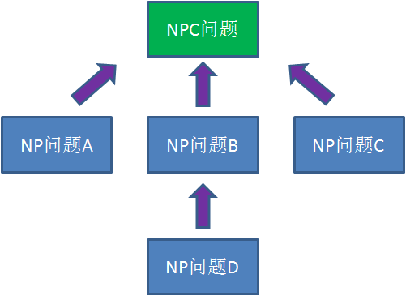

就数量上而言，NP问题远比P问题要多，而NP之中的NPC问题也仅占极少数。

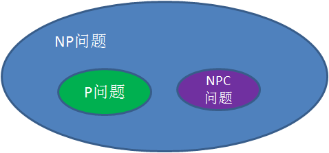

俗话说擒贼先擒王，只要有朝一日，我们能够找到NPC问题的多项式时间算法，就能够解决掉所有的NP问题！但遗憾的是，至今还没有人能够找到可行的方法，很多人认为这些问题是无解的。


**旅行商问题**


<div style="page-break-after: always;"></div>

# 第5章 动态规划

## 5.1 动态规划

**动态规划（Dynamic Programming）**

动态规划在数学上属于运筹学的分支，是求解决策过程最优化的数学方法，同时也是计算机科学与技术领域中一种常见的算法思想。

动态规划算法的基本思想与分治法类似，也是将带求解的问题分解为若干个子问题，按顺序求解子问题。前一子问题的解，为后一子问题的求解提供了有用的信息。

在求解任一子问题时，列出各种可能的局部解，通过决策保留那些有可能达到最优的局部解，丢弃其它局部解。依次解决各子问题，最后一个子问题就是初始问题的解。

动态规划的本质是对问题状态的定义和状态转移方程的定义。动态规划通过拆分问题，定义问题状态和状态之间的关系，使得问题能够以递推的方式去解决。因此在一个典型的动态规划问题上，需要定义问题状态以及写出状态转移方程，这样对于问题的解答就会一目了然。


**爬楼梯**

有一座高度是10级台阶的楼梯，从下往上走，每跨一步只能向上1级或者2级台阶，要求求出一共有多少种走法。

比如，每次走1级台阶，一共走10步，这是其中一种走法，可以简写成$ [1, 1, 1, 1, 1, 1, 1, 1, 1, 1] $。再比如，每次走2级台阶，一共走5步，这是另一种走法，可以简写成$ [2, 2, 2, 2, 2] $。当然，除此之外，还有很多很多种走法。

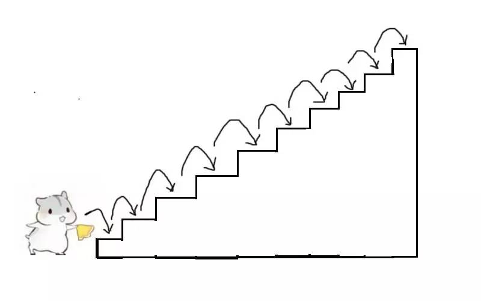

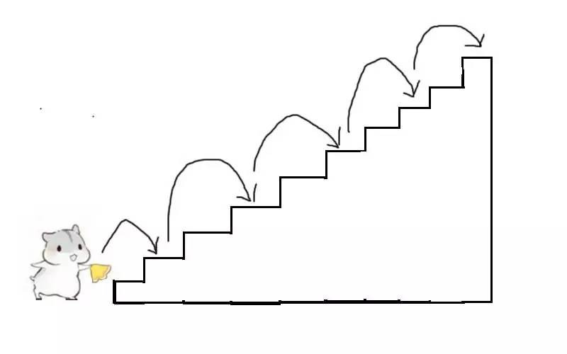


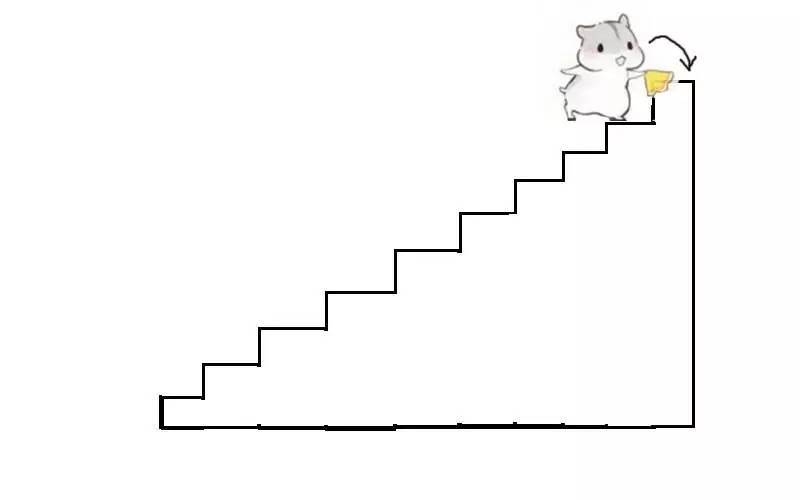

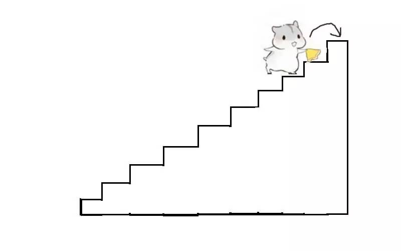


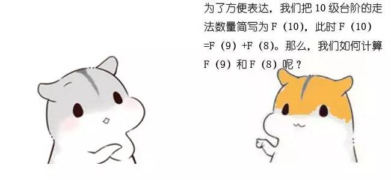

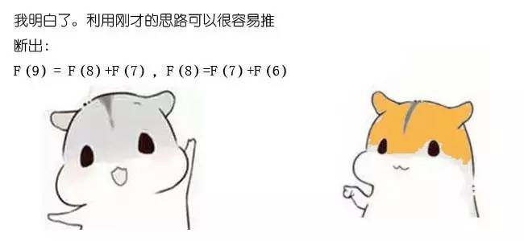


$$
f(n) = \left\{
\begin{aligned}
& 1 & n = 1 \\
& 1 & n = 2 \\
& f(n-1) + f(n-2) & n \ge 3
\end{aligned}
\right.
$$


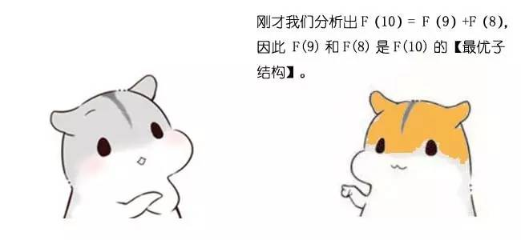


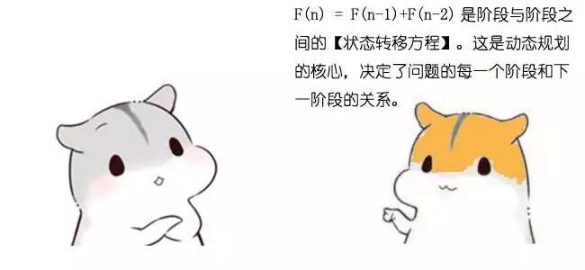


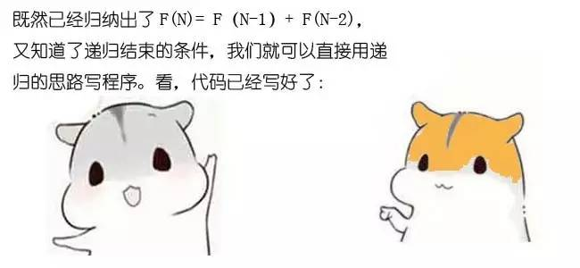

---

【代码】爬楼梯（递归）

```c
int climbStairs(int n) {
    if(n <= 0) {
        return 0;
    } else if(n == 1) {
        return 1;
    } else if(n == 2) {
        return 2;
    }
    return climbStairs(n-1) + climbStairs(n-2);
}
```

---


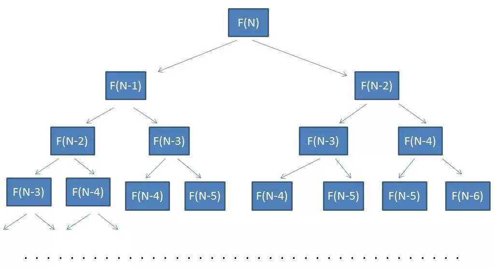


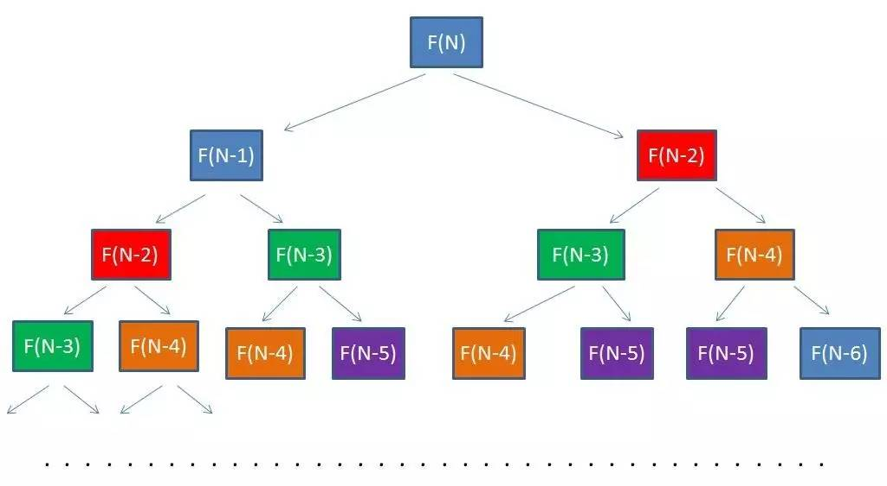


|   台阶数   |  1   |  2   |  3   |  4   |  5   |  6   |  7   |  8   |  9   |
| :--------: | :--: | :--: | :--: | :--: | :--: | :--: | :--: | :--: | :--: |
| **走法数** |  1   |  2   |      |      |      |      |      |      |      |


|   台阶数   |  1   |  2   |  3   |  4   |  5   |  6   |  7   |  8   |  9   |
| :--------: | :--: | :--: | :--: | :--: | :--: | :--: | :--: | :--: | :--: |
| **走法数** |  1   |  2   |  3   |      |      |      |      |      |      |


|   台阶数   |  1   |  2   |  3   |  4   |  5   |  6   |  7   |  8   |  9   |
| :--------: | :--: | :--: | :--: | :--: | :--: | :--: | :--: | :--: | :--: |
| **走法数** |  1   |  2   |  3   |  5   |      |      |      |      |      |


|   台阶数   |  1   |  2   |  3   |  4   |  5   |  6   |  7   |  8   |  9   |
| :--------: | :--: | :--: | :--: | :--: | :--: | :--: | :--: | :--: | :--: |
| **走法数** |  1   |  2   |  3   |  5   |  8   |      |      |      |      |

---

【代码】爬楼梯（动态规划）

```c
int climbStairs(int n) {
    if(n <= 0) {
        return 0;
    } else if(n == 1) {
        return 1;
    } else if(n == 2) {
        return 2;
    }
    int num1 = 1;
    int num2 = 2;
    int sum;
    for(int i = 3; i <= n; i++) {
        sum = num1 + num2;
        num1 = num2;
        num2 = sum;
    }
    return sum;
}
```

---

<div style="page-break-after: always;"></div>

## 5.2 硬币找零

**硬币找零**

有三种硬币，面值分别是2元、5元、7元，每种硬币都有足够多。买一个物品需要27元，如何用最少的硬币组合正好付清？

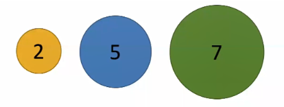

要让硬币最少，应该尽量用面值大的硬币，也就是贪心算法的结果为$ 7 + 7 + 7 + 5 = 26 $，呃……

那么需要改变一下策略，尽量用面值大的硬币，最后如果可以用一种硬币付清就行。$ 7 + 7 + 7 + 2 + 2 + 2 = 27 $，一共$ 6 $枚硬币，应该对了吧……

正确答案：$ 7 + 5 + 5 + 5 + 5 = 27 $，一共$ 5 $枚硬币。

状态在动态规划中的作用属于定海神针，确定状态需要两个意识：

1. 最后一步：虽然目前不知道最优策略是什么，但是最优策略肯定是$ k $枚硬币$ a_1, a_2, \dots, a_K $面值加起来是$ 27 $。所以一定有最后一枚硬币$ a_k $除了这枚硬币，前面硬币的面值加起来是$ 27 - a_k $。因为是最优策略，所以拼出$ 27 - a_k $的硬币数一定要最少。


2. 子问题：因此问题就变成了最少用多少枚硬币可以拼出$ 27 - a_k $。这样就将原问题转化成了一个子问题，而且规模更小。

假设状态$ F(X) = 拼出X元的最少硬币数 $，

最后那枚硬币$ a_k $只可能是$ 2 $元、$ 5 $元或$ 7 $元：

- 如果$ a_k $是$ 2 $元，$ F(27) = F(27-2) + 1 $（加上最后一枚$ 2 $元硬币）
- 如果$ a_k $是$ 5 $元，$ F(27) = F(27-5) + 1 $（加上最后一枚$ 5 $元硬币）
- 如果$ a_k $是$ 7 $元，$ F(27) = F(27-7) + 1 $（加上最后一枚$ 7 $元硬币）

由此可得到递归公式：
$$
F(27) = min\{F(27-2)+1,\ F(27-5)+1,\ F(27-7)+1\}
$$

---

【代码】硬币找零（递归）

```java
public static int getMinCoins(int price) {
    // 0元钱只需要0枚硬币
    if(price == 0) {
        return 0;
    }
    // 初始化为无穷大
    int coinNum = Integer.MAX_VALUE - 1;
    // 最后一枚硬币是2元
    if(price >= 2) {
        coinNum = Math.min(getMinCoins(price-2) + 1, coinNum);
    }
    // 最后一枚硬币是5元
    if(price >= 5) {
        coinNum = Math.min(getMinCoins(price-5) + 1, coinNum);
    }
    // 最后一枚硬币是7元
    if(price >= 7) {
        coinNum = Math.min(getMinCoins(price-7) + 1, coinNum);
    }
    return coinNum;
}
```

---

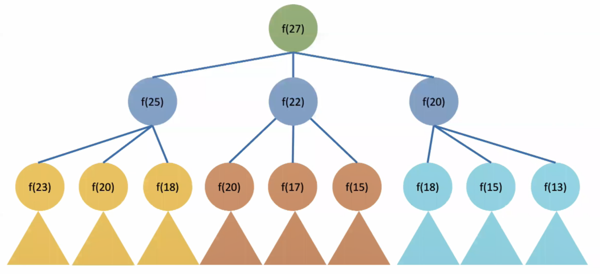

动态规划的另一个组成部分就是状态转移方程：
$$
F[X] = min\{F[X-2]+1,\ F[X-5]+1,\ F[X-7]+1\}
$$
其次需要考虑初始条件和边界情况：如果不能拼出$ i $元，则定义$ F[i] = \infin $。例如当$ X - 2 $、$ X - 5 $、$ X - 7 $小于$ 0 $，
$$
F[-1] = F[-2] = \dots = \infin
$$
因此，
$$
F[1] = min\{F[-1]+1,\ F[-4]+1,\ F[-6]+1\} = \infin
$$
表示拼不出$ 1 $元。

状态转移方程的初始状态为
$$
F[0] = 0
$$
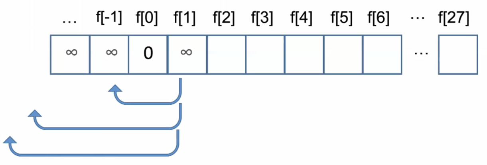


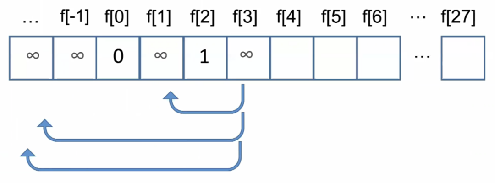

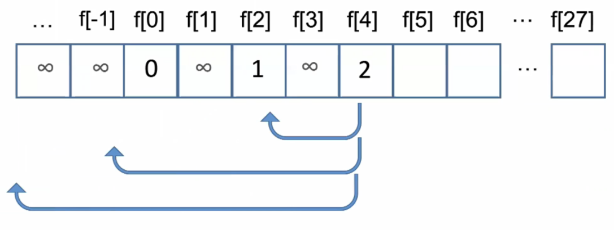

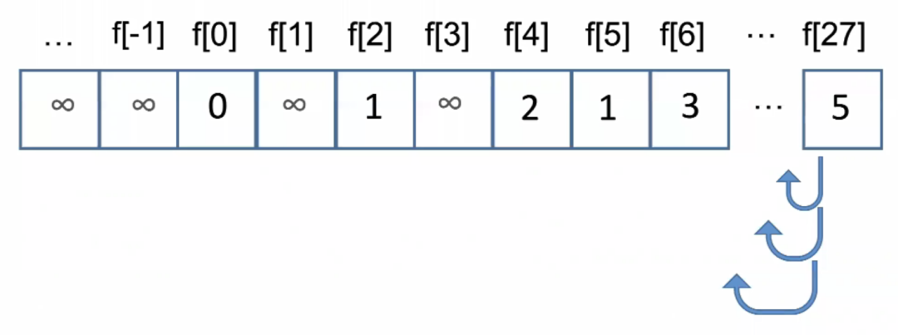

---

【代码】硬币找零（动态规划）

```python
def get_min_coins(coins, price):
    f = [INF] * (price + 1)

    f[0] = 0
    for i in range(1, price+1):
        for j in range(len(coins)):
            if i >= coins[j] and f[i - coins[j]] != INF:
                f[i] = min(f[i - coins[j]] + 1, f[i])
        
    if f[price] == INF:
        f[price] = -1
    return f[price]
```

---

<div style="page-break-after: always;"></div>

## 5.3 路径问题

**路径问题**

有一个机器人位于一个$ m $行$ n $列的网格的左上角$ (0, 0) $，机器人每次只能向下或向右移动一步，问有多少种方法可以走到右下角。

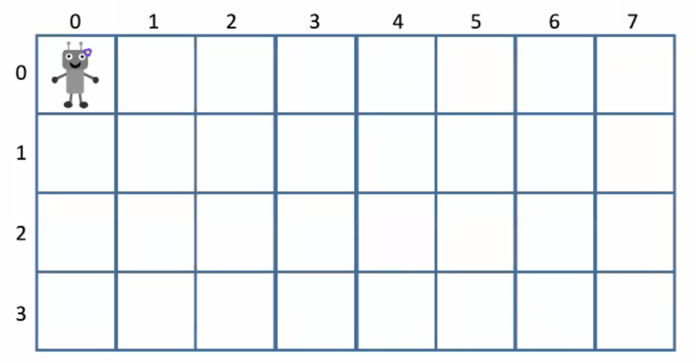

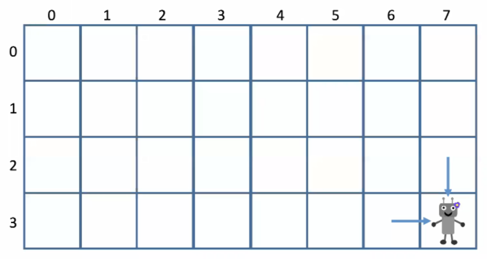

无论机器人用何种方式到达右下角，总有最后挪动的一步。右下角的坐标为$ (m-1, n-1) $，那么前一步机器人一定在$ (m-2, n-1) $或$ (m-1, n-2) $的位置。

如果机器人有$ X $种方式从左上角走到$ (m-2, n-1) $，有$ Y $种方式从左上角走到$ (m-1, n-2) $，那么机器人一共有$ X + Y $种方式从左上角走到$ (m-1, n-1) $。原问题就转换为了机器人有多少种方式从左上角走到$ (m-2, n-1) $和$ (m-1, n-2) $。

那么可以得出转移方程：
$$
f[i][j] = f[i-1][j] + f[i][j-1]
$$

> $ f[i][j] $：机器人有多少种方式走到$ (i, j) $
>
> $ f[i-1][j] $：机器人有多少种方式走到$ (i-1, j) $
>
> $ f[i][j-1] $：机器人有多少种方式走到$ (i, j-1) $

初始条件为$ f[0][0] = 1 $，因为机器人只有$ 1 $种方式到达左上角。

边界情况为当$ i = 0 $或$ j = 0 $，则前一步只能有一个方向到达，因此$ f[i][j] = 1 $。

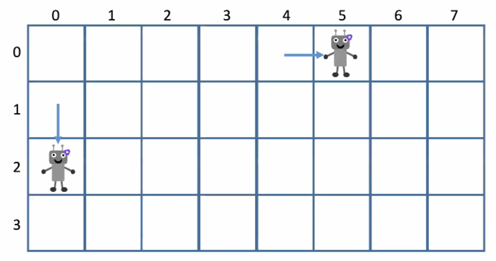

---

【代码】路径问题

```c
int uniquePath(int m, int n) {
    int f[m][n];
    for(int i = 0; i < m; i++) {
        for(int j = 0; j < n; j++) {
            if(i == 0 || j == 0) {
                f[i][j] = 1;
            } else {
                f[i][j] = f[i-1][j] + f[i][j-1];
            }
        }
    }
    return f[m-1][n-1];
}
```

---

<div style="page-break-after: always;"></div>

## 5.4 跳跃游戏

**跳跃游戏**

有$ n $块石头分别在$ 0, 1, \dots, n-1 $的位置，一只青蛙在石头$ 0 $，想跳到石头$ n - 1 $。如果青蛙在第i块石头上，每块石头的元素表示可以跳跃的最长距离。问青蛙能否跳到石头$ n - 1 $。

> 示例1：
>
> 输入: s = [2, 3, 1, 1, 4]
>
> 输出: True
>
> 解释: 可以先跳1步，从石头0达到石头1，然后再从石头1跳3步到达目标。

> 示例2：
>
> 输入: s = [3, 2, 1, 0, 4]
>
> 输出: False
>
> 解释: 无论怎样，总会达到石头3，但该石头的最大跳跃长度是0，所以永远不可能到达目标。

如果青蛙能跳到最后一块石头$ n - 1 $，那么它一定是从石头$ i $跳过来的（$ i < n - 1 $）。

这需要两个条件同时满足：

1. 青蛙可以跳到石头$ i $。
2. 最后一跳不超过跳跃的最大距离。


那么问题转化为了青蛙能否跳到石头$ i $。假设$ f[j] $表示青蛙能否跳到石头$ j $，可以得出转移方程：
$$
f[j] = OR_{0 \le i < j}(f[i]\ AND\ i + a[i] \ge j)
$$

> $ f[j] $：青蛙能否跳到石头$ j $
>
> $ OR_{0 \le i < j} $：枚举上一个跳到的石头$ i $
>
> $ f[i] $：青蛙能否跳到石头$ i $
>
> $ a[i] $：最后一步的距离不能超过$ a_i $

初始条件为$ f[0] = True  $，因为青蛙一开始就在石头$ 0 $。

---

【代码】跳跃游戏

```java
public static boolean canJump(int[] stone) {
    int n = stone.length;
    boolean[] f = new boolean[n];
    f[0] = true;

    for(int j = 1; j < n; j++) {
        f[j] = false;
        for(int i = 0; i < j; i++) {
            if(f[i] && i + stone[i] >= j) {
                f[j] = true;
                break;
            }
        }
    }
    return f[n-1];
}
```

---

<div style="page-break-after: always;"></div>

## 5.5 0-1背包

**0-1背包（0-1 Knapsack）**

有一个小偷带了一个能够装$ C = 20 $公斤物品的背包到商店里面偷东西，请问他要怎么偷才能使价值最高？

| 物品 | 重量W | 价格V |
| :--: | :---: | :---: |
|  0   |   2   |   3   |
|  1   |   3   |   4   |
|  2   |   4   |   5   |
|  3   |   5   |   8   |
|  4   |   9   |  10   |

假设用$ B(k, C) $表示当背包容量还剩下$ C $的时候，在前$ k $件物品中能偷到的最大价值。
$$
B(k, C) = \left\{
\begin{aligned}
& B(k-1, C) & \text{当第}k\text{件太重} \\
& max \left\{
        \begin{aligned}
        & B(k-1, C-w_k) + v_k & \text{偷} \\
        & B(k-1, C)	& \text{不偷} \\
        \end{aligned}
	\right.
\end{aligned}
\right.
$$
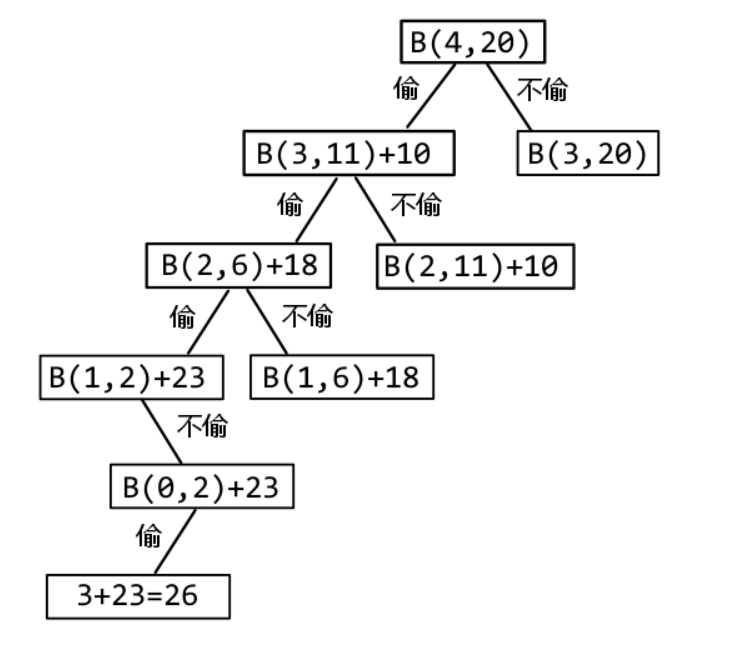

边界情况为$ B(i, 0)  = B(0, j) = 0 $，即当背包容量为$ 0 $或者没有物品可偷的情况下，最大价值为$ 0 $。 

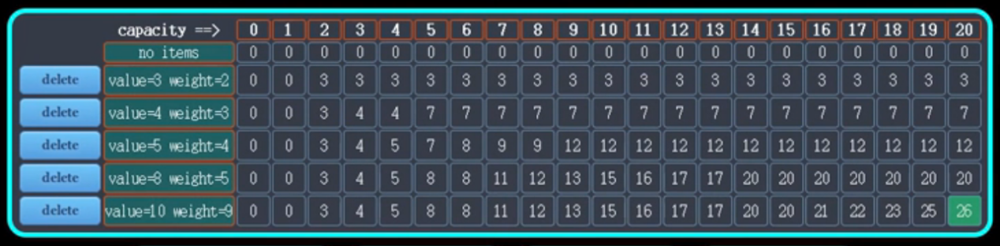

---

【代码】0-1背包

```c
#define ITEM_NUM 5
#define CAPACITY 20

int getMaxValue(int *weight, int *value) {
    int b[ITEM_NUM+1][CAPACITY+1] = {{0}};

    for(int k = 1; k <= ITEM_NUM; k++) {
        for(int c = 1; c <= CAPACITY; c++) {
            if(weight[k] > c) {
                b[k][c] = b[k-1][c];
            } else {
                b[k][c] = max(
                    b[k-1][c-weight[k]] + value[k],
                    b[k-1][c]
               	);
            }
        }
    }
    return b[ITEM_NUM][CAPACITY];
}
```

---

<div style="page-break-after: always;"></div>

## 5.6 最短路径

**最短路径（Shortest Path）**

在现实中很多需要都运用到了最短路径的算法，例如从一个地铁站到另一个地铁站的最快换乘路线等。地铁线路图中，地铁站可以看作是图的顶点，站与站之间的线路可以看作是边，权重可以是距离、时间、费用等。

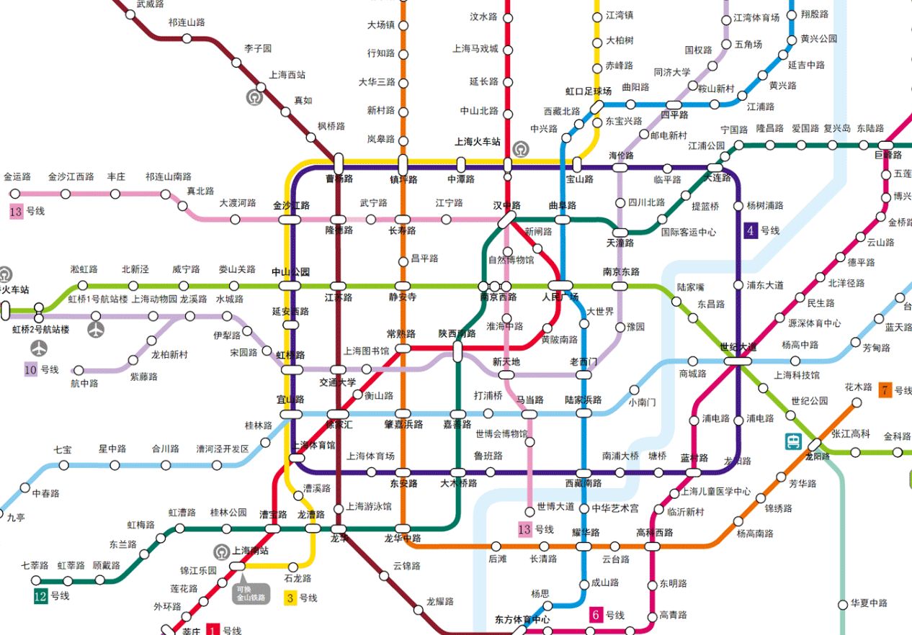

在网络中，求两个不同顶点之间的所有路径中，边的权值之和最小的那一条路径，这条路径就是两点之间的最短路径。其中最短路径的第一个顶点称为源点（source），最后一个顶点为终点（destination）。

图的最短路径问题分为2种类型：

1. 单源最短路径：从某固定源点出发，求到所有其它顶点的最短路径。
2. 多源最短路径：求任意两顶点间的最短路径。


**无权图的单源最短路径算法（SSSP, Single-Source Shortest Path）**

无权图的单源最短路径算法可以按照递增（非递减）的顺序找出到各个顶点的最短路，算法类似广度优先遍历。

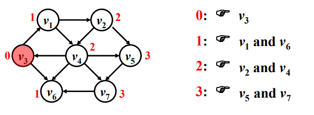

---

【代码】无权图的单源最短路径

```
unweightedSSSP(Vertex S):
    enqueue(Q, S)
    while(!isEmpty(Q))
        V = dequeue(Q)
        for(v in V)
            if(dist[v] == -1)
                dist[v] = dist[V] + 1
                path[v] = V
                enqueue(Q, v)
```

---

无权图的单元最短路径算法中，`dist[v]`存储从源点$ S $到$ v $的最短路径，初始化源点`dist[S]`的距离为$ 0 $，`path[v]`表示达到顶点路径$ v $上一个经过的顶点。

|   顶点   |  1   |  2   |  3   |  4   |  5   |  6   |  7   |
| :------: | :--: | :--: | :--: | :--: | :--: | :--: | :--: |
| **dist** |  1   |  2   |  0   |  2   |  3   |  1   |  3   |
| **path** |  3   |  1   |  -1  |  1   |  2   |  3   |  4   |


**有权图的单源最短路径算法**

有权图的最短路径不一定是经过顶点树最少的路。如果图中存在负值圈（negative-cost cycle）的话会导致算法失效，因为沿着回路走无穷多次，花销是负无穷。

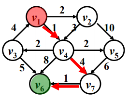

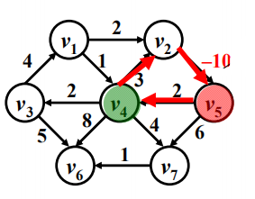


迪杰斯特拉（Dijkstra）算法的本质是不断刷新起点与其他各个顶点之间的距离表。`Dijkstra`算法采用了贪心的思想，每次都未收录的顶点中选取`dist`值最小的收录。每当收录一个顶点时，可能会影响另外一个顶点的`dist`值。
$$
dist[w] = min\{dist[w], dist[v] + weight_{<v, w>}\}
$$
例如计算从源点$ A $到其它各顶点的最短路径。

第1步：创建距离表。其中表中`key`是顶点名称，`value`是源点$ A $到对应顶点的已知最短距离。一开始并不知道最短路径是多少，因此`value`都为无穷大。

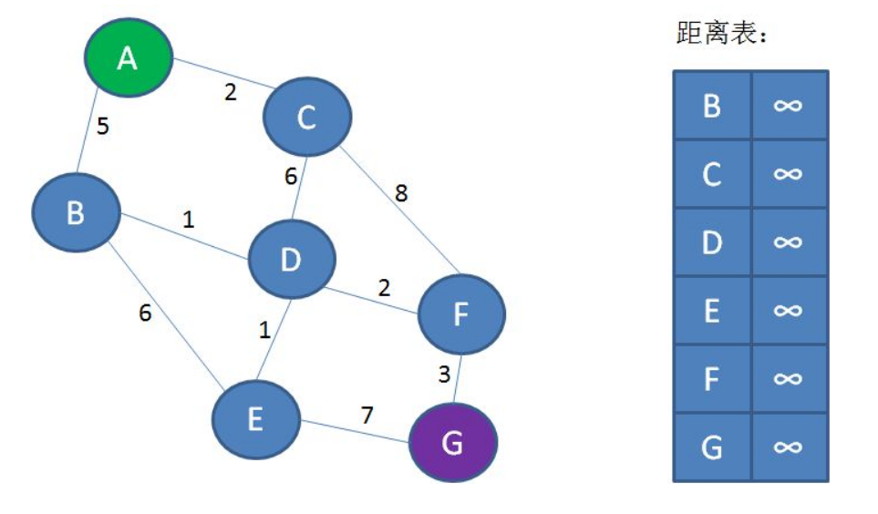

第2步：找到源点$ A $的邻接点$ B $和$ C $，从$ A $到$ B $的距离是`5`，从$ A $到$ C $的距离是`2`。更新距离表。

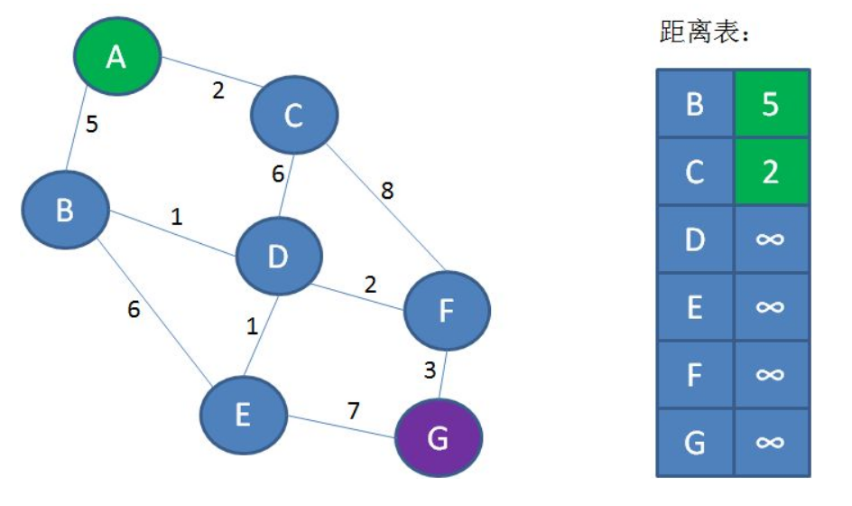

第3步：从距离表中找到从$ A $出发距离最短的顶点，也就是顶点$ C $。找到顶点$ C $的邻接点$ D $和$ F $（$ A $已经遍历过不需要考虑）。从$ C $到$ D $的距离是`6`，所以从$ A $到$ D $的距离是`2 + 6 = 8`；从$ C $到$ F $的距离是`8`，所以从$ A $到$ F $的距离是`2 + 8 = 10`。更新距离表。

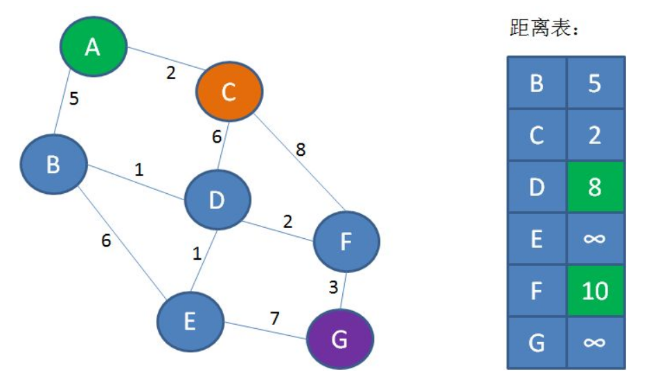

第4步：从距离表中找到从$ A $出发距离最短的顶点（$ C $已经遍历过不需要考虑），也就是顶点$ B $。找到顶点$ B $的邻接点$ D $和$ E $（$ A $已经遍历过不需要考虑）。从$ B $到$ D $的距离是`1`，所以从$A $到$ D $的距离是`5 + 1 = 6`，小于距离表中的`8`；从$ B $到$ E $的距离是`6`，所以从$ A $到$ E $的距离是`5 + 6 = 11`。更新距离表。

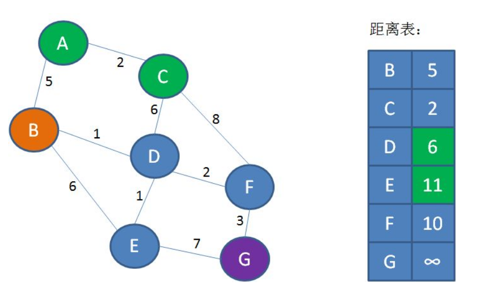

第5步：从距离表中找到从$ A $出发距离最短的顶点（$ B $和$ C $不用考虑），也就是顶点$ D $。找到顶点$ D $的邻接点$ E $和$ F $。从$ D $到$ E $的距离是`1`，所以从$ A $到$ E $的距离是`6 + 1 = 7`，小于距离表中的`11`；从$ D $到$ F $的距离是`2`，所以从$ A $到$ F $的距离是`6 + 2 = 8`，小于距离表中的`10`。更新距离表。

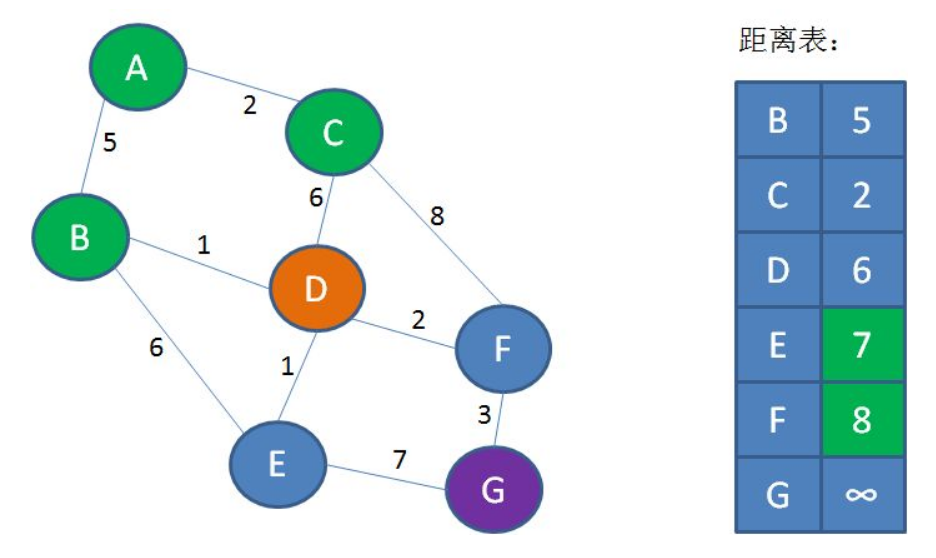

第6步：从距离表中找到从$ A $出发距离最短的顶点，也就是顶点$ E $。找到顶点$ E $的邻接点$ G $。从$ E $到$ G $的距离是`7`，所以从$ A $到$ G $的距离是`7 + 7 = 14`。更新距离表。


第7步：从距离表中找到从$ A $出发距离最短的顶点，也就是顶点$ F $。找到顶点$ F $的邻接点$ G $。从$ F $到$ G $的距离是`3`，所以从$ A $到$ G $的距离是`8 + 3 = 11`，小于距离表中的`14`。更新距离表。

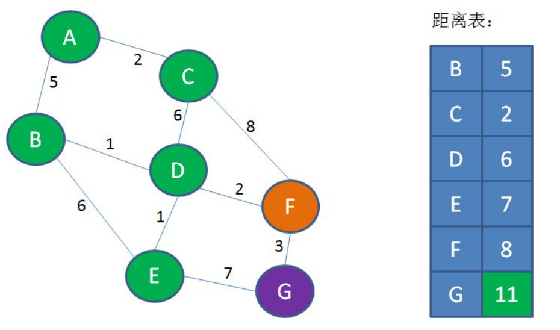

最终，距离表中存储的是从源点$ A $到所有顶点的最短距离。


**多源最短路径算法**


弗洛伊德（Floyd-Warshall）算法是专门用于寻找带权图中多源点之间的最短路径算法。`Floyd`算法的思想是，若想缩短两点间的距离，仅有一种方式，那就是通过第三顶点绕行。

假设$ D^k[i][j]$为路径$ \{i \rarr \{l \le k\} \rarr j\} $的最小长度。当$ D^{k-1} $已经完成，递推到$ D^k $时：

1. 如果$ k \notin \text{最短路径}\{i \rarr \{l \le k\} \rarr j\} $，则$ D^k = D^{k-1} $。
2. 如果$ k \in \text{最短路径}\{i \rarr \{l \le k\} \rarr j\} $，该路径必定由两段最短路径组成，则$ D^k[i][j] = D^{k-1}[i][k] + D^{k-1}[k][j] $。

例如，小哼准备去一些城市旅游，有些城市之间有公路，有些城市之间则没有。为了节省经费以及方便计划旅程，小哼希望在出发之前直到任意两个城市之间的最短路程。

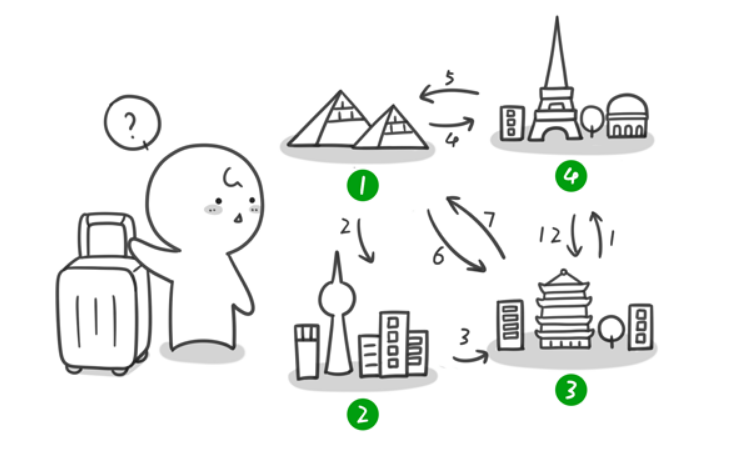

如果要让任意两点之间的路程变短，只能引入第三个点，并通过这个顶点中转才有可能缩短原来的路程。这个中转的顶点甚至有时候不只通过一个顶点，而是经过两个或更多点中转会更短。

当任意两点之间不允许经过第三个点中转时，这些城市之间的最短路径就是邻接矩阵的初始路径。


在只允许经过$ 1 $号顶点中转的情况下，任意两点之间的最短路程更新为：

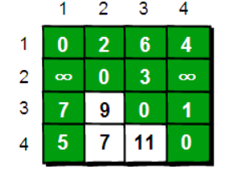

在只允许经过$ 1 $号和$ 2 $号顶点中转的情况下，任意两点之间的最短路程更新为：

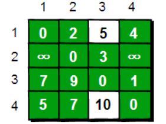

在只允许经过$ 1 $号、$ 2 $号和$ 3 $号顶点中转的情况下，任意两点之间的最短路程更新为：

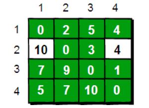

最后允许通过所有顶点作为中转，任意两点之间的最短路程更新为：

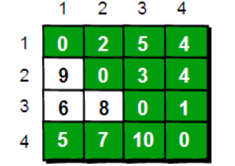

---

【代码】Floyd最短路径

```c
void floyd(Graph *g, int dist[MAX][MAX]) {
    // 最短路径矩阵初始化为图的邻接矩阵
    for(int i = 0; i < g->vertexNum; i++) {
        for(int j = 0; j < g->vertexNum; j++) {
            dist[i][j] = g->weight[i][j];
        }
    }

    // Floyd算法
    for(int k = 0; k < g->vertexNum; k++) {
        for(int i = 0; i < g->vertexNum; i++) {
            for(int j = 0; j < g->vertexNum; j++) {
                if(dist[i][k] + dist[k][j] < dist[i][j]) {
                    dist[i][j] = dist[i][k] + dist[k][j];
                }
            }
        }
    }
}
```

---

