<center><h1>高级数据结构与算法</h1></center>

<div style="border-bottom: none;"><center><h3>目录</h3></center></div>

[TOC]

<div style="page-break-after: always;"></div>

# 第1章 计算复杂性理论

## 1.4 递推方程

**插入排序（Insertion Sort）**

插入排序的递推公式：
$$
W(n) = \left\{
\begin{aligned}
& 0 & n = 1 \\
& W(n - 1) + n - 1 & n > 1
\end{aligned}
\right.
$$
当数组中只有$ 1 $个元素时，无须进行任何交换。当数组中的元素大于$ 1 $时，最坏情况下需要进行$ n - 1 $次交换。 
$$
\begin{aligned}
W(n) &= W(n - 1) + n - 1 \\
	 &= [W(n - 2) + n - 2] + n - 1 \\
	 &= [[W(n - 3) + n - 3] + n - 2] + n - 1 \\
	 &= \dots \\
	 &= W(n - k) + 1 + 2 + \dots + (n - 2) + (n - 1) \\
	 &= W(1) + n(n - 1) / 2 \\
	 &= n(n - 1) / 2 \\
	 &= O(n^2)
\end{aligned}
$$


**归并排序（Merge Sort）**

利用换元法，可以将对$ n $个递推式转换成对其它变元$ k $的递推式，通过对$ k $直接迭代，最后将关于k的函数转换成关于$ n $的函数。

假设$ n = 2^k $，二分归并排序的递推公式：
$$
W(n) = \left\{
\begin{aligned}
& 0 & n = 1 \\
& 2W(n/2) + n - 1 & n > 1
\end{aligned}
\right.
$$
通过换元：
$$
W(2^k) = \left\{
\begin{aligned}
& 0 & n = 1 \\
& 2W(2^{k-1}) + 2^k - 1 & n > 1
\end{aligned}
\right.
$$

$$
\begin{aligned}
W(2^k) &= 2W(2^{k-1}) + 2^k - 1\\
	   &= 2[2W(2^{k-2}) + 2^{k-1} - 1] + 2^k - 1 \\
	   &= 2[2[2W(2^{k-3}) + 2^{k-2} - 1] + 2^{k-1} - 1] + 2^k - 1 \\
	   &= \dots \\
	   &= 2^k W(1) + k2^k - (2^{k-1} + 2^{k-2} + \dots + 2 + 1) \\
	   &= k2^k - 2^k + 1 \\
	   &= nlogn - n + 1 \\
	   &= O(nlogn)
\end{aligned}
$$

<div style="page-break-after: always;"></div>

## 1.5 Master Theorem

**主定理（Master Theorem）**

Master Theorem是算法分析中非常重要的定理。对一个规模为$ n $的问题通过分治，得到$ a $个规模为$ n \over b $的子问题，分解和合并子问题的时间是$ f(n) $。
$$
T(n) = aT\left( {n \over b} \right) + f(n)
$$

1. 若$ f(n) = O \left( n^{log_b{a-\epsilon}} \right),\ \epsilon > 0 $，那么$ T(n) = \Theta \left( n^{log_b{a}} \right) $。
2. 若$ f(n) = \Theta \left( n^{log_b{a}} \right) $，那么$ T(n) = \Theta \left( n^{log_b{a}} * logn \right) $。
3. 若$ f(n) = \Omega \left( n^{log_b{a+\epsilon}} \right),\ \epsilon > 0 $，且对于某个常数$ c < 1 $和充分大的$ n $满足$ af\left( {n \over b} \right) \le cf(n) $，那么$ T(n) = \Theta(f(n)) $。

---

【范例】$ T(n) = 9T(n/3) + n $

$ a = 9,\ b = 3,\ f(n) = n $

$ n^{log_3{9}} = n^2 $

取$ \epsilon = 1 $，$ f(n) = O \left( n^{log_3{9-1}} \right) $

满足Master Theorem 1，$ T(n) = \Theta(n^2) $

---

【范例】$ T(n) = T(2n / 3) + 1 $

$ a = 1,\ b = 3/2,\ f(n) = 1 $

$ n^{log_{3/2}{1}} = n^0 = 1 $

满足Master Theorem 2，$ T(n) = \Theta(logn) $

---

【范例】$ T(n) = 3T(n/4) + nlogn $

$ a = 3,\ b = 4,\ f(n) = nlogn $

取$ \epsilon = 0.2 $，$ f(n) = \Omega \left( n^{log_4{3+\epsilon}} \right) \approx \Omega \left( n^{0.793+\epsilon} \right) = \Omega \left( n^{0.993} \right) $

要使$ af\left( {n \over b} \right) \le cf(n) $成立：$ 3(n/4)log(n/4) \le cnlogn $

当$ 3/4 \le c < 1 $，不等式对所有充分大的$ n $成立

满足Master Theorem 3，$ T(n) = \Theta(nlogn) $

---

<div style="page-break-after: always;"></div>

## 1.6 旅行商问题

**旅行商问题（TSP, Traveling Salesman Problem）**


有一个快递员，要分别给三家顾客送快递，他自己到达每个顾客家的路程各不相同，每个顾客之间的路程也各不相同。那么想要把快递依次送达这三家，并最终回到起点，哪一条路线所走的总距离是最短的呢？


有一个商品推销员，要去若干个城市推销商品。该推销员从一个城市出发，需要经过所有城市后，回到出发地。每个城市之间都有道路连通，且距离各不相同，推销员应该如何选择路线，使得总行程最短呢？

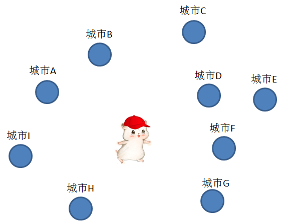

这个问题看起来很简单，却很难找到一个真正高效的求解算法。其中最容易想到的，是使用穷举法把所有可能的路线穷举出来，计算出每一条路线的总行程。

通过排列组合，从所有路线中找出总行程最短的路线。显然，这个方法的时间复杂度是$ O(n!) $，随着城市数量的增长，花费的运算时间简直不可想象！

后来，人们想出了许多相对优化的解决方案，比如动态规划法和分枝定界法等。但是，这些算法的时间复杂度仍然是指数级的，并没有让性能问题得到根本的解决。


<div style="page-break-after: always;"></div>

## 1.7 NP=P?

**P和NP**

算法的设计与分析在计算机科学领域有着重要的应用背景。1966~2005年期间，Turing奖获奖50人，其中10人以算法设计，7人以计算理论、自动机和复杂性研究领域的杰出贡献获奖。计算复杂性理论中的$ P = NP? $问题是世界七大数学难题之一。

|     算法      |  时间复杂度  |
| :-----------: | :----------: |
|   二分查找    | $ O(logn) $  |
|   归并排序    | $ O(nlogn) $ |
| Floyd最短路径 |  $ O(n^3) $  |

尽管这些算法的运行时间有数量级上的差别，但是它们的时间复杂度都可以用$ O(n^k) $来表示，其中$ k $是一个常数。因此，这些算法都是多项式时间算法，能用多项式时间算法解决的问题被称为P问题（Polynomial）。

人们常说，能用钱解决的问题都不是问题，在计算机科学家眼中，能用多项式时间解决的问题都不是问题。

然而，世间还存在许多变态的问题，是无法（至少是暂时无法）在多项式时间内解决的，比如一些算法的时间复杂度是$ O(2^n) $，甚至$ O(n!) $。随着问题规模$ n $的增长，计算量的增长速度是非常恐怖的。这类问题被称为NP问题（Non-deterministic Polynomial），意思是“不确定是否能用多项式时间解决”。

有些科学家认为，所有的NP问题终究都可以在多项式时间内解决，只是我们暂时还没有找到方法；也有些科学家认为，某些NP问题永远无法在多项式时间内解决。

这个业界争论可以用一个公式来表达：
$$
NP = P?
$$


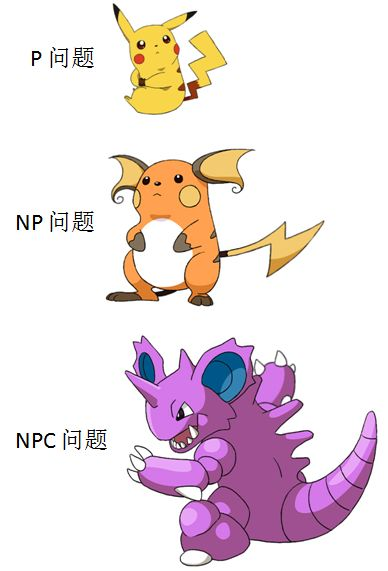


**规约和NPC**

这里所说的NPC问题可不是游戏当中的NPC，要想理解NPC问题，需要先了解归约的概念。

归约（reduction），可以简单理解成问题之间的转化。例如问题是一个一元一次方程的求解问题$ Q: 3x + 6 = 12 $，这个问题可以转化成一个一元二次问题$ Q': 0x^2 + 3x + 6 = 12 $。

显然，问题$ Q $并不比问题$ Q' $更难解决，只要有办法解决$ Q' $，就一定能够解决$ Q $。对于这种情况，我们可以说问题$ Q $归约于问题$ Q' $。

同时，这种归约可以逐级传递，比如问题A归约于问题B，问题B归约于问题C，问题C归约于问题D，那么可以说问题A归约于问题D。

在NP问题之间，也可以存在归约关系。我们把众多的NP问题层层归约，必定会得到一个或多个终极问题，这些归约的终点就是所谓的NPC问题（NP-Complete）。旅行商问题被科学家证明属于NPC问题。


就数量上而言，NP问题远比P问题要多，而NP之中的NPC问题也仅占极少数。


俗话说擒贼先擒王，只要有朝一日，我们能够找到NPC问题的多项式时间算法，就能够解决掉所有的NP问题！但遗憾的是，至今还没有人能够找到可行的方法，很多人认为这些问题是无解的。


**旅行商问题**


<div style="page-break-after: always;"></div>

# 第2章 分治法

## 2.1 芯片测试

**芯片测试**

有两片芯片A和B，将两片芯片互相进行测试，测试报告是“好”或者“坏”。假设好芯片的报告一定是正确的，坏芯片的报告是不确定的（有可能会出错）。

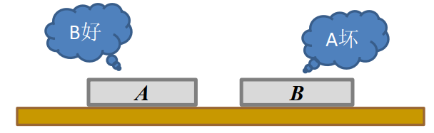

|  A报告  |  B报告  |      结论      |
| :-----: | :-----: | :------------: |
| B是好的 | A是好的 | AB都好或AB都坏 |
| B是好的 | A是坏的 | 至少一片是坏的 |
| B是坏的 | A是好的 | 至少一片是坏的 |
| B是坏的 | A是坏的 | 至少一片是坏的 |

芯片测试问题给定$n $片芯片，其中好芯片的数量比坏芯片的数量至少多$ 1 $片，要求设计一种方法，用最少的测试次数，通过测试从$ n $片芯片中挑出$ 1 $片好芯片。

当需要测试某一片芯片A的好坏时，可以用其它$ n - 1 $片芯片对芯片A进行测试。

> 假设$ n = 7 $（好芯片数$ \ge 4 $）：
>
> -  如果A为好芯片，那么6个报告中至少3个报“好”。
> -  如果A为坏芯片，那么6个报告状况至少4个报“坏”。

当$ n $为奇数时（好芯片数$ \ge (n+1) / 2 $）：

1. 如果A为好芯片，至少有$ (n-1) / 2 $个报“好”。
2. 如果A为坏芯片，至少有$ (n+1) / 2 $个报“坏”。

> 假设$ n = 8 $（好芯片数$ \ge 5 $）：
>
> 1. 如果A为好芯片，那么7个报告中至少4个报“好”。
> 2. 如果A为坏芯片，那么7个报告状况至少5个报“坏”。

当$ n $为偶数时（好芯片数$ \ge n/2 + 1 $）：

1. 如果A为好芯片，至少有$ n / 2 $个报“好”。
2. 如果A为坏芯片，至少有$ n/2 + 1 $个报“坏”。

使用暴力算法，任意一个芯片进行测试，如果是好芯片，则测试结束。如果是坏芯片，则抛弃，再从剩下的芯片中任取一片进行测试，直到找到好芯片。因此暴力算法的时间复杂度为$ \Theta(n) $。


**分治算法**

假设$ n $为偶数，将$ n $个芯片两两一组做测试淘汰，剩下的芯片构成子问题，进行下一轮分组淘汰。

淘汰的规则为：

|   情况   |   描述   |
| :------: | :------: |
|  好 好   | 任留1片  |
| 其它情况 | 全部抛弃 |

递归的截止条件为$ n \le 3 $，因为当$ n = 1 $或$ n = 2 $，所有芯片一定都为好芯片，无需进行测试。当$ n = 3 $时，只进行$ 1 $次测试即可得到好芯片。

分治算法要求子问题与原问题性质相同，原问题中在$ n $个芯片中好芯片至少比坏芯片多$ 1 $片，因此需要验证分治算法子问题的正确性，即证明：当$ n $是偶数时，经过淘汰规则后，剩下的好芯片至少比坏芯片多$ 1 $片。

假设在分组中，A与B都为好芯片的有$ i $组，A与B一好一坏的有$ j $组，A与B都为坏芯片的有$ k $组，初始芯片的总数为$ 2i + 2j + 2k = n $。

根据淘汰规则：

1. A与B都为好芯片，任留1片，因此淘汰后好芯片至少有$ i $个。
2. A与B一好一坏，全部抛弃。
3. A与B都为坏芯片，有可能A和B同时错报为好，因此淘汰后坏芯片至多有$ k $个。

$$
\begin{aligned}
2i + j > 2k + j && \text{初始好芯片多于坏芯片} \\
i > k           && \text{子问题好芯片多于坏芯片}
\end{aligned}
$$

以上算法是基于芯片数量$ n $为偶数情况下的，但是如果当$ n $为奇数时，可能会出现问题。

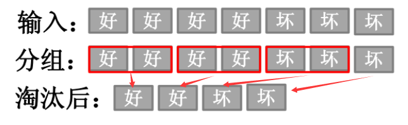

解决这个问题的处理办法就是额外增加一轮对多余的那个芯片单独测试。如果该芯片为好芯片，则算法结束。如果是坏芯片，则抛弃，将剩余芯片分组淘汰。

每轮分组淘汰后，芯片数量至少减半。对芯片进行测试（包括对额外多余芯片单独测试）的处理时间为$ O(n) $。

$$
W(n) = \left\{
\begin{aligned}
& 0 & n = 1\ or\ n = 2 \\
& 1 & n = 3 \\
& W(n/2) + O(n) & n > 3
\end{aligned}
\right.
$$

求解得到：

$$
W(n) = O(n)
$$

<div style="page-break-after: always;"></div>

## 2.2 大整数乘法

**大整数乘法**

起初，小灰认为只要按照大整数相加的思路稍微做一下变形，就可以轻松实现大整数相乘。但是随着深入的学习，小灰才发现事情并没有那么简单……


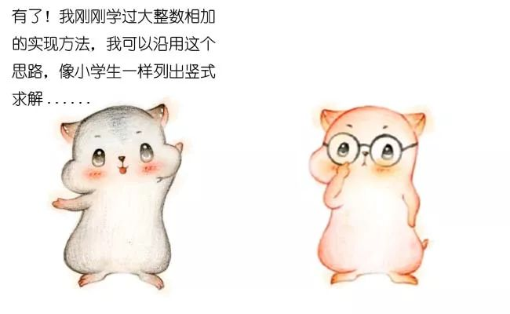

$$
\begin{array}{r}
\ \ \ \ 93281 \\
\times \ \ \ \ \ \ 2034 \\
\hline
373124 \\
279843\ \  \\
000000\ \ \ \  \\
186562\ \ \ \ \ \  \\
\hline
189733554
\end{array}
$$

乘法竖式的计算过程可以大体分为两步：

1. 整数B的每一个数位和整数A所有数位依次相乘，得到中间结果。
2. 所有中间结果相加，得到最终结果。


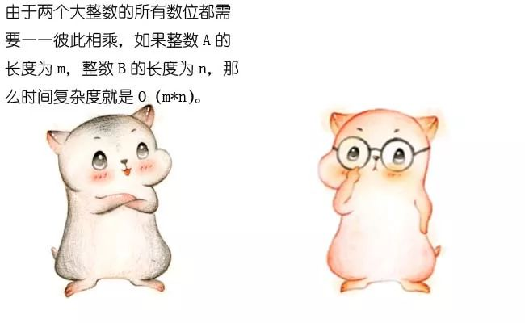

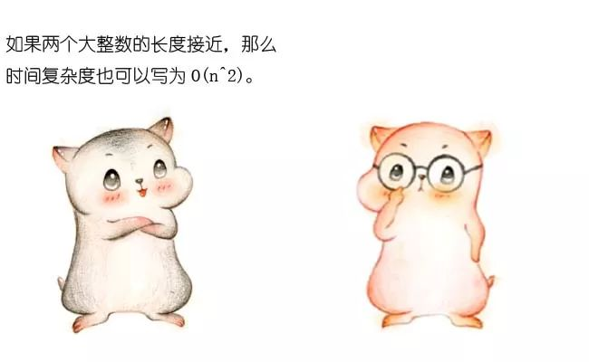


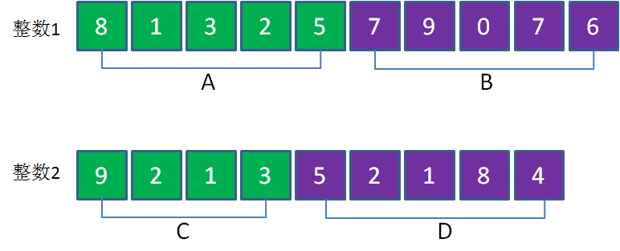

$$
\text{整数1} = A \times 10^5 + B \\
\text{整数2} = C \times 10^5 + D
$$

如果把两个大整数的长度抽象为m和n，那么：
$$
\text{整数1} = A \times 10^{m/2} + B \\
\text{整数2} = C \times 10^{n/2} + D
$$

$$
\begin{aligned}
& \text{整数1} \times \text{整数2} \\
&= (A \times 10^{m/2} + B) \times (C \times 10^{n/2} + D) \\
&= AC \times 10^{m+n \over 2} + AD \times 10^{n \over 2} + BC \times 10^{m \over 2} + BD
\end{aligned}
$$

如此一来，原本长度为$ n $的大整数的$ 1 $次乘积，被转化成了长度为$n / 2 $的大整数的$ 4 $次乘积。


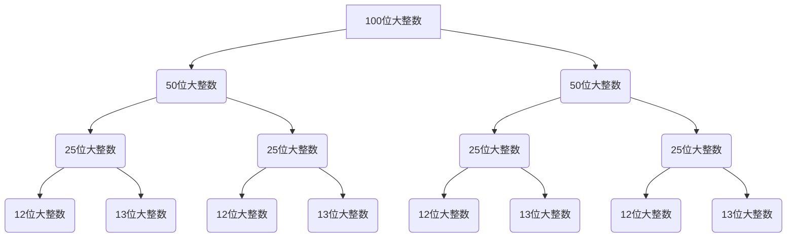
```mermaid
graph TB
	100位大整数 --> int_50_1(50位大整数)
	100位大整数 --> int_50_2(50位大整数)
	
	int_50_1 --> int_25_1(25位大整数)
	int_50_1 --> int_25_2(25位大整数)
	int_50_2 --> int_25_3(25位大整数)
	int_50_2 --> int_25_4(25位大整数)
	
	int_25_1 --> int_12_1(12位大整数)
	int_25_1 --> int_13_1(13位大整数)
	int_25_2 --> int_12_2(12位大整数)
	int_25_2 --> int_13_2(13位大整数)
	int_25_3 --> int_12_3(12位大整数)
	int_25_3 --> int_13_3(13位大整数)
	int_25_4 --> int_12_4(12位大整数)
	int_25_4 --> int_13_4(13位大整数)
```


$$
T(n) = \left\{
\begin{aligned}
& O(1) & n = 1 \\
& 4T(n/2) + O(n) & n > 1 \\
\end{aligned}
\right.
$$

求解得到：

$$
T(n) = O(n^2)
$$


分治算法的时间复杂度方程为$ W(n) = aW(n/b) + f(n) $，其中$ a $为子问题数，$ n / b $为子问题规模，$ f(n) $为划分与合并工作量。当$ a $较大、$ b $较小、$ f(n) $不大时，$ W(n) = \Theta(n^{log_ba}) $。减少$ a $是降低$ W(n) $的阶的一种途径。利用子问题的依赖问题，可以使某些子问题的解通过组合其它子问题的解而得到。

在大整数乘法运算中，如果只简单地利用分治法将大整数的位置减半，并不能降低时间复杂度的阶。


$$
\begin{aligned}
& \text{整数1} \times \text{整数2} \\
&= (A \times 10^{n/2} + B) \times (C \times 10^{n/2} + D) \\
&= AC \times 10^n + AD \times 10^{n/2} + BC \times 10^{n/2} + BD \\
&= AC \times 10^n + (AD + BC) \times 10^{n/2} + BD \\
&= AC \times 10^n + (AD - AC - BD + BC + AC + BD) \times 10^{n/2} + BD \\
&= AC \times 10^n + ((A - B)(D - C) + AC + BD) \times 10^{n/2} + BD
\end{aligned}
$$
这样一来，原本的$ 4 $次乘法和$ 3 $次加法，转变成了$ 3 $次乘法和$ 6 $次加法。


$$
T(n) = \left\{
\begin{aligned}
& O(1) & n = 1 \\
& 3T(n/2) + O(n) & n > 1
\end{aligned}
\right.
$$

求解得到：
$$
T(n) = O(n^{log_2{3}}) \approx O(n^{1.59})
$$

---

【代码】大整数乘法

```python
def big_int_mul(num1, num2):
    # 有一个为空，结果为0
    if not num1 or not num2:
        return '0'
    # 终止条件
    elif len(num1) == 1 and len(num2) == 1:
        return str(int(num1) * int(num2))
    
    mid1 = len(num1) // 2
    mid2 = len(num2) // 2

    # 将num1分成两部分
    a = num1[:mid1]
    b = num1[mid1:]
    # 将num2分成两部分
    c = num2[:mid2]
    d = num2[mid2:]

    m = len(b)      # m次幂
    n = len(d)      # n次幂

    # 分治计算，分别补上幂次
    x1 = big_int_mul(a, c) + '0' * (m + n)
    x2 = big_int_mul(b, c) + '0' * n
    x3 = big_int_mul(a, d) + '0' * m
    x4 = big_int_mul(b, d)

    # 将计算结果根据最长的补零，方便之后直接相加
    max_len = max(len(x1), len(x2), len(x3), len(x4))
    x1 = '0' * (max_len - len(x1)) + x1
    x2 = '0' * (max_len - len(x2)) + x2
    x3 = '0' * (max_len - len(x3)) + x3
    x4 = '0' * (max_len - len(x4)) + x4

    # 计算x1 + x2 + x3 + x4的值，也就是原问题的解
    result = ""
    carry = 0           # 保存进位
    for i in range(max_len - 1, -1, -1):
        s = int(x1[i]) + int(x2[i]) 
        	+ int(x3[i]) + int(x4[i])
            + carry
        result = str(s % 10) + result
        carry = s // 10
    # 判断是否存在进位
    if carry > 0:
        result = str(carry) + result
    
    # 去除结果前面多余的0
    i = 0
    while i < len(result) and result[i] == '0':
        i += 1
    return result[i:]
```

---

<div style="page-break-after: always;"></div>

## 2.3 快速幂

**快速幂（Fast Exponentiation）**

使用传统算法计算$ a^n $的时间复杂度为$ \Theta(n) $，然而利用快速幂的算法时间复杂度为$ \Theta(logn) $。

$$
a^n = \left\{
\begin{aligned}
& a^{n/2} * a^{n/2} & n\text{为偶数} \\
& a^{(n-1)/2} * a^{(n-1)/2} * a  & n\text{为奇数}
\end{aligned}
\right.
$$
例如计算$ 2^{18} $只需要4步即可：
$$
\begin{aligned}
2^{18} &= 2^9 * 2^9 \\
2^9 &= 2^4 * 2^4 * 2 \\
2^4 &= 2^2 * 2^2 \\
2^2 &= 2^1 * 2 \\

\end{aligned}
$$

---

【代码】快速幂

```c
/**
 * @brief  快速幂计算a^n
 */
int fastExp(int a, int n) {
    int result = 1;
    while(n) {
        if(n & 1) {
            result *= a;
        }
        a *= a;
        n >>= 1;
    }
    return result;
}
```

---


**矩阵快速幂**

Fibonacci数列$ \{0, 1, 1, 2, 3, 5, 8, 13, 21, \dots \} $可以通过递归公式$ F_n = F_{n-1} + F_{n-2} $计算出第$ n $项的值，时间复杂度为$ \Theta(n) $。但是利用矩阵快速幂的算法可以在将时间复杂度降低为$ \Theta(logn) $。

令$ M = \left[\begin{matrix} 1 & 1 \\ 1 & 0\end{matrix} \right] $，通过计算$ M^n $即可计算出$ F_n $的值。即：

$$
\left[\begin{matrix} F_{n+1} & F_n \\ F_n & F_{n-1} \end{matrix} \right]
= \left[\begin{matrix} 1 & 1 \\ 1 & 0 \end{matrix} \right]^n
$$
通过数学归纳法可以证明该性质：
$$
\begin{aligned}
& \text{当}n = 1\text{时，} \\
& \left[\begin{matrix} F_2 & F_1 \\ F_1 & F_0 \end{matrix} \right]
= \left[\begin{matrix} 1 & 1 \\ 1 & 0 \end{matrix} \right] \\
\\
& \text{当}n \ge 2\text{时，} \\
& \left[\begin{matrix} F_{n+2} & F_{n+1} \\ F_{n+1} & F_n \end{matrix} \right] \\
&= \left[\begin{matrix} F_{n+1} & F_{n} \\ F_{n} & F_{n-1} \end{matrix} \right]
   \left[\begin{matrix} 1 & 1 \\ 1 & 0 \end{matrix} \right] \\
&= \left[\begin{matrix} 1 & 1 \\ 1 & 0 \end{matrix} \right]^n
   \left[\begin{matrix} 1 & 1 \\ 1 & 0 \end{matrix} \right] \\
&= \left[\begin{matrix} 1 & 1 \\ 1 & 0 \end{matrix} \right]^{n+1}
\end{aligned}
$$

---

【代码】矩阵快速幂

```python
N = 2

def matrix_multiply(a, b):
    c = [
        [0, 0],
        [0, 0]
    ]
    for i in range(N):
        for j in range(N):
            for k in range(N):
                c[i][j] += a[i][k] * b[k][j]
    return c

def matrix_fast_exp(n):
    result = [
        [1, 1],
        [1, 0]
    ]
    M = [
        [1, 1],
        [1, 0]
    ]

    while n > 0:
        if n & 1:
            result = matrix_multiply(result, M)
        M = matrix_multiply(M, M)
        n >>= 1
    
    return result[0][0]
```

---

<div style="page-break-after: always;"></div>

## 2.4 Strassen矩阵乘法

**矩阵乘法**

假设$ A $和$ B $为$ n $阶矩阵（$ n = 2^k $），计算时，对于$ C $中$ n^2 $个元素，每个元素都需要做$ n $次乘法，因此$ W(n) = O(n^3) $。

利用简单的分治策略，可以将矩阵分块计算计算。
$$
\left( \begin{matrix}
A_{11} & A_{12} \\
A_{21} & A_{22}
\end{matrix} \right)
\left( \begin{matrix}
B_{11} & B_{12} \\
B_{21} & B_{22}
\end{matrix} \right)
=
\left( \begin{matrix}
C_{11} & C_{12} \\
C_{21} & C_{22}
\end{matrix} \right)
\\
\text{其中，} \\
C_{11} = A_{11}B_{11} + A_{12}B_{21} \\
C_{12} = A_{12}B_{12} + A_{12}B_{22} \\
C_{21} = A_{21}B_{11} + A_{22}B_{21} \\
C_{22} = A_{21}B_{12} + A_{21}B_{22} \\
$$
这样就把原问题转换为了8个子问题，递推方程为：
$$
W(n) = \left\{
\begin{aligned}
& 1 & n = 1 \\
& 8W(n/2) + cn^2  & n > 1
\end{aligned}
\right.
$$
求解得到：
$$
W(n) - O(n^3)
$$
简单的分治算法并不能降低时间复杂度的阶，但是矩阵乘法可以通过减少子问题的个数进行优化。


**Strassen矩阵乘法**

让$  M_1,\ M_2,\ \dots,\ M_7 $分别对应矩阵乘法的7个子问题：
$$
\begin{aligned}
M_1 &= A_{11}(B_{12} - B_{22}) \\
M_2 &= (A_{11} + A_{12})B_{22} \\
M_3 &= (A_{21} + A_{22})B_{11} \\
M_4 &= A_{22}(B_{21} - B_{11}) \\
M_5 &= (A_{11} + A_{22})(B_{11} + B_{22}) \\
M_6 &= (A_{12} - A_{22})(B_{21} + B_{22}) \\
M_7 &= (A_{11} - A_{21})(B_{11} + B_{12})
\end{aligned}
$$

利用这些中间矩阵，可以得到结果矩阵：
$$
\begin{aligned}
C_{11} &= M_5 + M_4 - M_2 + M_6 \\
C_{12} &= M_1 + M_2 \\
C_{21} &= M_3 + M_4 \\
C_{22} &= M_5 + M_1 - M_3 - M_7
\end{aligned}
$$
在这些运算中，一共有$ 7 $个子问题和$ 18 $次矩阵加减法，时间复杂度为：
$$
W(n) = \left\{
\begin{aligned}
& 1 & n = 1 \\
& 7W(n/2) + 18(n/2)^2  & n > 1
\end{aligned}
\right.
$$
求解得到：
$$
W(n) = O(n^{log7}) \approx O(n^{2.8075})
$$
`Coppersmith-Winograd`算法是目前已知最好的矩阵乘法算法，时间复杂度为$ O(n^{2.376}) $。矩阵乘法可以应用在科学计算、图形处理、数据挖掘等方面，在回归、聚类、主成分分析、决策树等挖掘算法中常常涉及大规模矩阵运算。

<div style="page-break-after: always;"></div>

# 第3章 排序算法

## 3.2 希尔排序

**希尔排序（Shell Sort）**

希尔排序本质上是直接插入排序的升级版。对于插入排序而言，在大多数元素已经有序的情况下，工作量会比较小。这个结论很明显，如果一个数组大部分元素都有序，那么数组中的元素自然不需要频繁地进行比较和交换。

如何能够让待排序的数组中大部分元素有序呢？需要对原始数组进行预处理，使得原始数组的大部分元素变得有序。采用分组的方法，可以将数组进行一定程度地粗略调整。

例如一个有8个数字组成的无序序列$ \{5, 8, 6, 3, 9, 2, 1, 7\} $，进行升序排序。让元素两两一组，同组两个元素之间的跨度为数组总长度的一半。

接着让每组元素进行独立排序，排序方式使用直接插入排序即可。由于每一组的元素数量很少，所以插入排序的工作量很少。这样一来，仅仅经过几次简单的交换，数组整体的有序程序得到了显著提高，使得后续再进行直接插入排序的工作量大大减少。

但是这样还不算完，还可以进一步缩小分组跨度，重复上述工作。

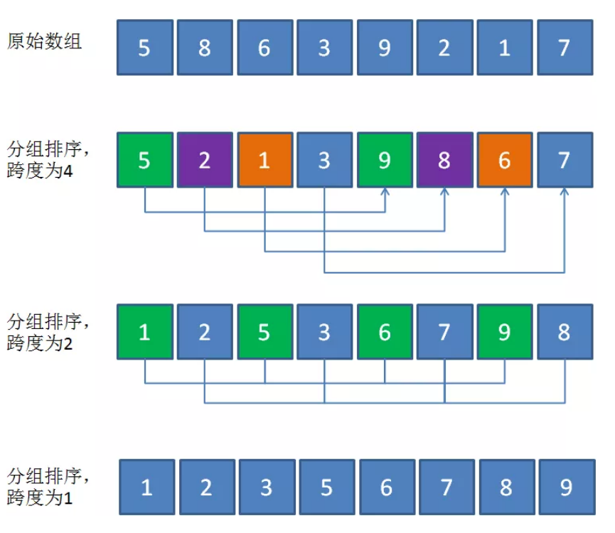

希尔排序的发明者是计算机科学家`Donald Shell`。希尔排序中说使用的分组跨度被称为希尔排序的增量。增量的选择可以有很多种，最朴素的就是`Donald Shell`在发明希尔排序时所提出的逐步折半的方法。

---

【代码】希尔排序

```c
void shellSort(int *arr, int n) {
    int gap = n;
    while(gap > 1) {
        gap /= 2;
        for(int i = 0; i < gap; i++) {
            for(int j = i+gap; j < n; j += gap) {
                int temp = arr[j];
                int k = j - gap;
                while(k >= 0 && arr[k] > temp) {
                    arr[k+gap] = arr[k];
                    k -= gap;
                }
                arr[k+gap] = temp;
            }
        }
    }    
}
```

---


**算法分析**

希尔排序利用分组粗略调整的方式减少了直接插入排序的工作量，使得算法的平均时间复杂度低于$ O(n^2) $。但是在某些极端情况下，希尔排序的最坏时间复杂度仍然是$ O(n^2) $，甚至比插入排序更慢。

例如$ \{2, 1, 5, 3, 7, 6, 9, 8\} $，无论是以4为增量，还是以2为增量，每组内部的元素都没有任何交换。直到增量缩减为1，数组才会按照直接插入排序的方式进行调整。

对于这样的数组，希尔排序不但没有减少直接插入排序的工作量，反而白白增加了分组操作的成本。

这是因为每一轮希尔增量之间都是等比的，这就导致了希尔增量存在盲区。为了避免这样的极端情况，科学家发明了许多更为严谨的增量方式。其中最具有代表性的是`Hibbard`增量和`Sedgewick`增量。

1. `Hibbard`增量序列：$ 1, 3, 7, 15, \dots $，通项公式为$ 2^i - 1 $。

    利用这种增量方式的希尔排序，最坏时间复杂度是。

---

【代码】Hibbard增量序列

```python
def get_hibbard_sequence(n):
    """
        生成Hibbard序列
        1, 3, 7, 15, 31, 63, ...
    """
    sequence = []
    i = 1
    while i <= n:
        sequence.append(i)
        i = (i << 1) + 1
    sequence.reverse()
    return sequence

def shell_sort_hibbard(lst):
    """
        希尔排序（Hibbard增量序列）
    """
    n = len(lst)
    hibbard = get_hibbard_sequence(n)
    for gap in hibbard:
        for i in range(gap, n):
            j = i
            temp = lst[j]
            while j >= gap:
                if temp < lst[j-gap]:
                    lst[j] = lst[j-gap]
                    j -= gap
                else:
                    break
            lst[j] = temp
```

---

2. `Sedgewick`增量序列：$ 1, 5, 19, 41, 109, \dots $，通项公式为$ 9 \times 4^i - 9 \times 2^i + 1 $和$ 4^{i+2} - 3 \times 2^{i+2} + 1 $。

    利用这种增量方式的希尔排序，最坏时间复杂度是$ O(n^{4/3}) $。

---

【代码】Sedgewick增量序列

```python
def get_sedgewick_sequence(n):
    """
        生成Sedgewick序列
        1, 5, 19, 41, 109, ...
    """
    sequence = []
    i = 0
    while True:
        # 9 * 4^i - 9 * 2^i + 1
        # ==> 9 * (2^(2*i) - 2^i) + 1
        item = 9 * ((1 << (2 * i)) - (1 << i)) + 1
        if item <= n:
            sequence.append(item)
        else:
            break

        # 4^(i+2) - 3 * 2^(i+2) + 1
        # ==> 2^(2i+4) - 3 * 2^(i+2) + 1
        item = (1 << (2 * i + 4)) - 3 * (1 << (i + 2)) + 1
        if item <= n:
            sequence.append(item)
        else:
            break
        
        i += 1
    return sequence

def shell_sort_sedgewick(lst):
    """
        希尔排序（Sedgewick增量序列）
    """
    n = len(lst)
    sedgewick = get_sedgewick_sequence(n)
    for gap in sedgewick:
        for i in range(gap, n):
            j = i
            temp = lst[j]
            while j >= gap:
                if temp < lst[j-gap]:
                    lst[j] = lst[j-gap]
                    j -= gap
                else:
                    break
            lst[j] = temp
```

---

这两种增量方式的时间复杂度需要很复杂的数学证明，有些是人们的大致猜想。

|  希尔排序  |                       |
| :--------: | :-------------------: |
| 时间复杂度 | $ O(n^{1.3 \sim 2}) $ |
| 空间复杂度 |       $ O(1) $        |
|   稳定性   |        不稳定         |

<div style="page-break-after: always;"></div>

## 3.3 归并排序

**归并排序优化**

简单的归并排序利用分治法，递归地将对小规模子数组进行处理。但是递归会使小规模问题中方法调用太过频繁，因此对于规模较小的子数组可以采用插入排序。一般来说插入排序在小数组中比归并更快，这种优化可以使归并排序的运行时间缩短$ 10\% \sim 15\% $。

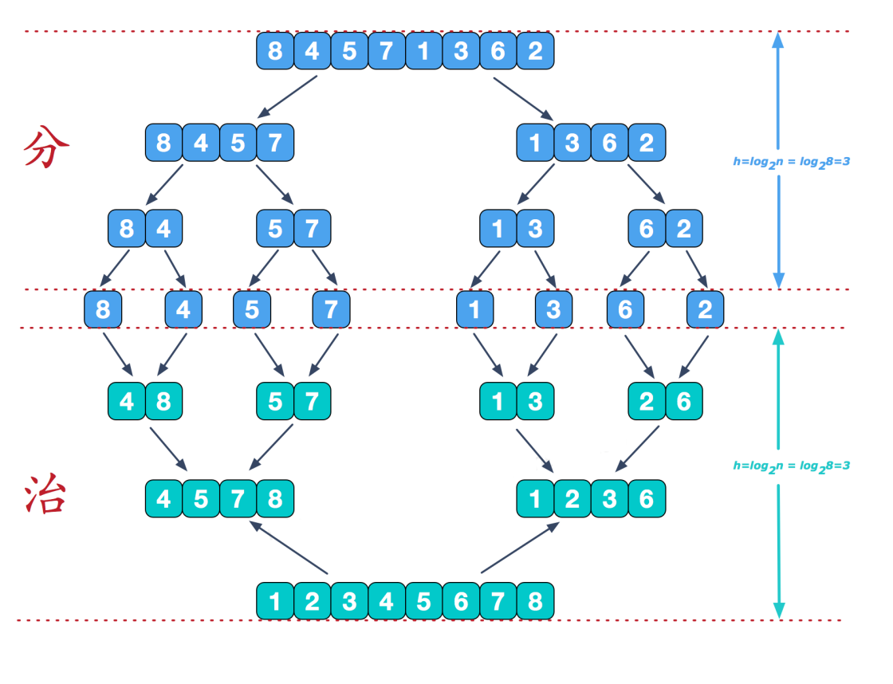

另一个可以优化的地方是对于单次合并的过程，例如将子数组$ arr[start..mid] $和$ arr[mid+1..end] $进行合并，如果$ arr[mid] \le arr[mid+1] $的话，说明$ arr[start..end] $已经为有序状态，无序再进行不必要的合并。

---

【代码】归并排序优化

```c
void mergeSortWorker(int *arr, int start, int end, int *temp) {
    // 列表长度小于10时，采用二分插入排序
    if(end - start <= 10) {
        binaryInsertionSort(arr, start, end);
        return;
    }
    if(start < end) {
        int mid = start + (end - start) / 2;
        mergeSortWorker(arr, start, mid, temp);
        mergeSortWorker(arr, mid+1, end, temp);
        // 避免不必要的合并
        if(arr[mid] <= arr[mid+1]) {
            return;
        }
        merge(arr, start, mid, end, temp);
    }
}
```

---


**归并排序迭代实现**

递归实现的归并排序是自顶向下的过程，基于循环的归并排序是自底向上进行的。非递归的归并排序避免了递归时深度为$ logn $的栈空间，空间上只用到了长度为$ n $的临时空间。

---

【代码】归并排序（迭代）

```java
public static void mergeSort(int[] arr) {
        int n = arr.length;
        int[] temp = new int[n];
        int pos = 0;            // 临时数组的下表
        int left1, left2;       // 左子数组边界
        int right1, right2;     // 右子数组边界

        for (int i = 1; i < n; i *= 2) {
            for (left1 = 0; left1 < n - i; left1 = right2) {
                // 设置子数组边界
                right1 = left2 = left1 + i;
                right2 = left2 + i;

                // 防止右边界越界
                right2 = right2 > n ? n : right2;

                pos = 0;
                while (left1 < left2 && right1 < right2) {
                    if (arr[left1] < arr[right1]) {
                        temp[pos++] = arr[left1++];
                    } else {
                        temp[pos++] = arr[right1++];
                    }
                }

                while (left1 < left2) {
                    arr[--right1] = arr[--left2];
                }

                // 将排好序的部分保存回数组
                while (pos > 0) {
                    arr[--right1] = temp[--pos];
                }
            }
        }
    }
```

---


**外部排序**

在内存中进行的排序称为内部排序，而在许多实际应用中，经常需要对大文件进行排序。因为文件中的信息量庞大，无法将整个文件拷贝进内存进行排序。因此需要将待排序的记录存储在外存上，排序时再把数据一部分一部分调入内存进行排序，再讲排好序的记录写回文件中。

因为磁盘读写的时间远超过内存计算的时间，因此外部排序过程中的时间代价主要是磁盘I/O次数。


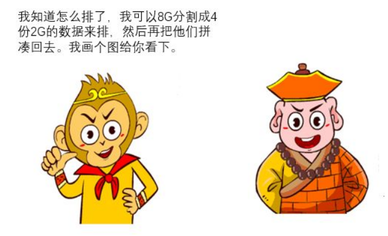

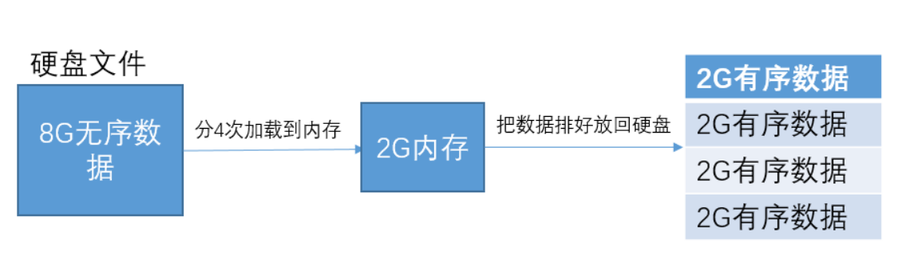

排序的时候可以采用归并排序，每次将两个有序子串合并层一个大的有序子串。


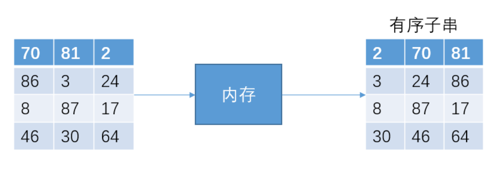


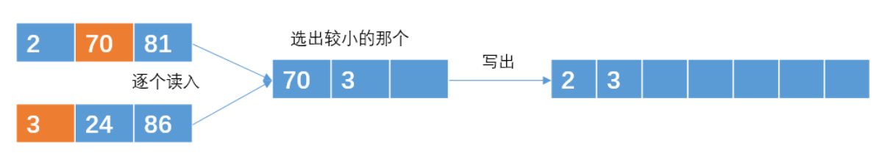

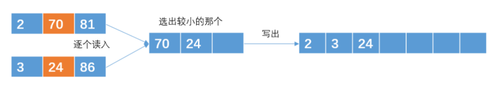


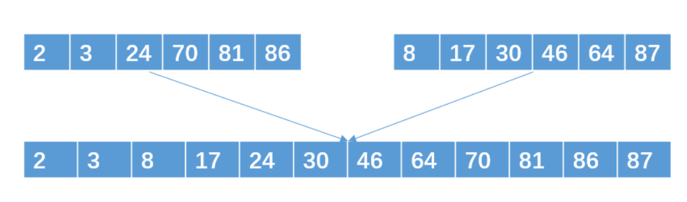


**多路归并**


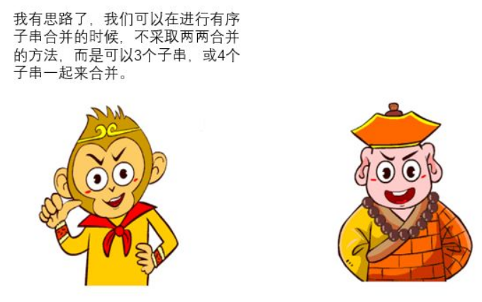

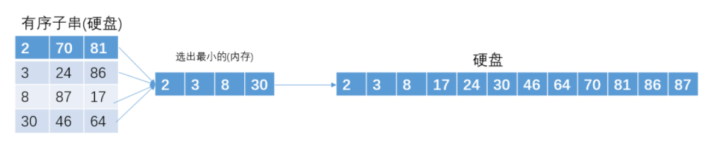


<div style="page-break-after: always;"></div>

## 3.4 快速排序

**随机选择基准值**

快速排序利用分治法，通过一趟排序将数组分为两部分，其中一部分小于等于基准值，另一部分大于等于基准值，然后再递归对两个子问题排序。

基本的快速排序采用序列的第一个元素作为基准值，但是这不是一种好方法。当数组已经有序时，这样的分割效率非常糟糕。为了缓解这种极端情况，可以在待排序数组中随机选择一个元素作为基准值。

---

【代码】随机选取基准值

```c
int selectRandomPivot(int *arr, int start, int end) {
    srand(time(NULL));
    int pos = rand() % (end - start) + start;
    swap(&arr[pos], &arr[start]);
    return arr[start];
}
```

---


**三数取中**

虽然随机选取基准值可以减少出现分割不好的几率，但是最坏情况下还是$ O(n) $。另一种选取基准值的方法就是三数取中，也就是取序列中start、mid、end三个元素的中间值作为基准值。

---

【代码】三数取中

```c
int selectMedianPivot(int *arr, int start, int end) {
    int mid = start + (end - start) / 2;
    if(arr[mid] > arr[end]) {
        swap(&arr[mid], &arr[end]);
    }
    if(arr[start] > arr[end]) {
        swap(&arr[start], &arr[end]);
    }
    if(arr[mid] > arr[start]) {
        swap(&arr[mid], &arr[start]);
    }
    // 此时arr[mid] <= arr[start] <= arr[end]
    return arr[start];
}
```

---


**三数取中+插入排序**

对于很小和部分有序的数组，快速排序的效率不如插入排序。因此当待排序数组被分割到一定大小后，可直接采用插入排序。

---

【代码】三数取中+插入排序

```c
void quickSort(int *arr, int start, int end) {
    if(end - start <= 10) {
        binaryInsertionSort(arr, start, end);
        return;
    }
    
    if(start < end) {
        int i = start;
        int j = end;
        int pivot = selectMedianPivot(arr, start, end);

        while(i < j) {
            while(i < j && arr[j] > pivot) {
                j--;
            }
            if(i < j) {
                arr[i] = arr[j];
                i++;
            }
            while(i < j && arr[i] < pivot) {
                i++;
            }
            if(i < j) {
                arr[j] = arr[i];
                j--;
            }
        }
        arr[i] = pivot;
        quickSort(arr, start, i-1);
        quickSort(arr, i+1, end);
    } 
}
```

---


**聚集相等基准值**

在一次分割结束后，可以把所有与基准值相等的元素聚集在一起，这样在下次分割时，就不用对这些值再分割了。

例如待排序序列为$ \{1, 4, 6, 7, 6, 6, 7, 6, 8, 6\} $，选择6（下标为4）作为基准值。在进行一次分割后，得到两个子序列$ \{1, 4, 6\} $和$ \{7, 6, 7, 6, 8, 6\} $。将所有与基准值相等的元素聚集后，可得到$ \{1, 4, 6, 6, 6, 6, 6, 7, 8, 7\} $。这样下一次分割的子序列可以减少为$ \{1, 4\} $和$ \{7, 8, 7\} $。

---

【代码】聚集相等基准值

```c
/**
 * @brief  聚集相等基准值
 * @param  arr: 待排序数组
 * @param  start: 数组开始位置
 * @param  end: 数组结束位置
 * @param  pivotPos: 基准值下标
 * @param  left: 相等基准值左边界
 * @param  right: 相等基准值右边界
 */
void gather(int *arr, int start, int end, 
            int pivotPos, int *left, int *right) {
    if(start >= end) {
        return;
    }

    int cnt = pivotPos - 1;
    for(int i = pivotPos - 1; i >= start; i--) {
        if(arr[i] == arr[pivotPos]) {
            swap(&arr[i], &arr[cnt]);
            cnt--;
        }
    }
    *left = cnt;

    cnt = pivotPos + 1;
    for(int i = pivotPos + 1; i <= end; i++) {
        if(arr[i] == arr[pivotPos]) {
            swap(&arr[i], &arr[cnt]);
            cnt++;
        }
    }
    *right = cnt;
}
```

---


**尾递归优化**

快速排序在函数尾部有2次递归操作，可以对其中的尾递归进行优化。因为在第一次递归后，start就没用了，第二次递归可以用循环代替。

---

【代码】尾递归优化

```c
void quickSort(int *arr, int start, int end) {
    if(end - start <= 10) {
        binaryInsertionSort(arr, start, end);
        return;
    }
    
    while(start < end) {
        int i = start;
        int j = end;
        int pivot = selectMedianPivot(arr, start, end);

        while(i < j) {
            while(i < j && arr[j] > pivot) {
                j--;
            }
            if(i < j) {
                arr[i] = arr[j];
                i++;
            }
            while(i < j && arr[i] < pivot) {
                i++;
            }
            if(i < j) {
                arr[j] = arr[i];
                j--;
            }
        }
        arr[i] = pivot;

        // 聚集与基准值相等元素
        int left, right;
        gather(arr, start, end, i, &left, &right);
        
        quickSort(arr, start, left);
        // quickSort(arr, right, end);  // 消除尾递归
        start = right;
    } 
}
```

---

其实这种优化编译器会自己进行优化，因此相比不使用优化的方法，运行时间几乎无异。


**快速排序迭代实现**

递归实现主要是在划分子区间，因此可以通过利用栈的特性来保存区间即可，因为递归本身就是压栈的过程。

---

【代码】快速排序（迭代）

```c
int partition(int *arr, int start, int end) {
    int i = start - 1;
    int pivot = arr[end];

    for(int j = start; j < end; j++) {
        if(arr[j] <= pivot) {
            i++;
            swap(&arr[i], &arr[j]);
        }
    }

    swap(&arr[i+1], &arr[end]);
    return i + 1;
}

void quickSort(int *arr, int start, int end) {
    Stack *s = initStack(end - start + 1);
    push(s, start);
    push(s, end);

    while(!isEmptyStack(s)) {
        int right = pop(s);
        int left = pop(s);

        int index = partition(arr, left, right);
        if(index - 1 > left) {
            push(s, left);
            push(s, index - 1);
        }
        if(index + 1 < right) {
            push(s, index + 1);
            push(s, right);
        }
    }
}
```

---

<div style="page-break-after: always;"></div>

## 3.5 堆排序

**堆（Heap）**

二叉堆本质上是一种完全二叉树，分为最大堆和最小堆两个类型。在最大堆中，任何一个父结点的值都大于等于它左右孩子结点的值。在最小堆中，任何一个父结点的值都小于等于它左右孩子结点的值。

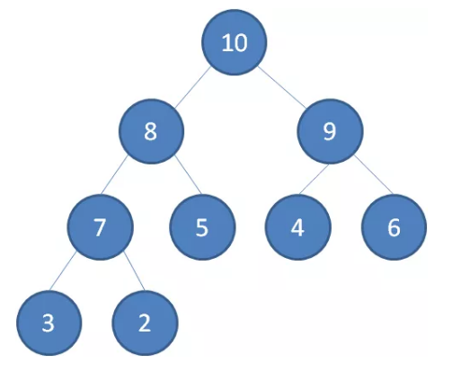

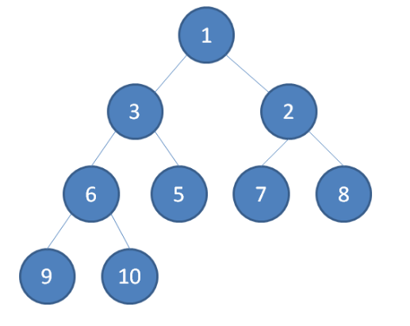

二叉堆的根结点称为堆顶，在最大堆中堆顶是整个堆中的最大元素，在最小堆中堆顶是整个堆中的最小元素。

在二叉堆中插入结点、删除结点、构造二叉堆的操作都基于堆的自我调整。

二叉堆虽然是一棵完全二叉树，但它的存储方式并不是链式存储，而是顺序存储。数组中，通过下标可以定位到结点的左右孩子，假设父结点的下标是$ parent $，那么它的左孩子下标为$ 2 * parent + 1 $、右孩子下标为$ 2 * parent + 2 $。

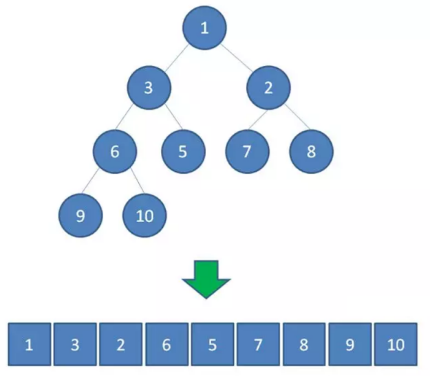


**插入/删除结点**

二叉堆的插入操作可以看成是结点上浮，当在堆中插入一个结点时，必须满足完全二叉树的标准，那么被插入结点的位置是完全二叉树的最后一个位置。在最大堆中，如果新结点的值大于它的父结点的值，则让新结点上浮，即和父结点交换位置。

堆的插入时间复杂度取决于树高为$ O(logn) $。

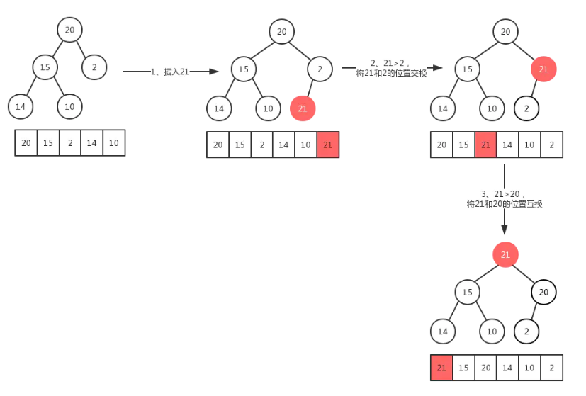

二叉堆的删除操作总是从堆的根结点删除元素。根结点被删除之后为了能够保证该树还是一棵完全二叉树，需要将完全二叉树的最后一个结点补到根结点的位置，让其继续符合完全二叉树的定义。二叉堆的删除结点操作可以看作是结点下沉。在最大堆中，如果新堆顶元素小于它的左右孩子中较大的那个结点，则与它的较大的子结点交换位置。

堆的删除时间复杂度取决于树高为$ O(logn) $。

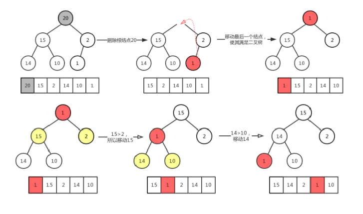


**构建二叉堆**

构建二叉堆，就是把一个无序的完全二叉树调整为二叉堆，本质上就是让所有非叶子结点依次下沉。

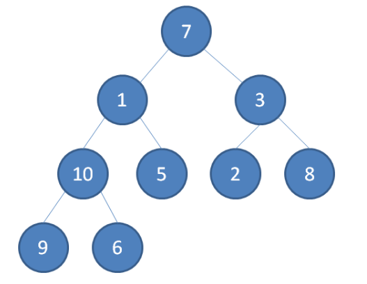

首先从最后一个非叶子结点开始，结点10下沉：

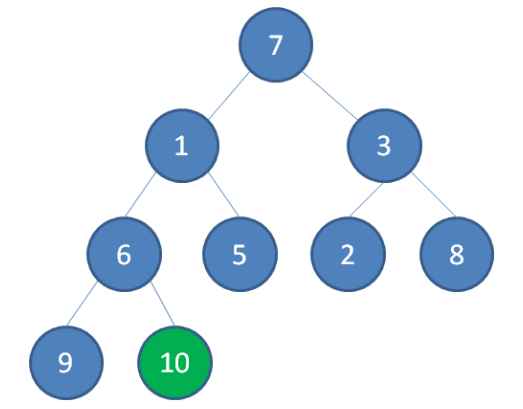

结点3下沉：

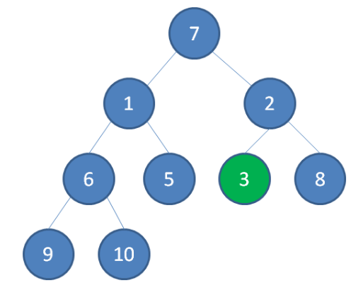

结点1不用改变。结点7下沉：

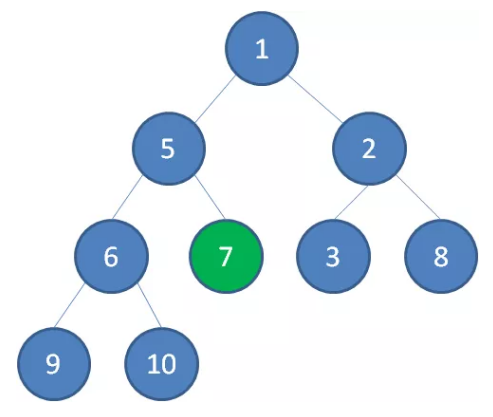

最终一棵无序完全二叉树就调整成了一个最小堆。


**堆排序（Heap Sort）**

有了二叉堆的构建、删除和自我调节，实现堆排序就是水到聚成了。当删除一个最大堆的堆顶后（并不是完全删除，而是替换到堆的最后面），经过自我调节，第二大的元素就会被交换上来，成为最大堆的新堆顶。

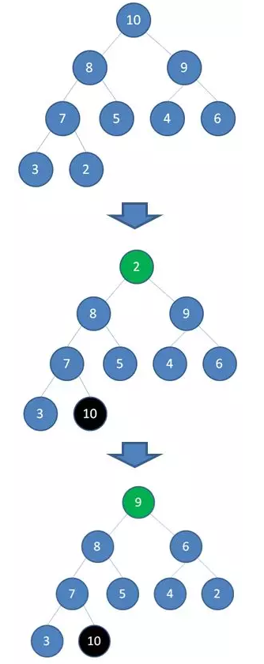

只要反复删除堆顶，反复调节二叉堆，所得到的的集合就成为了一个有序集合。

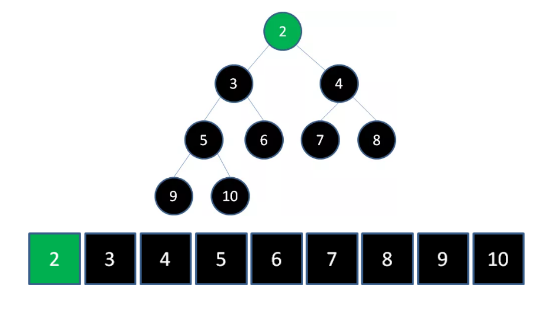

---

【代码】堆排序

```java
public static void downAdjust(int[] arr, int parentIndex, int length) {
    // 保存父结点的值，用于最后的赋值
    int temp = arr[parentIndex];
    int childIndex = 2 * parentIndex + 1;

    while(childIndex < length) {
        // 如果有右孩子，且右孩子大于左孩子的值，则定位到右孩子
        if(childIndex + 1 < length 
           && arr[childIndex + 1] > arr[childIndex]) {
            childIndex++;
        }
        // 如果父结点小于任何一个孩子的值，直接跳出
        if(temp >= arr[childIndex]) {
            break;
        }
        // 无需真正交换，单向赋值即可
        arr[parentIndex] = arr[childIndex];
        parentIndex = childIndex;
        childIndex = 2 * childIndex + 1;
    }
    arr[parentIndex] = temp;
}

public static void heapSort(int[] arr) {
    // 把无序数组构建成二叉堆
    for(int i = (arr.length-2) / 2; i >= 0; i--) {
        downAdjust(arr, i, arr.length);
    }

    // 循环删除堆顶元素，移到数组尾部，调节堆产生新的堆顶
    for(int i = arr.length - 1; i > 0; i--) {
        // 最后一个元素和第一个元素交换
        int temp = arr[i];
        arr[i] = arr[0];
        arr[0] = temp;
        // 下沉调整最大堆
        downAdjust(arr, 0, i);
    }
}
```

---

堆排序的空间复杂度为$ O(1) $，因为算法并没有开辟额外的集合空间。

至于空间复杂度，假设二叉堆总共有$ n $个元素，那么下沉调整的最坏时间复杂度就等同于二叉堆的高度$ O(logn) $。

堆排序的算法步骤分为两部分：

1. 把无序数组构建成二叉堆：进行$ n / 2 $次循环，每次循环进行一次下沉调节，因为此步骤的计算规模为$ n/2 * logn $，时间复杂度为$ O(nlogn) $。
2. 循环删除堆顶元素，移到数组尾部，调节堆产生新堆顶：进行$ n - 1 $次循环，每次循环进行一次下沉调节，因此次步骤的计算规模为$ (n-1) * logn $，时间复杂度为$ O(nlogn) $。

综合堆排序的两个步骤，整体时间复杂度为$ O(nlogn) $。

<div style="page-break-after: always;"></div>

# 第4章 模式匹配

## 4.1 BF

**BF（Brute Force）**

在一个字符串中查找另一个字符串的操作称为模式匹配。其中，被查找的字符串被称为文本串，需要查找的子串称为模式串。

查找子串的最简单的算法就是采用暴力匹配的方式。暴力匹配的基本思想就是逐个比较相应位置的字符。

假设文本串为$ S $，模式串为$ P $：

1. 如果当前字符匹配成功（即`S[i] == P[j]`），则`i++`， `j++`，继续匹配下一个字符。
2. 如果失配（即`S[i] != P[j]`），令`i = i - j + 1`，`j = 0`，相当于每次匹配失败时，`i`回溯，`j`被置为`0`。

| 步骤                    | 描述                                                         |
| ----------------------- | ------------------------------------------------------------ |
| 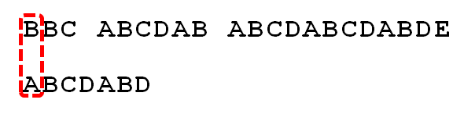 | `S[0]`为`B`，`P[0]`为`A`，不匹配（情形2）。然后再判断`S[1]`和`P[0]`是否匹配，相当于模式串向右移动一位。 |
| 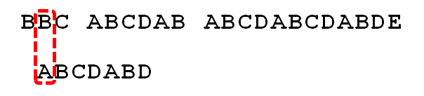 | `S[1]`与`P[0]`还是不匹配（情形2）。然后再判断`S[2]`和`P[0]`是否匹配，模式串再向右移动一位。 |
| 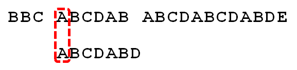 | 直到`S[4]`与`P[0]`匹配成功（情形1）。可得`i = 5`，`j = 1`，接下来判断`S[5]`与`P[1]`是否匹配。 |
| 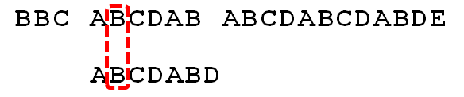 | `S[5]`与`P[1]`匹配成功（情形1）。可得`i = 6`，`j = 2`。      |
| 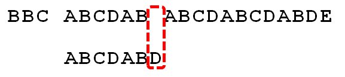 | 直到`S[10]`为空格，`P[6]`为`D`，不匹配（情形2）。此时`i = 5`，`j = 0`，相当于判断`S[5]`跟`P[0]`是否匹配。 |
| 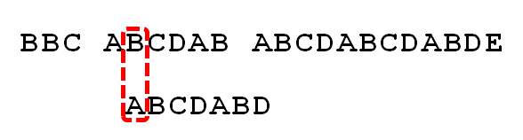 | 至此可以看出，按照暴力匹配算法的思路。同理，直到找到匹配的字符串或文本串遍历结束退出。 |

`BF`暴力匹配在最坏情况下时间复杂度是$ O(mn) $。

---

【代码】BF

```python
def brute_force(s, p):
    s_len = len(s)
    p_len = len(p)
    i = 0
    j = 0

    while i < s_len and j < p_len:
        if s[i] == p[j]:
            i += 1
            j += 1
        else:
            i = i - j + 1
            j = 0
    
    if j == p_len:
        return i - j
    else:
        return -1
```

---

<div style="page-break-after: always;"></div>

## 4.2 Sunday

**Sunday**

`Sunday`是从前往后匹配的算法，在匹配失败时重点关注的是文本串中参加匹配的最末位字符的下一位字符。如果该字符没有在模式串中出现则直接跳过，移动位数为模式串长度`+1`，否则移动位数为`模式串长度 - 该字符最右出现的下标`。

`Sunday`算法巧妙的地方在于它发现匹配失败之后可以直接考察文本串中参加匹配的最末尾字符的下一个字符。

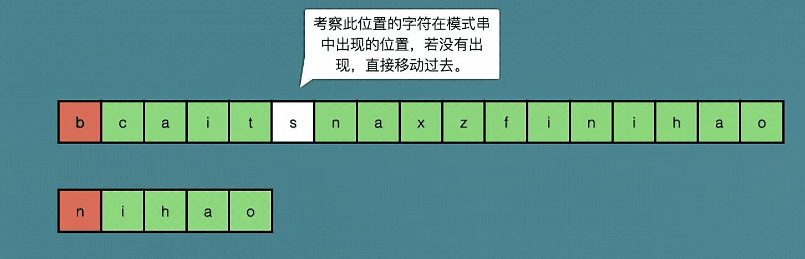

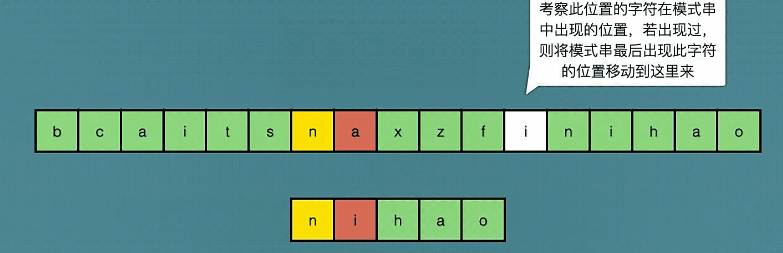

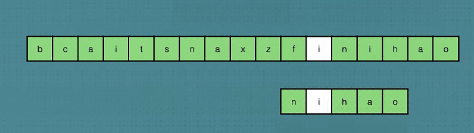

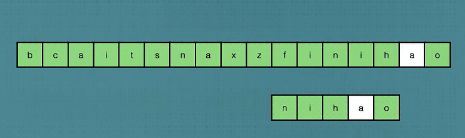

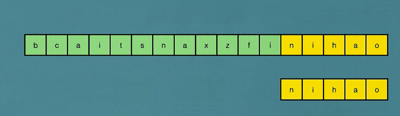

---

【代码】Sunday

```python
def sunday(s, p):
    s_len = len(s)
    p_len = len(p)
    i = 0
    j = 0
    result = 0
    
    while i < s_len and j < p_len:
        if s[i] == p[j]:
            i += 1
            j += 1
            continue

        idx = result + p_len
        if idx >= s_len:
            return -1

        k = p_len - 1
        while k >= 0 and s[idx] != p[k]:
            k -= 1

        i = result
        i += p_len - k
        result = i
        j = 0

        if result + p_len > s_len:
            return -1

    return result
```

---

<div style="page-break-after: always;"></div>

## 4.3 RK

**RK（Rabin-Karp）**

`RK`算法的命名由`Rabin`和`Karp`两位发明者的名字而来，它的实现方式有点与众不同。


`RK`算法的基本思想就是讲模式串$ P $的哈希值跟文本串$ S $中每一个长度为$ |S| $的子串的哈希值进行比较。如果两个字符串哈希值不相同，则它们肯定不匹配。如果它们的哈希值相同，它们有可能匹配（因为可能存在哈希冲突）。


由于哈希函数有可能会产生哈希冲突，哈希值相等的两个字符串不一定相同。因此如果两个字符串的哈希值相等，就把这两个字符串本身进行一次比较即可。这种方法的前提是要控制冲突概率，达到可以接受的状态。

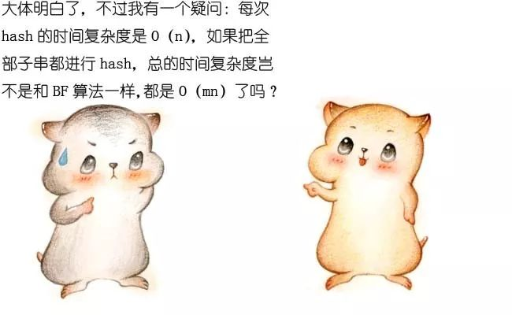


通过设计特殊的哈希算法，只需扫描一遍文本串就能计算出所有子串的哈希值。期间最多需要比较$ m - n + 1 $个子串的哈希值。


---

【代码】RK

```java
public static int rk(String s, String p) {
    int sLen = s.length();
    int pLen = p.length();

    int sHash = hash(s.substring(0, pLen)); // 文本串子串哈希值
    int pHash = hash(p);                    // 模式串哈希值

    for(int i = 0; i < sLen - pLen + 1; i++) {
        if(sHash == pHash) {
            if(match(s.substring(i, i + pLen), p)) {
                return i;
            }
        }

        if(i < sLen - pLen) {
            sHash = nextHash(s, sHash, i, pLen);
        }
    }

    return -1;
}

public static int hash(String s) {
    int hashCode = 0;
    for(int i = 0; i < s.length(); i++) {
        hashCode += s.charAt(i) - 'a';
    }
    return hashCode;
}

public static int nextHash(String s, int hash, int start, int n) {
    hash -= s.charAt(start) - 'a';
    hash += s.charAt(start + n) - 'a';
    return hash;
}

public static boolean match(String s, String p) {
    return s.equals(p);
}
```

---

<div style="page-break-after: always;"></div>

## 4.4 BM

**BM（Boyer-Moore）**

`BM`算法的名字取自于它的两位发明者，计算机科学家`Bob Boyer`和`J Strother Moore`。


坏字符（bad character）是指文本串与模式串不匹配的字符。

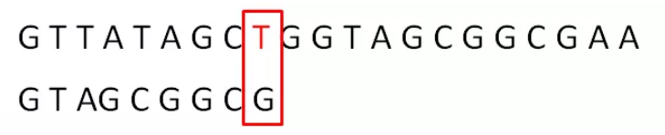


当检测到第一个坏字符后，并没有必要让模式串一位一位向后挪动并比较。因为只有模式串与坏字符对齐的位置相同的情况下，两者才有匹配的可能。

由于模式串的第1位字符也是`T`，这样就可以直接把模式串中的`T`与文本串的坏字符对齐，进行下一轮比较。

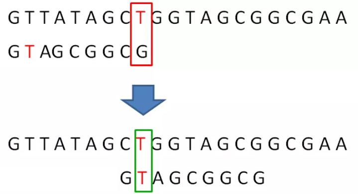

坏字符的位置越靠右，下一轮模式串的挪动跨度就可能越长，节省的比较次数也就越多。这就是`BM`算法从右向左检测的好处。

接着，从右向左成功匹配`GCG`，并遇到坏字符`A`。按照类似的方式，找到模式串的第2位字符`A`，将它与文本串的坏字符对齐。

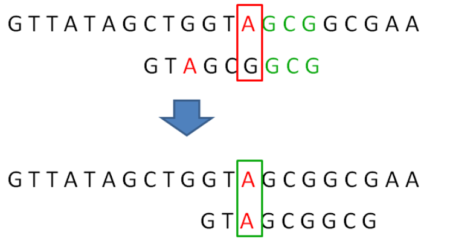

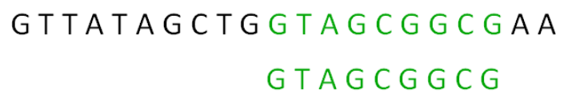


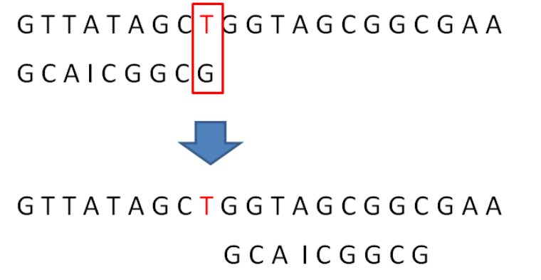


好后缀（good suffix）是指文本串与模式串当中相匹配的后缀。

例如这个例子，如果继续使用坏字符规则，模式串只能向后挪动一位。

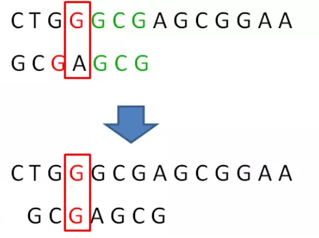

为了能真正减少比较次数，就需要使用好后缀规则。

在第一轮比较中，文本串和模式串都有共同的后缀`GCG`，这就是所谓的好后缀。

如果模式串的其它位置也包含与`GCG`相同的子串，那么就可以挪动模式串，让这个子串与好后缀对齐。

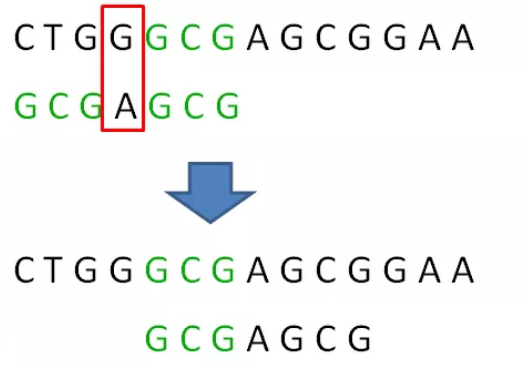


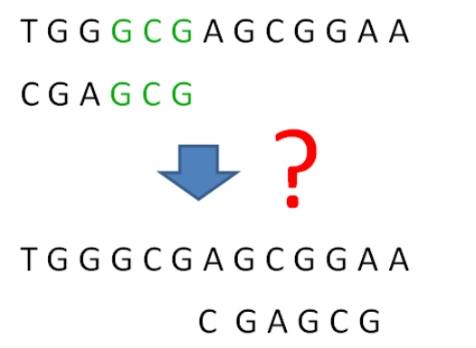


<div style="page-break-after: always;"></div>

## 4.5 KMP

**KMP（Knuth-Morris-Pratt）**

`KMP`算法是一个里程碑似的算法，它的出现宣告了人类找到了线性时间复杂度的字符串匹配算法。在此之后才出现了其它线性时间的字符串匹配算法，比如`BM`算法和`Sunday`算法。


在每一次匹配过程中，其实可以判断出后续几次匹配是否会成功。算法的核心就是每次匹配过程中推断出后续完全不可能匹配成功的部分，从而减少比较的次数。


`KMP`算法的整体思路就是在已匹配的前缀当中寻找最长可匹配后缀子串和最长可匹配前缀子串，在下一轮直接把两者对齐，从而实现模式串的快速移动。


`next`数组实质上就是找出模式串前后字符重复出现的个数，`next[i]`表示模式串`T[0]`到`T[i]`这个子串使得前`k`个字符等于后`k`个字符。其中`k`不能取`i + 1`，因为子串一共才`i + 1`个字符，自己跟自己相等毫无意义。


计算跳过长度的公式：
$$
\text{跳过的长度} = \text{匹配上的字符个数} - \text{重复字符串长度}
$$


在跳过不可能匹配的趟数后，并非再从头开始匹配，而是从之前不匹配的位置开始。


---

【代码】KMP

```java
public static int[] getNexts(String p) {
    int n = p.length();
    int[] next = new int[n];
    int j = 0;
    for(int i = 2; i < n; i++) {
        while(j != 0 && p.charAt(j) != p.charAt(i-1)) {
            j = next[j];
        }
        if(p.charAt(j) == p.charAt(i-1)) {
            j++;
        }
        next[i] = j;
    }
    return next;
}

public static int kmp(String s, String p) {
    int[] next = getNexts(p);
    int j = 0;
    for(int i = 0; i < s.length(); i++) {
        while(j > 0 && s.charAt(i) != p.charAt(j)) {
            j = next[j];
        }
        if(s.charAt(i) == p.charAt(j)) {
            j++;
        }
        if(j == p.length()) {
            return i - p.length() + 1;
        }
    }
    return -1;
}
```

---

<div style="page-break-after: always;"></div>

# 第5章 树

## 5.1 AVL树

**AVL树**


AVL树的命名是取自两位发明者的首字母`G. M. Adelson-Velsky`和`E. M. Landis`，AVL树也称为平衡二叉树。

AVL树能够调整自身的平衡性，AVL树遵循高度平衡，任何结点的两个子树高度差不会超过`1`。

对于AVL树的每一个结点，平衡因子（balance factor）是它左子树高度和右子树高度的差值。只有当二叉树所有结点的平衡因子都是`-1`、`0`、`1`这三个值时，这棵树才是一个合格的AVL树。


**失衡调整**

当AVL树插入或删除结点时，平衡有可能被打破。


通过对AVL树进行`左旋转`、`右旋转`的操作，就能使其重新恢复平衡。

1. 左旋转：`逆时针`旋转AVL树的两个结点X和Y，使得父结点被自己的右孩子取代，而自己成为左孩子。


2. 右旋转：`顺时针`旋转AVL树的两个结点X和Y，使得父结点被自己的左孩子取代，而自己成为右孩子。


AVL树的失衡调整可以分为四种情况：

1. 左左局面（LL）：右旋转


---

【代码】LL旋转

```c
static AVLNode* LLRotation(AVLTree *k2) {
    AVLTree *k1 = k2->left;
    k2->left = k1->right;
    k1->right = k2;
    
    k2->height = max(height(k2->left), height(k2->right)) + 1;
    k1->height = max(height(k1->left), k2->height) + 1;
    return k1;
}
```

---

2. 右右局面（RR）：左旋转


---

【代码】RR旋转

```c
static AVLNode* RRRotation(AVLTree *k1) {
    AVLTree *k2 = k1->right;
    k1->right = k2->left;
    k2->left = k1;

    k1->height = max(height(k1->left), height(k1->right)) + 1;
    k2->height = max(k1->height, height(k2->right)) + 1;
    return k2;
}
```

---

3. 左右局面（LR）：先左旋转、再右旋转


---

【代码】LR旋转

```c
static AVLNode* LRRotation(AVLTree *k3) {
    k3->left = RRRotation(k3->left);
    return LLRotation(k3);
}
```

---

4. 右左局面（RL）：先右旋转、再左旋转


---

【代码】RL旋转

```c
static AVLNode* RLRotation(AVLTree *k1) {
    k1->right = LLRotation(k1->right);
    return RRRotation(k1);
}
```

---

例如依次向AVL树添加结点：3, 2, 1, 4, 5, 6, 7, 16, 15, 14, 13, 12, 11, 10, 8, 9。


---

【代码】插入结点

```c
AVLNode* insert(AVLTree *tree, dataType val) {
    if(!tree) {
        tree = createNode(val, NULL, NULL);
        tree->height = 1;
        return tree;
    }

    if(val < tree->data) {
        tree->left = insert(tree->left, val);
        if(height(tree->left) - height(tree->right) == 2) {
            if(val < tree->left->data) {
                tree = LLRotation(tree);
            } else {
                tree = LRRotation(tree);
            }
        }
    } else {
        tree->right = insert(tree->right, val);
        if(height(tree->right) - height(tree->left) == 2) {
            if(val > tree->right->data) {
                tree = RRRotation(tree);
            } else {
                tree = RLRotation(tree);
            }
        }
    }

    tree->height = max(height(tree->left), height(tree->right)) + 1;
    return tree;
}
```

---

【代码】删除结点

```c
static AVLNode* deleteNode(AVLTree *tree, AVLNode *del) {
    if(!tree || !del) {
        return NULL;
    }

    if(del->data < tree->data) {
        tree->left = deleteNode(tree->left, del);
        if(height(tree->right) - height(tree->left) == 2) {
            AVLNode *rightNode = tree->right;
            if(height(rightNode->left) > height(rightNode->right)) {
                tree = RLRotation(tree);
            } else {
                tree = RRRotation(tree);
            }
        }
    } else if(del->data > tree->data) {
        tree->right = deleteNode(tree->right, del);
        if(height(tree->left) - height(tree->right) == 2) {
            AVLNode *leftNode = tree->left;
            if(height(leftNode->right) > height(leftNode->left)) {
                tree = LRRotation(tree);
            } else {
                tree = LLRotation(tree);
            }
        }
    } else {
        if(tree->left && tree->right) {
            if(height(tree->left) > height(tree->right)) {
                // 如果左子树比右子树高：
                // 1. 找出左子树的最大结点
                // 2. 将最大结点的值赋给tree
                // 3. 删除最大结点
                AVLNode *max = getMax(tree->left);
                tree->data = max->data;
                tree->left = deleteNode(tree->left, max);
            } else {
                // 如果右子树比左子树高（或相等）：
                // 1. 找出右子树的最小结点
                // 2. 将最小结点的值赋给tree
                // 3. 删除最小结点
                AVLNode *min = getMin(tree->right);
                tree->data = min->data;
                tree->right = deleteNode(tree->right, min);
            }
        } else {
            AVLNode *temp = tree;
            tree = tree->left ? tree->left : tree->right;
            free(temp);
        }
    }
    return tree;
}
```

---

<div style="page-break-after: always;"></div>

## 5.2 伸展树

**伸展树（Splay Tree）**

为了维持二叉搜索树的高效率查找，就需要对二叉搜索树进行平衡调整。著名的AVL树和红黑树就是典型的自平衡二叉搜索树。

伸展树是一种相当奇特的树，它不需要平衡因子、颜色等信息，甚至它没有时刻维护全树的平衡状态，却仍然能保持各项操作达到均摊为$ O(logn) $。

伸展树考虑到局部性原理（刚被访问的内容下次可能仍会被访问，查找次数多的内容下一次仍可能被访问），为了使整体查找时间更小，被查频率高的结点应该处于靠近树根的位置。

伸展树的核心是每次查找结点后对树进行重构，把被查找结点旋转到根结点，伸展树的旋转操作沿用了AVL树中的旋转方式。


<div style="page-break-after: always;"></div>

## 5.3 红黑树

**红黑树（Red Black Tree）**


1. 结点是红色或黑色的。
2. 根结点是黑色的。
3. 叶子结点都是黑色的空结点`NIL`。
4. 红色结点的两个子结点都是黑色的，即从叶子到根的所有路径上不能有连续的两个红色结点。
5. 从任一结点到其每个叶子的所有路径都包含相同数目的黑色结点。


例如向红黑树中插入新结点14，由于父结点15是黑色结点，这种情况不会破坏红黑树的规则，无需做任何调整。


向红黑树中插入新结点21，由于父结点22是红色结点，这种情况打破了红黑树的规则4（红色结点的两个子结点都是黑色的），因此必须进行调整，使其重新符合红黑树的规则。


**变色**

为了重新符合红黑树的规则，有时需要把红色结点变为黑色，或是把黑色结点变为红色。

例如对于红黑树的一部分（子树），新插入的结点Y是红色结点，它的父结点X也是红色结点，不符合规则4（红色结点的两个子结点都是黑色的），因此可以把结点X变为黑色。


但是，如果这是简单的把一个结点变色，会导致相关路径凭空多出一个黑色结点，这样就会打破规则5（从任一结点到其每个叶子的所有路径都包含相同数目的黑色结点），因此还需要其它的调整策略。


**旋转**

旋转分为左旋转和右旋转。

左旋转就是逆时针旋转红黑树的两个结点，使得父结点被自己的右孩子取代，而自己称为右孩子的左孩子。


右旋转就是顺时针旋转红黑树的两个结点，使得父结点被自己的左孩子取代，而自己称为左孩子的右孩子。


**插入结点**


1. 局面1：新结点（A）位于树根，没有父结点。这种局面，直接让新结点变色为黑色，规则2（根结点是黑色的）满足。同时黑色的根结点使每条路径上的黑色结点数目都增加了1，因此并没有打破规则5（从任一结点到其每个叶子的所有路径都包含相同数目的黑色结点）。


2. 局面2：新结点（B）的父结点是黑色的。新插入的红色结点B并没有打破规则，无需调整。


3. 局面3：新结点（D）的父结点和叔叔结点都是红色。这种局面，两个红色结点B和D连续，违反了规则4（红色结点的两个子结点都是黑色的），因此需要先让结点B变为黑色。


但是这样一来，结点B所在路径凭空多出了一个黑色结点，打破了规则5（从任一结点到其每个叶子的所有路径都包含相同数目的黑色结点），因此再让结点A变为红色。


这时结点A和C又成为了连续的红色结点，再将结点C变为黑色。


经过以上调整后，再次符合了红黑树的规则。

4. 局面4：新结点（D）的父结点是红色，叔叔结点是黑色或者没有叔叔，且新结点是父结点的右孩子，父结点是祖父结点的左孩子。

这个局面可以以结点B为轴，做一次左旋转，使得新结点D成为父结点，结点B成为D的左孩子。这样一来进入了局面5。


5. 局面5：新结点（D）的父结点是红色，叔叔结点是黑色或者没有叔叔，且新结点是父结点的左孩子，父结点是祖父结点的左孩子。

这一局面可以以结点A为轴，做一次右旋转，使得结点B成为祖父结点，结点A成为B的右孩子。


再将结点B变为黑色，结点A变为红色。


经过以上调整后，再次符合了红黑树的规则。

红黑树的插入操作设计到这5种局面。如果局面4中父结点B是右孩子，则成为了局面5的镜像，原本的右旋转改为左旋转；如果局面5中父结点B是右孩子，则成为了局面4的镜像，原本的左旋转改为右旋转。


新结点21和它的父结点22是连续的红色结点，违背了规则4。当前情况符合局面3（新结点的父结点和叔叔结点都是红色）。于是经过三次变色，22变为黑色，25变为红色，27变为黑色，将以结点25为根的子树符合了红黑树的规则。


但结点25和结点17成为了连续的红色结点，违背了规则4。于是可以将结点25看做一个新结点，当前正好符合局面5的镜像（新结点的父结点是红色，叔叔是黑色或者没有叔叔，且新结点是父结点的右孩子，父结点是祖父结点的右孩子）。因此可以以根结点13为轴进行左旋转，使得结点17成为新的根结点。

再让结点17变为黑色，13变为红色，使红黑树重新符合规则。


**二叉查找树删除结点**


二叉查找树的删除可分为三种情况：

1. 待删除的结点没有子节点：直接删除即可。


2. 待删除结点只有一个孩子：让孩子取代待删除结点。


3. 待删除结点有两个孩子：选择仅小于或仅大于待删除结点的结点取代，习惯上更多地会选择仅大于待删除结点的结点。


**红黑树删除结点**


1. 第一步：如果待删除结点有两个非空的孩子结点，转化成待删除结点只有一个孩子（或没有孩子）的情况。

例如删除结点8，因为结点8有两个孩子，可以选择仅大于8的结点10复制到8的位置，结点颜色变成待删除结点的颜色。


结点10能成为仅大于8的结点，必定没有左孩子结点，所以问题转换成了待删除结点只有一个右孩子（或者没有孩子）的情况。

2. 第二步：根据待删除结点和其唯一子结点的颜色，分情况处理。
- 情况1：自身是红色，子结点是黑色。直接按照二叉查找树的删除操作，删除结点1即可。


- 情况2：自身是黑色，子结点是红色。按照二叉查找树的删除操作，删除结点1。此时这条路径凭空少了一个黑色结点，因此需要将结点2变成黑色即可。


- 情况3：自身是黑色，子结点也是黑色，或者子结点是空叶子结点。这种情况最为复杂，涉及到很多变化。首先还是按照二叉查找树的删除操作，删除结点1。此时这条路径凭空少了一个黑色结点，而且并不能改变结点2的颜色来解决问题。这时需要进入第三步，专门解决父子双黑的情况。


3. 第三步：遇到双黑结点，在子结点顶替父结点后，可分为6种情况处理。

- 情况1：结点2是红黑树的根。此时所有路径都减少了一个黑色结点，并未打破规则，无需调整。


- 情况2：结点2的父亲、兄弟、侄子结点都是黑色。


直接把结点2的兄弟结点变为红色。


这样结点B所在路径少了一个黑色结点，两边扯平了。

- 情况3：结点2的兄弟结点是红色。


以结点2的父结点A为轴进行左旋转。


然后结点A变为红色，结点B变为黑色。


这样的变化就有可能转换成情况4、5、6中的任意一种。

- 情况4：结点2的父结点是红色，兄弟和侄子结点是黑色。


将结点2的父结点A变为黑色，兄弟结点B变为红色。


这样结点2的路径补充了黑色结点，而结点B的路径并没有减少黑色结点，重新符合红黑树的规则。

- 情况5：结点2的父结点随意，兄弟结点B是黑色右孩子，结点2的左侄子是红色，右侄子是黑色。


以结点2的兄弟结点B为轴进行右旋转。


将结点B变为红色，结点C变为黑色。


这样的变化就转换成了情况6。

- 情况6：结点2的父结点随意，兄弟结点B是黑色右孩子，结点2的右侄子的红色。


以结点2的父结点A为轴进行左旋转。


将结点A和B的颜色交换，让结点D变为黑色。


这样经过结点2的路径由之前的`随机 + 黑`变成了`随机 + 黑 + 黑`，补充了一个黑色结点。

经过结点D的路径由之前的`随机 + 黑 + 红`变成了`随机 + 黑`，黑色结点并没有减少。

这时重新符合了红黑树的规则。


由于待删除结点17有两个孩子，子树当中仅大于17的结点是25，所以把结点25复制到17的位置，保持黑色。


接着需要删除原本的结点25，这个情况对应的是删除结点操作中的第二步情况3（待删除结点是黑色，子结点是空叶子结点）。


此时，以结点25为根的子树符合第三步情况5的镜像（结点NIL的父结点随意，兄弟结点15是黑色左孩子，结点NIL的右侄子是红色，左侄子是黑色）。


通过左旋转和变色，将子树转化成第三步情况6的镜像（结点NIL的父结点随意，兄弟结点16是黑色左孩子，结点NIL的左侄子是红色）。


通过右旋转和变色，使整棵二叉树重新符合红黑树的规则。


<div style="page-break-after: always;"></div>

## 5.4 Trie树

**Trie树**

`Trie`树的名字取自`检索retrieval`，发音同`tree`，但为了防止误解，也可发音为`try`。

`Trie`树也称`字典树`或`前缀树`，因此它专门用于处理字符串的匹配，用来解决在一组字符串集合中快速查找某个字符串的问题。


`Trie`树的核心思想就是利用空间换时间，通过最大限度地减少无谓的字符串比较，做到高效查询和插入，时间复杂度为$ O(k) $，$ k $为字符串长度，缺点是如果大量字符串没有公共前缀时会消耗大量内存。

`Trie`树的根结点不包含字符，除根结点外每一个结点都只包含一个字符。从根结点到某一结点，路径上经过的字符连接起来，就为该结点对应的字符串。

`Trie`树在实现过程中，会在结点中设置一个标志，用来表示该结点是否是一个字符串的结尾。


**查询**

在`Trie`树中查找一个字符串时，可以将待查找字符串分割成单个字符，从根结点开始匹配。


`Trie`树可以用于前缀匹配，也就是找出一个字符串集合中所有指定前缀的字符串。例如在进行搜索时，可以根据用户输入返回前缀匹配的搜索结果。


**插入与删除**

`Trie`树的插入操作就是将字符串的每个字符逐一插入，插入前先判断字符对应结点是否存在，存在则共享结点，不存在则创建新结点。当字符串插入`Trie`树后，将该字符串最后一个字符所对应的结点中设置标志位，表示该字符为该路径上某一字符串的末尾。


`Trie`树的删除操作分为3种情况：

1. 删除整个字符串。例如删除`hi`，从树根找到结点`h`，再找到结点`i`。因为结点i为标志位，所以去除其标志位。同时结点`i`是叶子结点，将其删除。删除后结点`h`变为叶子结点，并且结点`h`不是标志位，也将其删除。

2. 删除前缀字符串。例如删除`cod`，首先查找到末尾字符结点`d`，因为结点`d`不是叶子结点，只需将其标志位去除即可。

3. 删除分支字符串。例如删除`cook`，方法与删除整个字符串类似，区别在于当删除到共享结点`o`时，由于`o`不是叶子结点，停止删除。

<div style="page-break-after: always;"></div>

## 5.5 B树

**B树**


一个$m $阶的`B树`具有以下特征：

1. 根结点至少有$ 2 $个孩子。
2. 每个中间结点都包含$ k-1 $个元素和$ k $个孩子（$ {m \over 2} \le k \le m $）。
3. 每个叶子结点都包含$ k - 1 $个元素（$ {m \over 2} \le k \le m $）。
4. 所有叶子结点都位于同一层。
5. 每个结点中的元素从小到大排列，结点中$ k - 1 $个元素正好是k个孩子包含的元素的值域分划。


**插入**


由于结点$ (3, 5) $已经是两元素结点，无法再增加。父结点$ (2, 6) $也是两元素结点，也无法再增加。根结点$ 9 $是单元素结点，可以升级为两元素结点。于是拆分结点$ (3, 5) $和结点$ (2, 6) $，让根结点$ 9 $升级为$ (4, 9) $，结点$ 6 $独立为根结点的第二个孩子。


**删除**


删除结点$ 11 $后，结点$ 12 $只有一个孩子，不符合`B树`特征。因此找出$ 12 $、$ 13 $、$ 15 $中的中位数$ 13 $，取代结点$ 12 $，而结点$ 12 $下移成为第一个孩子。


<div style="page-break-after: always;"></div>

## 5.6 B+树

**B+树**


一个$ m $阶的`B+树`具有以下特征：

1. 有$ k $个子树的中间结点包含$ k $个元素（`B树`中是$ k - 1 $个元素）。
2. 所有的叶子结点中包含了全部元素的信息，及指向含这些元素记录的指针，且叶子结点本身按照关键字大小连接。
3. 所有中间结点元素都同时存在于子结点，在子结点元素中是最大（或最小）元素。


**范围查找**


<div style="page-break-after: always;"></div>

## 5.7 并查集

**并查集（Disjoint Set）**

并查集是一种简洁优雅的数据结构，主要用于解决一些元素分组的问题。

它管理一系列不相交的集合，并支持两种操作：

1. 合并（union）：把两个不相交的集合合并为一个集合。
2. 查询（find）：查询两个元素是否在同一个集合中。

例如在某个家族中，如果$ x $和$ y $是亲戚，$ y $和$ z $是亲戚，那么$ x $和$ z $也是亲戚。如果$ x $和$ y $是亲戚，那么$ x $的亲戚都是$ y $的亲戚，$ y $的亲戚也都是$ x $的亲戚。为了判断两个人是否为亲戚，只需判断他们是否属于同一个集合即可。

并查集的思想在于用集合中的一个元素代表集合，类似于把集合看做帮派，代表元素则是帮主，最开始所有元素各自为一个集合（各自的帮主就是自己）。


例如将元素$ 1 $和$ 3 $合并，就是将$ 1 $号和$ 3 $号比武，假设$ 1 $号赢了，$ 3 $号就认$ 1 $号作帮主。


再合并元素$ 2 $和$ 3 $，但$ 3 $号表示“别跟我打，让我的帮主来收拾你”。假设还是$ 1 $号赢了，$ 2 $号也认$ 1 $号作帮主。


假设元素$ 4 $、$ 5 $、$ 6 $也进行了相关合并：


现在再合并元素$ 2 $和$ 6 $，将它们的帮主$ 1 $号和$ 4 $号比武，假设$ 1 $号胜利后，$ 4 $号认$ 1 $号为帮主，当然它的手下也都跟着投降了。


并查集是一种树型结构，要寻找集合的代表元素，只需要一层一层向上访问父结点，直达树的根结点即可。根结点的父结点就是它自己。


假设有$ n $个元素，利用数组`parent`存放每个元素的父结点。一开始每个元素的父结点为自己。

---

【代码】初始化

```c
void init(int n) {
    parent = (int *)malloc(sizeof(int) * n);
    for(int i = 0; i < n; i++) {
        parent[i] = i;
    }
}
```

---

要判断两个元素是否属于同一个集合，只需要看它们的根结点是否相同。利用递归的方法可以实现对代表元素的查询，一层一层访问父结点，直至根结点。

---

【代码】查询

```c
int find(int val) {
    if(parent[val] == val) {
        return val;
    }
    return find(parent[val]);
}
```

---

合并操作需要先找到两个集合的根结点，将前者的父结点设置为后者即可（也可将后者的父结点设置为前者）。

---

【代码】合并

```c
void merge(int i, int j) {
    parent[find(i)] = find(j);
}
```

---


**路径压缩（Path Compression）**

最简单的并查集效率是比较低的，例如：


分别`merge(2, 3)`和`merge(2, 4)`：


这样可能会形成一条长链，随着链越来越长，想要从底部找到根结点会变得越来越难。利用路径压缩的方法可以解决这个问题，因为我们只关心一个元素所对应的根结点，因此每个元素到根结点的路径最好尽可能短。


实现的时候只需在查询过程中，把沿途的每个结点的父结点都设置为根结点即可。在下一次查询的时候，就可以节省很多时间。

---

【代码】查询（路径压缩）

```c
int find(int val) {
    if(parent[val] == val) {
        return val;
    } else {
        parent[val] = find(parent[val]);
        return parent[val];
    }
}
```

---


**按秩合并**

如果需要将一棵比较复杂的树与一个单元素进行合并，例如`merge(7, 8)`时，是把元素$ 7 $的父结点设为$ 8 $好，还是把$ 8 $的父结点设为$ 7 $呢？


如果把$ 7 $的父结点设为$ 8 $，会使树的深度加深，原来树中的每个元素到根结点的距离都变长了，之后寻找根结点的路径也会变长。虽然有路径压缩，但路径压缩也是要消耗时间的。而把$ 8 $的父结点设为$ 7 $，并不会影响到不相关的结点。


因此在合并两个集合时，应该把简单的树往复杂的树上合并。利用数组`rank`记录每个结点对应的树的深度，一开始所有元素的`rank`设为$ 1 $。合并时比较两个根结点，把`rank`较小者往较大者上合并。

---

【代码】按秩合并

```c
void init(int n) {
    parent = (int *)malloc(sizeof(int) * n);
    rank = (int *)malloc(sizeof(int) * n);
    for(int i = 0; i < n; i++) {
        parent[i] = i;
        rank[i] = 1;
    }
}

void merge(int i, int j) {
    // 找到对应根结点
    int x = find(i);
    int y = find(j);
    if(rank[x] <= rank[y]) {
        parent[x] = y;
    } else {
        parent[y] = x;
    }
    // 如果深度相同且根结点不同，则新的根结点深度+1
    if(rank[x] == rank[y] && x != y) {
        rank[y]++;
    }
}
```

---

深度相同的情况下，无论如何合并，都会使树的深度增加$ 1 $。


